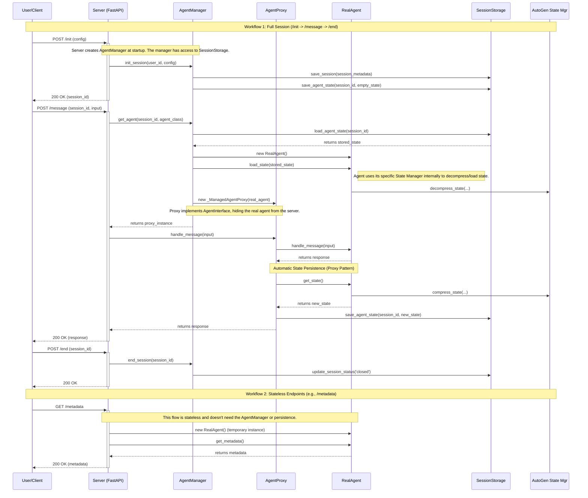

# Agent Framework Architecture

## 1. Overview

This document outlines the architecture of the Agent Framework, designed to provide a robust, scalable, and extensible platform for serving conversational agents.

The primary architectural goal is the **Separation of Concerns**. Specifically, we aim to completely decouple the web server layer from the implementation details of any specific agent framework (e.g., Microsoft Autogen). The server should not know how an agent manages its internal memory or state; its only job is to handle web requests and interact with a generic `AgentInterface`.

This design allows for easy extension to support other agent frameworks (like LangChain, etc.) in the future without modifying the core server logic.

## 2. Core Components

The architecture is composed of several key components, each with a single, well-defined responsibility.

| Component                    | Responsibility                                                                                                                                                                                                                  |
| :--------------------------- | :------------------------------------------------------------------------------------------------------------------------------------------------------------------------------------------------------------------------------ |
| **Server (FastAPI)**   | Handles HTTP requests, manages the web layer, and orchestrates high-level workflows by interacting with the `AgentManager`.                                                                                                   |
| **AgentManager**       | The "wrapper" or provider. Manages the lifecycle of agents, including creation, state loading, and wrapping them in a proxy. It is the single point of contact for the server.                                                  |
| **_ManagedAgentProxy** | An object that implements the `AgentInterface` and wraps the real agent. It transparently adds automatic state-saving behavior after a message is handled.                                                                    |
| **RealAgent**          | The concrete agent implementation (e.g.,StreamingAutoGenAssistant). Implements the `AgentInterface` and contains the core conversational logic. It is responsible for its own state via `get_state()` and `load_state()`. |
| **SessionStorage**     | The persistence layer. Manages the storage of two distinct data types: session metadata and agent state, linked by a `session_id`.                                                                                            |
| **AutoGen State Mgr**  | A helper module used*only* by an Autogen-based `RealAgent` to handle the specifics of serializing, compressing, and managing Autogen's unique state format.                                                                 |

## 3. Key Architectural Decisions & Principles

### a. True Decoupling via an Agent Manager

The server does not create agent instances or load their state directly. Instead, it delegates this entire responsibility to the `AgentManager`. This manager is the only component that understands how to assemble a fully functional agent, abstracting away all complexity from the server.

### b. The Proxy Pattern for Transparent State Management

A critical requirement was that state should be persisted automatically after an agent responds, without the server needing to explicitly trigger a "save" operation. We achieve this using the **Proxy Pattern**.

- The `AgentManager` does not return the `RealAgent` to the server. It returns a `_ManagedAgentProxy` instead.
- This proxy *looks and feels* exactly like a real agent because it implements the same `AgentInterface`.
- When the server calls `handle_message()` on the proxy, the proxy first passes the call to the `RealAgent`.
- Once the `RealAgent` returns a response, the proxy automatically calls the agent's `get_state()` method and instructs the `SessionStorage` to persist the new state.

This makes state saving an invisible, automatic side-effect of handling a message, dramatically simplifying the server logic.

### c. Separation of Agent State from Session Metadata

Based on your insight, an agent's internal state (its memory, configuration, etc.) is a fundamentally different concern from the session's metadata (user ID, timestamps, correlation ID).

This architecture formalizes that separation. The `SessionStorage` interface has distinct methods and underlying collections/tables for:

1. `save_session()` / `load_session()`: For lightweight session metadata.
2. `save_agent_state()` / `load_agent_state()`: For the potentially large and complex agent state "blob".

This ensures the system is more organized, scalable, and easier to debug.

### d. Interface-Driven Design for Extensibility

The `AgentInterface` is the core contract that enables the entire system's flexibility. Any future agent, regardless of its underlying framework, can be integrated into the system by simply:

1. Implementing the `AgentInterface`.
2. Providing the logic for its own state management within the `get_state()` and `load_state()` methods.

The server, `AgentManager`, and `SessionStorage` layers will require no changes.

## 4. Workflows & Sequence Diagram

The following diagram illustrates how the components interact across the main API workflows.

