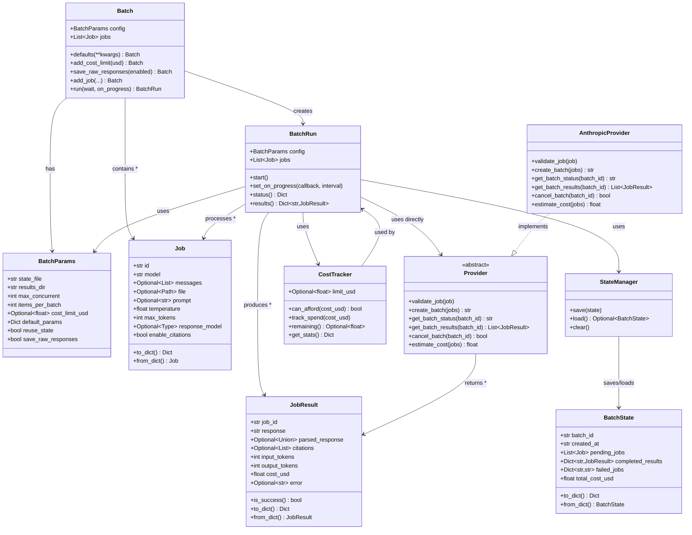

# Development Guide

## Architecture Overview



### Key Design Patterns

- **Builder Pattern**: `Batch` provides fluent interface for configuration
- **Provider Pattern**: Abstract provider interface for different AI services  
- **Synchronous Processing**: `BatchRun` processes jobs in batches synchronously
- **State Persistence**: Automatic saving/resuming via `StateManager`
- **Cost Control**: Built-in cost tracking and limits via `CostTracker`

## Running Tests

Tests require an Anthropic API key since they make real API calls.

```bash
# Install dependencies
uv sync --dev

# Set API key
export ANTHROPIC_API_KEY="your-api-key"

# Run all tests (parallel)
uv run pytest -v -n auto 

# Run a specific test file
uv run pytest tests/test_ai_batch.py

# Run a specific test
uv run pytest tests/test_ai_batch.py::test_batch_empty_messages
```

## Releasing a New Version

```bash
# One-liner to update version, commit, push, and release
VERSION=0.0.2 && \
sed -i '' "s/version = \".*\"/version = \"$VERSION\"/" pyproject.toml && \
git add pyproject.toml && \
git commit -m "Bump version to $VERSION" && \
git push && \
gh release create v$VERSION --title "v$VERSION" --generate-notes
```

## GitHub Secrets Setup

For tests to run in GitHub Actions, add your API key as a secret:
1. Go to Settings → Secrets and variables → Actions
2. Add new secret: `ANTHROPIC_API_KEY`