# 🌀 bluer-sbc

🌀 `bluer-sbc` is a [`bluer-ai`](https://github.com/kamangir/bluer-ai) plugin for edge computing on [single board computers](https://github.com/kamangir/blue-bracket). 

```bash
pip install bluer_sbc

# @env dot list
@env dot cp <env-name> local
```

|   |   |   |
| --- | --- | --- |

```mermaid
graph LR
    camera["@sbc<br>&lt;camera&gt;<br>capture|preview<br>image|video"]

    hardware_validate["@sbc<br>&lt;hardware&gt;<br>validate<br>&lt;options&gt;"]

    object["📂 object"]:::folder
    camera_hardware["👁️‍🗨️ camera"]:::folder
    hardware["🖱️ hardware"]:::folder
    UI["💻 UI"]:::folder

    camera_hardware --> camera
    camera --> object
    camera --> UI

    hardware --> hardware_validate
    hardware_validate --> hardware
    hardware_validate --> UI

    classDef folder fill:#999,stroke:#333,stroke-width:2px;
```

| [`bluer-swallow`](./bluer_sbc/docs/bluer-swallow.md) [](./bluer_sbc/docs/bluer-swallow.md)  | [`bryce`](./bluer_sbc/docs/bryce.md) [](./bluer_sbc/docs/bryce.md)  | [`blue3`](https://github.com/kamangir/blue-bracket/blob/main/designs/blue3.md) [](https://github.com/kamangir/blue-bracket/blob/main/designs/blue3.md)  |
| [`chenar-grove`](https://github.com/kamangir/blue-bracket/blob/main/designs/chenar-grove.md) [](https://github.com/kamangir/blue-bracket/blob/main/designs/chenar-grove.md)  | [`cube`](https://github.com/kamangir/blue-bracket/blob/main/designs/cube.md) [](https://github.com/kamangir/blue-bracket/blob/main/designs/cube.md)  | [`eye_nano`](https://github.com/kamangir/blue-bracket/blob/main/designs/eye_nano.md) [](https://github.com/kamangir/blue-bracket/blob/main/designs/eye_nano.md)  |



---

> 🌀 [`blue-sbc`](https://github.com/kamangir/blue-sbc) for the [Global South](https://github.com/kamangir/bluer-south).

---


[](https://github.com/kamangir/bluer-sbc/actions/workflows/pylint.yml) [](https://github.com/kamangir/bluer-sbc/actions/workflows/pytest.yml) [](https://github.com/kamangir/bluer-sbc/actions/workflows/bashtest.yml) [](https://pypi.org/project/bluer-sbc/) [](https://pypistats.org/packages/bluer-sbc)

built by 🌀 [`bluer README`](https://github.com/kamangir/bluer-objects/tree/main/bluer_objects/README), based on 🌀 [`bluer_sbc-8.155.1`](https://github.com/kamangir/bluer-sbc).

