# chunkle

**Smart text chunking** that respects both line and token limits while preserving semantic boundaries.

GitHub: [https://github.com/allen2c/chunkle](https://github.com/allen2c/chunkle)
Pypi: [https://pypi.org/project/chunkle/](https://pypi.org/project/chunkle/)

## Install

```bash
pip install chunkle
```

## Quick Start

```python
from chunkle import chunk

# Basic usage
for piece in chunk(text, lines_per_chunk=20, tokens_per_chunk=500):
    print(piece)

# Custom limits
chunks = list(chunk(text, lines_per_chunk=5, tokens_per_chunk=100))
```

## How It Works

```mermaid
flowchart TD
    A["📝 Start processing text"] --> B["📊 Accumulate chars<br/>Count lines & tokens"]
    B --> C{"✅ Both limits met?<br/>(lines ≥ min AND tokens ≥ min)"}
    C -->|No| D{"🚨 Exceeded 2x limits?"}
    C -->|Yes| E{"🎯 Good break point?<br/>(newline > whitespace)"}

    D -->|No| B
    D -->|Yes| F["💥 Force flush<br/>(semantic boundary ignored)"]

    E -->|No| D
    E -->|Yes| G["✂️ Flush chunk<br/>(clean semantic boundary)"]

    F --> H["🧽 Absorb whitespace/punctuation<br/>into previous chunk"]
    G --> H
    H --> I{"📄 More text?"}
    I -->|Yes| B
    I -->|No| J["🏁 Done"]
```



### Rules

1. **Dual Requirements**: Chunks must meet BOTH line AND token minimums
2. **Smart Boundaries**: Prefers newlines (best) > whitespace (good) > force split
3. **Force Split**: Splits at 2x limits even if it breaks semantics
4. **Clean Starts**: New chunks begin with meaningful characters

## Examples

**English Text:**

```python
text = "Hello world!\nThis is a test.\nAnother line here."
chunks = list(chunk(text, lines_per_chunk=1, tokens_per_chunk=8))
# Result: ['Hello world!\n', 'This is a test.\n', 'Another line here.']
```

**Chinese Text (force split):**

```python
text = "這是一個很長的句子，沒有空格，會觸發強制切分機制。"
chunks = list(chunk(text, lines_per_chunk=1, tokens_per_chunk=10))
# May split mid-sentence when no whitespace available
```

## API

```python
def chunk(
    content: str,
    *,
    lines_per_chunk: int = 20,
    tokens_per_chunk: int = 500,
    encoding: tiktoken.Encoding | None = None,
) -> Generator[str, None, None]:
```

**Parameters:**

- `content`: Text to split
- `lines_per_chunk`: Minimum lines per chunk (default: 20)
- `tokens_per_chunk`: Minimum tokens per chunk (default: 500)
- `encoding`: Custom tiktoken encoding (default: gpt-4o-mini)

## License

MIT © 2025 Allen Chou
