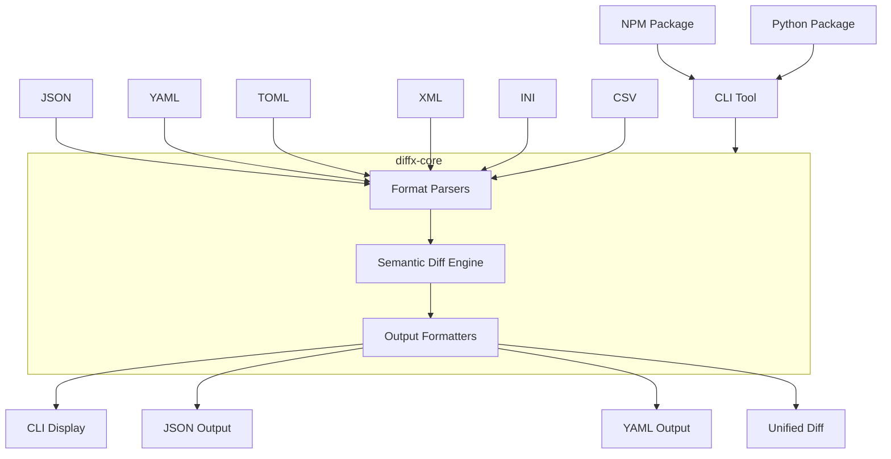
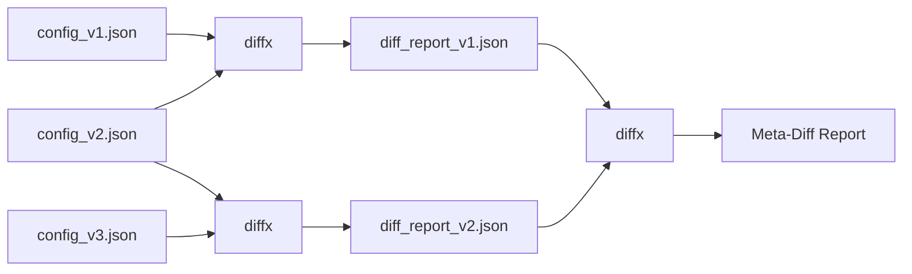

# diffx

> **🚀 Semantic diff for structured data - Focus on what matters, not formatting**

[English README](README.md) | [日本語版 README](README_ja.md) | [中文版 README](README_zh.md)

[](https://github.com/kako-jun/diffx/actions/workflows/ci.yml)
[](https://crates.io/crates/diffx)
[](https://docs.rs/diffx-core)
[](https://www.npmjs.com/package/diffx-js)
[](https://pypi.org/project/diffx-python/)
[](https://github.com/kako-jun/diffx/tree/main/docs/index.md)
[](https://docs.rs/diffx-core)
[](LICENSE)

A next-generation diff tool that understands the **structure** and **meaning** of your data, not just text changes. Perfect for JSON, YAML, TOML, XML, INI, and CSV files.

```bash
# Traditional diff shows formatting noise (key order, trailing commas)
$ diff config_v1.json config_v2.json
< {
<   "name": "myapp",
<   "version": "1.0"
< }
> {
>   "version": "1.1",
>   "name": "myapp"
> }

# diffx shows only semantic changes
$ diffx config_v1.json config_v2.json
~ version: "1.0" -> "1.1"
```

## ✨ Key Features

- **🎯 Semantic Awareness**: Ignores formatting, key order, whitespace, and trailing commas
- **🔧 Multiple Formats**: JSON, YAML, TOML, XML, INI, CSV support
- **🤖 AI-Friendly**: Clean CLI output perfect for automation and AI analysis
- **⚡ Fast**: Built in Rust for maximum performance
- **🔗 Meta-Chaining**: Compare diff reports to track change evolution

## 📊 Performance

Real benchmark results on AMD Ryzen 5 PRO 4650U:

```bash
# Test files: ~600 bytes JSON with nested config
$ time diff large_test1.json large_test2.json  # Shows 15+ lines of noise
$ time diffx large_test1.json large_test2.json # Shows 3 semantic changes

# Results:
Traditional diff: ~0.002s (but with formatting noise)
diffx:           ~0.005s (clean semantic output)
```

**Why CLI matters for the AI era**: As AI tools become essential in development workflows, having structured, machine-readable diff output becomes crucial. `diffx` provides clean, parseable results that AI can understand and reason about, making it perfect for automated code review, configuration management, and intelligent deployment pipelines.

## Why diffx?

Traditional `diff` tools show you formatting noise. `diffx` shows you what actually changed.

- **Focus on meaning**: Ignores key order, whitespace, and formatting
- **Multiple formats**: Works with JSON, YAML, TOML, XML, INI, CSV
- **Clean output**: Perfect for humans, scripts, and AI analysis

## Specification

### Supported Formats

- JSON
- YAML
- TOML
- XML
- INI
- CSV

### Types of Differences

- Key addition/deletion
- Value change
- Array insertion/deletion/modification
- Nested structure differences
- Value type change

### Output Formats

`diffx` outputs differences in the **diffx format** by default - a semantic diff representation designed specifically for structured data. The diffx format provides the richest expression of structural differences and can be complemented with machine-readable formats for integration:

- **diffx Format (Default)**

  - The **diffx format** is a human-readable, semantic diff representation that clearly displays structural differences (additions, changes, deletions, type changes, etc.) using intuitive symbols and hierarchical paths.
  - Differences are represented by `+` (addition), `-` (deletion), `~` (change), `!` (type change) symbols with full path context (e.g., `database.connection.host`).
  - **Core Feature**: Focuses on semantic changes in data, ignoring changes in key order, whitespace, and formatting. This semantic focus is the fundamental value of both the tool and the diffx format.

- **JSON Format**

  - Machine-readable format. Used for CI/CD and integration with other programs.
  - Differences detected by `diffx` are output as a JSON array.

- **YAML Format**

  - Machine-readable format. Used for CI/CD and integration with other programs, similar to JSON.
  - Differences detected by `diffx` are output as a YAML array.

- **diff-compatible Format (Unified Format)**
  - Provided with the `--output unified` option.
  - Intended for integration with `git` and existing merge tools.
  - **Note**: This format only shows the semantic differences detected by `diffx` in traditional diff format. Changes that are not semantic differences (e.g., key order changes, whitespace changes) are not displayed. This is purely for compatibility with existing tools.

## 🏗️ Architecture

### System Overview



### Project Structure

```
diffx/
├── diffx-core/      # Diff extraction library (Crate)
├── diffx-cli/       # CLI wrapper
├── tests/           # All test-related files
│   ├── fixtures/    # Test input data
│   ├── integration/ # CLI integration tests
│   ├── unit/        # Core library unit tests
│   └── output/      # Test intermediate files
├── docs/            # Documentation and specifications
└── ...
```

### Technology Stack

- **Rust** (Fast, safe, cross-platform)
- `serde_json`, `serde_yml`, `toml`, `configparser`, `quick-xml`, `csv` parsers
- `clap` (CLI argument parsing)
- `colored` (CLI output coloring)
- `similar` (Unified Format output)

## 🔗 Meta-Chaining

Compare diff reports to track how changes evolve over time:



```bash
$ diffx config_v1.json config_v2.json --output json > report1.json
$ diffx config_v2.json config_v3.json --output json > report2.json
$ diffx report1.json report2.json  # Compare the changes themselves!
```

## 🚀 Quick Start

### Installation

```bash
# Rust (recommended - native performance)
cargo install diffx

# Node.js ecosystem (⚡ offline-ready with all platform binaries)
npm install diffx-js

# Python ecosystem (🆕 self-contained wheel with embedded binary)
pip install diffx-python

# Or download pre-built binaries from GitHub Releases
```

For detailed usage and examples, see the [documentation](docs/index.md).

### Quick Documentation Links

- **[Getting Started](docs/user-guide/getting-started.md)** - Learn the basics
- **[Installation Guide](docs/user-guide/installation.md)** - Platform-specific setup
- **[CLI Reference](docs/reference/cli-reference.md)** - Complete command reference
- **[Real-World Examples](docs/user-guide/examples.md)** - Industry use cases
- **[Integration Guide](docs/guides/integrations.md)** - CI/CD and automation

### Basic Usage

```bash
# Compare JSON files
diffx file1.json file2.json

# Compare with different output formats
diffx config.yaml config_new.yaml --output json
diffx data.toml data_updated.toml --output yaml

# Advanced filtering options
diffx large.json large_v2.json --ignore-keys-regex "^timestamp$|^_.*"
diffx users.json users_v2.json --array-id-key "id"
diffx metrics.json metrics_v2.json --epsilon 0.001

# High-demand practical options
diffx config.yaml config_new.yaml --ignore-case          # Ignore case differences
diffx api.json api_formatted.json --ignore-whitespace    # Ignore whitespace changes
diffx large.json large_v2.json --context 3 --output unified  # Show 3 lines of context
diffx file1.json file2.json --quiet && echo "Files identical"  # Script automation
diffx dir1/ dir2/ --recursive --brief                    # Quick file change check

# Performance optimization for large files
diffx huge_dataset.json huge_dataset_v2.json
# Directory comparison
diffx config_dir1/ config_dir2/ --recursive

# Meta-chaining for change tracking
diffx config_v1.json config_v2.json --output json > diff1.json
diffx config_v2.json config_v3.json --output json > diff2.json
diffx diff1.json diff2.json  # Compare the changes themselves!
```

### Integration Examples

**CI/CD Pipeline:**

```yaml
- name: Check configuration changes
  run: |
    diffx config/prod.yaml config/staging.yaml --output json > changes.json
    # Process changes.json for deployment validation

- name: Quick file change detection
  run: |
    if ! diffx config/current.json config/new.json --quiet; then
      echo "Configuration changed, triggering deployment"
    fi

- name: Compare with ignore options for cleaner diffs
  run: |
    diffx api_old.json api_new.json --ignore-case --ignore-whitespace --output json > api_changes.json
    # Focus on semantic changes, ignore formatting

- name: Compare large datasets efficiently  
  run: |
    diffx large_prod_data.json large_staging_data.json --output json > data_changes.json
    # Optimized processing for large files in CI
```

**Git Hook:**

```bash
#!/bin/bash
# pre-commit hook
if diffx package.json HEAD~1:package.json --output json | jq -e '.[] | select(.Added)' > /dev/null; then
  echo "New dependencies detected, running security audit..."
fi
```

## 🌍 Multi-Language Support

diffx is available across multiple ecosystems:

```bash
# Rust (native CLI)
cargo install diffx

# Node.js wrapper
npm install diffx-js

# Python wrapper  
pip install diffx-python
```

All packages provide the same semantic diff capabilities:
- **Rust**: Source-based compilation 
- **npm**: Universal package with all platform binaries (offline-ready)
- **Python**: Self-contained wheels with embedded binaries

## 🔮 Future Plans

- **Interactive TUI (`diffx-tui`)**: A powerful viewer showcasing diffx capabilities with side-by-side data display
- **AI agent integration**: Automated diff summarization and explanation
- **Web UI version** (`diffx-web`)
- **VSCode extension** (`diffx-vscode`)
- **Advanced CI/CD templates**: Pre-built workflows for common use cases

## 🤝 Contributing

We welcome contributions! See [CONTRIBUTING.md](CONTRIBUTING.md) for guidelines.

## 📄 License

MIT License - see [LICENSE](LICENSE) for details.
