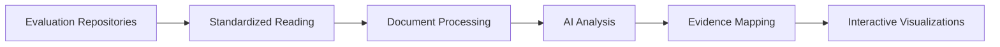

# EvalStack


<!-- WARNING: THIS FILE WAS AUTOGENERATED! DO NOT EDIT! -->

[](https://pypi.org/project/evalstack/)
[](LICENSE)
[](https://franckalbinet.github.io/evalstack/)

## What is EvalStack?

EvalStack is an AI-powered system that automates the creation of
**Evidence Maps** - structured, visual tools that organize what we know
(and don’t know) about programs, policies, and interventions. It
transforms hundreds of hours of manual document review into an
automated, intelligent process.

### The Challenge We Solve

Traditional evidence mapping requires hundreds of staff-hours manually
reviewing and tagging evaluation documents. EvalStack automates this
process while maintaining **accuracy** through human-AI collaboration,
making evidence mapping accessible and efficient.

## Key Features

- **📚 Multi-Format Repository Reading**: Standardized processing of
  evaluation repositories from different organizations
- **🤖 AI-Powered Analysis**: Automated extraction of program details,
  context, and findings
- **🗂️ Framework Agnostic**: Works with various evaluation frameworks
  (IOM Strategic Results Framework, Global Compact on Migration, etc.)
- **Interactive Visualizations**: Generate bubble maps, heatmaps, and
  gap analysis
- **🔍 Hybrid Search**: Vector database storage with semantic and
  keyword search capabilities

## Workflow Overview



### Current Implementation ✅

**Step 1: Repository Reading** - EvalStack can read and standardize
evaluation repositories from different organizations:

``` python
from evalstack.readers import IOMRepoReader

# Read IOM evaluation repository
reader = IOMRepoReader('files/test/eval_repo_iom.xlsx')
evaluations = reader()  # Returns standardized format

# Each evaluation contains:
# - id: Unique identifier
# - docs: Associated documents with URLs and descriptions
# - meta: All metadata in standardized format
```

### Coming Soon 🚧

- **Step 2**: Document Processing (OCR, chunking, embeddings)
- **Step 3**: Structured Information Extraction (AI-powered)
- **Step 4**: Evidence Mapping & Analysis (cross-evaluation patterns)

## ️ Installation

### From PyPI (Recommended)

``` bash
pip install evalstack
```

### From GitHub

``` bash
pip install git+https://github.com/franckalbinet/evalstack.git
```

### Development Installation

``` bash
# Clone the repository
git clone https://github.com/franckalbinet/evalstack.git
cd evalstack

# Install in development mode
pip install -e .

# Make changes in nbs/ directory, then compile:
nbdev_prepare
```

## Quick Start

### Reading an IOM Evaluation Repository

``` python
from evalstack.readers import IOMRepoReader

# Initialize reader with your Excel file
reader = IOMRepoReader('files/test/eval_repo_iom.xlsx')

# Process the repository
evaluations = reader()

# Each evaluation is a standardized dictionary
for eval in evaluations[:3]:  # Show first 3
    print(f"ID: {eval['id']}")
    print(f"Title: {eval['meta']['Title']}")
    print(f"Documents: {len(eval['docs'])}")
    print("---")
```

    ID: 1a57974ab89d7280988aa6b706147ce1
    Title: EX-POST EVALUATION OF THE PROJECT:  NIGERIA: STRENGTHENING REINTEGRATION FOR RETURNEES (SRARP)  - PHASE II
    Documents: 2
    ---
    ID: c660e774d14854e20dc74457712b50ec
    Title: FINAL EVALUATION OF THE PROJECT: STRENGTHEN BORDER MANAGEMENT AND SECURITY IN MALI AND NIGER THROUGH CAPACITY BUILDING OF BORDER AUTHORITIES AND ENHANCED DIALOGUE WITH BORDER COMMUNITIES
    Documents: 2
    ---
    ID: 2cae361c6779b561af07200e3d4e4051
    Title: Final Evaluation of the project "SUPPORTING THE IMPLEMENTATION OF AN E RESIDENCE PLATFORM IN CABO VERDE"
    Documents: 2
    ---

### Export to JSON

    reader.to_json('processed_evaluations.json')

## Documentation

- **Full Documentation**: [GitHub
  Pages](https://fr.anckalbi.net/evalstack/)
- **API Reference**: Available in the documentation
- **Examples**: See the `nbs/` directory for Jupyter notebooks

## Contributing

We welcome contributions! Here’s how you can help:

1.  **Fork** the repository
2.  **Create** a feature branch
    (`git checkout -b feature/amazing-feature`)
3.  **Make** your changes in the `nbs/` directory
4.  **Compile** with `nbdev_prepare`
5.  **Commit** your changes (`git commit -m 'Add amazing feature'`)
6.  **Push** to the branch (`git push origin feature/amazing-feature`)
7.  **Open** a Pull Request

### Development Setup

``` bash
# Install development dependencies
pip install -e .

# Make changes in nbs/ directory
# ...

# Compile changes to evalstack package
nbdev_prepare
```

## License

This project is licensed under the MIT License - see the
[LICENSE](LICENSE) file for details.

## Acknowledgments

- Built with [nbdev](https://nbdev.fast.ai/) for literate programming
- Uses [pandas](https://pandas.pydata.org/) for data processing
- Powered by [rich](https://rich.readthedocs.io/) for beautiful terminal
  output

## Support

- **Issues**: [GitHub
  Issues](https://github.com/franckalbinet/evalstack/issues)
- **Discussions**: [GitHub
  Discussions](https://github.com/franckalbinet/evalstack/discussions)
- **Email**: \[Your email here\]
