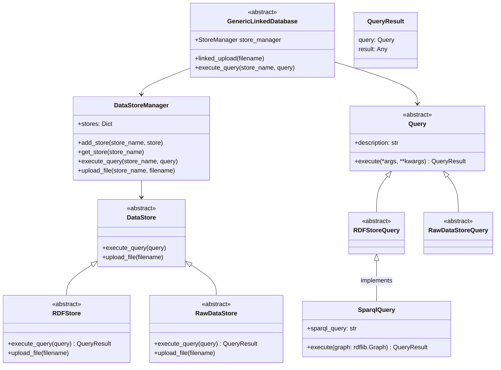

# generic-linked-database


[](https://codecov.io/gh/matthiasprobst/generic-linked-database)


An approach to integrate multiple databases behind a unified interface. At least on database is intended to be 
an RDF database for metadata storage, the others are raw data storages like SQL or noSQL databases.

## Quickstart

### Installation

Install the package:

```bash
pip install gldb
```

### Example

An example exists as [Jupyter Notebook](docs/examples/Tutorial.ipynb) in `docs/examples/`. You may also try it online 
with Google Colab:

[](https://colab.research.google.com/github/matthiasprobst/generic-linked-database/blob/main/docs/examples/Tutorial.ipynb)

## Design

### Abstractions

The package provides the following abstractions:

- `GenericLinkedDatabase`: The unified interface to interact with the semantic metadata and raw data storage
- `RDFStore`: The interface to interact with the semantic metadata storage
- `RawDataStore`: The interface to interact with the raw data storage
- `DataStoreManager`: The manager to interact with the different data stores
- `Query`: The interface to interact with the different data stores
- `RDFStoreQuery`: The interface to interact with the semantic metadata storage
- `RawDataStoreQuery`: The interface to interact with the raw data storage

### Class Diagram




