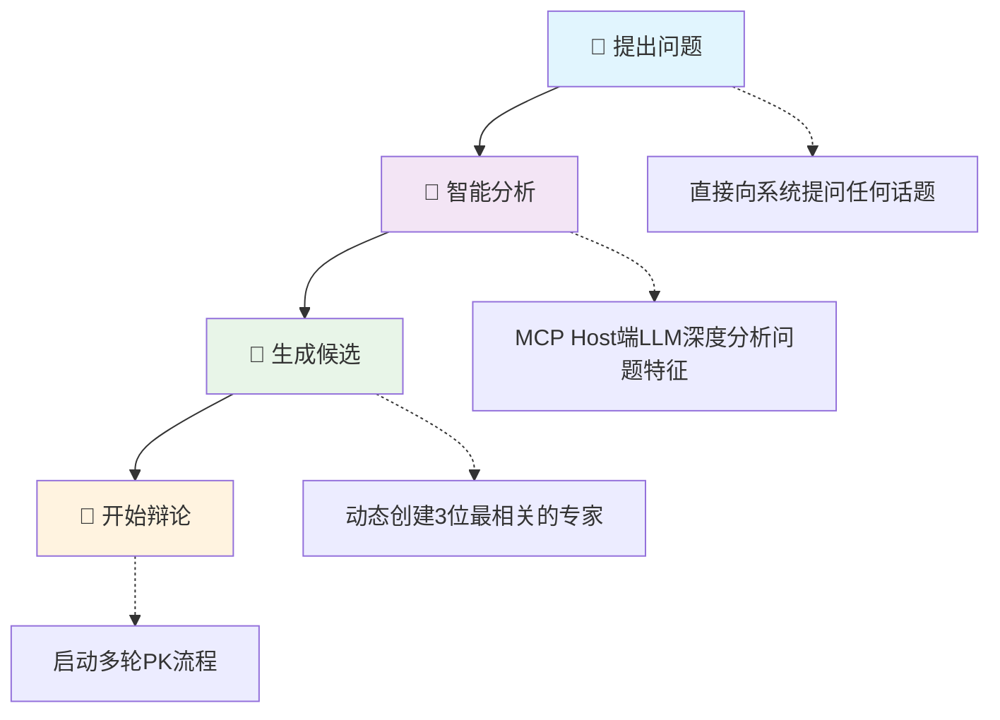
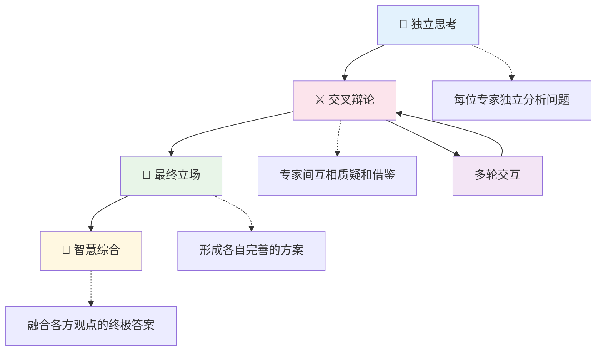

# Guru-PK MCP 智能专家辩论系统

基于本地MCP（Model Context Protocol）的AI专家辩论系统，采用**动态专家生成架构**，根据问题而智能的创建最适合的专家组合进行多轮智慧碰撞。

## ✨ 核心特色

- 🏭 **动态专家生成** - 完全问题驱动，每次生成专属专家组合
- 🌟 **无限专家池** - 突破固定专家限制，支持任意领域的专家生成
- 🔄 **多轮PK流程** - 独立思考 → 交叉辩论 → 最终立场 → 智慧综合  
- 🎨 **塔夫特风格信息图** - 将专家辩论转化为严格遵循数据可视化大师爱德华·塔夫特设计原则的单页动态信息图
- 🤖 **智能分工架构** - MCP Host端LLM负责智能分析，MCP Server端提供流程指导

## 🌐 在线演示

**👉 [查看信息图演示](https://mitsudoai.github.io/guru-pk-mcp/)**

这个网页展示了使用本MCP工具创建的塔夫特风格动态信息图，直观展现了专家辩论系统的强大功能。

## 🚀 快速安装

### 1. 安装依赖

**方式一：使用安装脚本（推荐）**

**macOS/Linux:**

```bash
curl -LsSf https://astral.sh/uv/install.sh | sh
```

**Windows:**

```powershell
powershell -ExecutionPolicy ByPass -c "irm https://astral.sh/uv/install.ps1 | iex"
```

**方式二：使用 pip 安装（适用于所有平台）**

```bash
pip install uv
```

**方式三：下载安装包**

从 [UV Releases](https://github.com/astral-sh/uv/releases) 页面下载对应平台的安装包

### 2. 配置MCP客户端

**推荐方式：从PyPI安装**

```json
{
  "mcpServers": {
    "guru-pk": {
      "command": "uvx",
      "args": ["--from", "guru-pk-mcp", "guru-pk-mcp-server"],
      "env": {
        "DATA_DIR": "~/.guru-pk-data"  // macOS/Linux: ~/目录, Windows: %USERPROFILE%目录
      }
    }
  }
}
```

> **更新说明**:
>
> - 当需要更新`guru-pk-mcp`到最新版本时，请执行命令：
>
>   ```bash
>   uvx pip install --upgrade guru-pk-mcp
>   ```
>
> - 此命令会从PyPI获取并安装最新发布的版本
> - 如果遇到缓存问题，可以强制刷新：
>
>   ```bash
>   uvx --refresh-package guru-pk-mcp --from guru-pk-mcp python -c "print('✅ UVX缓存已刷新')"
>   ```
>
> **注意**:
>
> - macOS用户可能需要使用完整路径：`/Users/{用户名}/.local/bin/uvx`
> - Windows用户：`~`会自动解析为用户主目录（如 `C:\Users\{用户名}`），无需手动修改

**开发方式：从源码安装**

```json
{
  "mcpServers": {
    "guru-pk": {
      "command": "uvx", 
      "args": ["--from", "/path/to/guru-pk-mcp", "guru-pk-mcp-server"],
      "env": {
        "DATA_DIR": "~/.guru-pk-data"  // macOS/Linux: ~/目录, Windows: %USERPROFILE%目录
      }
    }
  }
}
```

> **本地开发说明**:
>
> - 对于本地开发场景，如需刷新uvx缓存，请使用`make refresh-uvx`
> - 此命令强制UVX重新安装本地包，确保使用最新的代码更改

## 使用入门

重启MCP客户端，输入 `guru_pk_help` 获取帮助，或直接提问开始专家辩论！

```javascript
// 1. 自然语言提问（最推荐的使用方式）
生成AI的领域，有没有特别适合个人创业的方向？请三个专家PK

// 2. 智能生成候选专家（系统自动执行）
start_pk_session: 生成AI的领域，有没有特别适合个人创业的方向？

// 3. 智能生成候选专家（用户对期待的专家范围进行限定）
start_pk_session: 生成AI的领域，有没有特别适合个人创业的方向？ 找两个AI领域的大牛和一个知名的个人创业家来辩论
```

### 💡 使用提示

**启动辩论**：

- 🤖 **`start_pk_session:直接提问`** - 默认高效批处理模式（推荐）
- 🔄 **`start_stepwise_pk_session:直接提问`** - 传统逐步对话模式

**工具功能**：

- 📋 `guru_pk_help` - 获取系统介绍和详细帮助
- 📄 `export_session` - 导出会话为Markdown文件
- 🎨 `export_session_as_infographic` - 导出会话为塔夫特风格单页动态信息图
- 📄 `export_enhanced_session` - 导出增强分析报告
- 🌍 `set_language` - 设置专家回复语言

### 📱 兼容性

支持所有MCP兼容应用：Claude Desktop、Cursor、TRAE、DeepChat、Cherry Studio等

### 🎯 推荐配置

**最推荐的MCP Host**：

- 💰 **按用户请求计算的订阅制MCP Host** - 如Cursor和海外版Trae
- 🌟 **优势**：
  - 成本优势显著：按用户请求计算的订阅制收费，而非API调用次数或token收费
  - Claude模型对MCP支持最佳，具有优秀的指令遵循能力

### ⚠️ 不推荐配置

- 🚫 **Trae国内版** - 内置的国内模型存在敏感词审查问题，可能导致专家辩论过程中断，影响使用体验

## 🛠️ 技术架构

**智能分工原则**：

- 🧠 **MCP Host端 LLM**：负责复杂的语义分析和智能生成
- 🔧 **MCP Server端**：提供简洁的流程控制和数据管理

### 动态专家生成流程



### 🔄 辩论流程

**两种辩论模式**：

🚀 **批处理模式** (`start_pk_session`) - **默认推荐**

- ⚡ 高效率：一轮生成所有专家回答，节省约60%时间
- 🎯 适用场景：快速获取多角度分析，高效决策支持

🔄 **逐步模式** (`start_stepwise_pk_session`) - 传统体验  

- 🎭 互动性：逐个专家发言，实时调整和深入探讨
- 🎯 适用场景：深度思辨，享受完整辩论过程

**4轮辩论流程**：



## 💭 设计理念

### 灵感来源

本项目初期的专家系统受到 [人生教练团Agent](https://mp.weixin.qq.com/s/QGNzRRo7U3Y2fmvOXNJvyw) 的启发，将内置专家的多角色PK的创新思路通过本地MCP的方式实现。

### 技术方案对比

**🔧 Agent框架开发**

- ✅ 功能强大，可集成多个LLM API
- ✅ 前端交互灵活，控制强劲
- ❌ 开发复杂度高，API调用成本高昂

**☁️ 第三方文档服务远程MCP方案(飞书MCP)**  

- ✅ 部署简单，利用现有生态
- ❌ 依赖第三方服务，定制化程度有限

**🏠 本地MCP方案（本项目）**

- ✅ 与订阅制Chat APP结合，无API费用
- ✅ 数据本地化，隐私保护
- ✅ 开源可定制，技术独立
- ✅ **智能分工架构** - 充分利用MCP Host端LLM智能
- ✅ **动态专家生成** - 突破固定专家池限制
- ❌ 依赖MCP客户端实现

本项目最新的设计，通过完全的动态专家生成，实现了从固定专家库到智能专家工厂的根本性突破。
借助于MCP Host端大语言模型的智能，MCP服务器端(本项目)专注流程控制，降低维护成本，实现智能与简洁的最佳平衡。
