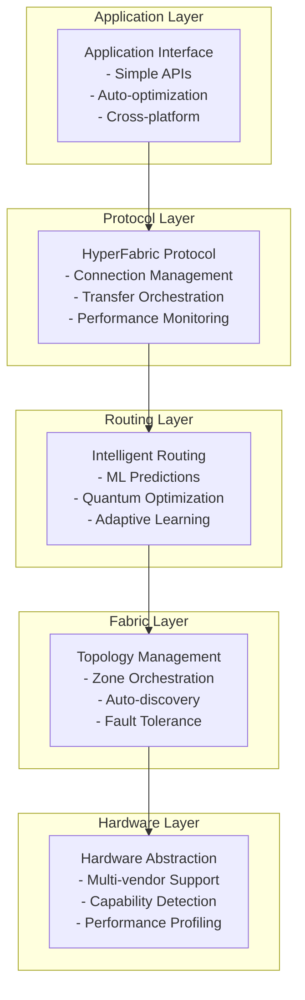
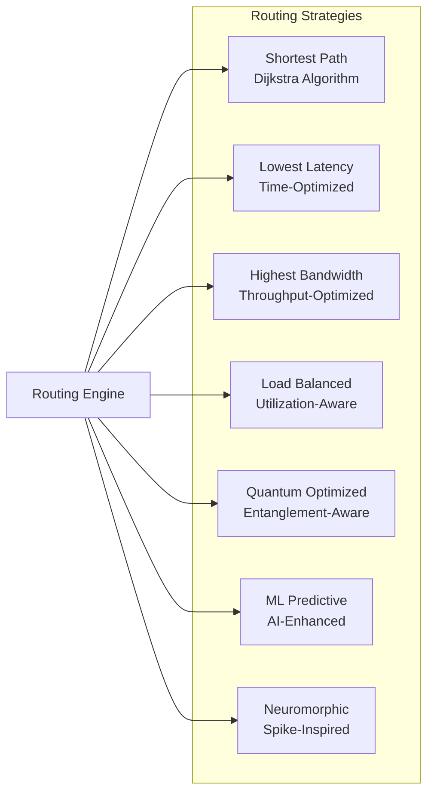
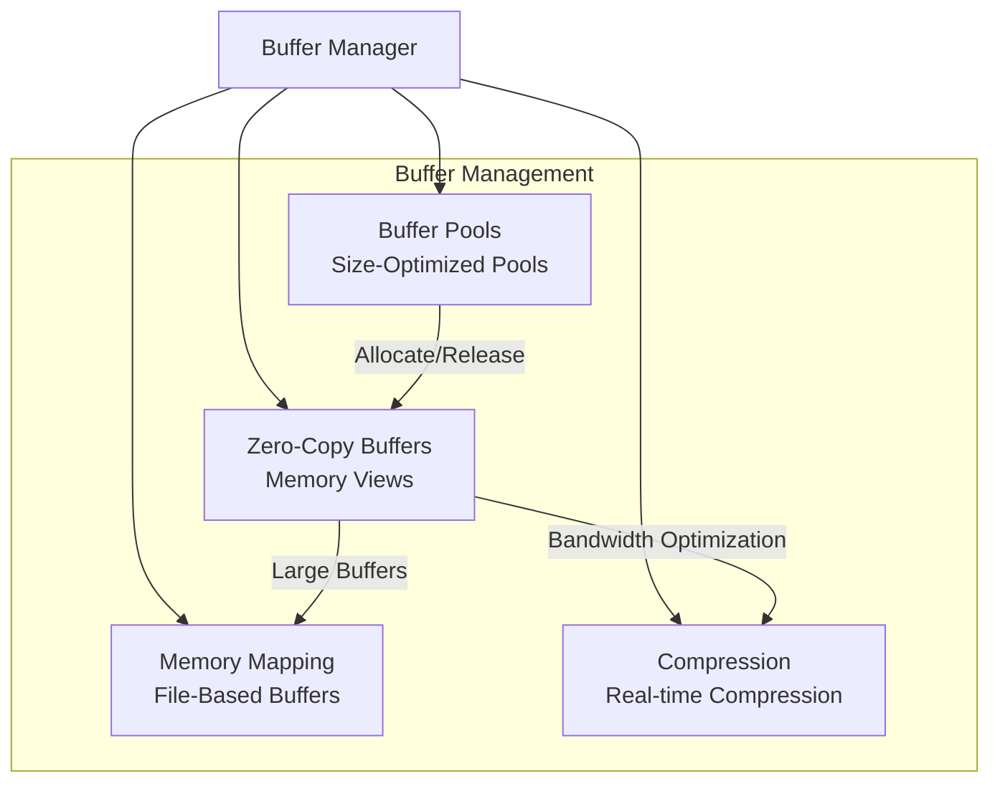
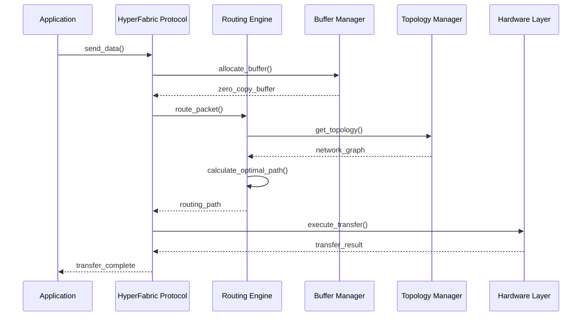
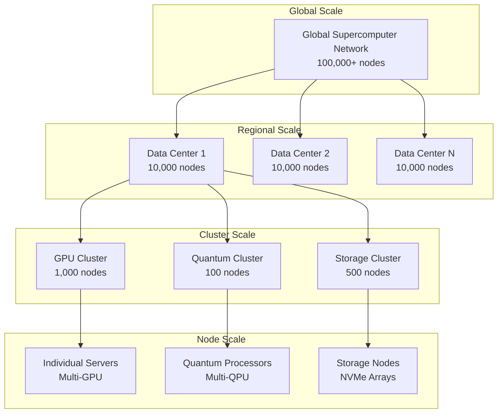
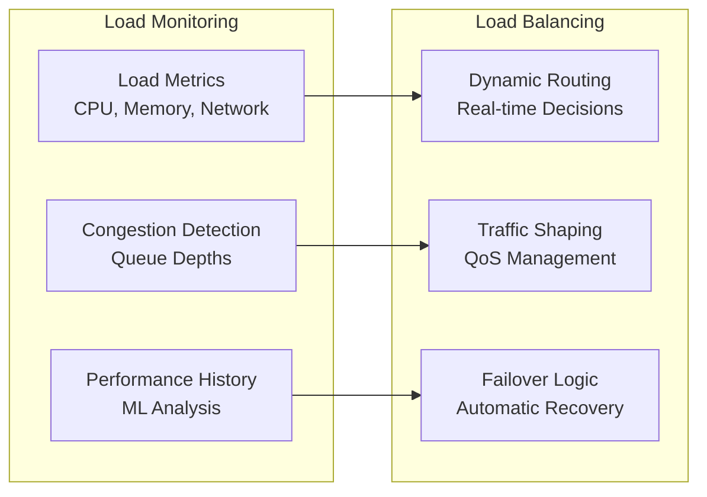
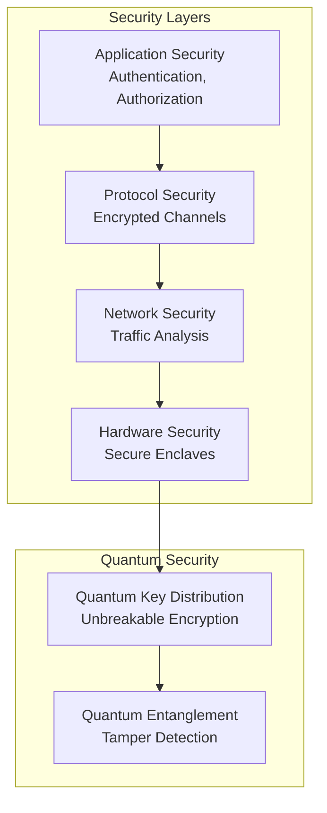

# 🏛️ HyperFabric Architecture

## Overview

HyperFabric Interconnect is built on a multi-layered architecture designed for maximum performance, scalability, and adaptability. The system transcends traditional networking paradigms by integrating advanced concepts from quantum computing, neuromorphic systems, and machine learning.

## Core Architectural Principles

### 1. Layered Design Philosophy



### 2. Zero-Copy Philosophy

HyperFabric implements true zero-copy data movement throughout the entire stack:

- **Memory Mapping**: Direct hardware-to-hardware transfers
- **Buffer Pools**: Reusable memory regions to minimize allocation overhead
- **View-Based Operations**: Data manipulation without copying
- **RDMA Integration**: Hardware-accelerated memory access

### 3. Adaptive Intelligence

The system continuously learns and optimizes performance:

- **ML-Based Routing**: Neural networks predict optimal paths
- **Pattern Recognition**: Automated detection of communication patterns
- **Congestion Prediction**: Proactive avoidance of network bottlenecks
- **Hardware Optimization**: Dynamic adaptation to hardware characteristics

## Component Architecture

### HyperFabric Protocol Engine

The central orchestrator that manages all system operations:

```python
class HyperFabricProtocol:
    """
    Central protocol engine coordinating all fabric operations.
    
    Key Responsibilities:
    - Node lifecycle management
    - Transfer orchestration
    - Performance monitoring
    - Fault tolerance coordination
    """
```

**Features:**

- Asynchronous operation for maximum concurrency
- Background monitoring and optimization
- Graceful degradation under load
- Comprehensive performance metrics

### Intelligent Routing Engine

Advanced routing system with multiple optimization strategies:



**Key Features:**

- Multiple routing algorithms for different scenarios
- Real-time performance feedback integration
- Quantum-aware path selection
- Machine learning-based optimization
- Neuromorphic-inspired adaptive weights

### Topology Manager

Manages the fabric topology and zone orchestration:

```python
class TopologyManager:
    """
    Manages network topology and fabric zones.
    
    Capabilities:
    - Automatic node discovery
    - Zone-based isolation
    - Fault tolerance and recovery
    - Performance optimization
    """
```

**Zone Types:**

- **Compute Cluster**: High-performance GPU/CPU clusters
- **Quantum Realm**: Quantum processors with entanglement support
- **Photonic Backbone**: Ultra-high-speed optical interconnects
- **Neuromorphic Mesh**: Spike-based neuromorphic networks
- **Edge Swarm**: Distributed edge computing nodes

### Buffer Manager

Advanced memory management for zero-copy operations:



## Data Flow Architecture

### Packet Processing Pipeline



### Quantum-Aware Communication

For quantum-enhanced networks, HyperFabric maintains quantum coherence:

```mermaid
graph LR
    subgraph "Quantum Network"
        QN1[QPU Node 1<br/>|ψ⟩ state]
        QN2[QPU Node 2<br/>|φ⟩ state]
        QN3[QPU Node 3<br/>|χ⟩ state]
    end
    
    subgraph "Entanglement Preservation"
        EP[Coherence Time<br/>Monitoring]
        ES[Error Syndrome<br/>Correction]
        QR[Quantum Routing<br/>State-Aware]
    end
    
    QN1 -.->|Entangled| QN2
    QN2 -.->|Entangled| QN3
    QN1 --> EP
    QN2 --> ES
    QN3 --> QR
```

## Scalability Architecture

### Hierarchical Scaling

HyperFabric scales from small clusters to massive supercomputer networks:



### Zone-Based Isolation

Different isolation levels provide security and performance optimization:

| Isolation Level | Description | Use Cases |
|----------------|-------------|-----------|
| **None (0)** | No isolation, full connectivity | Development, testing |
| **Soft (1)** | Traffic prioritization | Mixed workloads |
| **Medium (2)** | Logical separation with controlled access | Production environments |
| **Hard (3)** | Physical separation, strict controls | Sensitive workloads |
| **Quantum Secure (4)** | Quantum-encrypted communication | Ultra-secure applications |

## Performance Optimization Strategies

### 1. Predictive Routing

Machine learning models predict network conditions:

```python
class MLRoutePredictor:
    """
    ML-based route prediction for optimal performance.
    
    Models:
    - Congestion prediction (LSTM networks)
    - Latency forecasting (regression models)
    - Bandwidth utilization (time series analysis)
    """
```

### 2. Hardware-Specific Optimization

Adaptive optimization based on hardware characteristics:

- **GPU Clusters**: Optimize for high bandwidth, parallel transfers
- **Quantum Processors**: Minimize coherence time impact
- **Photonic Networks**: Leverage speed-of-light advantages
- **Neuromorphic**: Event-driven, spike-based communication

### 3. Dynamic Load Balancing

Real-time load distribution across available paths:



## Fault Tolerance and Recovery

### Self-Healing Architecture

HyperFabric automatically detects and recovers from failures:

1. **Detection**: Continuous health monitoring
2. **Isolation**: Quarantine failed components
3. **Recovery**: Automatic route recalculation
4. **Healing**: Gradual reintegration of recovered nodes

### Redundancy Strategies

- **Path Redundancy**: Multiple routes between critical nodes
- **Data Redundancy**: Erasure coding for critical transfers
- **Node Redundancy**: Hot standby nodes for critical services
- **Zone Redundancy**: Cross-zone backup and recovery

## Security Architecture

### Multi-Layer Security



### Threat Mitigation

- **Side-Channel Attacks**: Hardware-based protection
- **Man-in-the-Middle**: Quantum key distribution
- **DDoS Protection**: Intelligent traffic filtering
- **Data Exfiltration**: Zero-knowledge transfer protocols

## Future Architecture Evolution

### Planned Enhancements

1. **Quantum Internet Integration**: Full quantum network support
2. **Neuromorphic Expansion**: Brain-inspired communication protocols
3. **Photonic Computing**: Light-based computation integration
4. **Edge AI**: Distributed intelligence at network edges
5. **Biological Interfaces**: Bio-hybrid computing connections

### Research Directions

- **Consciousness-Inspired Networking**: Self-aware network entities
- **Molecular Communication**: Chemical signal-based protocols
- **Gravitational Wave Networks**: Space-time based communication
- **Quantum Gravity Effects**: Relativistic network optimization

The HyperFabric architecture represents a fundamental shift towards intelligent, adaptive, and quantum-aware networking systems that will power the next generation of computational infrastructure.
