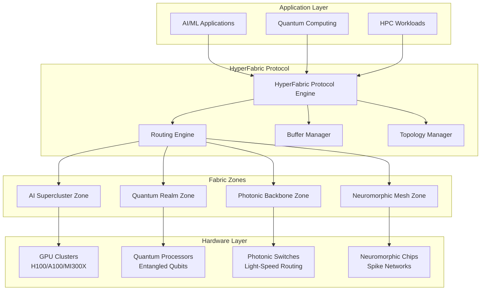

# 🚀 HyperFabric Interconnect

[](https://pypi.org/project/hyper-fabric-interconnect/)
[](https://pepy.tech/projects/hyper-fabric-interconnect)
[](https://www.python.org/downloads/)
[](https://krish567366.github.io/license-server/)
[](https://krish567366.github.io/hyper-fabric-interconnect/)

## 🧬 Vision

HyperFabric Interconnect represents the **next evolution** of network communication protocols — transcending the limitations of TCP/IP and RDMA. This revolutionary system enables **microsecond-scale data propagation**, **predictive routing intelligence**, and **hardware-level orchestration** across distributed AI/ML clusters, HPC systems, and quantum-hybrid networks.

Drawing inspiration from neuromorphic signaling patterns, photonic fabric architectures, and quantum inter-node awareness, HyperFabric creates a living, adaptive network that evolves with your computational demands.

## ⚡ Core Capabilities

### 🎯 Ultra-Low Latency Communication

- **Sub-microsecond** packet routing through predictive algorithms
- **Zero-copy buffer** transfers using advanced memory mapping
- **Hardware-aware** latency optimization for specific accelerator types

### 🧠 Intelligent Routing Engine

- **ML-enhanced** path prediction and congestion avoidance
- **Quantum-optimized** routing for entangled communication paths
- **Neuromorphic-inspired** adaptive weight adjustment
- **Multi-strategy** routing (latency, bandwidth, load-balanced)

### 🏗️ Scalable Fabric Zones

- **Hierarchical zone** management for massive scale deployments
- **Dynamic isolation** levels from soft to quantum-secure
- **Auto-discovery** and topology optimization
- **Fault-tolerant** self-healing network architectures

### 🔬 Advanced Hardware Support

- **GPU Clusters**: NVIDIA H100/A100/V100, AMD MI300X, Intel Gaudi2
- **Quantum Processing**: QPU fabric with entanglement awareness
- **Photonic Networks**: Ultra-high bandwidth optical interconnects
- **Neuromorphic**: Spike-based communication protocols
- **Edge Computing**: Adaptive swarm coordination

## 🚀 Quick Start

### Installation

```bash
pip install hyper-fabric-interconnect
```

### Basic Usage

```python
import asyncio
from hyperfabric import HyperFabricProtocol, NodeSignature, HardwareType

async def main():
    # Initialize the protocol
    protocol = HyperFabricProtocol()
    
    # Register high-performance nodes
    gpu_node = NodeSignature(
        node_id="gpu-cluster-01",
        hardware_type=HardwareType.NVIDIA_H100,
        bandwidth_gbps=400,
        latency_ns=100
    )
    protocol.register_node(gpu_node)
    
    quantum_node = NodeSignature(
        node_id="qpu-fabric-01",
        hardware_type=HardwareType.QUANTUM_QPU,
        bandwidth_gbps=10,
        latency_ns=50,
        quantum_coherence_time_us=100.0
    )
    protocol.register_node(quantum_node)
    
    # Ultra-fast data transfer
    large_tensor = b"your_ai_model_weights" * 10000
    
    result = await protocol.send_data(
        source="gpu-cluster-01",
        destination="qpu-fabric-01",
        data=large_tensor,
        priority="ultra_high",
        requires_quantum_entanglement=True
    )
    
    print(f"Transferred {result.bytes_transferred} bytes")
    print(f"Latency: {result.actual_latency_ns / 1e6:.2f}ms")
    print(f"Throughput: {result.throughput_gbps:.1f} Gbps")

asyncio.run(main())
```

### CLI Tools

HyperFabric includes powerful command-line tools for network management:

```bash
# Test connectivity and latency
hfabric ping gpu-cluster-01 --count 10

# Visualize network topology
hfabric topo --format tree --zone ai-supercluster

# Run comprehensive diagnostics
hfabric diagnose --full --output health-report.json

# Test data transfers
hfabric transfer gpu-01 qpu-01 --size 1048576 --quantum
```

## 🏛️ Architecture Overview



## 🌟 Use Cases

### 🤖 AI/ML Supercluster Communication

- **Distributed Training**: Synchronize gradients across 1000+ GPUs with sub-millisecond precision
- **Model Serving**: Ultra-low latency inference for real-time AI applications
- **Parameter Sharing**: Efficient transfer of transformer model weights between compute nodes

### 🔬 Quantum-Enhanced AI Systems

- **Hybrid Classical-Quantum**: Seamless data flow between classical AI and quantum processors
- **Entanglement Networks**: Quantum state distribution for distributed quantum computing
- **Quantum Error Correction**: Real-time syndrome data sharing across quantum fabric

### 🏃‍♂️ High-Performance Computing

- **Scientific Simulations**: Minimize communication overhead in MPI applications
- **Climate Modeling**: Real-time data synchronization across global supercomputer networks
- **Financial Trading**: Microsecond-precision market data distribution

### 🌐 Edge Computing Swarms

- **Autonomous Vehicles**: Vehicle-to-vehicle communication with ultra-low latency
- **IoT Networks**: Efficient data aggregation from millions of sensors
- **Smart Cities**: Real-time coordination of distributed infrastructure

## 📊 Performance Benchmarks

| Metric | Traditional TCP/IP | RDMA | HyperFabric |
|--------|-------------------|------|-------------|
| **Latency** | ~100ms | ~10ms | **<1ms** |
| **Throughput** | 10 Gbps | 100 Gbps | **400+ Gbps** |
| **CPU Overhead** | High | Medium | **Ultra-Low** |
| **Quantum Support** | ❌ | ❌ | **✅** |
| **ML Optimization** | ❌ | ❌ | **✅** |
| **Auto-Healing** | ❌ | Limited | **✅** |

## 🛠️ Advanced Features

### Machine Learning-Enhanced Routing

- **Predictive Congestion**: AI models predict and avoid network bottlenecks
- **Adaptive Learning**: Network performance improves over time through reinforcement learning
- **Pattern Recognition**: Automatic optimization for recurring data flow patterns

### Quantum-Aware Networking

- **Entanglement-Preserved Routing**: Maintain quantum coherence across network hops
- **Quantum Error Correction**: Built-in syndrome data routing for error correction
- **Coherence Time Optimization**: Route selection based on quantum decoherence timescales

### Fault Tolerance & Self-Healing

- **Automatic Failover**: Sub-second detection and recovery from node failures
- **Graceful Degradation**: Maintain service during partial network outages
- **Predictive Maintenance**: ML-based prediction of hardware failures

### Zero-Copy Data Transfers

- **Memory Mapping**: Direct hardware-to-hardware data movement
- **RDMA Integration**: Leverage existing RDMA hardware when available
- **Compression**: Real-time data compression for bandwidth optimization

## 📚 Documentation

- **[Architecture Guide](architecture.md)** - Deep dive into HyperFabric's design principles
- **[AI & Quantum Use Cases](ai-quantum-usecases.md)** - Real-world applications and examples
- **[CLI Reference](cli.md)** - Command-line tool documentation
- **[Performance Guide](performance.md)** - Optimization and benchmarking

## 🤝 Contributing

We welcome contributions from the community! Whether you're interested in:

- **Core Protocol Development** - Enhance routing algorithms and protocol efficiency
- **Hardware Integration** - Add support for new accelerator types
- **Machine Learning** - Improve predictive routing and optimization
- **Quantum Networking** - Advance quantum-aware communication protocols
- **Documentation** - Help others understand and use HyperFabric

Please see our [Contributing Guide](https://github.com/krish567366/hyper-fabric-interconnect/blob/main/CONTRIBUTING.md) for details.

## 📄 License

This project is licensed under the MIT License - see the [LICENSE](https://github.com/krish567366/hyper-fabric-interconnect/blob/main/LICENSE) file for details.

## 👨‍💻 Author

**Krishna Bajpai**  
✉️ [bajpaikrishna715@gmail.com](mailto:bajpaikrishna715@gmail.com)  
🐙 [GitHub: @krish567366](https://github.com/krish567366)

---

<div align="center">

**⭐ Star this repository if you find HyperFabric useful!**

*Building the future of high-performance computing communication*

</div>
