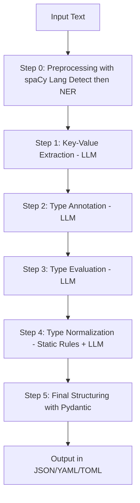

# Flexible Key-Value Extracting MCP Server

[](https://smithery.ai/server/@KunihiroS/kv-extractor-mcp-server)

Version: 0.3.2

This MCP server extracts key-value pairs from arbitrary, noisy, or unstructured text using LLMs (GPT-4.1-mini) and pydantic-ai. 
It ensures type safety and supports multiple output formats (JSON, YAML, TOML). The server is robust to any input and always attempts to structure data as much as possible, however, perfect extraction is **not guaranteed**.

---
## 🤔💡 Why Use This MCP Server?

While many Large Language Model (LLMs) services offer structured output capabilities, this MCP server provides distinct advantages for key-value extraction, especially from challenging real-world text:

*   🔑🔍 **Automatic Key Discovery**: A core strength is its ability to *autonomously identify and extract relevant key-value pairs* from unstructured text *without requiring pre-defined keys*. While typical LLM structured outputs need you to specify the keys you're looking for, this server discovers them, making it highly effective for diverse and unpredictable data where the structure is not known beforehand.
*   💪🧱 **Superior Robustness for Complex Inputs**: It excels with arbitrary, noisy, or unstructured text where standard LLM structured outputs might falter. The multi-step pipeline is specifically designed to sift through and make sense of imperfect data.
*   🌐🗣️ **Advanced Multi-Lingual Preprocessing**: Before LLM processing, it leverages spaCy for Named Entity Recognition (NER) in Japanese, English, and Chinese (Simplified/Traditional), significantly enhancing extraction accuracy for these languages by providing context-rich candidate phrases.
*   🔄✍️ **Iterative Refinement and Typing**: Unlike a single-pass extraction, this server employs a sophisticated pipeline including LLM-based type annotation, LLM-based type evaluation, and rule-based/LLM-fallback normalization. This ensures more accurate and contextually appropriate data types.
*   ✅🛡️ **Guaranteed Type Safety and Schema Adherence**: Final structuring with Pydantic ensures that the output is not only structured but also type-safe and validated against a defined schema, providing reliable data for downstream applications.
*   📊⚙️ **Consistent and Predictable Output**: The server is designed to always return a well-formed response, even if extraction is partial or encounters issues, which is critical for building robust automated systems.

---

## Release Notes

### v0.3.2
- Fix: FastMCP caused error.

### v0.3.1
- Update: Improve type evaluation prompt for robust correction.
- Update: Added the strong point of this MCP server on README.md

### v0.2.0
- Fix: Lang code for zh-cn / zh-tw.

### v0.1.0
- Initial release

## Tools

- `/extract_json` : Extracts type-safe key-value pairs in JSON format from input text.
- `/extract_yaml` : Extracts type-safe key-value pairs in YAML format from input text.
- `/extract_toml` : Extracts type-safe key-value pairs in TOML format from input text.
    - *Note: Due to TOML specifications, arrays of objects (dicts) or deeply nested structures cannot be directly represented. See "Note on TOML Output Limitations" below for details.*

**Note:**
- Supported languages: Japanese, English, and Chinese (Simplified: zh-cn / Traditional: zh-tw).
- Extraction relies on pydantic-ai and LLMs. Perfect extraction is not guaranteed.
- Longer input sentences will take more time to process. Please be patient.
- On first launch, the server will download spaCy models, so the process will take longer initially.

### Estimated Processing Time Sample

| Input Tokens | Input Characters (approx.) | Measured Processing Time (sec) | Model Configuration |
|:-----------:|:--------------------------:|:------------------------------:|:-------------------|
| 200         | ~400                       | ~15                            | gpt-4.1-mini       |

*Actual processing time may vary significantly depending on API response, network conditions, and model load. Even short texts may take 15 seconds or more.*

## Features
- **Flexible extraction**: Handles any input, including noisy or broken data.
- **JP / EN / ZH-CN / ZH-TW full support**: Preprocessing with spaCy NER by automatic language detection (Japanese, English, Chinese [Simplified: zh-cn / Traditional: zh-tw] supported; others are rejected with error).
- **Type-safe output**: Uses Pydantic for output validation.
- **Multiple formats**: Returns results as JSON, YAML, or TOML.
- **Robust error handling**: Always returns a well-formed response, even on failure.
- **High accuracy**: Uses GPT-4.1-mini for both extraction/annotation and type evaluation, with Pydantic for final structuring.

## Tested Scenarios
The server has been tested with various inputs, including:
- Simple key-value pairs
- Noisy or unstructured text with important information buried within
- Different data formats (JSON, YAML, TOML) for output

## Processing Flow
Below is a flowchart representing the processing flow of the key-value extraction pipeline as implemented in `server.py`:



## Preprocessing with spaCy (Multilingual NER)

This server uses [spaCy](https://spacy.io/) with automatic language detection to extract named entities from the input text **before** passing it to the LLM. Supported languages are Japanese (`ja_core_news_md`), English (`en_core_web_sm`), and Chinese (Simplified/Traditional, `zh_core_web_sm`).

- The language of the input text is automatically detected using `langdetect`.
- If the detected language is not Japanese, English, or Chinese, the server returns an error: `Unsupported lang detected`.
- The appropriate spaCy model is automatically downloaded and loaded as needed. No manual installation is required.
- The extracted phrase list is included in the LLM prompt as follows:

  > [Preprocessing Candidate Phrases (spaCy NER)]
  > The following is a list of phrases automatically extracted from the input text using spaCy's detected language model.
  > These phrases represent detected entities such as names, dates, organizations, locations, numbers, etc.
  > This list is for reference only and may contain irrelevant or incorrect items. The LLM uses its own judgment and considers the entire input text to flexibly infer the most appropriate key-value pairs.

## Step Details

This project's key-value extraction pipeline consists of multiple steps. Each step's details are as follows:

### Step 0: Preprocessing with spaCy (Language Detection → Named Entity Recognition)
- **Purpose**: Automatically detect the language of the input text and use the appropriate spaCy model (e.g., `ja_core_news_md`, `en_core_web_sm`, `zh_core_web_sm`) to extract named entities.
- **Output**: The extracted phrase list, which is included in the LLM prompt as a hint to improve key-value pair extraction accuracy.

### Step 1: Key-Value Extraction (LLM)
- **Purpose**: Use GPT-4.1-mini to extract key-value pairs from the input text and the extracted phrase list.
- **Details**:
  - The prompt includes instructions to return list-formatted values when the same key appears multiple times.
  - Few-shot examples are designed to include list-formatted outputs.
- **Output**: Example: `key: person, value: ["Tanaka", "Sato"]`

### Step 2: Type Annotation (LLM)
- **Purpose**: Use GPT-4.1-mini to infer the data type (int, str, bool, list, etc.) of each key-value pair extracted in Step 1.
- **Details**:
  - The type annotation prompt includes instructions for list and multiple value support.
- **Output**: Example: `key: person, value: ["Tanaka", "Sato"] -> list[str]`

### Step 3: Type Evaluation (LLM)
- **Purpose**: Use GPT-4.1-mini to evaluate and correct the type annotations from Step 2.
- **Details**:
  - For each key-value pair, GPT-4.1-mini re-evaluates the type annotation's validity and context.
  - If type errors or ambiguities are detected, GPT-4.1-mini automatically corrects or supplements the type.
  - Example: Correcting a value extracted as a number but should be a string, or determining whether a value is a list or a single value.
- **Output**: The type-evaluated key-value pair list.

### Step 4: Type Normalization (Static Rules + LLM Fallback)
- **Purpose**: Convert the type-evaluated data into Python's standard types (int, float, bool, str, list, None, etc.).
- **Details**:
  - Apply static normalization rules (regular expressions or type conversion functions) to convert values into Python's standard types.
  - Example: Converting comma-separated values to lists, "true"/"false" to bool, or date expressions to standard formats.
  - If static rules cannot convert a value, use LLM-based type conversion fallback.
  - Unconvertible values are safely handled as None or str.
- **Output**: The Python-type-normalized key-value pair list.

### Step 5: Final Structuring with Pydantic
- **Purpose**: Validate and structure the type-normalized data using Pydantic models (KVOut/KVPayload).
- **Details**:
  - Map each key-value pair to Pydantic models, ensuring type safety and data integrity.
  - Validate single values, lists, null, and composite types according to the schema.
  - If validation fails, attach error information while preserving as much data as possible.
  - The final output is returned in the specified format (JSON, YAML, or TOML).
- **Output**: The type-safe and validated dict or specified format (JSON/YAML/TOML) output.

---

This pipeline is designed to accommodate future list format support and Pydantic schema extensions.

## Note on TOML Output Limitations

- In TOML, simple arrays (e.g., `items = ["A", "B"]`) can be represented natively, but
  **arrays of objects (dicts) or deeply nested structures cannot be directly represented due to TOML specifications.**
- Therefore, complex lists or nested structures (e.g., `[{"name": "A"}, {"name": "B"}]`) are
  **stored as "JSON strings" in TOML values.**
- This is a design choice to prevent information loss due to TOML's specification limitations.
- YAML and JSON formats can represent nested structures as-is.

## Example Input/Output
Input:
```
Thank you for your order (Order Number: ORD-98765). Product: High-Performance Laptop, Price: 89,800 JPY (tax excluded), Delivery: May 15-17. Shipping address: 1-2-3 Shinjuku, Shinjuku-ku, Tokyo, Apartment 101. Phone: 090-1234-5678. Payment: Credit Card (VISA, last 4 digits: 1234). For changes, contact support@example.com.
```

Output (JSON):
```json
{
  "order_number": "ORD-98765",
  "product_name": "High-Performance Laptop",
  "price": 89800,
  "price_currency": "JPY",
  "tax_excluded": true,
  "delivery_start_date": "20240515",
  "delivery_end_date": "20240517",
  "shipping_address": "1-2-3 Shinjuku, Shinjuku-ku, Tokyo, Apartment 101",
  "phone_number": "090-1234-5678",
  "payment_method": "Credit Card",
  "card_type": "VISA",
  "card_last4": "1234",
  "customer_support_email": "support@example.com"
}
```

Output (YAML):
```yaml
order_number: ORD-98765
product_name: High-Performance Laptop
price: 89800
price_currency: JPY
tax_excluded: true
delivery_start_date: '20240515'
delivery_end_date: '20240517'
shipping_address: 1-2-3 Shinjuku, Shinjuku-ku, Tokyo, Apartment 101
phone_number: 090-1234-5678
payment_method: Credit Card
card_type: VISA
card_last4: '1234'
customer_support_email: support@example.com
```

Output (TOML, simple case):
```toml
order_number = "ORD-98765"
product_name = "High-Performance Laptop"
price = 89800
price_currency = "JPY"
tax_excluded = true
delivery_start_date = "20240515"
delivery_end_date = "20240517"
shipping_address = "1-2-3 Shinjuku, Shinjuku-ku, Tokyo, Apartment 101"
phone_number = "090-1234-5678"
payment_method = "Credit Card"
card_type = "VISA"
card_last4 = "1234"
```

Output (TOML, complex case):
```toml
items = '[{"name": "A", "qty": 2}, {"name": "B", "qty": 5}]'
addresses = '[{"city": "Tokyo", "zip": "160-0022"}, {"city": "Osaka", "zip": "530-0001"}]'
```
*Note: Arrays of objects or nested structures are stored as JSON strings in TOML.*

## Tools

### 1. `extract_json`
- **Description**: Extracts key-value pairs from arbitrary noisy text and returns them as type-safe JSON (Python dict).
- **Arguments**:
  - `input_text` (string): Input string containing noisy or unstructured data.
- **Returns**: `{ "success": True, "result": ... }` or `{ "success": False, "error": ... }`
- **Example**:
  ```json
  {
    "success": true,
    "result": { "foo": 1, "bar": "baz" }
  }
  ```

### 2. `extract_yaml`
- **Description**: Extracts key-value pairs from arbitrary noisy text and returns them as type-safe YAML (string).
- **Arguments**:
  - `input_text` (string): Input string containing noisy or unstructured data.
- **Returns**: `{ "success": True, "result": ... }` or `{ "success": False, "error": ... }`
- **Example**:
  ```json
  {
    "success": true,
    "result": "foo: 1\nbar: baz"
  }
  ```

### 3. `extract_toml`
- **Description**: Extracts key-value pairs from arbitrary noisy text and returns them as type-safe TOML (string).
- **Arguments**:
  - `input_text` (string): Input string containing noisy or unstructured data.
- **Returns**: `{ "success": True, "result": ... }` or `{ "success": False, "error": ... }`
- **Example**:
  ```json
  {
    "success": true,
    "result": "foo = 1\nbar = \"baz\""
  }
  ```

## Usage

### Installing via Smithery

To install kv-extractor-mcp-server for Claude Desktop automatically via [Smithery](https://smithery.ai/server/@KunihiroS/kv-extractor-mcp-server):

```bash
npx -y @smithery/cli install @KunihiroS/kv-extractor-mcp-server --client claude
```

### Requirements
- Python 3.9+
- API key for OpenAI models (set in `settings.json` under `env`)

### Running the Server

```bash
python server.py
```
*In case you want to run the server manually.*

## MCP Host Configuration

When running this MCP Server, you **must explicitly specify the log output mode and (if enabled) the absolute log file path via command-line arguments**.

- `--log=off` : Disable all logging (no logs are written)
- `--log=on --logfile=/absolute/path/to/logfile.log` : Enable logging and write logs to the specified absolute file path
- Both arguments are **required** when logging is enabled. The server will exit with an error if either is missing, the path is not absolute, or if invalid values are given.

### Example: Logging Disabled
```json
"kv-extractor-mcp-server": {
  "command": "pipx",
  "args": ["run", "kv-extractor-mcp-server", "--log=off"],
  "env": {
    "OPENAI_API_KEY": "{apikey}"
  }
}
```

### Example: Logging Enabled (absolute log file path required)
```json
"kv-extractor-mcp-server": {
  "command": "pipx",
  "args": ["run", "kv-extractor-mcp-server", "--log=on", "--logfile=/workspace/logs/kv-extractor-mcp-server.log"],
  "env": {
    "OPENAI_API_KEY": "{apikey}"
  }
}
```

> **Note:**
> - When logging is enabled, logs are written **only** to the specified absolute file path. Relative paths or omission of `--logfile` will cause an error.
> - When logging is disabled, no logs are output.
> - If the required arguments are missing or invalid, the server will not start and will print an error message.
> - The log file must be accessible and writable by the MCP Server process.
> - If you have trouble to run this server, it may be due to caching older version of kv-extractor-mcp-server. Please try to run it with the latest version (set `x.y.z` to the latest version) of kv-extractor-mcp-server by the below setting.

```json
"kv-extractor-mcp-server": {
  "command": "pipx",
  "args": ["run", "kv-extractor-mcp-server==x.y.z", "--log=off"],
  "env": {
    "OPENAI_API_KEY": "{apikey}"
  }
}
```

## License
GPL-3.0-or-later

## Author
KunihiroS (and contributors)
