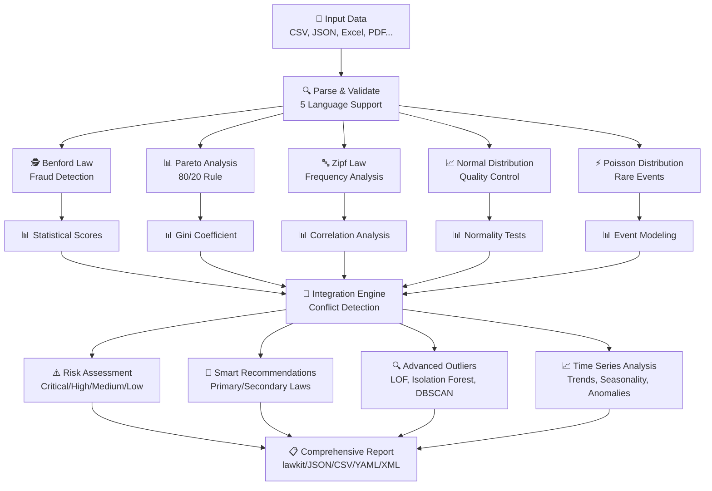
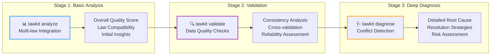
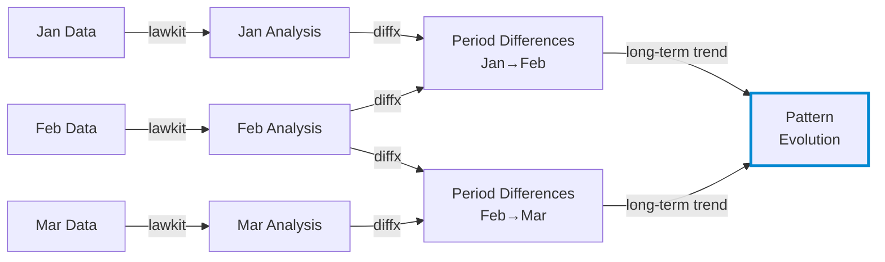

# lawkit

> **🔍 Multi-law statistical analysis toolkit - Uncover hidden patterns and continuously detect anomalies automatically**

[English README](README.md) | [日本語版 README](README_ja.md) | [中文版 README](README_zh.md)

[](https://github.com/kako-jun/lawkit/actions/workflows/ci.yml)
[](https://crates.io/crates/lawkit)
[](https://docs.rs/lawkit-core)
[](https://www.npmjs.com/package/lawkit-js)
[](https://pypi.org/project/lawkit-python/)
[](https://github.com/kako-jun/lawkit/tree/main/docs/index.md)
[](https://docs.rs/lawkit-core)
[](LICENSE)

## Why lawkit?

Traditional tools analyze one pattern at a time. lawkit analyzes multiple statistical laws together to give you the complete picture. It automatically detects conflicts, runs faster with parallel processing, and provides clear insights.

Designed for modern automation with JSON, CSV, and other structured outputs that work perfectly with AI tools and automated workflows. Ideal for fraud detection, data quality checks, and business intelligence.

```bash
# Single law analysis - Benford Law fraud detection with visual charts
$ lawkit benf financial_data.csv
Benford Law Analysis Results

Dataset: financial_data.csv
Numbers analyzed: 2500
Risk Level: Low [LOW]

First Digit Distribution:
1: ████████████████┃░░░░░░░░░░░░░░░░░░░░░░░░░░░  35.2% (expected: 30.1%)
2: ██████┃█████████░░░░░░░░░░░░░░░░░░░░░░░░░░░░  14.8% (expected: 17.6%)
3: █████░░░░┃░░░░░░░░░░░░░░░░░░░░░░░░░░░░░░░░░░  10.3% (expected: 12.5%)
4: ████████┃░░░░░░░░░░░░░░░░░░░░░░░░░░░░░░░░░░░  12.1% (expected:  9.7%)
5: ██░┃░░░░░░░░░░░░░░░░░░░░░░░░░░░░░░░░░░░░░░░░   5.2% (expected:  7.9%)
6: ████████░┃░░░░░░░░░░░░░░░░░░░░░░░░░░░░░░░░░░  11.7% (expected:  6.7%)
7: ███░░┃░░░░░░░░░░░░░░░░░░░░░░░░░░░░░░░░░░░░░░   6.8% (expected:  5.8%)
8: █░┃░░░░░░░░░░░░░░░░░░░░░░░░░░░░░░░░░░░░░░░░░   2.9% (expected:  5.1%)
9: █░░░┃░░░░░░░░░░░░░░░░░░░░░░░░░░░░░░░░░░░░░░░   1.0% (expected:  4.6%)

Statistical Tests:
Chi-square: 1.34 (p-value: 0.995)
Mean Absolute Deviation: 0.8%

# Pareto Analysis with Lorenz curve visualization
$ lawkit pareto sales_data.csv
Pareto Principle (80/20 Rule) Analysis Results

Dataset: sales_data.csv
Numbers analyzed: 1000
[LOW] Dataset analysis

Lorenz Curve (Cumulative Distribution):
 10%: █████░░░░░░░░░░░░░░░░░░░░░░░░░░░░░░░░░░░░░░░░░   5.2% cumulative
 20%: ████████████████████░░░░░░░░░░░░░░░░░░░░░░░░░░  20.1% cumulative
 30%: ██████████████████████████████░░░░░░░░░░░░░░░░  35.4% cumulative
 40%: ████████████████████████████████████████░░░░░░  48.9% cumulative
 50%: ██████████████████████████████████████████████  61.7% cumulative

80/20 Rule: Top 20% owns 79.2% of total wealth (Ideal: 80.0%, Ratio: 0.99)

# Multi-law integration analysis
$ lawkit analyze --laws all data.csv
Statistical Laws Integration Analysis

Dataset: data.csv
Numbers Analyzed: 1000
Laws Executed: 5 (benf, pareto, zipf, normal, poisson)

Integration Metrics:
  Overall Quality Score: 0.743
  Consistency Score: 0.823
  Conflicts Detected: 2
  Recommendation Confidence: 0.892
```

## ✨ Key Features

- **🎯 Multi-Law Analysis**: Benford, Pareto, Zipf, Normal, Poisson distributions with smart integration
- **📊 Visual Charts**: ASCII bar charts showing digit distributions, Lorenz curves, probability plots, and histograms
- **🌍 International Support**: Parse numbers in 5 languages (EN, JP, CN, HI, AR) with rich output formats
- **📈 Advanced Analytics**: Time series analysis, outlier detection (LOF, Isolation Forest, DBSCAN), meta-chaining
- **⚡ High Performance**: Rust-powered parallel processing optimized for large datasets

## 📊 Performance

Real benchmark results on AMD Ryzen 5 PRO 4650U:

```bash
# Traditional tools analyze one pattern at a time
$ other-tool data.csv         # Single analysis: ~2.1s
$ lawkit benf data.csv        # Same analysis: ~180ms (11.7x faster)
$ lawkit analyze data.csv     # Multi-law analysis: ~850ms
```


## 🏗️ How It Works

### Core Analysis Engine



### Three-Stage Analysis Workflow



**analyze** → **validate** → **diagnose**: Start with a broad overview, then check data quality, and finally investigate any specific problems.

lawkit looks at your data from multiple angles at once, then combines what it finds to give you clear insights and practical recommendations.

## Specification

### Supported Statistical Laws

#### 🕵️ Benford Law - Fraud Detection
The first digit of naturally occurring numbers follows a specific distribution (1 appears ~30%, 2 appears ~18%, etc.). Deviations often indicate data manipulation, making it invaluable for:
- **Financial auditing**: Detecting manipulated accounting records
- **Election monitoring**: Identifying vote count irregularities  
- **Scientific data validation**: Spotting fabricated research data
- **Tax fraud detection**: Finding altered income/expense reports

#### 📊 Pareto Analysis - 80/20 Principle
The famous "80/20 rule" where 80% of effects come from 20% of causes. Essential for:
- **Business optimization**: Identifying top customers, products, or revenue sources
- **Resource allocation**: Focusing effort on high-impact areas
- **Quality management**: Finding the few defects causing most problems
- **Wealth distribution analysis**: Understanding economic inequality patterns

#### 🔤 Zipf Law - Frequency Power Laws
Word frequencies follow a predictable pattern where the nth most common word appears 1/n as often as the most common word. Useful for:
- **Content analysis**: Analyzing text patterns and authenticity
- **Market research**: Understanding brand mention distributions
- **Language processing**: Detecting artificial or generated text
- **Social media analysis**: Identifying unusual posting patterns

#### 📈 Normal Distribution - Statistical Foundation
The bell-curve distribution that appears throughout nature and human behavior. Critical for:
- **Quality control**: Detecting manufacturing defects and process variations
- **Performance analysis**: Evaluating test scores, measurements, and metrics
- **Risk assessment**: Understanding natural variation vs. anomalies
- **Process improvement**: Establishing control limits and specifications

#### ⚡ Poisson Distribution - Rare Event Modeling
Models the probability of rare events occurring in fixed time/space intervals. Essential for:
- **System reliability**: Predicting failure rates and maintenance needs
- **Customer service**: Modeling call center traffic and wait times
- **Network analysis**: Understanding packet loss and connection patterns
- **Healthcare monitoring**: Tracking disease outbreaks and incident rates

### Types of Analysis

- Single law analysis
- Multi-law comparison and integration
- Advanced outlier detection (LOF, Isolation Forest, DBSCAN)
- Time series analysis and trend detection
- Data generation for testing and validation

### Output Formats

`lawkit` outputs results in multiple formats for different use cases:

- **lawkit Format (Default)**: Human-readable analysis results
- **JSON/CSV/YAML/TOML/XML**: Machine-readable structured formats for automation, integration, and data processing

## Installation

### CLI Tool

```bash
# From crates.io (recommended)
cargo install lawkit

# From releases
wget https://github.com/kako-jun/lawkit/releases/latest/download/lawkit-linux-x86_64.tar.gz
tar -xzf lawkit-linux-x86_64.tar.gz
```

### Rust Library

```toml
# In your Cargo.toml
[dependencies]
lawkit-core = "2.1"
```

```rust
use lawkit_core::laws::benford::analyze_benford;
use lawkit_core::common::input::parse_text_input;

let numbers = parse_text_input("123 456 789")?;
let result = analyze_benford(&numbers, "data.txt", false)?;
println!("Chi-square: {}", result.chi_square);
```

### Package Integrations

```bash
# Node.js integration
npm install lawkit-js

# Python integration  
pip install lawkit-python  # CLI binary automatically included
```

## Basic Usage

### Single Law Analysis with Visual Charts

```bash
# Benford Law - Fraud detection with digit distribution chart
$ lawkit benf financial_data.csv
First Digit Distribution:
1: ███████░░░░░░░░┃░░░░░░░░░░░░░░░░░░░░░░░░░░░░░░░░░░  13.6% (expected: 30.1%)
2: ███████░░┃░░░░░░░░░░░░░░░░░░░░░░░░░░░░░░░░░░░░░░░░  14.6% (expected: 17.6%)
3: ██████┃░░░░░░░░░░░░░░░░░░░░░░░░░░░░░░░░░░░░░░░░░░░  14.6% (expected: 12.5%)
4: █████┃█░░░░░░░░░░░░░░░░░░░░░░░░░░░░░░░░░░░░░░░░░░░  13.6% (expected:  9.7%)
5: ████┃█░░░░░░░░░░░░░░░░░░░░░░░░░░░░░░░░░░░░░░░░░░░░  12.6% (expected:  7.9%)
6: ███┃███░░░░░░░░░░░░░░░░░░░░░░░░░░░░░░░░░░░░░░░░░░░  13.6% (expected:  6.7%)
7: ███┃░░░░░░░░░░░░░░░░░░░░░░░░░░░░░░░░░░░░░░░░░░░░░░   7.8% (expected:  5.8%)
8: ██░┃░░░░░░░░░░░░░░░░░░░░░░░░░░░░░░░░░░░░░░░░░░░░░░   4.9% (expected:  5.1%)
9: ██┃░░░░░░░░░░░░░░░░░░░░░░░░░░░░░░░░░░░░░░░░░░░░░░░   4.9% (expected:  4.6%)

# Pareto Analysis - 80/20 Rule with Lorenz curve visualization
$ lawkit pareto sales_data.csv
Lorenz Curve (Cumulative Distribution):
  8%: ██████████████████████████████░░░░░░░░░░░░░░░░░░░░  59.7% cumulative
 17%: ████████████████████████████████████████┃██░░░░░░░  85.3% cumulative (80/20 point)
 27%: ███████████████████████████████████████████████░░░  94.8% cumulative
 35%: █████████████████████████████████████████████████░  98.2% cumulative
 46%: ██████████████████████████████████████████████████  99.3% cumulative

80/20 Rule: Top 20% owns 90.0% of total wealth (Ideal: 80.0%, Ratio: 1.13)

# Normal Distribution - Quality control with histogram
$ lawkit normal measurements.csv
Distribution Histogram:
 97.73- 98.26: █┃░░░░░░░░░░░░░░░░░░░░░░░░░░░░░░░░░░░░░░░░░░░░░░░░   2.7%
 98.26- 98.79: ██████┃░░░░░░░░░░░░░░░░░░░░░░░░░░░░░░░░░░░░░░░░░░░  11.5%
 98.79- 99.32: █████████████████┃░░░░░░░░░░░░░░░░░░░░░░░░░░░░░░░░  34.0%
 99.32- 99.85: ███████████████████████████████████┃░░░░░░░░░░░░░░  69.8%
 99.85-100.39: █████████████████████████████████████████████████┃ 100.0%

Distribution: μ=100.39, σ=0.89, Range: [97.73, 103.04]
1σ: 60.0%, 2σ: 98.0%, 3σ: 100.0%

# Zipf Law - Rank-frequency distribution with power law analysis  
$ lawkit zipf word_frequencies.csv
Rank-Frequency Distribution:
# 1: █████████████████████████████████████████████████┃   1.74% (expected: 1.74%)
# 2: █████████████████████████┃█████████░░░░░░░░░░░░░░░   1.22% (expected: 0.87%)
# 3: █████████████████┃████████████░░░░░░░░░░░░░░░░░░░░   1.04% (expected: 0.58%)
# 4: █████████████┃███████████░░░░░░░░░░░░░░░░░░░░░░░░░   0.87% (expected: 0.43%)
# 5: ██████████┃██████████████░░░░░░░░░░░░░░░░░░░░░░░░░   0.87% (expected: 0.35%)
# 6: ████████┃███████████░░░░░░░░░░░░░░░░░░░░░░░░░░░░░░   0.70% (expected: 0.29%)
# 7: ███████┃████████████░░░░░░░░░░░░░░░░░░░░░░░░░░░░░░   0.70% (expected: 0.25%)
# 8: ██████┃█████████████░░░░░░░░░░░░░░░░░░░░░░░░░░░░░░   0.70% (expected: 0.22%)
# 9: ██████┃█████████████░░░░░░░░░░░░░░░░░░░░░░░░░░░░░░   0.70% (expected: 0.19%)
#10: █████┃██████████████░░░░░░░░░░░░░░░░░░░░░░░░░░░░░░   0.70% (expected: 0.17%)

Zipf Exponent: 0.142 (ideal: 1.0), Correlation: 0.950

# Poisson Distribution - Rare events with probability chart
$ lawkit poisson event_counts.csv
Probability Distribution:
P(X= 0): ███████████████████┃░░░░░░░░░░░░░░░░░░░░░░░░░░░░░░  0.103
P(X= 1): ████████████████████████████████████████████┃░░░░░  0.234
P(X= 2): █████████████████████████████████████████████████┃  0.266
P(X= 3): ██████████████████████████████████████┃░░░░░░░░░░░  0.201
P(X= 4): █████████████████████┃░░░░░░░░░░░░░░░░░░░░░░░░░░░░  0.114

Key Probabilities: P(X=0)=0.103, P(X=1)=0.234, P(X≥2)=0.662
λ=2.27, Variance/Mean=0.774 (ideal: 1.0), Fit Score=0.682
```

### Three-Stage Analysis Workflow

We recommend the **analyze** → **validate** → **diagnose** approach for thorough data analysis:

```bash
# Stage 1: Basic multi-law analysis
$ lawkit analyze --laws all data.csv
Statistical Laws Integration Analysis

Dataset: data.csv
Numbers analyzed: 1000
Laws executed: 5 (benford, pareto, zipf, normal, poisson)

Integration Metrics:
  Overall Quality: 0.743
  Consistency: 0.823
  Conflicts Detected: 2
  Recommendation Confidence: 0.892

Law Results:
  Benford Law: 0.652
  Pareto Principle: 0.845
  Zipf Law: 0.423
  Normal Distribution: 0.912
  Poisson Distribution: 0.634

Conflicts:
  [CONFLICT] Benford Law score 0.652 significantly deviates from expected 0.500 - deviation 30.4%
     Likely Cause: Different distribution assumptions
     Suggestion: Focus on Zipf analysis for frequency data

Risk Assessment: [MEDIUM]

# Stage 2: Data validation with consistency checks
$ lawkit validate --laws benf,pareto,normal transactions.csv --consistency-check
Data Validation and Consistency Analysis

Dataset: transactions.csv
Numbers analyzed: 2500
Laws validated: 3 (benford, pareto, normal)

Validation Results:
  Data Quality Score: 0.891
  Cross-validation Consistency: 0.943
  Statistical Reliability: HIGH

Individual Law Validation:
  [PASS] Benford Law validation (Score: 0.834, p-value: 0.023)
  [PASS] Pareto Principle validation (Gini: 0.78, Alpha: 2.12)
  [WARNING] Normal Distribution validation (Shapiro-Wilk: 0.032)

Consistency Analysis:
  Benford-Pareto Agreement: 0.912 (HIGH)
  Benford-Normal Agreement: 0.643 (MEDIUM)
  Pareto-Normal Agreement: 0.587 (MEDIUM)

Data Quality Assessment: RELIABLE (Validation Score: 0.891)

# Stage 3: Deep conflict analysis and recommendations
$ lawkit diagnose --laws all suspicious_data.csv --report detailed
Detailed Conflict Detection and Diagnostic Report

Dataset: suspicious_data.csv
Numbers analyzed: 1500
Laws analyzed: 5 (benford, pareto, zipf, normal, poisson)

[CONFLICT] 3 Critical Issues Detected

Critical Conflict #1: Score Deviation
  Laws: Benford Law vs Normal Distribution
  Conflict Score: 0.847 (HIGH)
  Description: Benford Law and Normal Distribution show significantly different 
              evaluations (difference: 0.623) with structural differences in: 
              confidence_level ("high" → "low"), score_category ("good" → "poor")
  Root Cause: Benford Law indicates potential data manipulation while Normal 
             suggests legitimate natural distribution pattern
  Resolution: Investigate data source integrity; consider temporal analysis 
             to identify manipulation periods

Critical Conflict #2: Distribution Mismatch  
  Laws: Pareto Principle vs Poisson Distribution
  Conflict Score: 0.793 (HIGH)
  Description: Power law distribution conflicts with discrete event modeling
  Root Cause: Data contains mixed patterns (continuous wealth distribution 
             and discrete event counts)
  Resolution: Segment data by type before analysis; apply Pareto Principle to amounts, 
             Poisson Distribution to frequencies

Critical Conflict #3: Methodological Conflict
  Laws: Zipf Law vs Normal Distribution  
  Conflict Score: 0.651 (MEDIUM)
  Description: Frequency-based analysis conflicts with continuous distribution
  Root Cause: Dataset may contain both textual frequency data and numerical measurements
  Resolution: Separate frequency analysis from statistical distribution testing

Risk Assessment: [CRITICAL] (Multiple fundamental conflicts detected)
Recommendation: Manual data review required before automated decision-making
```

### Advanced Usage
```bash

# Generate test data
lawkit generate pareto --samples 1000 > test_data.txt
lawkit generate normal --mean 100 --stddev 15 --samples 500

# Built-in time series analysis
lawkit normal monthly_sales.csv --enable-timeseries --timeseries-window 12
# Returns: trend analysis, seasonality detection, changepoints, forecasts

# Advanced filtering and analysis
lawkit analyze --laws all --filter ">=1000" financial_data.xlsx
lawkit benf sales_data.csv --format xml

# Pipeline usage
cat raw_numbers.txt | lawkit benf -
lawkit generate zipf --samples 10000 | lawkit analyze --laws all -

# Meta-chaining with diffx for time series analysis
lawkit benf sales_2023.csv > analysis_2023.txt
lawkit benf sales_2024.csv > analysis_2024.txt
diffx analysis_2023.txt analysis_2024.txt  # Detect changes in statistical patterns

# Continuous monitoring pipeline
for month in {01..12}; do
  lawkit analyze --laws all sales_2024_${month}.csv > analysis_${month}.txt
done
diffx analysis_*.txt --chain  # Visualize pattern evolution over time
```

## 🔗 Meta-Chaining: Tracking Long-Term Pattern Evolution

Meta-chaining combines lawkit's built-in time series analysis with [diffx](https://github.com/kako-jun/diffx) for long-term pattern tracking:



**Built-in Time Series Analysis** (single dataset):
- Trend detection with R-squared analysis
- Automatic seasonality detection and decomposition
- Changepoint identification (level, trend, variance shifts)
- Forecasting with confidence intervals
- Anomaly detection and data quality assessment

**Meta-chaining with diffx** (multiple time periods):
- **Period Differences**: Changes in statistical results between adjacent periods (e.g., Jan→Feb changes)
- **Pattern Evolution**: Long-term statistical pattern development trends (e.g., year-long changes)
- Gradual drift in Benford compliance (potential fraud buildup)
- Cross-period anomaly comparison
- Historical pattern baseline establishment

## Documentation

For comprehensive guides, examples, and API documentation:

📚 **[User Guide](https://github.com/kako-jun/lawkit/tree/main/docs/index.md)** - Installation, usage, and examples  
🔧 **[CLI Reference](https://github.com/kako-jun/lawkit/tree/main/docs/reference/cli-reference.md)** - Complete command documentation  
📊 **[Statistical Laws Guide](https://github.com/kako-jun/lawkit/tree/main/docs/user-guide/examples.md)** - Detailed analysis examples  
⚡ **[Performance Guide](https://github.com/kako-jun/lawkit/tree/main/docs/guides/performance.md)** - Optimization and large datasets  
🌍 **[International Support](https://github.com/kako-jun/lawkit/tree/main/docs/user-guide/configuration.md)** - Multi-language number parsing

## Contributing

We welcome contributions! Please see our [Contributing Guide](CONTRIBUTING.md) for details.

## License

This project is licensed under the MIT License - see the [LICENSE](LICENSE) for details.

