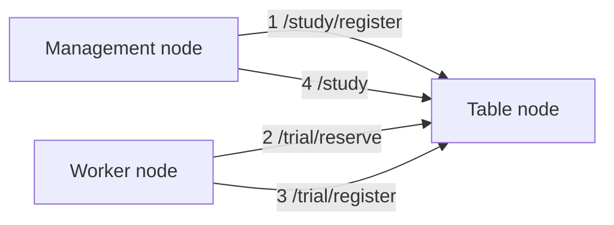

# lite_dist2
Simple distributed computing system

## 1. Overview
LiteDist2 is a simple distributed processing system that uses three types of nodes located within a LAN.

## 2. Architecture
### Management Node
Register a `Study` and retrieve the results. This behavior is implemented in `TableNodeClient`, 
so you can use that, or you can use API tools such as curl or talend (see [API reference](#7-api-reference)).  
You may call it a "client" because it is the part that is responsible for the beginning and end of a series of processes (registering tasks and receiving results).

### Table Node
This node manages the `Trial`, which is a fragment of a `Study`, and the `Curriculum`, which is a collection of `Study`. 
It is responsible for proposing `Trial` and aggregating the results.
The number of this node should always be one. This node does not need to know the actual implementation of the computational tasks to be performed.
Therefore, it is sufficient to directly clone this repository and start a server, but it is preferable to align it with a worker node for administrative purposes.

### Worker Node
Executes a `Trial` obtained from a table node and returns the result to the table node.
This node must implement a function to perform the distributed processing.
In most cases, a repository of projects using this library should be deployed (such as cloned or set up via a Docker image).

### Communication between nodes
The above nodes work together as follows:

The arrows noted the API paths and the order in which they are typically used.
1. Management node registers the `Study` to the table node (/study/register)
2. Worker node gets `Trial` generated from the `Study` (/trial/reserve) and executes it.
3. The worker node registers the completed `Trial` to the table node (/trial/register).
4. Repeat 2~3 until it finishes, then retrieve the result at the end (/study).

## 3. Concepts
Several terms are necessary when describing LiteDist2. `Study` and `Trial` have already been mentioned.
This section describes those terms.

### Curriculum
A bundle of multiple `Study`, a list of tasks that are scheduled to be executed, are being executed, or have been executed. 
It can also be described as the state of the entire table node.
A `Study` is added to the `Curriculum` in /study/register and popped in /study.  
The table node periodically backs up this object.

### Study
It is a large task that is processed using worker nodes.
It always has a parameter space of one or more dimensions, and the coordinates of a grid in that space are given to worker nodes to perform a given calculation.
It is possible to have a single table node perform multiple types of calculations, in which case the `Study` is set to `required_capacity: list[str]`.
Worker nodes can similarly declare the types of calculations they can perform as `retaining_capacity: list[str]`, allowing each node to perform tasks according to its capabilities.

### Trial
A `Study` is part of a split task: a `Trial` is always executed on one worker node.
A worker node executes the `Trial` given by `TrialRunner`. It then appends the results to the `Trial` and sends it back to the table node.
The number of grids in the `Trial` can be changed with `max_size: int`, which is sent when retrieving with /trial/reserve.

### ParameterSpace
It is the space in which a worker node generates a set of parameters for its computation. A parameter space always has one or more dimensions.
For example, the following example defines a `ParameterSpace` with three dimensions. (See [PortableValueType](#portablevaluetype) for how to represent numbers)
```json
{
  "type": "aligned",
  "axes": [
    {"type": "bool", "name": "x", "size": "0x2", "step": "0x1", "start": false},
    {"type": "int", "name": "y", "size": "0x65", "step": "0x1", "start": "-0x32"},
    {"type": "float", "name": "y", "size": "0xc8", "step": "0x1.0p-2", "start": "0x0p+0"}
  ]
}
```
This means x is a boolean `True` or `False`, y is an integer from `-50` to `50` in `1` increments, and z is a floating number from `0.0` to `50.0` in `0.25` increments.
In this case, there are 2\*101\*200 = 40400 grids in the parameter space.
See [about-implementation-of-parameterspace](#about-implementation-of-parameterspace) for a concrete implementation of `ParameterSpace`.

### PortableValueType
As shown above, only strings or Boolean values are allowed to be used in JSON. This means that Boolean values can be used as is, but integer values must be represented in hexadecimal notation.
This is to ensure that values are represented correctly even when different processors are used in between.  
The following functions can be used to convert between normal types and these `PortableValueType`s.
```python
from lite_dist2.common import numerize, portablize

n = 0.24
p = portablize("float", n)  # "0x1.eb851eb851eb8p-3"
assert n == numerize("float", p)
```

### StudyStrategy
Depending on the type of distributed processing, the processing termination conditions or the method of obtaining results may vary.
LiteDist2 provides the following three `StudyStrategy` to enable operation that is suitable for your application.
- `all_calculation`: Perform a given calculation over the entire given parameter space.
- `find_exact`: Find a pair of parameters such that a function has a specific value. (e.g. generating the preimage of a hash function).
- `minimize`: **Not implemented**. Find a pair of parameters that minimize the value of a function. (e.g. hyperparameter tuning for machine learning)

An example of `all_calculation` is as follows. There are no parameters required for `all_calculation`.
```json
{
  "type": "all_calculation",
  "study_strategy_param": null
}
```
An example of `find_exact`. This example requires a target value, `target_value`, as a parameter.
```json
{
  "type": "find_exact",
  "study_strategy_param": {"target_value": "aff97160474a056e838c1f721af01edf"}
}
```

### SuggestStrategy
It is not uniquely determined which subspace to assign as `Trial` to each worker node.
This is controlled by the `SuggestStrategy`. Currently, the following two types are available
- `sequential`: assigns parameters in order from the beginning of the parameter space.
- `random`: **Not implemented**. Assigns randomly selected parameters in the parameter space.

An example of `sequential` is as follows. You can force the use of [`ParameterAlignedSpace`](#parameteralignedspace) by specifying `strict_aligned: true`.

Translated with DeepL.com (free version)
```json
{
  "type": "sequential",
  "suggest_strategy_param": {"strict_aligned": true}
}
```

### TrialRunner
It is a class that executes `Trial` on worker nodes. This class must be customized to perform the processing desired by the user.
Specifically, you need to implement `BaseTrialRunner`. In `example/generate_mandelbrot_set.py`, it is implemented as follows.

```python
from lite_dist2.type_definitions import RawParamType, RawResultType
from lite_dist2.worker_node.trial_runner import AutoMPTrialRunner


class Mandelbrot(AutoMPTrialRunner):
    _ABS_THRESHOLD = 2.0
    _MAX_ITER = 255

    def func(self, parameters: RawParamType, *args: tuple, **kwargs: dict) -> RawResultType:
        x = float(parameters[0])
        y = float(parameters[1])
        c = complex(x, y)
        z = complex(0, 0)
        iter_count = 0
        while abs(z) <= self._ABS_THRESHOLD and iter_count < self._MAX_ITER:
            z = z ** 2 + c
            iter_count += 1
        return iter_count
```
Here we use an abstract class `AutoMPTrialRunner` which is a modified version of `BaseTrialRunner` and automatically performs multiprocessing.
The key point to note is the argument and return type of the `func` method. **The argument and return types of the `func` method must conform to this format.** 
The argument is `parameters: RawParamType`, which is a `tuple` of parameter tuples (e.g. `(-0.5, 1.4)`).
The return value, on the other hand, is `RawResultType`. This is a computed value (e.g. `15`). If the return value is a vector quantity, you can use a `tuple` such as `(1.2, 4)`.  
The other arguments, `args` and `kwargs`, can be used when you want to pass some constants, and you can assign values to them from the `worker.start()` method described below.
For `BaseTrialRunner` implementations, there is `AutoMPTrialRunner` as well as `SemiAutoMPTrialRunner` and `ManualMPTrialRunner`.
See [advanced TrialRunner implementation](#advanced-implementation-of-trialrunner) for details.

## 4. Installation
### Requirements
- Python >= 3.13

### Recommended requirements
- uv >= 0.7.0

### Installation procedure
```commandline
uv add lite-dist2
```
or
```commandline
pip install lite-dist2
```

## 5. Usage
> [!CAUTION]  
> Cannot be used in environments that require a global IP. Be sure to use it within a LAN.
> Also, a table node open their IPs to the LAN, so be sure to use them only within a trusted network.

A basic usage example is shown in `example/generate_mandelbrot_set.py`. This section does not describe the API reference or schema, so if you want to know 
please refer to the [7. API Reference](#7-api-reference) or [8. API Schema](#8-api-schema).

### Implement TrialRunner
Refer to [description of TrialRunner](#trialrunner) and [Advanced implementation of TrialRunner](#advanced-implementation-of-trialrunner) at 
and implement `TrialRunner` in your project. The project will run on each node (or at least each worker node).

### Startup table node
Deploy this library or your project using this library to a table node. 
On the deployed table node, you can start the server with the following command:
```shell
uv run start-table
```
or simply
```shell
start-table
```
if you are in a virtual environment with this library installed. In this case,
```text
$ uv run start-table
INFO:lite_dist2.table_node_api.start_table_api:Table Node IP: xxx.xxx.xxx.xxx
INFO:     Started server process [17836]
INFO:     Waiting for application startup.
INFO:     Application startup complete.
INFO:     Uvicorn running on http://0.0.0.0:8000 (Press CTRL+C to quit)
```
will be displayed. The `Table Node IP: xxx.xxx.xxx.xxx.xxx` is the private IP of this node. **This value will be used in subsequent worker node startups.**  

If the table node configuration file is in the given path (`your_project_root/table_config.json`), it will be read at startup.
If not, it is created before startup and default values are written. This value can be changed with the `-c` option of the startup command.
```shell
uv run start-table -c path/to/table_config.json
```

### Register Study
Register `Study` from an administrative node to a table node with /study/register. You can register a study in Python via a client class or by using an API tool such as curl.    
In Python:
```python
from lite_dist2.common import float2hex, int2hex
from lite_dist2.curriculum_models.study_portables import StudyRegistry
from lite_dist2.study_strategies import StudyStrategyModel
from lite_dist2.suggest_strategies import SuggestStrategyModel
from lite_dist2.suggest_strategies.base_suggest_strategy import SuggestStrategyParam
from lite_dist2.table_node_api.table_param import StudyRegisterParam
from lite_dist2.value_models.aligned_space_registry import LineSegmentRegistry, ParameterAlignedSpaceRegistry
from lite_dist2.worker_node.table_node_client import TableNodeClient

_resolution = 10
_half_size = 2.0

study_register_param = StudyRegisterParam(
    study=StudyRegistry(
        name="mandelbrot",
        required_capacity=set(),
        study_strategy=StudyStrategyModel(type="all_calculation", study_strategy_param=None),
        suggest_strategy=SuggestStrategyModel(
            type="sequential",
            suggest_strategy_param=SuggestStrategyParam(strict_aligned=True),
        ),
        result_type="scalar",
        result_value_type="int",
        const_param=None,
        parameter_space=ParameterAlignedSpaceRegistry(
            type="aligned",
            axes=[
                LineSegmentRegistry(
                    name="x",
                    type="float",
                    size=int2hex(_resolution),
                    step=float2hex(2 * _half_size / _resolution),
                    start=float2hex(-1 * _half_size),
                ),
                LineSegmentRegistry(
                    name="y",
                    type="float",
                    size=int2hex(_resolution),
                    step=float2hex(2 * _half_size / _resolution),
                    start=float2hex(-1 * _half_size),
                ),
            ],
        ),
    ),
)
client = TableNodeClient(ip="xxx.xxx.xxx.xxx", port=8000)
client.register_study(study_register_param)
```
In curl:
```shell
curl -X POST -H "Content-Type: application/json" \
-d '{
  "study": {
    "name": "mandelbrot",
    "required_capacity": [],
    "study_strategy": {"type": "all_calculation", "study_strategy_param": null},
    "suggest_strategy": {
      "type": "sequential",
      "suggest_strategy_param": {"strict_aligned": true}
    },
    "result_type": "scalar",
    "result_value_type": "int",
    "parameter_space": {
      "type": "aligned",
      "axes": [
        {"name": "x", "type": "float", "size": "0xa", "step": "0x1.999999999999ap-2", "start": "-0x1.0000000000000p+1"},
        {"name": "y", "type": "float", "size": "0xa", "step": "0x1.999999999999ap-2", "start": "-0x1.0000000000000p+1"}
      ]
    }
  }
}' xxx.xxx.xxx.xxx:8000/study/register
```
Specify the private IP of the table node in `xxx.xxx.xxx.xxx.xxx`.

### Startup worker node
Deploy your project to a worker node.

```python
from lite_dist2.config import WorkerConfig
from lite_dist2.worker_node.worker import Worker
from lite_dist2.type_definitions import RawParamType, RawResultType
from lite_dist2.worker_node.trial_runner import AutoMPTrialRunner

class Mandelbrot(AutoMPTrialRunner):
    def func(self, parameters: RawParamType, *args: tuple, **kwargs: dict) -> RawResultType:
        ...

worker_config = WorkerConfig(
    name="w_01",
    process_num=2,
    max_size=10,
    wait_seconds_on_no_trial=5,
    table_node_request_timeout_seconds=60,
)
worker = Worker(
    trial_runner=Mandelbrot(),
    ip="xxx.xxx.xxx.xxx",
    port=8000,
    config=worker_config,
)
worker.start()
```
After passing the implemented `TrialRunner` and `WorkerConfig` to `Worker`, execute `worker.start()` and the worker node will automatically get the `Trial` from the table node and execute it.  
See [WorkerConfig](#workerconfig) for specific configuration of `WorkerConfig`.

### Retrieve the result
You can retrieve a `Study` in /study regardless of whether the `Study` is completed or not.
The `Study` can be identified either by the `study_id` issued in /study/register or by the `name` you specify as a parameter to /study/register.
As before, this process can be done in Python via a client class or using API tools such as curl.
In Python:
```python
from lite_dist2.worker_node.table_node_client import TableNodeClient
client = TableNodeClient(ip="xxx.xxx.xxx.xxx", port=8000)
study = client.study(name="mandelbrot")
```

In curl:
```shell
curl 'xxx.xxx.xxx.xxx:8000/study?name=mandelbrot'
```
If `Study` is still running, you should get the following response The status code is 202.
```json 
{"status": "running", "result": null} 
``` 
If it has finished, you will get `"status": "done"` and the `result` will contain the result of the execution.

### How to see the result
The result retrieved by /study is in the following format (only one `result` is shown for the sake of space).
```json
{
  "name": "mandelbrot",
  "required_capacity": [],
  "study_strategy": {
    "type": "all_calculation",
    "study_strategy_param": null
  },
  "suggest_strategy": {
    "type": "sequential",
    "suggest_strategy_param": {
      "strict_aligned": true
    }
  },
  "result_type": "scalar",
  "result_value_type": "int",
  "study_id": "b4fed0ba-394d-11f0-b30f-e8d45b580c23",
  "registered_timestamp": "2025-05-25T18:50:36.034909+09:00",
  "parameter_space": {
    "type": "aligned",
    "axes": [
      {
        "name": "x",
        "type": "float",
        "size": "0xa",
        "step": "0x1.999999999999ap-2",
        "start": "-0x1.0000000000000p+1",
        "ambient_index": "0x0",
        "ambient_size": "0xa",
        "is_dummy": false
      },
      {
        "name": "y",
        "type": "float",
        "size": "0xa",
        "step": "0x1.999999999999ap-2",
        "start": "-0x1.0000000000000p+1",
        "ambient_index": "0x0",
        "ambient_size": "0xa",
        "is_dummy": false
      }
    ],
    "check_lower_filling": true
  },
  "done_timestamp": "2025-05-25T18:50:42.078755+09:00",
  "results": {
    "params_info": [
      {
        "type": "scalar",
        "value_type": "float",
        "value": "0x0.0p+0",
        "name": "x"
      },
      {
        "type": "scalar",
        "value_type": "float",
        "value": "0x0.0p+0",
        "name": "y"
      }
    ],
    "result_info": {
      "type": "scalar",
      "value_type": "int",
      "value": "0x0",
      "name": null
    },
    "values": [
      [
        "-0x1.0000000000000p+1",
        "-0x1.0000000000000p+1",
        "0x0"
      ]
    ]
  },
  "done_grids": 100
}
```
If you look at the `results`, you will see that it contains `param_info` and `result_info`. These are input and output type information, and the values are dummies.
The actual values are stored in `results.values`, and are ordered by param and result. In the example above, the values are `x`, `y`, and `result` from head.

## 6. Configuration
### TableConfig
| name                             | type | default value                    | description                                                |
|----------------------------------|------|----------------------------------|------------------------------------------------------------|
| port                             | int  | 8000                             | The port number to use table node.                         |
| trial_timeout_seconds            | int  | 600                              | Timeout seconds before a trial is reserved and registered. |
| timeout_check_interval_seconds   | int  | 60                               | Interval of time to check timeout trials.                  |
| curriculum_path                  | Path | {project root}/"curriculum.json" | Path to the `Curriculum` json file.                        |
| trial_file_dir                   | Path | {project root}/"trials"          | Path to the directory to save `Trial` files.               |
| curriculum_save_interval_seconds | int  | 600                              | Interval of time to save `Curriculum` json file.           |

### WorkerConfig
| name                               | type        | default value | description                                                                                                                                                       |
|------------------------------------|-------------|---------------|-------------------------------------------------------------------------------------------------------------------------------------------------------------------|
| name                               | str \| None | None          | Name of the worker node.                                                                                                                                          |
| process_num                        | int \| None | None          | The number of processes on using `AutoMPTrialRunner`. If `None`, use `os.cpu_count()`.                                                                            |
| chunk_size                         | int         | 1             | The size of the chunks to be passed to each process on using `AutoMPTrialRunner` or `SemiAutoMPTrialRunner`.                                                      |
| max_size                           | int         | 1             | The maximum size of a `Trial`. If `“strict_aligned”: true` in `SuggestStrategy` is set, the size may be smaller than this.                                        |
| disable_function_progress_bar      | bool        | False         | Whether to disable progress bar.                                                                                                                                  |
| retaining_capacity                 | list[str]   | []            | Tags (internally of type `set[str]`) with the capabilities that the worker node has, to be used when processing multiple types of `Study` in a single table node. |
| wait_seconds_on_no_trial           | int         | 5             | Waiting time when there was no trial allocated by the table node.                                                                                                 |
| table_node_request_timeout_seconds | int         | 30            | Timeout for requests to table node.                                                                                                                               |

## 7. API Reference
| path             | method | parameter                                                                                                               | body                                      | response                                                | description                           |
|------------------|--------|-------------------------------------------------------------------------------------------------------------------------|-------------------------------------------|---------------------------------------------------------|---------------------------------------|
| /ping            | GET    |                                                                                                                         |                                           | [OkResponse](#okresponse)                               | ping API                              |
| /save            | GET    |                                                                                                                         |                                           | [OkResponse](#okresponse)                               | Save `Curriculum`.                    |
| /status          | GET    |                                                                                                                         |                                           | [CurriculumSummaryResponse](#curriculumsummaryresponse) | Retrieve summary of `Curriculum`.     |
| /status/progress | GET    | `cutoff_sec`: Aggregation period used to estimate ETA. Default value is 600.                                            |                                           | [ProgressSummaryResponse](#progresssummaryresponse)     | Retrieve progress for running `Study` |
| /study/register  | POST   |                                                                                                                         | [StudyRegisterParam](#studyregisterparam) | [StudyRegisteredResponse](#studyregisteredresponse)     | Register `Study`.                     |
| /trial/reserve   | POST   |                                                                                                                         | [TrialReserveParam](#trialreserveparam)   | [TrialReserveResponse](#trialreserveresponse)           | Reserve `Trial`.                      |
| /trial/register  | POST   |                                                                                                                         | [TrialRegisterParam](#trialregisterparam) | [OkResponse](#okresponse)                               | Register completed `Trial`.           |
| /study           | GET    | `study_id`: ID of `Study` to retrieve.<br>`name`: Name of `Study` to retrieve.<br>Only one of the two can be specified. |                                           | [StudyResponse](#studyresponse)                         | Retrieve `Study`.                     |
| /study           | DELETE | `study_id`: ID of `Study` to cancel.<br>`name`: Name of `Study` to cancel.<br>Only one of the two can be specified.     |                                           | [OkResponse](#okresponse)                               | Cancel `Study`.                       |

## 8. API Schema
### StudyRegisterParam
| name  | type                            | required | description          |
|-------|---------------------------------|----------|----------------------|
| study | [StudyRegistry](#studyregistry) | ✓        | `Study` to register. |

### TrialReserveParam
| name               | type        | required | description                                                                               |
|--------------------|-------------|----------|-------------------------------------------------------------------------------------------|
| retaining_capacity | list[str]   | ✓        | Types of tasks that can be performed by that worker node (internally of type `set[str]`). |
| max_size           | int         | ✓        | Maximum size of parameter space to be reserved.                                           |
| worker_node_name   | str \| None |          | Name of the worker node.                                                                  |
| worker_node_id     | str         |          | ID of the worker node.                                                                    |

### TrialRegisterParam
| name  | type                      | required | description                            |
|-------|---------------------------|----------|----------------------------------------|
| trial | [TrialModel](#trialmodel) | ✓        | `Trial` to register to the table node. |

### TrialReserveResponse
| name  | type                              | required | description                                                                                                                         |
|-------|-----------------------------------|----------|-------------------------------------------------------------------------------------------------------------------------------------|
| trial | [TrialModel](#trialmodel) \| None |          | The `Trial` reserved for the worker node. None` if `Curriculum` is empty or there is no corresponding `Trial` for that worker node. |

### StudyRegisteredResponse
| name     | type | required | description                           |
|----------|------|----------|---------------------------------------|
| study_id | str  | ✓        | ID issued for the registered `Study`. |

### StudyResponse
| name   | type                                  | required | description                                                                                       |
|--------|---------------------------------------|----------|---------------------------------------------------------------------------------------------------|
| status | [StudyStatus](#studystatus-enum)      | ✓        | The status of the target `Study`.                                                                 |
| result | [StudyStorage](#studystorage) \| None |          | The result of the completed `Study`. If the target `Study` is not completed or not found, `None`. |

### CurriculumSummaryResponse
| name      | type                                | required | description                                                        |
|-----------|-------------------------------------|----------|--------------------------------------------------------------------|
| summaries | list[[StudySummary](#studysummary)] | ✓        | List of `Study` and `StudyStorage` currently held by `Curriculum`. |

### ProgressSummaryResponse
| name               | type                                                | required | description                                 |
|--------------------|-----------------------------------------------------|----------|---------------------------------------------|
| now                | str                                                 | ✓        | Current time used for ETA estimation.       |
| cutoff_sec         | int                                                 | ✓        | Aggregation period used for ETA estimation. |
| progress_summaries | list[[StudyProgressSummary](#studyprogresssummary)] | ✓        | List of progress.                           |

### StudyProgressSummary
| name                | type                                        | required | description                                                                    |
|---------------------|---------------------------------------------|----------|--------------------------------------------------------------------------------|
| study_id            | str                                         | ✓        | ID of target `Study`.                                                          |
| study_name          | str \| None                                 | ✓        | Name of target `Study`.                                                        |
| total_grid          | int \| Literal["infinite"]                  | ✓        | The number of possible parameter tuples to compute in this `Study`.            |
| done_grid           | int                                         | ✓        | The number of parameter tuples actually completed in this `Study`.             |
| grid_velocity       | float                                       | ✓        | The number of parameter tuples calculated per second.                          |
| eta                 | str \| Literal["unpredictable"]             | ✓        | ETA. "unpredictable" if the parameter space is infinite or grid_velocity is 0. |
| worker_efficiencies | list[[WorkerEfficiency](#workerefficiency)] | ✓        | Efficiencies of worker nodes.                                                  |

### WorkerEfficiency
| name          | type        | required | description                                           |
|---------------|-------------|----------|-------------------------------------------------------|
| worker_id     | str         | ✓        | ID of worker node.                                    |
| worker_name   | str \| None | ✓        | Name of worker node.                                  |
| grid_velocity | float       | ✓        | The number of parameter tuples calculated per second. |

### OkResponse
| name | type | required | description |
|------|------|----------|-------------|
| ok   | bool | ✓        |             |

### StudyRegistry
| name                  | type                                                            | required | description                                                                                                                                                                                |
|-----------------------|-----------------------------------------------------------------|----------|--------------------------------------------------------------------------------------------------------------------------------------------------------------------------------------------|
| name                  | str \| None                                                     |          | Name of this `Study`.                                                                                                                                                                      |
| required_capacity     | list[str]                                                       | ✓        | Required capacity to perform this `Study`. This `Study` can be executed if this `required_capacity` is a subset of the worker node's `retaining_capacity`. (internally of type `set[str]`) |
| study_strategy        | [StudyStrategyModel](#studystrategymodel)                       | ✓        | The [`StudyStrategy`](#studystrategy) to use when perform this `Study`.                                                                                                                    |
| suggest_strategy      | [SuggestStrategyModel](#suggeststrategymodel)                   | ✓        | The [`SuggestStrategy`](#suggeststrategy)  to use when perform this `Study`.                                                                                                               |
| result_type           | Literal["scalar", "vector"]                                     | ✓        | A value indicating whether the return value of this `Study` is scalar or vector.                                                                                                           |
| result_value_type     | Literal["bool", "int", "float"]                                 | ✓        | The return type of `Study`.                                                                                                                                                                |
| const_param           | [ConstParam](#constparam)  \| None                              | ✓        | List of constant using on worker node.                                                                                                                                                     |
| parameter_space       | [ParameterAlignedSpaceRegistry](#parameteralignedspaceregistry) | ✓        | [ParameterSpace](#parameterspace) to calculate on this `Study`.                                                                                                                            |
| trial_repository_type | Literal["normal"]                                               |          | Type of `TrialRepository` to use. Default value is "normal".                                                                                                                               |

### StudySummary
| name                 | type                                                      | required | description                                                                                                                                                                                |
|----------------------|-----------------------------------------------------------|----------|--------------------------------------------------------------------------------------------------------------------------------------------------------------------------------------------|
| name                 | str \| None                                               |          | Name of this `Study`.                                                                                                                                                                      |
| required_capacity    | list[str]                                                 | ✓        | Required capacity to perform this `Study`. This `Study` can be executed if this `required_capacity` is a subset of the worker node's `retaining_capacity`. (internally of type `set[str]`) |
| study_strategy       | [StudyStrategyModel](#studystrategymodel)                 | ✓        | The [`StudyStrategy`](#studystrategy) to use when perform this `Study`.                                                                                                                    |
| suggest_strategy     | [SuggestStrategyModel](#suggeststrategymodel)             | ✓        | The [`SuggestStrategy`](#suggeststrategy)  to use when perform this `Study`.                                                                                                               |
| result_type          | Literal["scalar", "vector"]                               | ✓        | A value indicating whether the return value of this `Study` is scalar or vector.                                                                                                           |
| result_value_type    | Literal["bool", "int", "float"]                           | ✓        | The return type of `Study`.                                                                                                                                                                |
| study_id             | str                                                       | ✓        | ID of this `Study`.                                                                                                                                                                        |
| status               | [StudyStatus](#studystatus-enum)                          | ✓        | Status of this `Study`.                                                                                                                                                                    |
| registered_timestamp | str                                                       | ✓        | A timestamp indicating when this `Study` was registered. (internally of type `datetime`)                                                                                                   |
| const_param          | [ConstParam](#constparam)  \| None                        | ✓        | List of constant using on worker node.                                                                                                                                                     |
| parameter_space      | [ParameterAlignedSpaceModel](#parameteralignedspacemodel) | ✓        | [ParameterSpace](#parameterspace) to calculate on this `Study`.                                                                                                                            |
| total_grids          | int \| None                                               |          | The number of possible parameter tuples to compute in this `Study`. None` if the parameter space is infinite.                                                                              |
| done_grids           | int                                                       | ✓        | The number of parameter tuples actually completed in this `Study`.                                                                                                                         |

### StudyStorage
| name                 | type                                                      | required | description                                                                                                                                                                                |
|----------------------|-----------------------------------------------------------|----------|--------------------------------------------------------------------------------------------------------------------------------------------------------------------------------------------|
| name                 | str \| None                                               |          | Name of this `Study`.                                                                                                                                                                      |
| required_capacity    | list[str]                                                 | ✓        | Required capacity to perform this `Study`. This `Study` can be executed if this `required_capacity` is a subset of the worker node's `retaining_capacity`. (internally of type `set[str]`) |
| study_strategy       | [StudyStrategyModel](#studystrategymodel)                 | ✓        | The [`StudyStrategy`](#studystrategy) to use when perform this `Study`.                                                                                                                    |
| suggest_strategy     | [SuggestStrategyModel](#suggeststrategymodel)             | ✓        | The [`SuggestStrategy`](#suggeststrategy)  to use when perform this `Study`.                                                                                                               |
| result_type          | Literal["scalar", "vector"]                               | ✓        | A value indicating whether the return value of this `Study` is scalar or vector.                                                                                                           |
| result_value_type    | Literal["bool", "int", "float"]                           | ✓        | The return type of `Study`.                                                                                                                                                                |
| study_id             | str                                                       | ✓        | ID of this `Study`.                                                                                                                                                                        |
| registered_timestamp | str                                                       | ✓        | A timestamp indicating when this `Study` was registered. (internally of type `datetime`)                                                                                                   |
| const_param          | [ConstParam](#constparam)  \| None                        | ✓        | List of constant using on worker node.                                                                                                                                                     |
| parameter_space      | [ParameterAlignedSpaceModel](#parameteralignedspacemodel) | ✓        | [ParameterSpace](#parameterspace) to calculate on this `Study`.                                                                                                                            |
| done_timestamp       | str                                                       | ✓        | A timestamp indicating when this `Study` was completed. (internally of type `datetime`)                                                                                                    |
| results              | [MappingsStorage](#mappingsstorage)                       | ✓        | List of calculation result. If `StudyStrategy` is `all_calculation`, then `done_grids` and the length of this list match.                                                                  |
| done_grids           | int                                                       | ✓        | The number of parameter tuples actually completed in this `Study`.                                                                                                                         |
| trial_repository     | [TrialRepositoryModel](#trialrepositorymodel)             | ✓        | The [`TrialRepository`](#about-trialrepository) to use when perform this `Study`.                                                                                                          |

### StudyStrategyModel
| name  | type                                                 | required | description                                                  |
|-------|------------------------------------------------------|----------|--------------------------------------------------------------|
| type  | Literal["all_calculation", "find_exact", "minimize"] | ✓        | A type of calculation to be performed in the target `Study`. |
| param | [StudyStrategyParam](#studystrategyparam) \|None     |          | Parameters required for this strategy to work.               |

### StudyStrategyParam
| name         | type                           | required | description                                     |
|--------------|--------------------------------|----------|-------------------------------------------------|
| target_value | [ResultType](#list-of-aliases) | ✓        | Value to be searched for. Used in `find_exact`. |

### SuggestStrategyModel
| name  | type                                          | required | description                                    |
|-------|-----------------------------------------------|----------|------------------------------------------------|
| type  | Literal["sequential", "random", "designated"] | ✓        | A type of method to suggest `Trial`.           |
| param | [SuggestStrategyParam](#suggeststrategyparam) | ✓        | Parameters required for this strategy to work. |

### SuggestStrategyParam
| name           | type | required | description                                                                                                                                                                                                                                                            |
|----------------|------|----------|------------------------------------------------------------------------------------------------------------------------------------------------------------------------------------------------------------------------------------------------------------------------|
| strict_aligned | bool | ✓        | Whether the parameter space for `Trial` suggestion should always be [`ParameterAlignedSpace`](#parameteralignedspacemodel). Only if this value is `False` and the parameter space is 1-dimensional, [`ParameterJaggedSpace`](#parameterjaggedspacemodel) will be used. |

### TrialModel
| name              | type                                                                                                                 | required | description                                                                                                                        |
|-------------------|----------------------------------------------------------------------------------------------------------------------|----------|------------------------------------------------------------------------------------------------------------------------------------|
| study_id          | str                                                                                                                  | ✓        | ID of parent `Study`.                                                                                                              |
| trial_id          | str                                                                                                                  | ✓        | ID of this `Trial`.                                                                                                                |
| timestamp         | str                                                                                                                  | ✓        | A timestamp indicating the time this `Trial` is reserved. (internally of type `datetime`)                                          |
| trial_status      | [TrialStatus](#trialstatus-enum)                                                                                     | ✓        | Status of this `Trial`.                                                                                                            |
| const_param       | [ConstParam](#constparam)  \| None                                                                                   | ✓        | List of constant using on worker node.                                                                                             |
| parameter_space   | [ParameterAlignedSpaceModel](#parameteralignedspacemodel) \| [ParameterJaggedSpaceModel](#parameterjaggedspacemodel) | ✓        | [ParameterSpace](#parameterspace) to be calculated in this `Trial`. It is always a subspace of the parent `Study.parameter_space`. |
| result_type       | Literal["scalar", "vector"]                                                                                          | ✓        | A value indicating whether the return value of this `Trial` is scalar or vector. It always matches the parent `Study.result_type`. |
| result_value_type | Literal["bool", "int", "float"]                                                                                      | ✓        | The return type of this `Trial`. It always matches the parent `Study.result_value_type`.                                           |
| worker_node_name  | str \| None                                                                                                          |          | Name of the worker node to run.                                                                                                    |
| worker_node_id    | str                                                                                                                  |          | ID of the worker node to run.                                                                                                      |
| results           | list[[Mapping](#mapping)] \| None                                                                                    |          | The results of this `Trial`.                                                                                                       |

### Mapping
| name   | type                           | required | description                                                             |
|--------|--------------------------------|----------|-------------------------------------------------------------------------|
| params | [ParamType](#list-of-aliases)  | ✓        | parameter tuple.                                                        |
| result | [ResultType](#list-of-aliases) | ✓        | The value resulting from a given calculation with this parameter tuple. |

### MappingsStorage
| name        | type                                              | required | description                                                                                     |
|-------------|---------------------------------------------------|----------|-------------------------------------------------------------------------------------------------|
| params_info | [ParamType](#list-of-aliases)                     | ✓        | Type information of parameter. Values are dummies.                                              |
| result_info | [ResultType](#list-of-aliases)                    | ✓        | Type information of result. Values are dummies.                                                 |
| values      | list[list[[PortableValueType](#list-of-aliases)]] | ✓        | List of parameters and results. The internal list contains the parameters and results in order. |

### ParameterAlignedSpaceRegistry
| name | type                                              | required | description                                   |
|------|---------------------------------------------------|----------|-----------------------------------------------|
| type | Literal["aligned"]                                | ✓        | Type of parameter space. Must be `"aligned"`. |
| axes | list[[LineSegmentRegistry](#linesegmentregistry)] | ✓        | Axes that this parameter space has.           |

### LineSegmentRegistry
| name  |   | type                                  | required | description                                                                |
|-------|:--|---------------------------------------|----------|----------------------------------------------------------------------------|
| name  |   | str \| None                           |          | Name of this axis.                                                         |
| type  |   | Literal["bool", "int", "float"]       | ✓        | Type of value generated by this axis.                                      |
| size  |   | str \| None                           | ✓        | Number of value generated by this axis. If `None`, it means infinite size. |
| step  |   | [PortableValueType](#list-of-aliases) | ✓        | An increments between parameters.                                          |
| start |   | [PortableValueType](#list-of-aliases) | ✓        | Minimum value generated by this axis.                                      |

### ParameterAlignedSpaceModel
| name                | type                                        | required | description                                                                                                                                                                     |
|---------------------|---------------------------------------------|----------|---------------------------------------------------------------------------------------------------------------------------------------------------------------------------------|
| type                | Literal["aligned"]                          | ✓        | Type of parameter space. Must be `"aligned"`.                                                                                                                                   |
| axes                | list[[LineSegmentModel](#linesegmentmodel)] | ✓        | Axes that this parameter space has.                                                                                                                                             |
| check_lower_filling | bool                                        | ✓        | Flag to force the retrieval of values from the lower dimension (the end of `axes`) when retrieving parameters from this parameter space. Always `True` except for internal use. |

### ParameterJaggedSpaceModel
| name            | type                                                    | required | description                                                                            |
|-----------------|---------------------------------------------------------|----------|----------------------------------------------------------------------------------------|
| type            | Literal["jagged"]                                       | ✓        | Type of parameter space. Must be `"jagged"`.                                           |
| parameters      | list[tuple[[PortableValueType](#list-of-aliases), ...]] | ✓        | List of parameter tuples.                                                              |
| ambient_indices | list[list[str, ...]]                                    | ✓        | Indices that points to where the value of `parameters` is located in the mother space. |
| axes_info       | list[[LineSegmentModel](#linesegmentmodel)]             | ✓        | Name and type information for each axis.                                               |

### LineSegmentModel
| name          | type                                  | required | description                                                                                                                                              |
|---------------|---------------------------------------|----------|----------------------------------------------------------------------------------------------------------------------------------------------------------|
| name          | str \| None                           |          | Name of this axis.                                                                                                                                       |
| type          | Literal["bool", "int", "float"]       | ✓        | Type of value generated by this axis.                                                                                                                    |
| size          | str \| None                           | ✓        | Number of value generated by this axis. If `None`, it means infinite size.                                                                               |
| step          | [PortableValueType](#list-of-aliases) | ✓        | An increments between parameters.                                                                                                                        |
| start         | [PortableValueType](#list-of-aliases) | ✓        | Minimum value generated by this axis.                                                                                                                    |
| ambient_index | str                                   | ✓        | Index that points to where the value of `start` is located in the mother space.                                                                          |
| ambient_size  | str \| None                           |          | The total number of parameters that this axis generates in the mother space.                                                                             |
| is_dummy      | bool                                  |          | `True` if this axis belongs to [ParameterJaggedSpaceModel](#parameterjaggedspacemodel), indicating that only the `name` and `type` information is valid. |

### ScalarValue
| name       | type                                  | required | description                                                                                   |  
|------------|---------------------------------------|----------|-----------------------------------------------------------------------------------------------|  
| type       | Literal["scalar"]                     | ✓        | Identifier to distinguish between scalar and vector quantities.                               |  
| value_type | Literal["bool", "int", "float"]       | ✓        | Type of the value.                                                                            |  
| value      | [PortableValueType](#list-of-aliases) | ✓        | The actual value.                                                                             |  
| name       | str \| None                           |          | Name assigned to the value. If generated from a parameter space, this contains the axis name. |  

### VectorValue
| name       | type                                        | required | description                                                                                    |  
|------------|---------------------------------------------|----------|------------------------------------------------------------------------------------------------|  
| type       | Literal["vector"]                           | ✓        | Identifier to distinguish between scalar and vector quantities.                                |  
| value_type | Literal["bool", "int", "float"]             | ✓        | Type of the values.                                                                            |  
| values     | list[[PortableValueType](#list-of-aliases)] | ✓        | List of values.                                                                                |  
| name       | str \| None                                 |          | Name assigned to the values. If generated from a parameter space, this contains the axis name. |

### ConstParam
| name   | type                                          | required | description        |
|--------|-----------------------------------------------|----------|--------------------|
| consts | list[[ConstParamElement](#constparamelement)] | ✓        | List of constants. |

### ConstParamElement
| name  | type                                   | required | description                                 |
|-------|----------------------------------------|----------|---------------------------------------------|
| type  | Literal["int", "float", "bool", "str"] | ✓        | Identifier to distinguish type of constant. |
| key   | str                                    | ✓        | Key used to retrieve constants.             |
| value | str \| bool                            | ✓        | Portablized constant.                       |

### TrialRepositoryModel
| name     | type           | required | description                                                                         |
|----------|----------------|----------|-------------------------------------------------------------------------------------|
| type     | Literal["int"] | ✓        | Type of `TrialRepository` to use. Default value is "normal".                        |
| save_dir | str            | ✓        | String representing the directory to store the `Trial` (internally of type `Path`). |

### StudyStatus (Enum)
| name      | description                                                          |
|-----------|----------------------------------------------------------------------|
| wait      | Scheduled to be executed.                                            |
| running   | Being executed.                                                      |
| done      | Have been executed.                                                  |
| not_found | The target `Study` does not exist. Only appears in /study responses. |

### TrialStatus (Enum)
| name    | description         |
|---------|---------------------|
| running | Being executed.     |
| done    | Have been executed. |

### List of aliases
| alias             | original type                                              |
|-------------------|------------------------------------------------------------|
| ParamType         | list[[ScalarValue](#scalarvalue), ...]                     |
| ResultType        | [ScalarValue](#scalarvalue) \| [VectorValue](#vectorvalue) |
| PortableValueType | bool \| str                                                |

## 9. Advanced usage
### About implementation of ParameterSpace
#### ParameterAlignedSpace
The [ParameterSpace](#parameterspace) example is the simplest example of how to represent a parameter space, a type (`ParameterAlignedSpaceRegistry`) that can be used when first registering a `Study`.
A little more additional information is needed when communicating between table node and worker nodes.
In the above example, it is sufficient to represent the entire space, but in the communication between table node and worker nodes, it is necessary to represent "which part of the whole (mother space)".  
The following example shows a subspace that is a portion of the mother space.
```json
{
  "type": "aligned",
  "axes": [
    {
      "type": "bool",
      "name": "x",
      "size": "0x1",
      "step": "0x1",
      "start": false,
      "ambient_size": "0x2",
      "ambient_index": "0x0"
    },
    {
      "type": "int",
      "name": "y",
      "size": "0x1",
      "step": "0x1",
      "start": "-0x23",
      "ambient_size": "0x65",
      "ambient_index": "0xf"
    },
    {
      "type": "float",
      "name": "y",
      "size": "0xc8",
      "step": "0x1.0p-2",
      "start": "0x0p+0",
      "ambient_size": "0xc8",
      "ambient_index": "0x0"
    }
  ]
}
```
Notice that the sizes of x and y have changed. Each `size` is set to 1, z remains unchanged. On the other hand, new `ambient_size` and `ambient_index` have been added.
These are the size of the mother space and the index of the value of `start` in the mother space, respectively.  
These additional values are needed for aggregation on the table node after the worker node has finished its computation.
On the worker node, we can simply look at `size`, `size`, `start`, which in this example represents a one-dimensional space with `x=false, y=-35, z from 0.0 to 50.0`.

#### ParameterJaggedSpace
`ParameterAlignedSpace` such as "from here to there" can only represent a range that is always delimited by a square(or more precisely, a "hyper-rectangle").
On the other hand, there are situations where it is more convenient to enumerate specifically, such as "this point and that point".
```json
{
  "type": "jagged",
  "parameters": [
    ["0x4e", "0x1"], ["0x38", "0xa"]
  ],
  "ambient_index": [
    ["0x4e", "0x1"], ["0x38", "0xa"]
  ],
  "axes_info": [
    {
      "type": "int",
      "name": "x",
      "size": "0x1",
      "step": "0x1",
      "start": "0x0",
      "ambient_size": "0x64",
      "ambient_index": "0x0",
      "is_dummy": true
    },
    {
      "type": "int",
      "name": "y",
      "size": "0x1",
      "step": "0x1",
      "start": "0x0",
      "ambient_size": "0x64",
      "ambient_index": "0x0",
      "is_dummy": true
    }
  ]
}
```
`parameters` represents the actual parameters, and `ambient_index` is the index at which the parameter is in the population space.  
However, information about the name and type is still needed, so `axes_info` is defined.
As you can see from the `"is_dummy": true` in the last field, the only valid values for this object are `type`, `name`, and `ambient_size`.

### Half line
Only one half-line of infinite size may be included in the axes of the parameter space.
This half-line must always be the first axis. The definition of a half-line is as follows:
```json
{
  "type": "int",
  "name": "infinite_axis",
  "size": null,
  "step": "0x1",
  "start": "0x0",
  "ambient_size": null,
  "ambient_index": "0x0"
}
```
You can see that `ambient_size` is `null`. If you need to represent the whole parameter space, such as when registering a `Study`, the `size` will also be `null`.
> [!WARNING]
> The `StudyStrategy` type cannot be `all_calculation` in a parameter space containing half lines.

### Advanced implementation of TrialRunner
#### SemiAutoMPTrialRunner
In `AutoMPTrialRunner`, the process pool (`multiprocessing.pool.Pool`) is created inside this `TrialRunner`.
Since the creation of a child process is a heavy process, it is more efficient to use the first one created if you know you will use it repeatedly.  
The `SemiAutoMPTrialRunner` solves this problem by allowing process pools to be injected from the outside.
The definition is almost the same as in `AutoMPTrialRunner`, only the source of inheritance is different.
```diff
from lite_dist2.type_definitions import RawParamType, RawResultType
- from lite_dist2.worker_node.trial_runner import AutoMPTrialRunner
+ from lite_dist2.worker_node.trial_runner import SemiAutoMPTrialRunner


- class Mandelbrot(AutoMPTrialRunner):
+ class Mandelbrot(SemiAutoMPTrialRunner):
    _ABS_THRESHOLD = 2.0
    _MAX_ITER = 255

    def func(self, parameters: RawParamType, *args: object, **kwargs: object) -> RawResultType:
        x = float(parameters[0])
        y = float(parameters[1])
        c = complex(x, y)
        z = complex(0, 0)
        iter_count = 0
        while abs(z) <= self._ABS_THRESHOLD and iter_count < self._MAX_ITER:
            z = z ** 2 + c
            iter_count += 1
        return iter_count
```

When executing, the process pool is injected from the outside. Also, `WorkerConfig.process_num` is ignored.

```diff
+ from multiprocessing.pool import Pool

from lite_dist2.config import WorkerConfig
from lite_dist2.worker_node.worker import Worker

def run_worker(table_ip: str) -> None:
    worker_config = WorkerConfig(
        name="w_01",
-         process_num=2,
        max_size=10,
        wait_seconds_on_no_trial=5,
        table_node_request_timeout_seconds=60,
    )
-     worker = Worker(
-         trial_runner=Mandelbrot(),
-         ip=table_ip,
-         config=worker_config,
-     )
-     worker.start()
+     with Pool(processes=2) as pool:
+         worker = Worker(
+             trial_runner=Mandelbrot(),
+             ip=table_ip,
+             config=worker_config,
+             pool=Pool,
+         )
+         worker.start()
```

#### ManualMPTrialRunner
If you want to implement the part that takes a list of parameter pairs and processes them yourself (for example, the parallel processing part), you can use `ManualMPTrialRunner`.
If you use this class, implement the `batch_func` method instead of the `func` method.  
For example, the following example is equivalent to `AutoMPTrialRunner`.
```python
import functools
from typing import Iterator
from multiprocessing.pool import Pool

from lite_dist2.config import WorkerConfig
from lite_dist2.type_definitions import RawParamType, RawResultType
from lite_dist2.worker_node.trial_runner import ManualMPTrialRunner


class ManualMandelbrot(ManualMPTrialRunner):
    def batch_func(self, raw_params: Iterator[RawParamType], config: WorkerConfig, *args: object, **kwargs: object) -> list[tuple[RawParamType, RawResultType]]:
        raw_mappings: list[tuple[RawParamType, RawResultType]] = []
        parameter_pass_func = functools.partial(self.parameter_pass_func, args=args, kwargs=kwargs)
        with Pool(processes=2) as pool:
            for arg_tuple, result_iter in pool.imap_unordered(parameter_pass_func, raw_params):
                raw_mappings.append((arg_tuple, result_iter))
        return raw_mappings
```

### Register and use constants
It is rare to do a large computation without using constants. Having a constant in `TrialRunner` like the `Mandelbrot` class above (`_ABS_THRESHOLD` or `_MAX_ITER`) is one way to achieve this.
However, `TrialRunner` is deployed on worker nodes, so if you want to change this constant, you have to redeploy all worker nodes.  
This problem can be solved by having this constant in `Study`. The following instance is passed to `StudyRegister` when [registering a study](#register-study).
```python
from lite_dist2.common import float2hex, int2hex
from lite_dist2.value_models.const_param import ConstParam, ConstParamElement

const_param = ConstParam(
    consts=[
        ConstParamElement(type="float", key="abs_threshold", value=float2hex(2.0)),
        ConstParamElement(type="int", key="max_iter", value=int2hex(255)),
    ],
)
```
Alternatively, it can be generated from a dictionary.
```python
from lite_dist2.value_models.const_param import ConstParam

_const_dict = {
    "abs_threshold": 2.0,
    "max_iter": 255
}
const_param = ConstParam.from_dict(_const_dict)
```
These constants can be `str` as well as `int`, `float`, and `bool`.  
In `TrialRunner`, this value can be obtained from a keyword argument.
```diff
from lite_dist2.type_definitions import RawParamType, RawResultType
from lite_dist2.worker_node.trial_runner import AutoMPTrialRunner


class Mandelbrot(AutoMPTrialRunner):
-     _ABS_THRESHOLD = 2.0
-     _MAX_ITER = 255
-
    def func(self, parameters: RawParamType, *args: object, **kwargs: object) -> RawResultType:
+         abs_threshold = self.get_typed("abs_threshold", float, kwargs)
+         max_iter = self.get_typed("max_iter", int, kwargs)
        x = float(parameters[0])
        y = float(parameters[1])
        c = complex(x, y)
        z = complex(0, 0)
        iter_count = 0
-         while abs(z) <= self._ABS_THRESHOLD and iter_count < self._MAX_ITER:
+         while abs(z) <= abs_threshold and iter_count < max_iter:
            z = z ** 2 + c
            iter_count += 1
        return iter_count
```
Here, we use the `get_typed` method defined in `BaseTrialRunner`. This is a helper method to specify types strictly.
If you don't mind type checkers and exception handling, you can write the following way.
```diff
from lite_dist2.type_definitions import RawParamType, RawResultType
from lite_dist2.worker_node.trial_runner import AutoMPTrialRunner


class Mandelbrot(AutoMPTrialRunner):
-     _ABS_THRESHOLD = 2.0
-     _MAX_ITER = 255
-
    def func(self, parameters: RawParamType, *args: object, **kwargs: object) -> RawResultType:
+         abs_threshold = kwargs["abs_threshold"]
+         max_iter = kwargs["max_iter"]
        x = float(parameters[0])
        y = float(parameters[1])
        c = complex(x, y)
        z = complex(0, 0)
        iter_count = 0
-         while abs(z) <= self._ABS_THRESHOLD and iter_count < self._MAX_ITER:
+         while abs(z) <= abs_threshold and iter_count < max_iter:
            z = z ** 2 + c
            iter_count += 1
        return iter_count
```

### Startup table node in your Python script
In [Start Table Node](#startup-table-node), the table node was started with the uv command.  
If you want to start it up with a Python script, do the following
```python
from lite_dist2.table_node_api.start_table_api import start

start()
```
In this example, the table node are running in a blocking process, so they will not exit the `start` function unless the server is terminated.
If you want to start the table node non-blocking, you need to start the server in a separate thread.  
The following example starts the server in a separate thread.
```python
from lite_dist2.table_node_api.start_table_api import start_in_thread

start_in_thread()
```

### About TrialRepository
`TrialRepository` is a mechanism for the table node to store calculated `Trial`.
Currently, the only `TrialRepository` available is the `NormalTrialRepository` (see `type` in [`TrialRepositoryModel`](#trialrepositorymodel) or `trial_repository_type` in [`StudyRegistry`](#studyregistry)).
The `NormalTrialRepository` creates a directory named `study_id` for each `Study` under `TableConfig.trial_file_dir` (the `trials` directory under the execution directory in the default configuration). and a json file for each `Trial` under that directory.

After the results are finally retrieved by the /study API, the `Study` directories will be deleted. If you want to change this location, change `TableConfig.trial_file_dir`.

## 10. Development
### Requirements
- Python >= 3.13
- uv >= 0.7.0

### Development environment setup
```shell
uv sync --dev
```

### Run test
```shell
uv run pytest
```
Coverage information can also be obtained with the following options
```shell
uv run pytest --cov --cov-config=pyproject.toml
```
