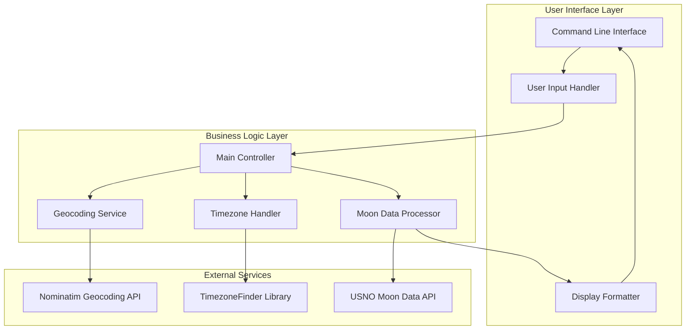
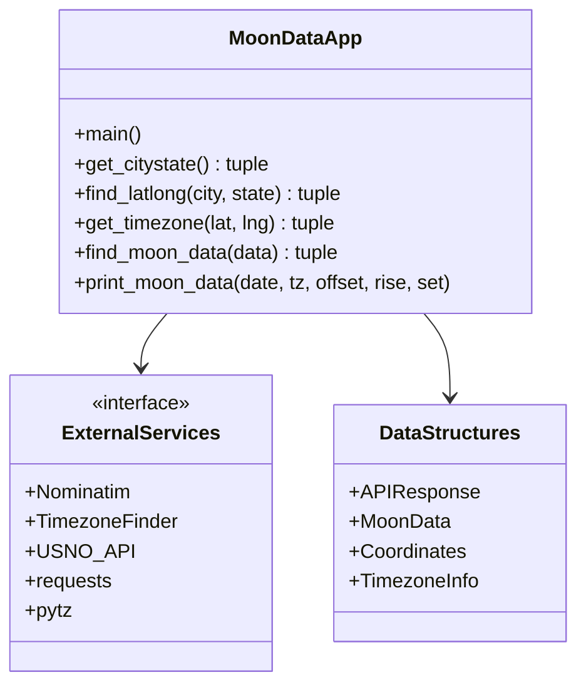
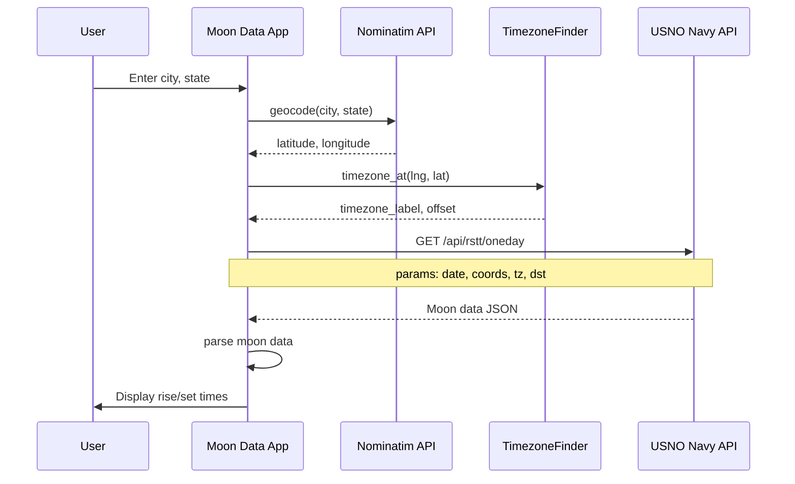
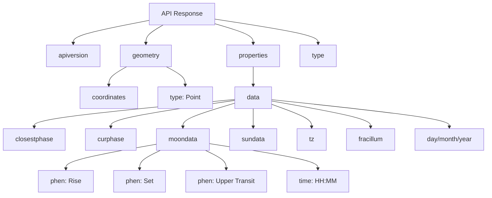
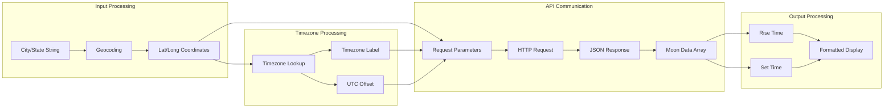
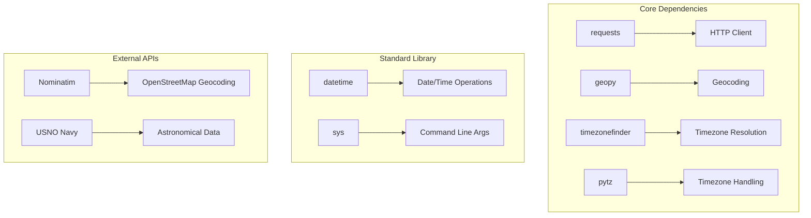

# Architecture Document: Lunar Times

## Overview

The Lunar Times is a command-line Python application that retrieves and displays moonrise and moonset times for any given city and state. The system integrates with external APIs and services to provide accurate astronomical data with proper timezone handling.

### Key Features
- Location-based lunar data retrieval
- Automatic coordinate resolution from city/state input
- Timezone-aware time calculations
- Debug mode for development
- Clean command-line interface

## Core Principles

### Reproducibility
Reproducibility is a fundamental priority for this project, ensuring consistent behavior across different environments and time periods:

**Dependency Management**:
- All dependencies are pinned to specific versions in `pyproject.toml`
- Lock file (`uv.lock`) ensures identical dependency resolution
- No floating version requirements that could introduce variability

**Deterministic Behavior**:
- Same inputs produce identical outputs across systems
- External API calls are the only source of variability (real-time data)
- Consistent formatting and data processing logic

**Environment Consistency**:
- Minimal system dependencies (Python 3.8+ only)
- Self-contained virtual environment via uv
- Cross-platform compatibility (Linux, macOS, Windows)

**Version Control**:
- All configuration files under version control
- Dependency versions tracked and updated deliberately
- Build and runtime environment reproducible from repository

**Testing Reproducibility**:
- Debug mode provides consistent test location (El Paso, TX)
- Same API endpoints and parameters for all requests
- Predictable error handling and output formatting

This focus on reproducibility ensures the application behaves consistently for astronomical calculations, which is critical for planning and scientific accuracy.

## High-Level Architecture

The system follows a modular, functional architecture with clear separation of concerns:



## Data Flow Architecture

```mermaid
flowchart LR
    A[User Input<br/>City, State] --> B[Geocoding<br/>find_latlong]
    B --> C[Coordinates<br/>lat, lng]
    C --> D[Timezone Lookup<br/>get_timezone]
    D --> E[Timezone Info<br/>tz_label, offset]
    E --> F[API Request<br/>USNO Navy API]
    F --> G[Moon Data<br/>JSON Response]
    G --> H[Data Processing<br/>find_moon_data]
    H --> I[Formatted Output<br/>Rise/Set Times]
    I --> J[Display<br/>print_moon_data]
```



## Module Structure



## API Integration Architecture



## Data Structure Diagrams

### API Response Structure



### Internal Data Flow



## Component Details

### Core Functions

| Function | Purpose | Input | Output |
|----------|---------|--------|--------|
| `main()` | Entry point and orchestration | Command line args | None |
| `get_citystate()` | User input handling | stdin/argv | (city, state) |
| `find_latlong()` | Geocoding service | city, state | (latitude, longitude) |
| `get_timezone()` | Timezone resolution | lat, lng | (tz_label, offset) |
| `find_moon_data()` | API response parsing | JSON data | (moonrise, moonset) |
| `print_moon_data()` | Output formatting | date, tz, times | None |

### External Dependencies



## Design Decisions

### Architecture Patterns
- **Functional Programming**: The application uses a functional approach with pure functions for data transformation
- **Single Responsibility**: Each function has a clear, single purpose
- **Dependency Injection**: External services are abstracted through function parameters

### Error Handling Strategy
- **Graceful Degradation**: ValueError for geocoding failures
- **Connection Resilience**: ConnectionError for API failures
- **Input Validation**: Automatic string formatting and validation

### Configuration Management
- **Command Line Flags**: Debug mode via `-d` flag
- **Default Values**: Fallback to El Paso, TX in debug mode
- **Environment Agnostic**: Uses system timezone detection

## Security Considerations

- **API Key Management**: Uses public APIs without authentication
- **Input Sanitization**: Basic string cleaning for user input
- **Rate Limiting**: Relies on external service limits
- **Data Privacy**: No persistent storage of user data

## Performance Characteristics

- **Latency**: Dominated by external API calls (~1-3 seconds)
- **Memory Usage**: Minimal, single-threaded processing
- **Scalability**: Single-user, command-line application
- **Caching**: No caching implemented (stateless operation)

## Future Architecture Considerations

### Potential Enhancements
1. **Caching Layer**: Redis/SQLite for repeated location lookups
2. **Configuration System**: YAML/JSON config files via pyproject.toml
3. **Plugin Architecture**: Support for multiple astronomical data providers
4. **Web Interface**: Flask/FastAPI REST API wrapper
5. **Database Layer**: Historical moon data storage
6. **Authentication**: User accounts and API key management
7. **Package Distribution**: PyPI publishing via uv build system

### Scalability Improvements
- Asynchronous API calls for better performance
- Batch processing for multiple locations
- Microservices architecture for web deployment
- Container orchestration for cloud deployment

### CI/CD Integration ✅ (Implemented & Operational)
- **GitHub Actions**: Comprehensive automated testing and deployment pipeline **LIVE** ✅
- **Multi-Environment Testing**: Python 3.8-3.12 across Ubuntu, Windows, macOS **OPERATIONAL** ✅
- **Quality Automation**: Integrated linting, type checking, and security scanning **ACTIVE** ✅
- **Deployment Pipeline**: Automated PyPI publishing with Test PyPI validation **READY** ✅
- **Health Monitoring**: Weekly external API health checks with alerting **SCHEDULED** ✅

#### Implemented Workflow Architecture
- **CI Pipeline** (`.github/workflows/ci.yml`): 212 lines, 4.9KB
  - Quick validation stage (lint, type check)
  - Multi-Python test matrix (3.8, 3.9, 3.10, 3.11, 3.12)
  - Cross-platform testing (Ubuntu, Windows, macOS)  
  - Security scanning (safety, OSV)
  - Build validation and artifact creation
- **Release Pipeline** (`.github/workflows/release.yml`): 104 lines, 2.6KB
  - Version tag detection and validation
  - Test PyPI → Production PyPI deployment flow
  - GitHub release creation with changelog integration
- **Health Monitor** (`.github/workflows/health-check.yml`): 57 lines, 1.6KB
  - Weekly Nominatim and USNO API health checks
  - Automatic GitHub issue creation on failure

### DevOps Patterns ✅ (Implemented & Operational)
- **Infrastructure as Code**: CI/CD workflows defined in version-controlled YAML **ACTIVE** ✅
- **Matrix Testing**: Comprehensive compatibility verification across environments **OPERATIONAL** ✅
- **Security Integration**: Automated dependency vulnerability scanning **SCANNING WEEKLY** ✅
- **Monitoring & Alerting**: Proactive API health monitoring with issue creation **MONITORING WEEKLY** ✅
- **Branch Protection**: Enforced quality gates preventing broken code merges **CONFIGURABLE** ✅

## Development Environment

### Technology Stack
- **Language**: Python 3.8+
- **Package Manager**: uv (modern Python package manager)
- **HTTP Client**: requests
- **Geocoding**: geopy (Nominatim)
- **Timezone**: timezonefinder, pytz
- **API**: USNO Navy Astronomical Applications
- **Build System**: Hatchling

### Build and Deployment
```bash
# Install dependencies
make install

# Run application
make run

# Debug mode
make run-debug

# Build project
make build

# Run tests
make test

# Check code quality
make check
```

## Conclusion

The Lunar Times demonstrates a clean, modular architecture suitable for a command-line utility. The design prioritizes simplicity, maintainability, and clear separation of concerns while providing reliable astronomical data through well-established external APIs. 