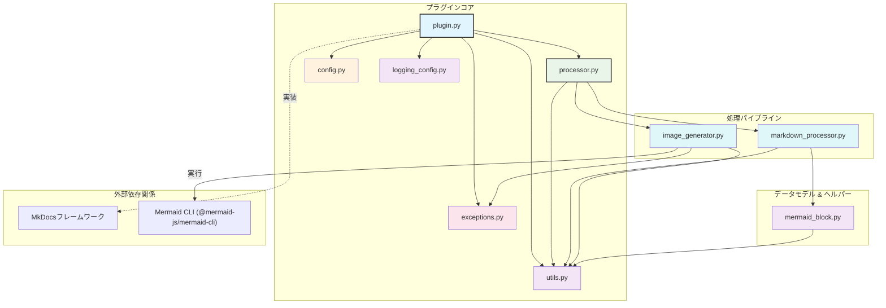
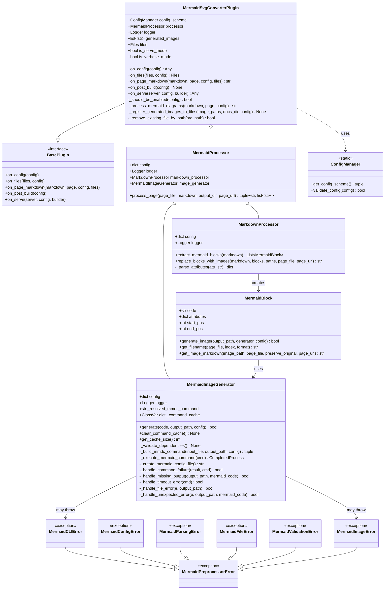
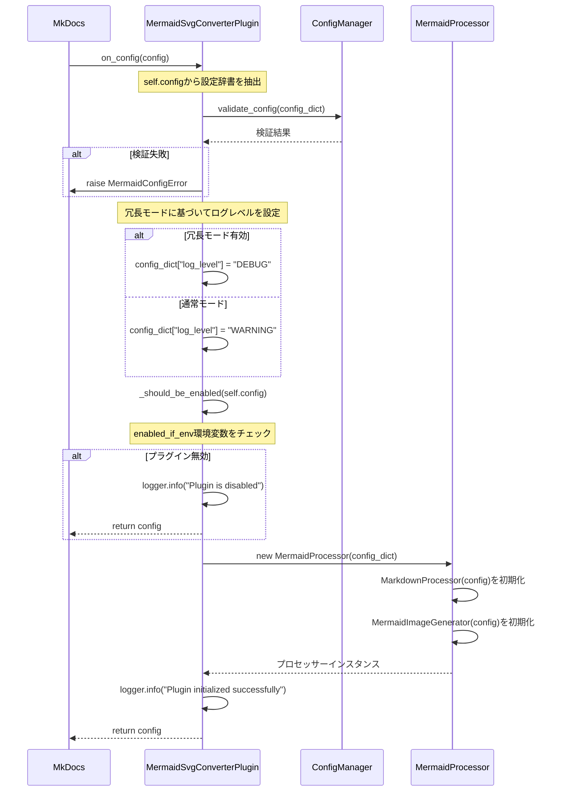
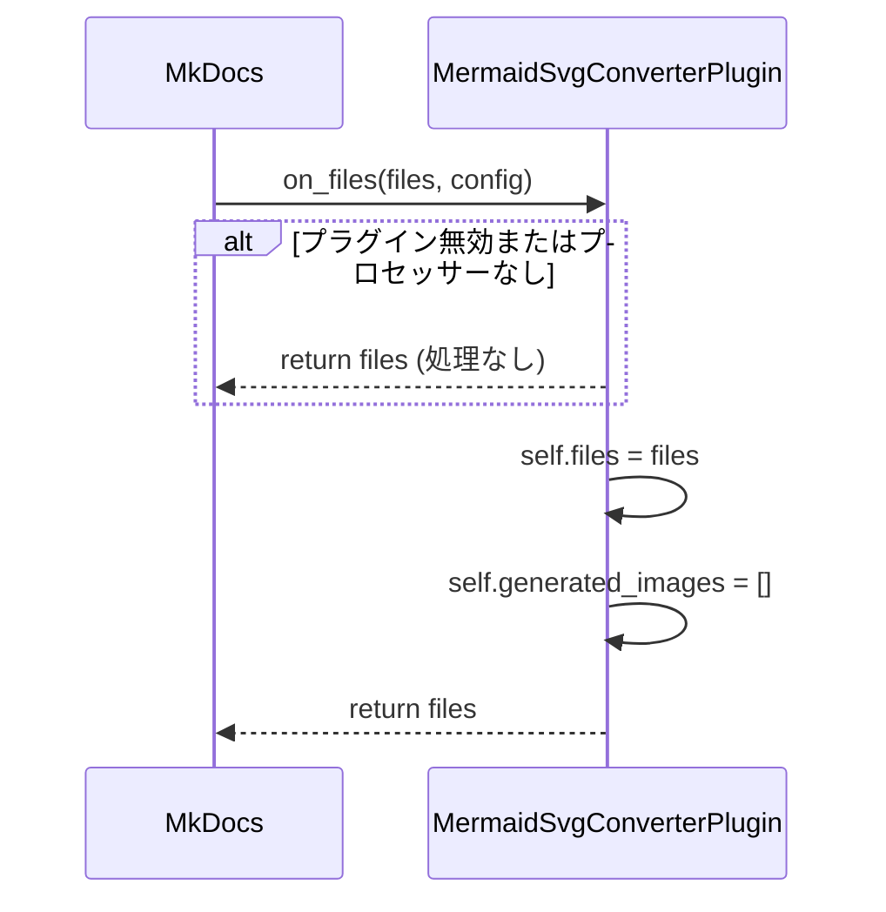
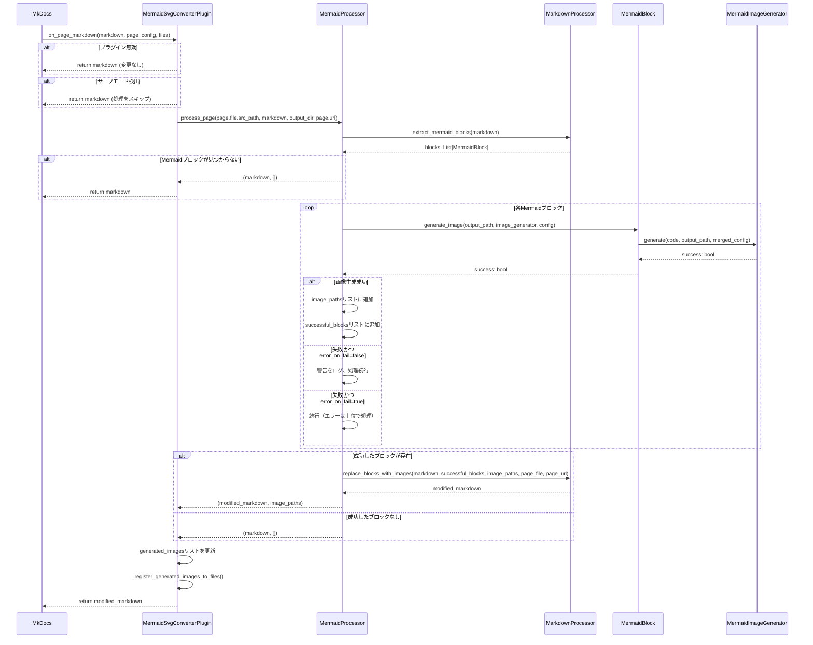
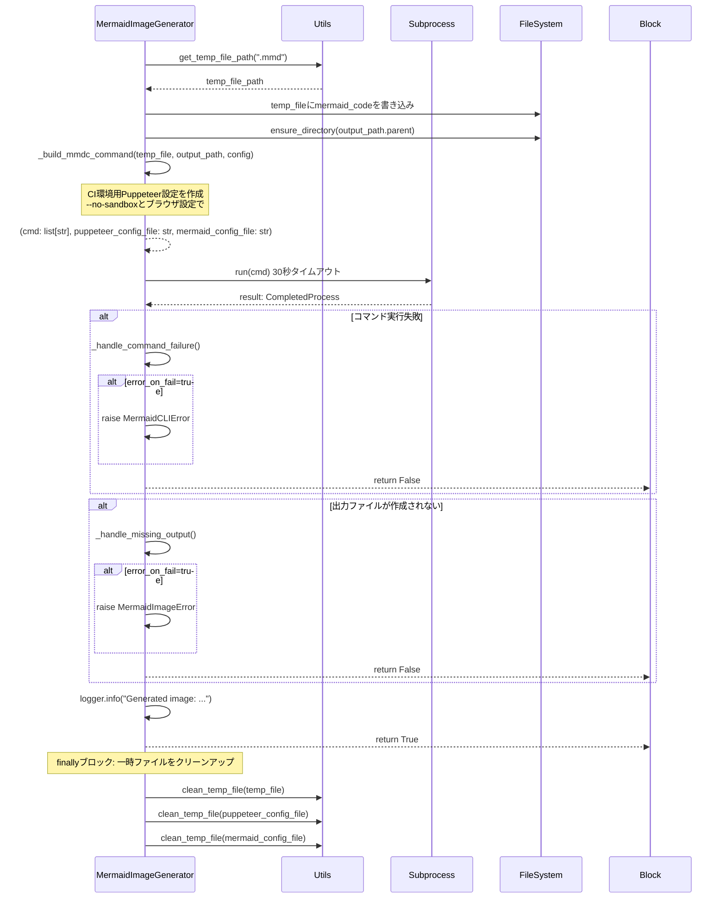
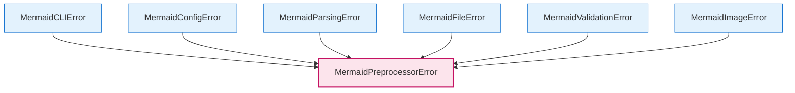

# アーキテクチャドキュメント

## 概要

MkDocs Mermaid to Image Pluginは、MkDocsビルドプロセス中にMermaidダイアグラムを静的なSVGイメージに変換する包括的なソリューションです。このプラグインは、Mermaid CLI（`@mermaid-js/mermaid-cli`）を活用してコードブロックを静的画像に変換することで、PDF出力の生成とMermaidダイアグラムを含むドキュメントのオフライン表示を可能にします。

## プロジェクト構成

```
mkdocs-mermaid-to-image/
└── src/
    └── mkdocs_mermaid_to_svg/
        ├── __init__.py             # パッケージ初期化とバージョン情報
        ├── _version.py             # バージョン管理
        ├── plugin.py               # メインMkDocsプラグインクラス (MermaidSvgConverterPlugin)
        ├── processor.py            # ページ処理オーケストレーター (MermaidProcessor)
        ├── markdown_processor.py   # Markdownパースと変換 (MarkdownProcessor)
        ├── image_generator.py      # Mermaid CLI経由での画像生成 (MermaidImageGenerator)
        ├── mermaid_block.py        # Mermaidブロック表現 (MermaidBlock)
        ├── config.py               # 設定スキーマと検証 (ConfigManager)
        ├── types.py                # 型定義とTypedDictクラス
        ├── exceptions.py           # カスタム例外階層
        ├── logging_config.py       # 構造化ログ設定
        └── utils.py                # ユーティリティ関数とヘルパー
```

## コンポーネント依存関係



## クラスアーキテクチャ



## 処理フロー

### 1. プラグイン初期化 (`on_config`)



### 2. ファイル登録 (`on_files`)



### 3. ページ処理 (`on_page_markdown`)



### 4. 画像生成 (`MermaidImageGenerator.generate`)



## 設定管理

プラグインの設定は`mkdocs.yml`を通じて管理され、`ConfigManager`クラスを使用して検証されます。

### 設定スキーマ

```python
# mkdocs.yml で利用可能な設定オプション
plugins:
  - mkdocs-mermaid-to-image:
      enabled_if_env: "ENABLE_MERMAID"        # 条件付き有効化のための環境変数
      output_dir: "assets/images"             # 生成画像のディレクトリ
      mermaid_config: {...}                   # Mermaid設定オブジェクトまたはファイルパス
      theme: "default"                        # Mermaidテーマ: default, dark, forest, neutral
      css_file: "path/to/custom.css"          # スタイリング用オプショナルCSSファイル
      puppeteer_config: "path/to/config.json" # オプショナルPuppeteer設定
      temp_dir: "/tmp"                        # 処理用一時ディレクトリ
      preserve_original: false                # 元のMermaidブロックを画像と並行して保持
      error_on_fail: false                    # 画像生成失敗時にビルドを停止
      log_level: "INFO"                       # ログレベル
      cleanup_generated_images: false         # ビルド後に生成画像をクリーンアップ
```

### 検証ロジック

`ConfigManager.validate_config()`メソッドは以下を保証します：
- 指定されたファイルパス（CSS、Puppeteer設定）が存在する
- 全オプション間の設定の整合性

## 環境固有の動作

### モード検出

プラグインは実行環境を自動的に検出します：

```python
# src/mkdocs_mermaid_to_svg/plugin.py
class MermaidSvgConverterPlugin(BasePlugin):
    def __init__(self) -> None:
        self.is_serve_mode: bool = "serve" in sys.argv
        self.is_verbose_mode: bool = "--verbose" in sys.argv or "-v" in sys.argv
```

### 条件付き有効化

プラグインの有効化は環境変数で制御できます：

```python
def _should_be_enabled(self, config: dict[str, Any]) -> bool:
    enabled_if_env = config.get("enabled_if_env")

    if enabled_if_env is not None:
        # 環境変数が存在し、空でない値を持つかチェック
        env_value = os.environ.get(enabled_if_env)
        return env_value is not None and env_value.strip() != ""

    # デフォルト: 条件付き環境変数が設定されていない場合は常に有効
    return True
```

### ログ戦略

ログレベルは冗長モードに基づいて動的に調整されます：

```python
# 冗長モードに基づいてログレベルを調整
config_dict["log_level"] = "DEBUG" if self.is_verbose_mode else "WARNING"
```

## ファイル管理戦略

### 生成画像の登録

生成された画像は、サイトディレクトリへの適切なコピーを確保するため、MkDocsのファイルシステムに動的に登録されます：

```python
def _register_generated_images_to_files(self, image_paths: list[str], docs_dir: Path, config: Any) -> None:
    from mkdocs.structure.files import File

    for image_path in image_paths:
        image_file_path = Path(image_path)
        if image_file_path.exists():
            rel_path = image_file_path.relative_to(docs_dir)
            # クロスプラットフォーム互換性のためのパス正規化
            rel_path_str = str(rel_path).replace("\\", "/")

            # 重複を避けるため既存ファイルを削除
            self._remove_existing_file_by_path(rel_path_str)

            # 新しいFileオブジェクトを作成し登録
            file_obj = File(rel_path_str, str(docs_dir), str(config["site_dir"]), ...)
            self.files.append(file_obj)
```

### 画像配置戦略

- **開発モード**: 即座に表示するため`docs_dir/output_dir`に画像を生成
- **ビルドモード**: MkDocsが登録された画像を自動的にサイトディレクトリにコピー
- **クリーンアップ**: `cleanup_generated_images`によるビルド完了後のオプション自動クリーンアップ

## エラーハンドリングアーキテクチャ

### 例外階層



### エラーハンドリング戦略

1. **設定エラー**: `on_config`中に検出され、即座にビルドプロセスを停止
2. **CLI実行エラー**: `error_on_fail`設定に基づいて処理：
   - `true`: ビルドを停止し例外を発生
   - `false`: エラーをログし継続（失敗したダイアグラムをスキップ）
3. **ファイルシステムエラー**: 詳細なエラーコンテキストと提案を含む包括的な処理
4. **検証エラー**: 特定のエラーメッセージと修正ガイダンスを含む入力検証

### エラーコンテキストとログ

すべてのカスタム例外にはデバッグ用のコンテキスト情報が含まれます：

```python
class MermaidCLIError(MermaidPreprocessorError):
    def __init__(self, message: str, command: str = None, return_code: int = None, stderr: str = None):
        super().__init__(message, command=command, return_code=return_code, stderr=stderr)
```

この包括的なエラーハンドリングは、異なる環境での堅牢な動作を保証し、問題のトラブルシューティングのための明確なガイダンスを提供します。

## パフォーマンス最適化

### コマンドキャッシング

`MermaidImageGenerator`は、繰り返しのCLI検出を避けるためにクラスレベルのコマンドキャッシングを実装しています：

```python
class MermaidImageGenerator:
    _command_cache: ClassVar[dict[str, str]] = {}

    def _validate_dependencies(self) -> None:
        # mmdcコマンドの解決を試みる前にまずキャッシュをチェック
        if primary_command in self._command_cache:
            self._resolved_mmdc_command = self._command_cache[primary_command]
            return
```

### バッチ処理

プラグインは、I/Oオーバーヘッドを最小限に抑え、同じドキュメント内のダイアグラム間の整合性を維持するために、ページ内のすべてのMermaidブロックをバッチ操作として処理します。

### 一時ファイル管理

自動クリーンアップ機能を持つ効率的な一時ファイル処理により、ビルドプロセス中の最小限のディスク使用量を確保し、リソースリークを防ぎます。
