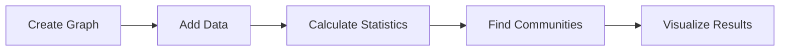
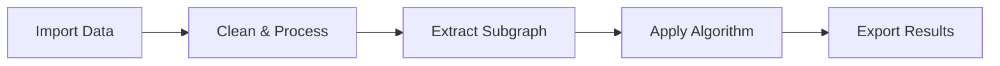

# API Reference

Welcome to the NetworkX MCP Server API reference! This section provides comprehensive documentation for all MCP Tools, Resources, and Prompts available in the server.

## Overview

The NetworkX MCP Server implements the complete [Model Context Protocol](https://github.com/anthropics/mcp) specification, providing three types of capabilities:

<div class="grid cards" markdown>

-   :material-tools:{ .lg .middle } __MCP Tools__

    ---

    Interactive operations that modify graphs and perform analysis. Tools can be called with parameters and return results.

    [:octicons-arrow-right-24: Browse Tools](tools/graph-operations.md)

-   :material-database:{ .lg .middle } __MCP Resources__

    ---

    Read-only access to graph data, statistics, and visualizations. Resources provide structured data access.

    [:octicons-arrow-right-24: Browse Resources](resources/catalog.md)

-   :material-lightbulb:{ .lg .middle } __MCP Prompts__

    ---

    Pre-configured workflow templates for common graph analysis tasks and domain-specific applications.

    [:octicons-arrow-right-24: Browse Prompts](prompts/social-analysis.md)

</div>

## Quick Reference

### Tool Categories

| Category | Count | Description |
|----------|-------|-------------|
| **[Graph Operations](tools/graph-operations.md)** | 12 tools | Create, modify, and manage graphs |
| **[Algorithms](tools/algorithms.md)** | 15 tools | Path finding, centrality, connectivity |
| **[Analysis](tools/analysis.md)** | 8 tools | Community detection, clustering, metrics |
| **[Visualization](tools/visualization.md)** | 6 tools | Interactive and static graph visualizations |
| **[Import/Export](tools/import-export.md)** | 5 tools | Data import/export in various formats |
| **[Machine Learning](tools/ml.md)** | 8 tools | Graph embeddings, prediction, classification |

### Resource Types

| Type | Description | Example |
|------|-------------|---------|
| **[Graph Catalog](resources/catalog.md)** | List and metadata of all graphs | `catalog://graphs` |
| **[Graph Data](resources/data.md)** | Node and edge data access | `data://graph/{id}/nodes` |
| **[Statistics](resources/statistics.md)** | Pre-computed graph metrics | `stats://graph/{id}/centrality` |
| **[Visualizations](resources/visualizations.md)** | Generated chart and plot data | `viz://graph/{id}/network.json` |

### Prompt Templates

| Template | Use Case | Domain |
|----------|----------|--------|
| **[Social Analysis](prompts/social-analysis.md)** | Social network analysis workflows | Social Media, Organizations |
| **[Path Finding](prompts/path-finding.md)** | Route optimization and navigation | Transportation, Logistics |
| **[ML Workflows](prompts/ml-workflows.md)** | Machine learning pipelines | Data Science, Research |

## Common Usage Patterns

### Pattern 1: Basic Graph Analysis



```python
# 1. Create graph
create_graph("network", graph_type="Graph")

# 2. Add data
add_edges("network", [("A", "B"), ("B", "C"), ("C", "A")])

# 3. Analyze
stats = graph_statistics("network")
communities = community_detection("network")

# 4. Visualize
visualize_graph("network", save_path="result.html")
```

### Pattern 2: Data Pipeline



```python
# 1. Import
import_graph("data", file_path="network.csv")

# 2. Process
subgraph = extract_subgraph("data", nodes=important_nodes)

# 3. Analyze
centrality = centrality_measures("data", ["pagerank"])

# 4. Export
export_graph("data", file_path="results.json", format="json")
```

### Pattern 3: Resource Access

```python
# Access via Resources (read-only)
catalog = get_resource("catalog://graphs")
node_data = get_resource("data://network/nodes")
stats = get_resource("stats://network/basic")
```

## Authentication & Security

### API Keys (Optional)

When authentication is enabled, include your API key:

```python
# In tool calls
result = call_tool("create_graph", {
    "graph_id": "secure_graph",
    "api_key": "your-api-key-here"
})
```

### Rate Limiting

All API calls are subject to rate limiting:

- **Default**: 1000 requests/minute
- **Authenticated**: 5000 requests/minute  
- **Enterprise**: Custom limits

### Input Validation

All inputs are validated for:

- **Graph Size**: Maximum nodes/edges limits
- **Memory Usage**: Prevents resource exhaustion
- **Input Sanitization**: SQL injection and XSS protection
- **File Access**: Sandboxed file operations

## Error Handling

### Standard Error Format

```json
{
  "error": {
    "code": "GRAPH_NOT_FOUND",
    "message": "Graph 'nonexistent' does not exist",
    "details": {
      "graph_id": "nonexistent",
      "available_graphs": ["graph1", "graph2"]
    }
  }
}
```

### Common Error Codes

| Code | Description | Resolution |
|------|-------------|------------|
| `GRAPH_NOT_FOUND` | Specified graph doesn't exist | Check graph ID or create graph first |
| `INVALID_PARAMETERS` | Invalid tool parameters | Check parameter types and ranges |
| `MEMORY_LIMIT_EXCEEDED` | Graph too large for memory | Use smaller graph or increase limits |
| `ALGORITHM_FAILED` | Algorithm couldn't complete | Check graph properties (connectivity, etc.) |
| `PERMISSION_DENIED` | Insufficient permissions | Check API key or authentication |

## Performance Considerations

### Tool Performance

| Operation Type | Small Graph | Medium Graph | Large Graph |
|----------------|-------------|--------------|-------------|
| **Graph Creation** | <0.1s | <1s | <10s |
| **Basic Analysis** | <0.5s | <5s | <30s |
| **Complex Algorithms** | <2s | <30s | <5min |
| **Visualization** | <1s | <10s | <60s |

### Memory Usage

| Graph Size | Nodes | Edges | Memory |
|------------|-------|-------|--------|
| Small | 1K | 10K | ~50MB |
| Medium | 100K | 1M | ~2GB |
| Large | 1M | 10M | ~20GB |

### Optimization Tips

!!! tip "Performance Optimization"
    
    - **Use caching**: Enable Redis for repeated operations
    - **Batch operations**: Group multiple changes together  
    - **Subset analysis**: Work with subgraphs when possible
    - **Appropriate algorithms**: Choose algorithms suitable for graph size
    - **Memory management**: Delete unused graphs to free memory

## Version Compatibility

### API Versioning

The NetworkX MCP Server follows semantic versioning:

- **Major version** (2.x): Breaking API changes
- **Minor version** (2.1.x): New features, backward compatible
- **Patch version** (2.1.1): Bug fixes, backward compatible

### Client Compatibility

| Client | Minimum Version | Recommended |
|--------|----------------|-------------|
| **Claude Desktop** | Any MCP support | Latest |
| **MCP CLI** | 0.1.0+ | 0.2.0+ |
| **Python MCP SDK** | 0.1.0+ | 0.2.0+ |

## Schema Definitions

### Tool Schema

```json
{
  "type": "function", 
  "function": {
    "name": "tool_name",
    "description": "Tool description",
    "parameters": {
      "type": "object",
      "properties": {
        "param_name": {
          "type": "string",
          "description": "Parameter description"
        }
      },
      "required": ["param_name"]
    }
  }
}
```

### Resource Schema

```json
{
  "uri": "resource://type/identifier",
  "name": "Resource Name", 
  "description": "Resource description",
  "mimeType": "application/json"
}
```

### Prompt Schema

```json
{
  "name": "prompt_name",
  "description": "Prompt description",
  "arguments": [
    {
      "name": "arg_name",
      "description": "Argument description",
      "required": true
    }
  ]
}
```

## Next Steps

<div class="grid cards" markdown>

-   [:material-tools: **Explore Tools**](tools/graph-operations.md)
    
    Start with graph operations

-   [:material-database: **Browse Resources**](resources/catalog.md)
    
    Access graph data

-   [:material-lightbulb: **Try Prompts**](prompts/social-analysis.md)
    
    Use workflow templates

-   [:material-code-braces: **Python API**](python/)
    
    Direct library usage

</div>

!!! info "Need Help?"
    
    - **=Ö User Guide**: [Core concepts and tutorials](../user-guide/concepts.md)
    - **=¡ Examples**: [Real-world use cases](../examples/social-networks.md)
    - **=¬ Community**: [GitHub Discussions](https://github.com/brightliu/networkx-mcp-server/discussions)
    - **= Issues**: [Report bugs](https://github.com/brightliu/networkx-mcp-server/issues)