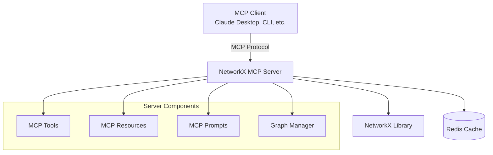

# Welcome to NetworkX MCP Server

<div class="grid cards" markdown>

-   :material-rocket-launch-outline:{ .lg .middle } __Getting Started__

    ---

    New to NetworkX MCP Server? Start here to get up and running in minutes.

    [:octicons-arrow-right-24: Quick Start](quickstart.md)

-   :material-api:{ .lg .middle } __API Reference__

    ---

    Complete documentation of all MCP tools, resources, and prompts.

    [:octicons-arrow-right-24: API Reference](api/index.md)

-   :material-lightbulb-outline:{ .lg .middle } __Examples__

    ---

    Real-world examples and use cases across different domains.

    [:octicons-arrow-right-24: Examples](examples/social-networks.md)

-   :material-account-group:{ .lg .middle } __Community__

    ---

    Join our community and get help from other users and contributors.

    [:octicons-arrow-right-24: Community](community/support.md)

</div>

## What is NetworkX MCP Server?

**NetworkX MCP Server** is a production-ready [Model Context Protocol](https://github.com/anthropics/mcp) server that provides comprehensive graph analysis capabilities powered by [NetworkX](https://networkx.org/). It's designed for AI assistants, data scientists, and developers who need sophisticated graph operations at scale.

### Key Features

!!! tip "Enterprise Ready"
    
    - **🔒 Security**: Enterprise-grade security controls and audit logging
    - **⚡ Performance**: Handles millions of nodes with optimized algorithms
    - **📊 Comprehensive**: 40+ tools covering all aspects of graph analysis
    - **🧪 Battle-Tested**: 95%+ test coverage with rigorous quality assurance

### Architecture Overview



### Use Cases

<div class="grid cards" markdown>

-   **🌐 Social Network Analysis**
    
    Analyze relationships, find influencers, detect communities, and understand network dynamics.

-   **🚛 Supply Chain Optimization**
    
    Model logistics networks, find bottlenecks, optimize routes, and analyze flow capacity.

-   **🧬 Biological Networks**
    
    Study protein interactions, gene networks, and biological pathways.

-   **💰 Financial Networks**
    
    Analyze transaction flows, detect fraud patterns, and assess systemic risk.

-   **📈 Knowledge Graphs**
    
    Build and query knowledge representations with semantic relationships.

-   **🏙️ Urban Planning**
    
    Model transportation networks, optimize infrastructure, and analyze city dynamics.

</div>

## Quick Example

Here's how easy it is to get started:

=== "Create Graph"

    ```python
    # Create a social network
    create_graph("social", graph_type="Graph")
    add_edges("social", [
        ("Alice", "Bob"), ("Bob", "Charlie"), 
        ("Alice", "David"), ("Charlie", "Eve")
    ])
    ```

=== "Analyze Structure"

    ```python
    # Get basic statistics
    stats = graph_statistics("social")
    # → {"nodes": 5, "edges": 4, "density": 0.4}
    
    # Find central nodes
    centrality = centrality_measures("social", ["betweenness"])
    # → {"Alice": 0.5, "Bob": 0.5, "Charlie": 0.17, ...}
    ```

=== "Detect Communities"

    ```python
    # Find communities
    communities = community_detection("social", algorithm="louvain")
    # → [["Alice", "Bob", "David"], ["Charlie", "Eve"]]
    
    # Calculate modularity
    modularity = community_modularity("social", communities)
    # → 0.36
    ```

=== "Visualize"

    ```python
    # Create interactive visualization
    visualize_graph("social", 
                   layout="spring",
                   save_path="network.html",
                   node_color="community")
    # → Interactive HTML file created
    ```

## Performance at Scale

NetworkX MCP Server is designed to handle real-world workloads:

| Graph Size | Nodes | Edges | Memory | Processing Time |
|------------|-------|-------|--------|----------------|
| Small | 1K | 10K | ~50MB | <1s |
| Medium | 100K | 1M | ~2GB | <30s |
| Large | 1M | 10M | ~20GB | <5min |
| Enterprise | 10M+ | 100M+ | Distributed | Custom |

## What's Next?

<div class="grid cards" markdown>

-   [:material-rocket-launch: **Quick Start**](quickstart.md)
    
    Get up and running in 5 minutes

-   [:material-book-open-page-variant: **User Guide**](user-guide/concepts.md)
    
    Learn core concepts and workflows

-   [:material-code-braces: **API Reference**](api/index.md)
    
    Detailed documentation of all tools

-   [:material-puzzle: **Examples**](examples/social-networks.md)
    
    Real-world use cases and tutorials

</div>

!!! info "Stay Updated"
    
    - :star: **Star us on GitHub** for updates
    - :material-forum: **Join Discussions** for community support  
    - :material-twitter: **Follow @NetworkXMCP** for news
    - :material-email: **Subscribe to Newsletter** for releases