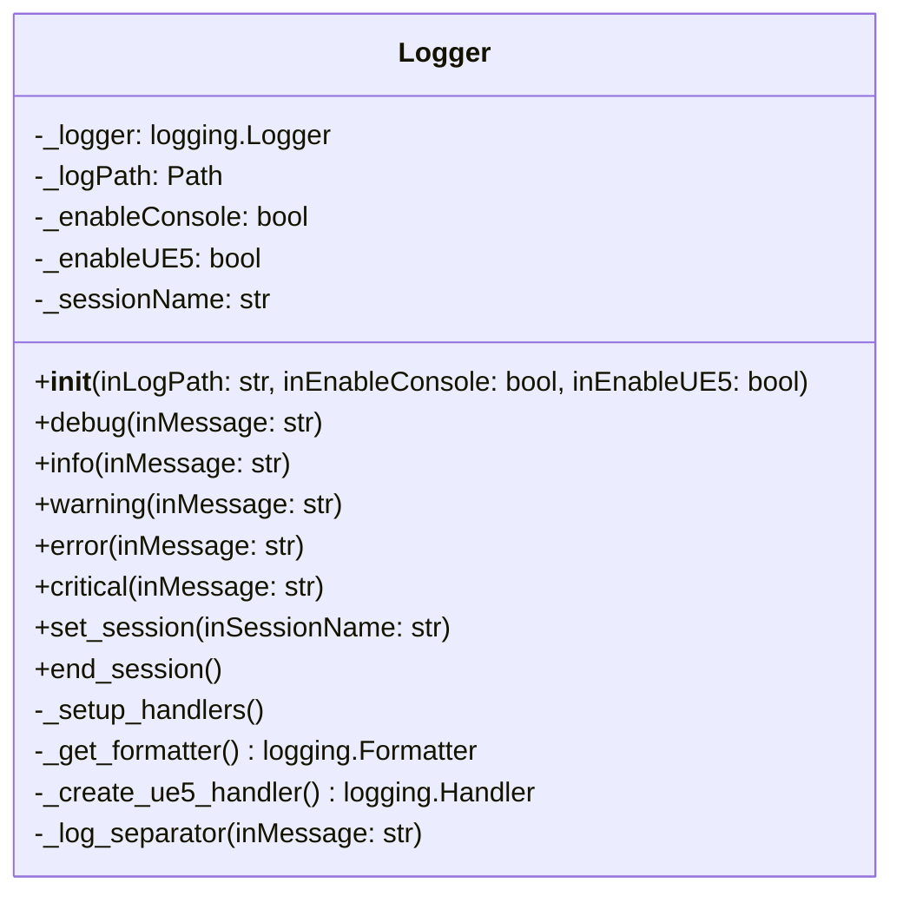

# PyJalLib 중앙 집중식 로깅 모듈 PRD
## Product Requirements Document

**프로젝트명**: PyJalLib 중앙 집중식 로깅 모듈 개발  
**버전**: 1.0  
**작성일**: 2025년 1월 18일  
**작성자**: Development Team  

---

## 1. 프로젝트 개요

### 1.1 목적
PyJalLib의 모든 모듈에서 사용할 수 있는 중앙 집중식 로깅 시스템을 구축하여 일관된 로깅 방식을 제공하고, 로그 관리의 효율성을 향상시킨다.

### 1.2 배경
- 현재 각 모듈(UE5, Perforce 등)이 독립적인 로깅 시스템을 사용
- 로그 형식, 저장 위치, 레벨 관리가 모듈마다 상이함
- 통합된 로그 분석 및 디버깅의 어려움
- 중복된 로깅 설정 코드로 인한 유지보수성 저하

### 1.3 범위
- 단일 로깅 클래스 구현 (`Logger`)
- 모듈별 로거 인스턴스 제공
- 통합된 로그 형식 및 저장 정책
- 런타임 로그 레벨 동적 변경
- 기존 모듈들의 단순한 로깅 코드 교체

---

## 2. 요구사항 분석

### 2.1 기능적 요구사항 (Functional Requirements)

#### 2.1.1 핵심 기능 (Core Features)
| 기능 ID | 기능명 | 설명 | 우선순위 |
|---------|--------|------|----------|
| F001 | Logger 클래스 | 간단한 로거 인스턴스 제공 | High |
| F002 | 파일 로깅 | 로그 파일에 메시지 기록 | High |
| F003 | 콘솔 로깅 | 콘솔에 메시지 출력 | High |
| F004 | UE5 로깅 | UE5 환경에서 UE5 콘솔에 출력 | Medium |
| F005 | 세션 구분 기능 | 동적 세션 변경 및 구분선 출력 | Medium |

#### 2.1.2 추가 기능 (Additional Features)
| 기능 ID | 기능명 | 설명 | 우선순위 |
|---------|--------|------|----------|
| F006 | 기본 로그 레벨 설정 | 생성 시 로그 레벨 설정 | Low |

### 2.2 비기능적 요구사항 (Non-Functional Requirements)

#### 2.2.1 성능 요구사항
- 로그 메시지 처리 지연시간: 1ms 이하
- 메모리 사용량: 기본 상태에서 10MB 이하
- 로그 파일 I/O 오버헤드: 기존 대비 5% 이내

#### 2.2.2 호환성 요구사항
- Python 3.7 이상 지원
- 기존 UE5, Perforce 모듈과 완전 호환
- 3DS Max, Unreal Engine 환경에서 동작

#### 2.2.3 확장성 요구사항
- 새로운 로그 핸들러 쉽게 추가 가능
- 플러그인 방식으로 확장 기능 지원
- 다국어 로그 메시지 지원 준비

---

## 3. 현재 상태 분석

### 3.1 기존 로깅 시스템 현황

#### 3.1.1 UE5 모듈 (`src/pyjallib/ue5/logger.py`)
**구현 상태**: ✅ 완료
**특징**:
- UE5 전용 핸들러 구현 (`UE5LogHandler`)
- 파일 + UE5 콘솔 이중 출력
- 날짜별 로그 파일 생성
- 동적 로그 레벨 설정 지원

**코드 구조**:
```python
class UE5LogHandler(logging.Handler)
def _setup_ue5_logging()
def set_log_level(inLevel: str)
def set_ue5_log_level(inLevel: str)
```

#### 3.1.2 Perforce 모듈 (`src/pyjallib/perforce.py`)
**구현 상태**: ✅ 완료
**특징**:
- 기본 파일 핸들러 사용
- 디버그 모드 생성자 지원
- 단일 로그 파일 (`Perforce.log`)

**코드 구조**:
```python
logger = logging.getLogger(__name__)
file_handler = logging.FileHandler(str(log_path), encoding='utf-8')
```

### 3.2 문제점 분석

#### 3.2.1 코드 중복 문제
- 로그 경로 설정: `Path.home() / "Documents" / "PyJalLib" / "logs"`
- 포맷터 설정: 각 모듈마다 유사한 형식 정의
- 핸들러 관리: 중복된 핸들러 추가/제거 로직

#### 3.2.2 일관성 부족
- 로그 파일명 규칙: `ue5_module_20250118.log` vs `Perforce.log`
- 인코딩 설정: UE5는 명시적 UTF-8, Perforce도 UTF-8이지만 중복 설정
- 로그 레벨 기본값: UE5는 DEBUG, Perforce는 ERROR

#### 3.2.3 확장성 제한
- 새 모듈 추가 시 로깅 설정 재구현 필요
- 통합된 로그 레벨 관리 불가능
- 런타임 설정 변경의 어려움

---

## 4. 기술적 사양

### 4.1 아키텍처 설계

#### 4.1.1 모듈 구조
```
src/pyjallib/
└── logger.py                 # 메인 로깅 클래스
```

#### 4.1.2 클래스 구조


### 4.2 핵심 클래스 설계

#### 4.2.1 Logger 클래스
```python
class Logger:
    """PyJalLib 간단한 로깅 클래스"""
    
    def __init__(self, inLogPath: str = None, inEnableConsole: bool = True, inEnableUE5: bool = False):
        """로거 인스턴스 초기화
        
        Args:
            inLogPath (str, optional): 로그 파일 저장 경로. 
                                     None인 경우 기본 경로 사용 (Documents/PyJalLib/logs)
            inEnableConsole (bool): 콘솔 출력 활성화 여부 (기본값: True)
            inEnableUE5 (bool): UE5 출력 활성화 여부 (기본값: False)
        """
        # 기본 로그 경로 설정
        if inLogPath is None:
            documents_path = Path.home() / "Documents"
            self._logPath = documents_path / "PyJalLib" / "logs"
        else:
            self._logPath = Path(inLogPath)
            
        # 로그 디렉토리 생성
        self._logPath.mkdir(parents=True, exist_ok=True)
        
        # 출력 옵션 설정
        self._enableConsole = inEnableConsole
        self._enableUE5 = inEnableUE5
        self._sessionName = None  # 초기에는 세션 없음
        
        # 로거 생성 및 설정
        self._logger = logging.getLogger(f"pyjallib_{id(self)}")
        self._logger.setLevel(logging.DEBUG)
        self._logger.handlers.clear()  # 기존 핸들러 제거
        self._setup_handlers()
    
    def debug(self, inMessage: str) -> None:
        """디버그 레벨 로그 메시지"""
        self._logger.debug(inMessage)
        
    def info(self, inMessage: str) -> None:
        """정보 레벨 로그 메시지"""
        self._logger.info(inMessage)
        
    def warning(self, inMessage: str) -> None:
        """경고 레벨 로그 메시지"""
        self._logger.warning(inMessage)
        
    def error(self, inMessage: str) -> None:
        """에러 레벨 로그 메시지"""
        self._logger.error(inMessage)
        
    def critical(self, inMessage: str) -> None:
        """치명적 에러 레벨 로그 메시지"""
        self._logger.critical(inMessage)
        
    def set_session(self, inSessionName: str) -> None:
        """새로운 로깅 세션 설정 및 시작
        
        Args:
            inSessionName (str): 세션 구분용 이름
        """
        # 기존 세션이 있다면 종료
        if self._sessionName is not None:
            self.end_session()
            
        # 새 세션 시작
        self._sessionName = inSessionName
        separator_msg = f"===== {self._sessionName} 로깅 시작 ====="
        self._log_separator(separator_msg)
        
    def end_session(self) -> None:
        """현재 로깅 세션 종료 구분선 출력"""
        if self._sessionName is not None:
            separator_msg = f"===== {self._sessionName} 로깅 끝 ====="
            self._log_separator(separator_msg)
            self._sessionName = None
        
    def _log_separator(self, inMessage: str) -> None:
        """구분선 메시지를 모든 핸들러에 직접 출력"""
        # 구분선은 INFO 레벨로 출력하되, 특별한 포맷 사용
        separator_record = logging.LogRecord(
            name=self._logger.name,
            level=logging.INFO,
            pathname="",
            lineno=0,
            msg=inMessage,
            args=(),
            exc_info=None
        )
        
        # 각 핸들러에 직접 전송 (포맷터 우회)
        for handler in self._logger.handlers:
            if handler.isEnabledFor(logging.INFO):
                # 구분선만 특별한 포맷으로 출력
                formatted_msg = f"{inMessage}"
                handler.stream.write(formatted_msg + "\n") if hasattr(handler, 'stream') else None
                handler.flush() if hasattr(handler, 'flush') else None
        
    def _setup_handlers(self) -> None:
        """로거에 핸들러 설정"""
        # 파일 핸들러 (항상 활성화)
        log_file = self._logPath / "pyjallib.log"
        file_handler = logging.FileHandler(log_file, encoding='utf-8')
        file_handler.setFormatter(self._get_formatter())
        self._logger.addHandler(file_handler)
        
        # 콘솔 핸들러 (선택사항)
        if self._enableConsole:
            console_handler = logging.StreamHandler()
            console_handler.setFormatter(self._get_formatter())
            self._logger.addHandler(console_handler)
            
        # UE5 핸들러 (선택사항)
        if self._enableUE5:
            ue5_handler = self._create_ue5_handler()
            if ue5_handler:
                self._logger.addHandler(ue5_handler)
            
    def _get_formatter(self) -> logging.Formatter:
        """표준 포맷터 반환"""
        return logging.Formatter(
            '%(asctime)s - %(levelname)s - %(message)s',
            datefmt='%Y-%m-%d %H:%M:%S'
        )
        
    def _create_ue5_handler(self) -> logging.Handler:
        """UE5 핸들러 생성 (기존 UE5LogHandler 코드 활용)"""
        # 기존 UE5LogHandler 코드를 여기에 통합
        try:
            import unreal
            
            class UE5LogHandler(logging.Handler):
                def emit(self, record):
                    try:
                        message = self.format(record)
                        if record.levelno >= logging.ERROR:
                            unreal.log_error(message)
                        elif record.levelno >= logging.WARNING:
                            unreal.log_warning(message)
                        else:
                            unreal.log(message)
                    except Exception:
                        pass
            
            return UE5LogHandler()
        except ImportError:
            return None
```

### 4.3 사용법

#### 4.3.1 기본 사용법
```python
from pyjallib.logger import Logger

# 기본 로거 생성 (파일 + 콘솔 출력)
logger = Logger()

# 사용자 지정 경로로 생성
logger = Logger("C:/MyProject/logs")

# 콘솔 출력 비활성화
logger = Logger(inEnableConsole=False)

# UE5 환경에서 UE5 출력 활성화
logger = Logger(inEnableUE5=True)

# 세션 시작
logger.set_session("UE5 Import")

# 로그 메시지 출력
logger.debug("디버그 메시지")
logger.info("정보 메시지")
logger.warning("경고 메시지")
logger.error("에러 메시지")
logger.critical("치명적 에러 메시지")

# 작업 완료 시 세션 종료
logger.end_session()

# 다른 작업 시작
logger.set_session("Animation Export")
logger.info("애니메이션 익스포트 시작")
logger.end_session()
```

#### 4.3.1.1 로그 출력 예시
```
===== UE5 Import 로깅 시작 =====
2025-01-18 14:30:15 - INFO - FBX 파일 로드 시작
2025-01-18 14:30:16 - INFO - 스켈레톤 생성 완료
2025-01-18 14:30:17 - WARNING - 일부 본이 누락됨
2025-01-18 14:30:18 - INFO - 임포트 완료
===== UE5 Import 로깅 끝 =====
===== UE5 Mesh Import 로깅 시작 =====
2025-01-18 14:31:00 - INFO - 메시 임포트 시작
2025-01-18 14:31:01 - INFO - 메시 임포트 완료
===== UE5 Mesh Import 로깅 끝 =====
```

#### 4.3.2 각 모듈에서의 사용법
```python
# UE5 모듈에서
from pyjallib.logger import Logger

# UE5 출력 활성화된 로거 생성
logger = Logger(inEnableUE5=True)
logger.set_session("UE5 Animation Import")
logger.info("애니메이션 임포트 시작")
logger.info("FBX 파일 분석 중...")
logger.error("UE5에서 오류 발생")
logger.end_session()  # 작업 완료 시 호출

# 같은 로거로 다른 작업 수행
logger.set_session("UE5 Mesh Import")
logger.info("메시 임포트 시작")
logger.end_session()

# Perforce 모듈에서
from pyjallib.logger import Logger

class Perforce:
    def __init__(self, debugMode: bool = False):
        # 디버그 모드에 따라 콘솔 출력 제어
        self.logger = Logger(inEnableConsole=debugMode)
            
    def sync_project(self, projectName: str):
        self.logger.set_session(f"Perforce Sync - {projectName}")
        self.logger.debug("Perforce 연결 시도")
        self.logger.info("Perforce 연결 성공")
        self.logger.info("동기화 완료")
        self.logger.end_session()
        
    def submit_files(self, description: str):
        self.logger.set_session("Perforce Submit")
        self.logger.info(f"파일 제출: {description}")
        self.logger.end_session()
        
# Max 모듈에서 - 파일만 출력
from pyjallib.logger import Logger

logger = Logger(inEnableConsole=False)
logger.set_session("3DS Max Export")
logger.info("Max 스크립트 실행")
logger.info("FBX 익스포트 완료")
logger.end_session()

# 같은 로거로 다른 익스포트 작업
logger.set_session("3DS Max Animation Export")
logger.info("애니메이션 익스포트 시작")
logger.end_session()
```


---

## 5. 구현 계획

### 5.1 개발 단계별 계획

#### Phase 1: Logger 클래스 구현 (2일)
**목표**: 핵심 로깅 클래스 구현
**주요 작업**:
- [ ] `Logger` 클래스 구현 (인스턴스 기반)
- [ ] 기본 파일 핸들러 구현
- [ ] 콘솔 핸들러 구현
- [ ] 기본 포맷터 구현

**완료 기준**:
- 기본적인 로거 생성 및 관리 기능 동작
- 파일 및 콘솔 로깅 기능 구현
- 단위 테스트 통과

#### Phase 2: UE5 핸들러 통합 (1일)
**목표**: 기존 UE5 핸들러 통합
**주요 작업**:
- [ ] 기존 `UE5LogHandler` 코드 통합
- [ ] UE5 출력 활성화/비활성화 기능
- [ ] UE5 환경 감지 및 fallback 처리

**완료 기준**:
- UE5 환경에서 정상 동작
- UE5가 없는 환경에서도 정상 동작
- 기존 UE5 로깅 기능과 동일한 동작

#### Phase 3: 테스트 및 검증 (1일)
**목표**: 다양한 환경에서 Logger 클래스 테스트
**주요 작업**:
- [ ] 단위 테스트 작성 및 실행
- [ ] 파일 로깅 기능 검증
- [ ] 콘솔 로깅 기능 검증
- [ ] UE5 환경에서 테스트 (가능한 경우)

**완료 기준**:
- 모든 기본 기능이 정상 동작
- 세션 구분 기능 정상 동작
- 다양한 환경에서 안정성 확인

---

## 6. 테스트 전략

### 6.1 단위 테스트

#### 6.1.1 Logger 테스트
```python
def test_instance_creation():
    """인스턴스 생성 및 독립성 검증"""

def test_logger_creation():
    """로거 생성 및 관리 검증"""

def test_level_setting():
    """로그 레벨 설정 검증"""
```

#### 6.1.2 핸들러 테스트
```python
def test_file_handler():
    """파일 핸들러 기본 동작 검증"""

def test_ue5_handler_fallback():
    """UE5 핸들러 fallback 동작 검증"""

def test_console_handler():
    """콘솔 핸들러 출력 검증"""
```

### 6.2 통합 테스트

#### 6.2.1 환경별 테스트
- Python 독립 환경에서 테스트
- 3DS Max 환경에서 테스트 (가능한 경우)
- UE5 환경에서 테스트 (가능한 경우)

### 6.3 사용자 수락 테스트

#### 6.3.1 기본 기능 검증
- [ ] 로그 파일이 예상 위치에 생성
- [ ] 모든 로그 레벨이 정상 출력
- [ ] 콘솔 출력 활성화/비활성화 동작
- [ ] UE5 환경에서 UE5 콘솔 출력 (UE5 환경에서)

#### 6.3.2 세션 기능 검증
- [ ] 세션 시작 구분선 자동 출력
- [ ] 세션 종료 구분선 수동 출력
- [ ] 사용자 정의 세션명 정상 표시

---

## 7. 위험 요소 및 대응 방안

### 7.1 기술적 위험

#### 7.1.1 성능 저하 위험
**위험**: 중앙 집중식 로깅으로 인한 성능 오버헤드
**대응 방안**:
- 비동기 로깅 처리 고려
- 로그 레벨 기반 조기 필터링
- 핸들러별 스레드 풀 적용

#### 7.1.2 호환성 문제
**위험**: 기존 모듈과의 호환성 이슈
**대응 방안**:
- 점진적 마이그레이션 전략
- 기존 API 래퍼 함수 제공
- 충분한 테스트 커버리지 확보

### 7.2 운영 위험

#### 7.2.1 로그 파일 크기 증가
**위험**: 통합 로깅으로 인한 로그 파일 크기 급증
**대응 방안**:
- 자동 로테이션 및 압축 기능
- 로그 레벨별 분리 저장
- 오래된 로그 자동 삭제 정책

#### 7.2.2 설정 복잡성
**위험**: 설정 파일의 복잡성 증가
**대응 방안**:
- 직관적인 기본 설정 제공
- 설정 검증 및 에러 메시지 개선
- 단계별 설정 가이드 문서 제공

---

## 8. 성공 측정 지표

### 8.1 기능적 지표
- [ ] Logger 클래스 기본 기능 동작 (debug, info, warning, error, critical)
- [ ] 파일 로깅 기능 동작
- [ ] 콘솔 로깅 기능 동작
- [ ] UE5 로깅 기능 동작 (UE5 환경에서)
- [ ] 세션 시작/종료 구분선 기능 동작

### 8.2 성능 지표
- [ ] 기존 대비 성능 저하 없음
- [ ] 로깅 관련 메모리 사용량 증가 최소화
- [ ] 파일 I/O 성능 유지

### 8.3 품질 지표
- [ ] 단위 테스트 커버리지 80% 이상
- [ ] 통합 테스트 100% 통과
- [ ] 기존 기능 완전 호환성 유지

---

## 9. 배포 계획

### 9.1 배포 단계

#### 9.1.1 개발 완료 (4일 후)
- Logger 클래스 구현 완료
- 기본 테스트 통과
- 문서화 완료

#### 9.1.2 검증 단계 (필요시)
- 다양한 환경에서 추가 테스트
- 사용자 피드백 수집
- 버그 수정 및 개선

#### 9.1.3 배포 준비
- 최종 코드 검토
- 사용 가이드 작성
- 예제 코드 준비

---

## 10. 추후 확장 계획

### 10.1 단기 확장 (필요시)
- 날짜별 로그 파일 자동 로테이션
- 로그 레벨별 파일 분리
- 간단한 로그 검색 기능

### 10.2 중기 확장 (필요시)
- 로그 압축 및 아카이브 기능
- 외부 로그 시스템 연동 (선택사항)
- 성능 모니터링 추가

---

## 11. 참고 문서

### 11.1 기존 구현 참고
- `src/pyjallib/ue5/logger.py` - UE5LogHandler 구현 참고

### 11.2 외부 참고 자료
- [Python Logging Documentation](https://docs.python.org/3/library/logging.html)
- [Python Logging Cookbook](https://docs.python.org/3/howto/logging-cookbook.html)
- [Clean Architecture Logging Patterns](https://blog.cleancoder.com/)

### 11.3 설계 원칙
- **SOLID 원칙**: 단일 책임, 개방-폐쇄, 의존성 역전 적용
- **Clean Architecture**: 도메인 로직과 인프라 관심사 분리
- **Factory Pattern**: 객체 생성 로직 캡슐화
- **Singleton Pattern**: 전역 상태 관리

---

**승인자**: ________________  
**승인일**: ________________
