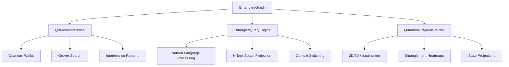

# Quantum Entangled Knowledge Graphs (QE-KGR)

<!-- Logo -->
<div align="center">
  
</div>

[](https://badge.fury.io/py/quantum-entangled-knowledge-graphs)
[](https://opensource.org/licenses/MIT)
[](https://krish567366.github.io/quantum-entangled-knowledge-graphs/)
[](https://www.python.org/downloads/)

## 🚀 World's First Open-Source Library for Quantum-Enhanced Knowledge Graph Reasoning

### Revolutionizing knowledge representation through quantum entanglement principle

---

## 🧠 What is QE-KGR?

QE-KGR (Quantum Entangled Knowledge Graph Reasoning) represents a paradigm shift in how we model and reason over complex knowledge. By applying quantum mechanics principles to graph theory, QE-KGR enables unprecedented capabilities in knowledge discovery and reasoning.

### 🌟 Key Innovations

- **🔗 Quantum Entanglement**: Nodes and edges exist in quantum superposition, enabling non-classical correlations
- **⚛️ Hilbert Space Embeddings**: Knowledge represented in complex vector spaces with quantum phases
- **🌊 Interference Patterns**: Constructive and destructive interference for enhanced reasoning
- **🎯 Quantum Walks**: Graph traversal using quantum mechanical principles
- **🔍 Grover-enhanced Search**: Quantum amplitude amplification for subgraph discovery

## 🚀 Quick Start

### Installation

```bash
pip install quantum-entangled-knowledge-graphs
```

### Basic Example

```python
import qekgr
from qekgr import EntangledGraph, QuantumInference, EntangledQueryEngine

# Create a quantum knowledge graph
graph = EntangledGraph(hilbert_dim=4)

# Add quantum nodes
alice = graph.add_quantum_node("Alice", state="physicist", 
                              metadata={"field": "quantum_computing"})
bob = graph.add_quantum_node("Bob", state="researcher",
                            metadata={"field": "ai"})

# Create entangled edge with superposed relations
graph.add_entangled_edge(alice, bob, 
                        relations=["collaborates", "co_authors"],
                        amplitudes=[0.8, 0.6])

# Quantum reasoning
inference = QuantumInference(graph)
walk_result = inference.quantum_walk(start_node="Alice", steps=10)

# Natural language queries
query_engine = EntangledQueryEngine(graph)
results = query_engine.query("Who might Alice collaborate with in AI research?")

print(f"Query confidence: {results[0].confidence_score:.3f}")
print(f"Answer path: {' -> '.join(results[0].reasoning_path)}")
```

## 🏗️ Architecture Overview



## 🔬 Scientific Foundation

QE-KGR is built on rigorous quantum mechanical and graph theoretical principles:

### Quantum State Representation

Each node $|ψ⟩$ in the graph represents a quantum state in Hilbert space $\mathcal{H}$:

$$|ψ⟩ = \sum_{i} α_i |i⟩$$

where $α_i$ are complex amplitudes and $\sum_i |α_i|^2 = 1$.

### Entanglement Tensors

Edges represent entanglement between quantum states through tensor products:

$$|ψ_{AB}⟩ = \sum_{ij} T_{ij} |i⟩_A ⊗ |j⟩_B$$

### Quantum Walks

Graph traversal follows the quantum walk operator:

$$U = S \cdot C$$

where $S$ is the shift operator and $C$ is the coin operator.

## 📚 Core Modules

### `qekgr.graphs.EntangledGraph`

- Quantum node and edge representation
- Tensor network storage
- Hilbert space operations

### `qekgr.reasoning.QuantumInference`

- Quantum walk algorithms
- Grover-enhanced search
- Entanglement entropy measurements

### `qekgr.query.EntangledQueryEngine`

- Natural language query processing
- Hilbert space projections
- Context-aware reasoning

### `qekgr.utils.QuantumGraphVisualizer`

- Interactive 2D/3D visualizations
- Entanglement strength heatmaps
- Quantum state projections

## 🎯 Applications

### 🧬 Drug Discovery

Discover hidden molecular interaction patterns through quantum entanglement analysis.

```python
# Model molecular interactions as quantum states
drug_graph = EntangledGraph()
drug_graph.add_quantum_node("Aspirin", state="anti_inflammatory")
drug_graph.add_quantum_node("Protein_COX1", state="enzyme")

# Quantum-enhanced interaction prediction
predictions = inference.interference_link_prediction("Aspirin")
```

### 🔬 Scientific Research

Find interdisciplinary connections between research fields.

```python
# Query for cross-domain insights
results = query_engine.query(
    "What quantum computing techniques could enhance drug discovery?"
)
```

### 🎯 Recommendation Systems

Quantum-enhanced collaborative filtering with entanglement-based similarities.

```python
# Discover user preference entanglements
user_similarities = inference.discover_entangled_subgraph(
    seed_nodes=["user123"], 
    min_entanglement=0.4
)
```

## 🛠️ Command Line Interface

QE-KGR includes a powerful CLI for interactive exploration:

```bash
# Display graph information
qekgr info

# Run quantum queries
qekgr query "Who collaborates with researchers in quantum AI?"

# Perform quantum walks
qekgr walk Alice --steps 10 --bias-relations "collaborates,mentors"

# Generate visualizations
qekgr visualize 3d --output quantum_graph.html

# Discover subgraphs
qekgr discover Alice,Bob --expansion-steps 3
```

## 📖 Documentation

- **[Theory](theory.md)**: Mathematical foundations and quantum mechanics
- **[API Reference](modules.md)**: Complete API documentation
- **[Tutorials](tutorials/basic_usage.md)**: Step-by-step guides
- **[Examples](examples.md)**: Real-world use cases

## 🤝 Community

- **[GitHub Discussions](https://github.com/krish567366/quantum-entangled-knowledge-graphs/discussions)**: Ask questions and share ideas
- **[Issues](https://github.com/krish567366/quantum-entangled-knowledge-graphs/issues)**: Report bugs and request features
- **[Contributing](contributing.md)**: Help improve QE-KGR

## 🏆 Why QE-KGR?

| Feature | Classical Graphs | QE-KGR |
|---------|------------------|--------|
| **Relations** | Single, deterministic | Superposed, probabilistic |
| **Reasoning** | Boolean logic | Quantum interference |
| **Discovery** | Pattern matching | Entanglement analysis |
| **Uncertainty** | Not handled | Native quantum uncertainty |
| **Correlations** | Local only | Non-local entanglement |

## 🚀 Getting Started

Ready to explore quantum-enhanced knowledge graphs?

1. **[Install QE-KGR](installation.md)**
2. **[Follow the Quick Start Guide](quickstart.md)**
3. **[Try the Examples](examples.md)**
4. **[Read the Theory](theory.md)**

---


**"In the quantum realm, knowledge is not just connected—it's entangled."** 🌌

*Built with ❤️ by [Krishna Bajpai](mailto:bajpaikrishna715@gmail.com)*
