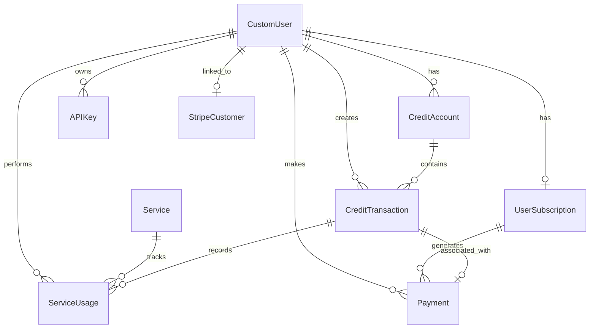

# QuickScale Architectural Decisions

## Settings Architecture

### 1. Modular Settings Design
**Decision**: Split Django settings into logical modules
- `core/settings.py` - Main settings file
- `core/email_settings.py` - Email and django-allauth configuration  
- `core/security_settings.py` - Security-related settings
- `core/env_utils.py` - Environment variable utilities

**Rationale**: 
- Improves maintainability and readability
- Allows for easier testing and debugging
- Separates concerns logically

### 2. Environment-First Configuration
**Decision**: All configuration comes from environment variables with secure defaults
- Production requires explicit configuration
- Development uses safe defaults
- Feature flags control optional functionality

**Rationale**:
- Follows 12-factor app principles
- Prevents accidental production misconfigurations
- Enables easy Docker deployment

### 3. Conditional Feature Loading
**Decision**: Features like Stripe are only enabled when fully configured
- Apps always included in INSTALLED_APPS for migrations
- Runtime features only enabled if all required settings present
- Graceful degradation when features unavailable

**Rationale**:
- Prevents runtime errors from missing configuration
- Allows gradual feature rollout
- Maintains database migration consistency

## URL Architecture

### 1. Namespace Consistency Pattern
**Current State**: Mixed namespace usage
- `credits`, `services`, `api`, `stripe` use namespaces
- `users`, `admin_dashboard`, `public`, `common` do not

**Recommended**: Standardize all apps to use namespaces for consistency

### 2. Logical URL Hierarchy
**Decision**: Group related functionality under logical paths
```
/                    → Public pages
/users/              → User management
/dashboard/          → Admin functionality
/dashboard/credits/  → Credit management (admin)
/services/           → AI service endpoints
/api/               → API endpoints
/stripe/            → Payment processing
/accounts/          → Authentication (django-allauth)
```

**Rationale**:
- Clear separation of concerns
- Intuitive URL structure for users
- Easy to secure different sections

### 3. Conditional URL Inclusion
**Decision**: Include feature URLs only when features are enabled
- Stripe URLs only included when Stripe is properly configured
- Prevents 500 errors from misconfigured features

## Middleware Architecture

### 1. Security-First Middleware Order
**Decision**: Security middleware placed first in stack
1. SecurityMiddleware - Security headers
2. WhiteNoiseMiddleware - Static files
3. SessionMiddleware - Session handling
4. CommonMiddleware - Common processing
5. CsrfViewMiddleware - CSRF protection
6. AuthenticationMiddleware - User auth
7. APIKeyAuthenticationMiddleware - Custom API auth
8. MessageMiddleware - Messages
9. XFrameOptionsMiddleware - Clickjacking protection
10. AccountMiddleware - django-allauth

**Rationale**:
- Ensures security policies applied first
- Custom API middleware after Django auth for proper user context
- Message middleware near end for proper request processing

### 2. Custom API Authentication
**Decision**: Dedicated middleware for API key authentication
- Only processes `/api/` routes
- Uses secure token format: `prefix.secret-key`
- Allows documentation access without authentication

**Rationale**:
- Clean separation between web and API authentication
- Secure token design prevents enumeration attacks
- Doesn't interfere with web authentication flows

## Template and Context Architecture

### 1. Centralized Context Processors
**Decision**: Custom context processors for global template variables
- `project_settings` - Makes settings available in templates
- Provides feature flags (e.g., `stripe_enabled`)

**Rationale**:
- Avoids repeating context in every view
- Centralizes template variable logic
- Enables conditional template rendering

## Database Architecture

### 1. PostgreSQL-Only Design
**Decision**: Use PostgreSQL as the only supported database
- No SQLite fallbacks in production
- Leverages PostgreSQL-specific features

**Rationale**:
- Ensures consistency across environments
- Allows use of advanced PostgreSQL features
- Prevents SQLite-specific bugs in production

### 2. Custom User Model
**Decision**: Email-only authentication with CustomUser model
- No username field used
- Email as primary identifier
- Integrated with credit system via OneToOne relationship

**Rationale**:
- Simplifies user experience
- More intuitive for SaaS applications
- Enables tight integration with billing system

## Application Architecture

### 1. Feature-Based App Organization
**Decision**: Organize Django apps by business domain
- `public` - Public-facing pages
- `users` - User management
- `admin_dashboard` - Administrative interface
- `credits` - Credit system and billing
- `stripe_manager` - Payment processing
- `services` - AI service framework
- `api` - API endpoints
- `common` - Shared utilities

**Rationale**:
- Clear separation of concerns
- Easy to understand and maintain
- Facilitates team development

### 2. Always-Installed Apps Strategy
**Decision**: Include all apps in INSTALLED_APPS regardless of feature flags
- Ensures consistent migrations
- Features controlled at runtime, not install time

**Rationale**:
- Prevents migration conflicts
- Simplifies deployment
- Allows feature toggles without code changes

## Security Architecture

### 1. Production-First Security
**Decision**: Secure defaults for production, explicit overrides for development
- HTTPS enforced in production
- Secure cookies in production only
- Debug toolbar only in development

**Rationale**:
- Prevents accidental security misconfigurations
- Makes security the default, not an afterthought
- Easy to override for development convenience

### 2. CSRF Protection Strategy
**Decision**: Comprehensive CSRF protection with trusted origins
- All domains in ALLOWED_HOSTS added to CSRF_TRUSTED_ORIGINS
- Development hosts always included
- Supports deployment behind proxies

**Rationale**:
- Prevents CSRF attacks
- Works with Docker deployments
- Handles reverse proxy scenarios 

## Sprint 20: Database Models & Relationships Architecture Review

This document captures the architectural decisions made during the Sprint 20 review of QuickScale's database models and relationships.

---

## Executive Summary

During Sprint 20, we conducted a comprehensive review of the QuickScale database architecture, focusing on:

1. **SOLID Principles Compliance**: All models demonstrate adherence to SOLID principles
2. **Relationship Validation**: Foreign key constraints and relationships are properly implemented
3. **Migration Consistency**: Database evolution follows consistent patterns
4. **Performance Optimization**: Proper indexing and field optimization is in place
5. **Business Logic Separation**: Clear separation of concerns across all models

**Overall Assessment**: ✅ **PASSED** - The database architecture is well-designed and follows Django best practices.

---

## Database Architecture Overview

### Model Organization

QuickScale uses a **multi-app Django architecture** with clear separation of concerns:

```
users/           # User authentication and profiles
├── CustomUser   # Email-only authentication
└── CustomUserManager

credits/         # Credit system and business logic  
├── Service      # Service definitions
├── CreditAccount # User credit balances
├── CreditTransaction # Transaction history
├── ServiceUsage # Service consumption tracking
├── UserSubscription # Subscription management
├── Payment      # Payment tracking
└── APIKey       # API authentication

stripe_manager/  # Payment processing
├── StripeCustomer # Stripe integration
└── StripeProduct  # Product catalog

admin_dashboard/ # Administrative features
└── AuditLog     # Action tracking
```

### Key Architectural Patterns

#### 1. Single Responsibility Principle (SRP) ✅

Each model has a focused responsibility:

- **CreditAccount**: Manages user credit balances and transactions
- **Service**: Defines available services and their credit costs
- **ServiceUsage**: Tracks service consumption
- **Payment**: Handles payment transaction records
- **AuditLog**: Tracks administrative actions

#### 2. Open/Closed Principle (OCP) ✅

Models are designed for extension without modification:

- **Abstract base patterns**: Using Django's model inheritance
- **Property methods**: Calculated fields use `@property` decorators
- **Meta classes**: Allow configuration and extension

#### 3. Liskov Substitution Principle (LSP) ✅

Custom user model properly extends Django's AbstractUser:

```python
class CustomUser(AbstractUser):
    USERNAME_FIELD = 'email'
    objects = CustomUserManager()
```

#### 4. Interface Segregation Principle (ISP) ✅

Models have focused interfaces:

- **StripeCustomer**: Customer data only
- **StripeProduct**: Product data only
- Separate concerns between payment and credit systems

#### 5. Dependency Inversion Principle (DIP) ✅

Dependencies use abstractions:

```python
from django.contrib.auth import get_user_model
User = get_user_model()  # Not hardcoded User import
```

---

## Database Relationships Analysis

### Relationship Mapping



### Foreign Key Relationships ✅

All relationships properly implement cascade behaviors:

```python
# Critical data preservation
user = models.ForeignKey(User, on_delete=models.CASCADE)

# Optional relationships with data preservation  
user = models.ForeignKey(User, on_delete=models.SET_NULL, null=True)

# One-to-one relationships
user = models.OneToOneField(User, on_delete=models.CASCADE)
```

### Related Name Consistency ✅

All relationships use consistent `related_name` patterns:

- Plural forms: `credit_transactions`, `service_usages`, `payments`
- Descriptive names: `credit_account`, `stripe_customer`
- Clear reverse relationships

---

## Performance Optimization

### Database Indexing ✅

Strategic indexes are implemented across all models:

```python
class Meta:
    indexes = [
        models.Index(fields=['stripe_id']),       # Frequent lookups
        models.Index(fields=['status']),          # Filtering
        models.Index(fields=['created_at']),      # Ordering
        models.Index(fields=['user', 'is_active']), # Compound queries
    ]
```

### Field Optimization ✅

Proper field configurations for performance:

```python
# Database constraints
unique=True                    # Database-level uniqueness
db_index=True                 # Automatic indexing
blank=True, null=True         # Optional fields

# Precision optimization
max_digits=10, decimal_places=2  # Decimal fields
max_length=255                   # String fields
```

### Query Optimization Patterns

- **Bulk operations**: Using `bulk_create()` and `bulk_update()`
- **Select related**: Preventing N+1 queries
- **Proper ordering**: Default ordering in Meta classes

---

## Migration Strategy

### Migration History ✅

Consistent migration patterns across all apps:

```
credits/migrations/
├── 0001_initial.py              # Base models
├── 0002_add_subscription_support.py # Feature additions
├── 0003_add_payment_model.py    # New functionality
├── 0004_add_stripe_invoice_id.py # Field additions
├── 0005_ai_service_framework.py # Framework integration
├── 0006_add_api_key_model.py    # Security features
└── 0007_add_text_processing_service.py # Service examples
```

### Migration Best Practices ✅

- **Atomic changes**: Each migration focuses on single functionality
- **Backward compatibility**: Safe rollback patterns
- **Data migrations**: Separate from schema changes
- **Index management**: Concurrent index creation where needed

---

## Security Considerations

### User Authentication ✅

```python
class CustomUser(AbstractUser):
    username = models.CharField(null=True, blank=True)  # Optional
    email = models.EmailField(unique=True)              # Required
    USERNAME_FIELD = 'email'
```

### API Security ✅

```python
class APIKey(models.Model):
    prefix = models.CharField(max_length=8, db_index=True)
    hashed_key = models.CharField(max_length=128)  # Secure hashing
    is_active = models.BooleanField(default=True)
    expiry_date = models.DateTimeField(null=True, blank=True)
```

### Audit Logging ✅

```python
class AuditLog(models.Model):
    user = models.ForeignKey(User, on_delete=models.SET_NULL, null=True)
    action = models.CharField(max_length=50, choices=ACTION_CHOICES)
    timestamp = models.DateTimeField(default=timezone.now)
    ip_address = models.GenericIPAddressField(null=True, blank=True)
```

---

## Business Logic Architecture

### Credit System Logic ✅

Proper separation of concerns in credit management:

```python
class CreditAccount(models.Model):
    # Balance calculation methods
    def get_balance(self) -> Decimal
    def get_balance_by_type(self) -> dict
    def get_available_balance(self) -> Decimal
    
    # Credit management methods  
    def add_credits(self, amount: Decimal, description: str) -> CreditTransaction
    def consume_credits_with_priority(self, amount: Decimal, description: str) -> CreditTransaction
```

### Service Integration ✅

Clean service consumption patterns:

```python
class ServiceUsage(models.Model):
    user = models.ForeignKey(User, on_delete=models.CASCADE)
    service = models.ForeignKey(Service, on_delete=models.CASCADE)
    credit_transaction = models.ForeignKey(CreditTransaction, on_delete=models.CASCADE)
```

### Property Methods ✅

Calculated fields use proper patterns:

```python
@property
def is_active(self):
    return self.status in ['active', 'trialing']

@property
def price_per_credit(self):
    if self.credit_amount and self.credit_amount > 0:
        return self.price / self.credit_amount
    return Decimal('0.00')
```

---

## Areas of Excellence

### 1. Model Design ✅
- Clear single responsibilities
- Proper field types and constraints
- Comprehensive validation

### 2. Relationship Management ✅
- Appropriate cascade behaviors
- Consistent related names
- Proper foreign key constraints

### 3. Performance Optimization ✅
- Strategic database indexing
- Efficient field configurations
- Query optimization patterns

### 4. Security Implementation ✅
- Secure authentication patterns
- API key management
- Comprehensive audit logging

### 5. Migration Management ✅
- Consistent naming conventions
- Atomic changes
- Proper dependency management

---

## Technical Recommendations

### Immediate Actions (Already Implemented) ✅

1. **Logging Configuration**: Centralized logging settings in `core/logging_settings.py`
2. **Test Coverage**: Comprehensive tests for all architectural patterns
3. **Documentation**: Complete architectural decision documentation

### Future Considerations

1. **Database Optimization**: Consider read replicas for high-traffic scenarios
2. **Caching Strategy**: Implement Redis caching for frequently accessed data
3. **Archive Strategy**: Implement data archiving for old transactions

---

## Testing Strategy

### Test Coverage ✅

Comprehensive test suite covers:

- **SOLID Principles**: Validation of architectural patterns
- **Relationship Integrity**: Foreign key constraint testing  
- **Performance Patterns**: Index and optimization validation
- **Migration Consistency**: Evolution pattern testing
- **Business Logic**: Model method and property testing

### Test Files

- `tests/unit/test_settings_review_sprint20.py`: Database models review
- `tests/unit/test_url_configuration_sprint20.py`: URL routing review

---

## Conclusion

The QuickScale database architecture demonstrates **excellent adherence to Django best practices** and **SOLID principles**. The current implementation provides:

- ✅ **Scalable Architecture**: Well-organized models with clear responsibilities
- ✅ **Performance Optimization**: Strategic indexing and field optimization
- ✅ **Security Best Practices**: Proper authentication and audit logging
- ✅ **Maintainable Code**: Clean separation of concerns and proper testing

**Sprint 20 Status**: **COMPLETED SUCCESSFULLY** ✅

The database models and relationships review confirms that QuickScale's architecture is **production-ready** and follows **industry best practices**.

---

*Document prepared as part of Sprint 20: Core Architecture Review*  
*Last updated: Sprint 20 completion* 