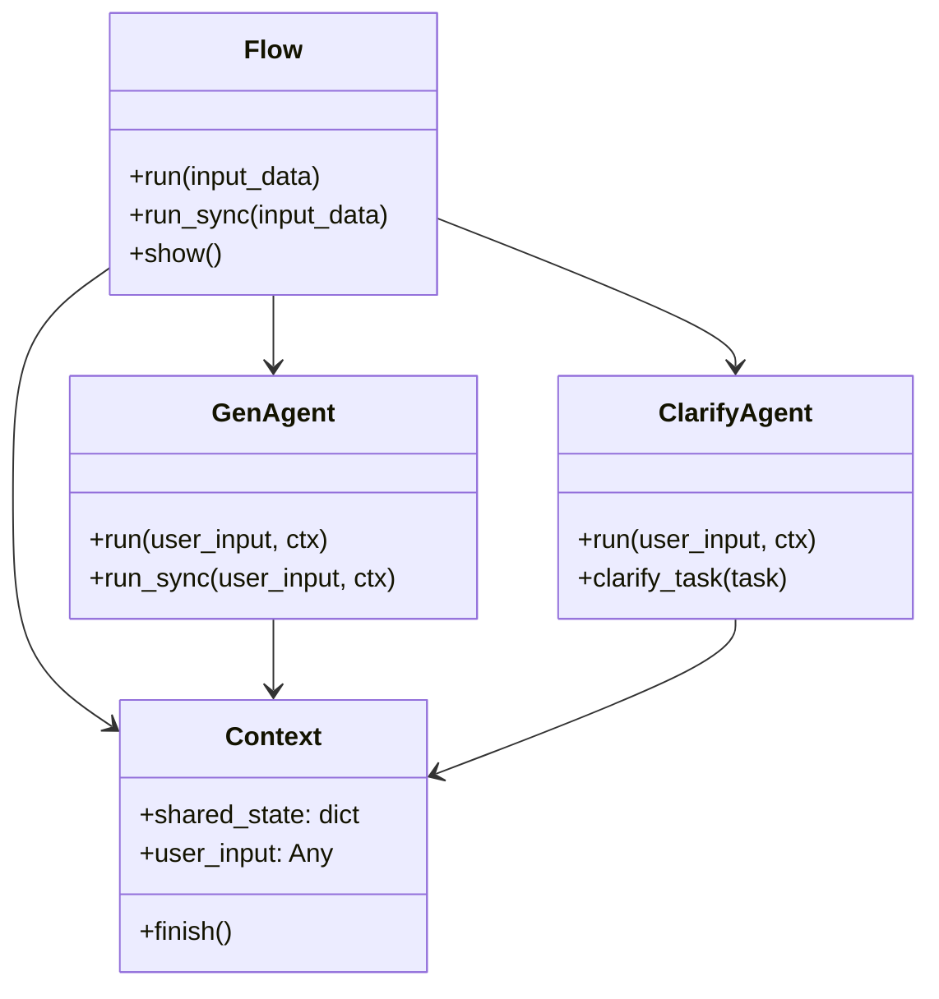

# API Reference

This page provides detailed API reference for the Refinire package's main components.

## Classes and Functions Overview

| Name                     | Type     | Description                                                 |
|--------------------------|----------|-------------------------------------------------------------|
| get_llm                  | Function | Get LLM instance from model name and provider              |
| create_simple_gen_agent  | Function | Create a simple generation agent                            |
| create_evaluated_gen_agent| Function| Create a generation agent with evaluation capabilities     |
| Flow                     | Class    | Central workflow management class                           |
| GenAgent                 | Class    | Agent class with generation and evaluation capabilities     |
| ClarifyAgent             | Class    | Interactive task clarification agent                        |
| Context                  | Class    | Context for sharing state between steps                     |
| ConsoleTracingProcessor  | Class    | Console colored trace output processor                      |
| enable_console_tracing   | Function | Enable console tracing functionality                        |
| disable_tracing          | Function | Disable all tracing functionality                           |
| AgentPipeline            | Class    | **[Deprecated]** Integrated pipeline for generation, evaluation, tools, and guardrails |

---

## Unified LLM Interface

### get_llm

Factory function for handling multiple LLM providers with a unified interface.

```python
from refinire import get_llm

# OpenAI
llm = get_llm("gpt-4o-mini")

# Anthropic Claude
llm = get_llm("claude-3-sonnet")

# Google Gemini
llm = get_llm("gemini-pro")

# Ollama (Local)
llm = get_llm("llama3.1:8b")
```

#### Parameters

| Name       | Type               | Required/Optional | Default | Description                                   |
|------------|--------------------|-------------------|---------|-----------------------------------------------|
| model      | str                | Required          | -       | LLM model name to use                         |
| provider   | str                | Optional          | None    | Model provider name (auto-inferred if None)  |
| temperature| float              | Optional          | 0.3     | Sampling temperature (0.0-2.0)               |
| api_key    | str                | Optional          | None    | Provider API key                              |
| base_url   | str                | Optional          | None    | Provider API base URL                         |
| thinking   | bool               | Optional          | False   | Claude model thinking mode                    |
| tracing    | bool               | Optional          | False   | Enable Agents SDK tracing                     |

#### Returns
- **LLM Instance**: LLM object for the specified provider

#### Supported Models

**OpenAI**
- gpt-4o, gpt-4o-mini
- gpt-4-turbo, gpt-4
- gpt-3.5-turbo

**Anthropic Claude**
- claude-3-5-sonnet-20241022
- claude-3-sonnet, claude-3-haiku
- claude-3-opus

**Google Gemini**
- gemini-pro, gemini-pro-vision
- gemini-1.5-pro, gemini-1.5-flash

**Ollama**
- llama3.1:8b, llama3.1:70b
- mistral:7b
- codellama:7b

---

## Agent Creation Functions

### create_simple_gen_agent

Creates a simple generation agent.

```python
from refinire import create_simple_gen_agent

agent = create_simple_gen_agent(
    name="assistant",
    instructions="You are a helpful assistant.",
    model="gpt-4o-mini"
)
```

#### Parameters

| Name         | Type  | Required/Optional | Default | Description                    |
|--------------|-------|-------------------|---------|--------------------------------|
| name         | str   | Required          | -       | Agent name                     |
| instructions | str   | Required          | -       | System prompt                  |
| model        | str   | Required          | -       | Model name to use              |
| tools        | list  | Optional          | None    | List of available tools        |

### create_evaluated_gen_agent

Creates a generation agent with evaluation capabilities.

```python
from refinire import create_evaluated_gen_agent

agent = create_evaluated_gen_agent(
    name="quality_assistant",
    generation_instructions="Generate helpful responses.",
    evaluation_instructions="Evaluate accuracy and usefulness.",
    threshold=80.0,
    model="gpt-4o-mini"
)
```

#### Parameters

| Name                      | Type  | Required/Optional | Default | Description                    |
|---------------------------|-------|-------------------|---------|--------------------------------|
| name                      | str   | Required          | -       | Agent name                     |
| generation_instructions   | str   | Required          | -       | Generation system prompt       |
| evaluation_instructions   | str   | Required          | -       | Evaluation system prompt       |
| threshold                 | float | Required          | -       | Quality threshold (0-100)      |
| model                     | str   | Required          | -       | Model name to use              |
| tools                     | list  | Optional          | None    | List of available tools        |

---

## Flow/Step Architecture

### Flow

Central workflow management class. Create complex processing flows by combining multiple steps.

```python
from refinire import Flow, FunctionStep
import asyncio

# Simple Flow
flow = Flow(steps=gen_agent)

# Multi-step Flow
flow = Flow([
    ("step1", FunctionStep("step1", func1)),
    ("step2", FunctionStep("step2", func2))
])

# Execute
result = asyncio.run(flow.run(input_data="input data"))
```

#### Main Methods

| Method Name   | Parameters                                    | Return Value        | Description                      |
|---------------|-----------------------------------------------|---------------------|----------------------------------|
| run           | input_data: Any                               | Context            | Execute workflow asynchronously  |
| run_sync      | input_data: Any                               | Context            | Execute workflow synchronously   |
| run_streamed  | input_data: Any, callback: Callable = None   | AsyncIterator[str] | Stream workflow output in real-time |
| show          | -                                             | None               | Visualize workflow structure     |

#### Flow Streaming

Flows support streaming output from steps that generate streaming content (like RefinireAgent):

```python
from refinire import Flow, FunctionStep, RefinireAgent

# Create flow with streaming-enabled agent
flow = Flow({
    "analyze": FunctionStep("analyze", analyze_function),
    "generate": RefinireAgent(
        name="generator",
        generation_instructions="Generate detailed content",
        model="gpt-4o-mini"
    )
})

# Stream entire flow output
async for chunk in flow.run_streamed("Create technical documentation"):
    print(chunk, end="", flush=True)
```

**Flow Streaming Behavior:**
- Only streaming-enabled steps (like RefinireAgent) produce chunks
- Non-streaming steps execute normally without chunks
- Context and state are preserved throughout streaming
- Mixed streaming/non-streaming workflows are supported

### Context

Context class for sharing state between steps.

```python
from refinire import Context

ctx = Context()
ctx.shared_state["key"] = "value"
ctx.finish()  # End workflow
```

#### Main Attributes and Methods

| Name           | Type         | Description                    |
|----------------|--------------|--------------------------------|
| shared_state   | dict         | State shared between steps     |
| user_input     | Any          | User input data                |
| finish()       | Method       | Signal workflow completion     |

---

## Agent Classes

### GenAgent

Agent class with generation and evaluation capabilities. Can be used as a step within Flow.

```python
from refinire.agents import GenAgent

agent = GenAgent(
    name="generator",
    generation_instructions="Generate text.",
    evaluation_instructions="Evaluate quality.",
    model="gpt-4o-mini",
    threshold=75.0
)
```

#### Main Methods

| Method Name | Parameters                      | Return Value  | Description                    |
|-------------|---------------------------------|---------------|--------------------------------|
| run         | user_input: str, ctx: Context   | Context       | Execute agent asynchronously   |
| run_sync    | user_input: str, ctx: Context   | Context       | Execute agent synchronously    |

### RefinireAgent

Advanced AI agent with built-in evaluation, tool integration, and streaming capabilities. The main agent class for production use.

```python
from refinire import RefinireAgent

agent = RefinireAgent(
    name="assistant",
    generation_instructions="You are a helpful assistant providing clear, accurate information.",
    evaluation_instructions="""Evaluate response quality on a scale of 0-100 based on:
    - Accuracy and factual correctness (0-25 points)
    - Clarity and comprehensibility (0-25 points)
    - Helpfulness and relevance (0-25 points)
    - Completeness and thoroughness (0-25 points)
    
    Provide your evaluation as:
    Score: [0-100]
    Comments:
    - [Specific strengths of the response]
    - [Areas needing improvement]
    - [Suggestions for enhancement]""",
    model="gpt-4o-mini",
    threshold=85.0,
    max_retries=3
)
```

#### Main Methods

| Method Name   | Parameters                                    | Return Value        | Description                      |
|---------------|-----------------------------------------------|---------------------|----------------------------------|
| run           | user_input: str, ctx: Context = None         | LLMResult          | Execute agent synchronously      |
| run_async     | user_input: str, ctx: Context = None         | LLMResult          | Execute agent asynchronously     |
| run_streamed  | user_input: str, ctx: Context = None, callback: Callable = None | AsyncIterator[str] | Stream response chunks in real-time |

#### Streaming Parameters

| Parameter | Type                  | Required/Optional | Default | Description                                |
|-----------|-----------------------|-------------------|---------|-------------------------------------------|
| user_input| str                   | Required          | -       | Input text to process                     |
| ctx       | Context               | Optional          | None    | Context for conversation state            |
| callback  | Callable[[str], None] | Optional          | None    | Function to process each chunk            |

#### Streaming Usage Examples

**Basic Streaming:**
```python
async for chunk in agent.run_streamed("Explain quantum computing"):
    print(chunk, end="", flush=True)
```

**Streaming with Callback:**
```python
def process_chunk(chunk: str):
    # Custom processing: save to file, send to websocket, etc.
    print(f"Received: {chunk}")

async for chunk in agent.run_streamed("Generate content", callback=process_chunk):
    print(chunk, end="", flush=True)
```

**Context-Aware Streaming:**
```python
from refinire import Context

ctx = Context()
async for chunk in agent.run_streamed("Hello", ctx=ctx):
    print(chunk, end="", flush=True)

# Continue conversation with context
async for chunk in agent.run_streamed("Continue our discussion", ctx=ctx):
    print(chunk, end="", flush=True)
```

#### Structured Output Streaming

When using structured output (Pydantic models) with streaming, responses are delivered as **JSON chunks**, not parsed objects:

```python
from pydantic import BaseModel

class Article(BaseModel):
    title: str
    content: str

agent = RefinireAgent(
    name="writer",
    generation_instructions="Write articles",
    output_model=Article
)

# Streams JSON chunks: {"title": "...", "content": "..."}
async for json_chunk in agent.run_streamed("Write about AI"):
    print(json_chunk, end="", flush=True)

# For parsed objects, use regular methods:
result = await agent.run_async("Write about AI")
article = result.content  # Returns Article object
```

#### Evaluation System

RefinireAgent includes a built-in evaluation system that automatically assesses content quality and triggers regeneration when quality thresholds aren't met.

**Evaluation Output Format:**

The evaluation system expects responses in this exact format:
```
Score: 87
Comments:
- Excellent technical accuracy and comprehensive coverage
- Clear structure with logical flow
- Strong use of practical examples
- Could benefit from more visual diagrams
- Consider adding troubleshooting section
```

**Evaluation Parameters:**

| Parameter | Type | Default | Description |
|-----------|------|---------|-------------|
| evaluation_instructions | str | None | Instructions for quality evaluation |
| threshold | float | 70.0 | Minimum score required (0-100) |
| max_retries | int | 3 | Maximum regeneration attempts |

**Accessing Evaluation Results:**

```python
# Basic evaluation access
result = agent.run("Create technical content")
score = result.evaluation_score  # Integer 0-100

# Detailed evaluation with Context
from refinire import Context
ctx = Context()
result = agent.run("Create technical content", ctx)

eval_data = ctx.evaluation_result
score = eval_data["score"]           # 87
passed = eval_data["passed"]         # True/False
feedback = eval_data["feedback"]     # Complete evaluation text
comments = eval_data["comments"]     # Parsed comment list
```

**Best Practices for Evaluation Instructions:**

1. **Use 100-point scoring scale** with clear point distributions
2. **Provide specific criteria** for each scoring dimension
3. **Request structured feedback** with comment lists
4. **Include actionable suggestions** for improvement

Example comprehensive evaluation instruction:
```python
evaluation_instructions="""Evaluate content quality (0-100):
- Technical accuracy (0-30 points): Factual correctness and precision
- Clarity (0-30 points): Clear communication and understanding  
- Structure (0-25 points): Logical organization and flow
- Completeness (0-15 points): Comprehensive coverage

Score: [0-100]
Comments:
- [Strengths with specific examples]
- [Improvement areas with suggestions]
- [Enhancement recommendations]"""
```

### ClarifyAgent

Interactive task clarification agent. Asks questions to clarify unclear requests.

```python
from refinire.agents import ClarifyAgent

agent = ClarifyAgent(
    name="clarifier",
    instructions="Clarify user requirements.",
    model="gpt-4o-mini"
)
```

---

## Tracing Functionality

### enable_console_tracing

Enable colored console tracing.

```python
from refinire import enable_console_tracing

enable_console_tracing()
```

### disable_tracing

Disable all tracing functionality.

```python
from refinire import disable_tracing

disable_tracing()
```

### ConsoleTracingProcessor

Class for custom trace processing.

```python
from refinire.tracing import ConsoleTracingProcessor

processor = ConsoleTracingProcessor(
    output_stream="console",
    simple_mode=True
)
```

---

## Deprecated APIs

### AgentPipeline (Deprecated)

⚠️ **Important**: `AgentPipeline` will be removed in v0.1.0. Use `GenAgent + Flow` for new code.

```python
# Deprecated - Do not use in new code
from refinire import AgentPipeline

pipeline = AgentPipeline(
    name="example",
    generation_instructions="Generate text.",
    evaluation_instructions="Evaluate quality.",
    model="gpt-4o-mini",
    threshold=80
)
```

---

## Architecture Diagram



## Usage Examples

### Basic Usage Pattern

```python
from refinire import create_simple_gen_agent, Flow, Context
import asyncio

# 1. Create agent
agent = create_simple_gen_agent(
    name="assistant",
    instructions="Respond as a helpful assistant.",
    model="gpt-4o-mini"
)

# 2. Create flow
flow = Flow(steps=agent)

# 3. Execute
async def main():
    result = await flow.run(input_data="Hello")
    print(result.shared_state["assistant_result"])

asyncio.run(main())
```

### Complex Workflow Example

```python
from refinire import Flow, FunctionStep, create_evaluated_gen_agent
import asyncio

def preprocess(user_input: str, ctx: Context) -> Context:
    ctx.shared_state["processed_input"] = user_input.strip().lower()
    return ctx

agent = create_evaluated_gen_agent(
    name="analyzer",
    generation_instructions="Analyze the input.",
    evaluation_instructions="Evaluate analysis accuracy.",
    threshold=80.0,
    model="gpt-4o-mini"
)

def postprocess(user_input: str, ctx: Context) -> Context:
    result = ctx.shared_state.get("analyzer_result", "")
    ctx.shared_state["final_result"] = f"Final result: {result}"
    ctx.finish()
    return ctx

flow = Flow([
    ("preprocess", FunctionStep("preprocess", preprocess)),
    ("analyze", agent),
    ("postprocess", FunctionStep("postprocess", postprocess))
])

async def main():
    result = await flow.run(input_data="  Analyze this text  ")
    print(result.shared_state["final_result"])

asyncio.run(main())
```

## ContextProvider Interface

| Class/Method         | Description (EN)                                                                 | Arguments / Returns                |
|---------------------|--------------------------------------------------------------------------------|------------------------------------|
| `ContextProvider`   | Abstract base for all context providers.                                        |                                    |
| `provider_name`     | Provider name (class variable).                                                | `str`                              |
| `get_config_schema` | Returns config schema for the provider.                                        | `classmethod` → `Dict[str, Any]`   |
| `from_config`       | Instantiates provider from config dict.                                         | `classmethod` → instance           |
| `get_context`       | Returns context string for a query.                                            | `query: str, previous_context: Optional[str], **kwargs` → `str` |
| `update`            | Updates provider state with new interaction.                                   | `interaction: Dict[str, Any]`      |
| `clear`             | Clears provider state.                                                         |                                    |

---

## Built-in Providers

### ConversationHistoryProvider

Manages conversation history.

**Configuration Example:**
```python
{
    "type": "conversation_history",
    "max_items": 10
}
```

**Parameters:**
- `max_items` (int): Maximum number of messages to keep (default: 10)

### FixedFileProvider

Always provides content from specified files.

**Configuration Example:**
```python
{
    "type": "fixed_file",
    "file_path": "config.yaml",
    "encoding": "utf-8",
    "check_updates": True
}
```

**Parameters:**
- `file_path` (str, required): Path to the file to read
- `encoding` (str): File encoding (default: "utf-8")
- `check_updates` (bool): Whether to check for file updates (default: True)

### SourceCodeProvider

Automatically searches for source code related to user questions.

**Configuration Example:**
```python
{
    "type": "source_code",
    "base_path": ".",
    "max_files": 5,
    "max_file_size": 1000,
    "file_extensions": [".py", ".js", ".ts"],
    "include_patterns": ["src/**/*"],
    "exclude_patterns": ["tests/**/*"]
}
```

**Parameters:**
- `base_path` (str): Base directory path for codebase analysis (default: ".")
- `max_files` (int): Maximum number of files to include in context (default: 50)
- `max_file_size` (int): Maximum file size in bytes to read (default: 10000)
- `file_extensions` (list): List of file extensions to include
- `include_patterns` (list): List of patterns to include
- `exclude_patterns` (list): List of patterns to exclude

### CutContextProvider

Compresses context to specified length.

**Configuration Example:**
```python
{
    "type": "cut_context",
    "provider": {
        "type": "source_code",
        "max_files": 10,
        "max_file_size": 2000
    },
    "max_chars": 3000,
    "max_tokens": None,
    "cut_strategy": "middle",
    "preserve_sections": True
}
```

**Parameters:**
- `provider` (dict, required): Configuration for the wrapped context provider
- `max_chars` (int): Maximum character count (None for no limit)
- `max_tokens` (int): Maximum token count (None for no limit)
- `cut_strategy` (str): How to cut the context ("start", "end", "middle") (default: "end")
- `preserve_sections` (bool): Whether to preserve complete sections when cutting (default: True)

---

## RefinireAgent Extensions

| Class/Method         | Description (EN)                                                                 | Arguments / Returns                |
|---------------------|--------------------------------------------------------------------------------|------------------------------------|
| `context_providers_config` | List/dict/YAML string for context provider config.                | `List[dict]`/`str`                 |
| `get_context_provider_schemas` | Returns schemas for all available providers.                   | `classmethod` → `Dict[str, Any]`   |
| `clear_context`     | Clears all context providers.                                                  |                                    |

---

## Example: Using SourceCodeProvider

```python
from refinire.agents.context_provider_factory import ContextProviderFactory

config = {
    "type": "source_code",
    "base_path": "src",
    "max_files": 5
}
provider = ContextProviderFactory.create_provider(config)
context = provider.get_context("How does the pipeline work?")
print(context)
```

---

## Example: YAML-like Multi-provider

```yaml
- conversation_history:
    max_items: 5
- source_code:
    base_path: src
    max_files: 3
- cut_context:
    provider:
      type: conversation_history
      max_items: 10
    max_chars: 4000
    cut_strategy: end
```

---

## See Also
- `docs/api_reference_ja.md` (Japanese)
- `docs/context_management.md` (Design)
- `examples/context_management_example.py` (Usage)

