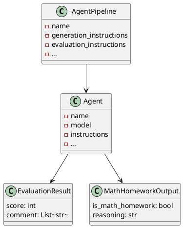

# アーキテクチャ設計書

## システム構成・アーキテクチャの概要

本システムはレイヤーアーキテクチャを採用し、以下のような構成となっています。

- UI/利用例層（examples/）
- ユースケース層（AgentPipelineクラス）
- 機能クラス層（ツール関数、ガードレール関数、評価関数など）
- データクラス層（pydanticモデル、dataclass等）
- ゲートウェイ層（get_llm等のモデル取得）
- ユーティリティ層（設定、ログ等）

## 主要インターフェース
| クラス名 | 役割 | レイヤー |
|---|---|---|
| AgentPipeline | ワークフロー統合・実行 | ユースケース |
| Agent | LLMエージェント | 機能/ユースケース |
| function_toolで定義した関数 | ツールとして利用 | 機能 |
| input_guardrailで定義した関数 | 入力ガードレール | 機能 |
| get_llm | モデル取得 | ゲートウェイ |
| pydantic.BaseModel | 構造化出力 | データ |

## 主要データ（データの種類、構造）
| クラス名 | 保持データ |
|---|---|
| EvaluationResult | score, comment |
| MathHomeworkOutput | is_math_homework, reasoning |

### ER図（PlantUML）

---

## 参考
- 詳細な事例・使い方は [docs/pipeline_examples.md](pipeline_examples.md) を参照。 