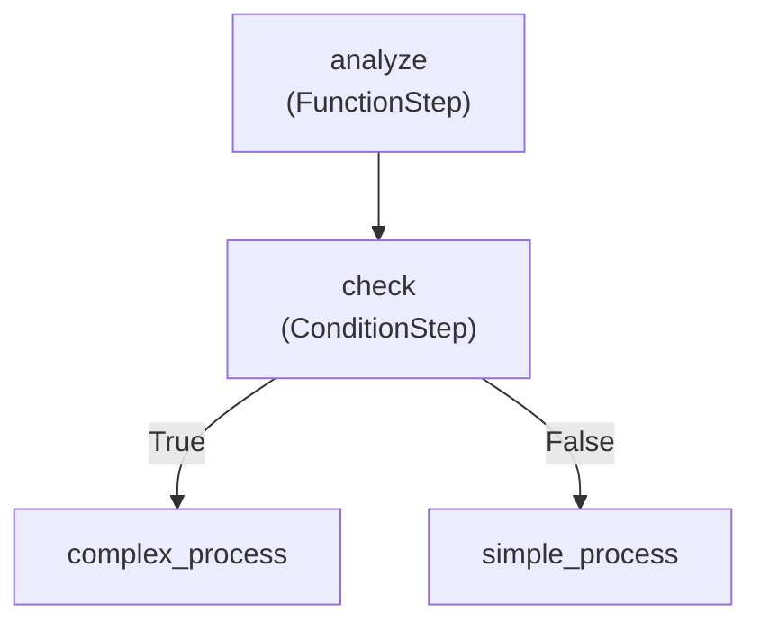

# Refinire Flow Complete Guide - From Basics to Advanced

This guide provides a systematic learning path for Refinire's Flow functionality, from basic concepts to advanced production-ready systems. Following this step-by-step approach, you'll be able to build everything from simple workflows to complex enterprise-grade systems.

## 📚 Table of Contents

1. [Basics: Flow Concepts and Core Structure](#basics)
2. [Intermediate: Complex Workflows and Agent Integration](#intermediate)
3. [Advanced: Production-Ready Flow Design Patterns](#advanced)

---

## Basics: Flow Concepts and Core Structure

### 1.1 What is a Flow?

A Flow is a workflow engine that executes multiple tasks in a chained manner. Unlike traditional procedural programming, Flows allow you to define workflows using a **declarative structure**.

#### Traditional Approach vs Flow Approach

```python
# Traditional approach (LangGraph style)
from langgraph.graph import StateGraph
from langchain.chat_models import ChatOpenAI
from langchain.schema import HumanMessage
from typing import TypedDict

class WorkflowState(TypedDict):
    user_input: str
    analysis: str
    advice: str
    final_message: str

def analyze_step(state: WorkflowState):
    llm = ChatOpenAI(model="gpt-4o-mini")
    response = llm.invoke([HumanMessage(content=f"Please analyze: {state['user_input']}")])
    state["analysis"] = response.content
    return state

def advice_step(state: WorkflowState):
    llm = ChatOpenAI(model="gpt-4o-mini")
    response = llm.invoke([
        HumanMessage(content=f"Previous analysis: {state['analysis']}"),
        HumanMessage(content="Please provide advice based on this analysis")
    ])
    state["advice"] = response.content
    return state

def encourage_step(state: WorkflowState):
    llm = ChatOpenAI(model="gpt-4o-mini")
    response = llm.invoke([
        HumanMessage(content=f"Analysis: {state['analysis']}"),
        HumanMessage(content=f"Advice: {state['advice']}"),
        HumanMessage(content="Please create an encouraging message based on these")
    ])
    state["final_message"] = response.content
    return state

# Graph construction
workflow = StateGraph(WorkflowState)
workflow.add_node("analyze", analyze_step)
workflow.add_node("advice", advice_step)
workflow.add_node("encourage", encourage_step)
workflow.add_edge("analyze", "advice")
workflow.add_edge("advice", "encourage")
workflow.set_entry_point("analyze")
workflow.set_finish_point("encourage")

app = workflow.compile()

def traditional_ai_workflow(user_input):
    result = app.invoke({"user_input": user_input})
    return result["final_message"]

# Refinire Flow approach (declarative)
from refinire import Flow, RefinireAgent

analyzer = RefinireAgent(
    name="analyzer",
    generation_instructions="Analyze the input in detail",
    model="gpt-4o-mini"
)

advisor = RefinireAgent(
    name="advisor", 
    generation_instructions="Provide specific advice based on the analysis results",
    model="gpt-4o-mini"
)

encourager = RefinireAgent(
    name="encourager",
    generation_instructions="Create an encouraging message based on the analysis and advice",
    model="gpt-4o-mini"
)

flow = Flow({
    "analyze": analyzer,
    "advise": advisor, 
    "encourage": encourager
})

result = await flow.run(user_input)
```

#### Key Benefits of Flows

1. **Readability**: Workflow structure is immediately understandable
2. **Maintainability**: Easy to add, remove, or modify steps
3. **Reusability**: Steps can be reused across different Flows
4. **Monitoring**: Track execution status of each step
5. **Parallel Processing**: Automatically execute independent tasks in parallel

### 1.2 Building Basic Flows

#### Step 1: Import Required Components

```python
from refinire import Flow, RefinireAgent
import asyncio
```

#### Step 2: Create Your First Flow - Sequential RefinireAgent Execution

```python
# Flow with multiple RefinireAgents executing sequentially
first_agent = RefinireAgent(
    name="greeter",
    generation_instructions="Greet the user in a friendly manner",
    model="gpt-4o-mini"
)

second_agent = RefinireAgent(
    name="analyzer", 
    generation_instructions="Based on the previous response, provide suitable advice for that user",
    model="gpt-4o-mini"
)

# Basic Flow definition
simple_flow = Flow({
    "greet": first_agent,
    "advice": second_agent
})

# Flow execution
async def run_simple_example():
    result = await simple_flow.run("Alice")
    print(f"Final result: {result}")

# Execute
asyncio.run(run_simple_example())
```

In this example:
1. **first_agent** greets the user
2. **second_agent** provides additional advice based on the greeting
3. Two RefinireAgents execute **sequentially**

### 1.3 Three-Stage RefinireAgent Collaboration

Let's look at a more complex example with three RefinireAgents working together.

```python
# Stage 1: User information analysis
analyzer_agent = RefinireAgent(
    name="analyzer",
    generation_instructions="Analyze personality and characteristics from the user's name. Keep your response concise.",
    model="gpt-4o-mini"
)

# Stage 2: Recommendation suggestions
recommender_agent = RefinireAgent(
    name="recommender",
    generation_instructions="Based on the analysis results, suggest recommended activities or hobbies for this user.",
    model="gpt-4o-mini"
)

# Stage 3: Encouraging message
encourager_agent = RefinireAgent(
    name="encourager",
    generation_instructions="Create a warm, encouraging message based on the analysis and recommendations provided.",
    model="gpt-4o-mini"
)

# Three-stage collaboration Flow
three_step_flow = Flow({
    "analyze": analyzer_agent,
    "recommend": recommender_agent,
    "encourage": encourager_agent
})

async def run_three_step_example():
    result = await three_step_flow.run("Sakura")
    print(f"Final encouraging message: {result}")

# Execute
asyncio.run(run_three_step_example())
```

In this example:
1. **analyzer_agent** analyzes characteristics from the user's name
2. **recommender_agent** suggests recommendations based on the analysis
3. **encourager_agent** creates an encouraging message considering everything

Each agent's output becomes the input for the next agent, allowing the **content to deepen progressively**.

### 1.4 Basic Conditional Branching

Use ConditionStep to dynamically change flow routes.

```python
def check_age_category(ctx):
    """Check age category"""
    age = ctx.shared_state.get("age", 0)
    return age >= 18  # True if 18 or older, False if younger

def set_age(data, ctx):
    """Set age"""
    ctx.shared_state["age"] = int(data)
    return f"Set age to {data}"

def adult_response(data, ctx):
    """Adult response"""
    return "You can access adult services"

def minor_response(data, ctx):
    """Minor response"""
    return "Please use services for minors"

# Conditional branching Flow
condition_flow = Flow({
    "set_age": FunctionStep("set_age", set_age),
    "age_check": ConditionStep("age_check", check_age_category, "adult", "minor"),
    "adult": FunctionStep("adult", adult_response),
    "minor": FunctionStep("minor", minor_response)
})

async def run_condition_example():
    # Adult case
    result1 = await condition_flow.run("25")
    print(f"25-year-old result: {result1}")
    
    # Minor case
    result2 = await condition_flow.run("15")
    print(f"15-year-old result: {result2}")
```

### 1.5 Basics Summary and Practice Exercise

#### What You've Learned in Basics
- Basic Flow concepts and differences from traditional approaches
- How to use FunctionStep and ConditionStep
- Data sharing using Context
- Implementing basic conditional branching

#### Practice Exercise

```python
# Exercise: Create a Flow that meets the following requirements
# 1. Accept user input
# 2. Determine if input is a number
# 3. If number: determine even/odd and return message
# 4. If not number: return error message

def is_number(ctx):
    """Determine if input is a number"""
    try:
        int(ctx.result)
        return True
    except ValueError:
        return False

def check_even_odd(data, ctx):
    """Check if even or odd"""
    num = int(data)
    if num % 2 == 0:
        return f"{num} is even"
    else:
        return f"{num} is odd"

def error_response(data, ctx):
    """Error response"""
    return f"'{data}' is not a valid number"

# Practice Flow (solution example)
practice_flow = Flow({
    "validate": ConditionStep("validate", is_number, "process", "error"),
    "process": FunctionStep("process", check_even_odd),
    "error": FunctionStep("error", error_response)
})
```

### 1.6 Flow Visualization with show()

Understanding and debugging complex flows becomes much easier when you can visualize them. Refinire provides a powerful `show()` method that generates both text-based and graphical representations of your flows.

#### Basic Flow Visualization

```python
from refinire import Flow, FunctionStep, ConditionStep

def analyze_input(ctx):
    return f"Analyzed: {ctx.result}"

def is_complex(ctx):
    return len(str(ctx.result)) > 10

# Create a flow for demonstration
demo_flow = Flow(start="analyze", steps={
    "analyze": FunctionStep("analyze", analyze_input, next_step="check"),
    "check": ConditionStep("check", is_complex, "complex_process", "simple_process"),
    "complex_process": FunctionStep("complex_process", lambda ctx: "Complex processing complete"),
    "simple_process": FunctionStep("simple_process", lambda ctx: "Simple processing complete")
})

# Display flow structure in text format
print("=== Flow Structure (Text) ===")
print(demo_flow.show(format="text"))

# Display flow structure in Mermaid format
print("\n=== Flow Structure (Mermaid) ===")
print(demo_flow.show(format="mermaid"))
```

**Expected Output:**

```
=== Flow Structure (Text) ===
Flow Diagram:
==================================================
→ analyze (FunctionStep)
  → check (ConditionStep)
    True → complex_process
    False → simple_process
    → complex_process (FunctionStep)
    → simple_process (FunctionStep)

=== Flow Structure (Mermaid) ===
graph TD
    analyze["analyze<br/>(FunctionStep)"]:::start
    analyze --> check
    check["check<br/>(ConditionStep)"]:::condition
    check -->|"True"| complex_process
    check -->|"False"| simple_process
    complex_process["complex_process<br/>(FunctionStep)"]
    simple_process["simple_process<br/>(FunctionStep)"]
```

#### Visualization Formats

**Text Format** (`format="text"`):
- Perfect for console debugging and quick inspection
- Shows hierarchical structure with indentation
- Displays step types and routing information
- Ideal for development and troubleshooting

**Mermaid Format** (`format="mermaid"`):
- Generates Mermaid.js flowchart code
- Can be rendered in GitHub, GitLab, Notion, and other platforms
- Professional documentation and presentations
- Copy-paste ready for markdown files

#### Visualizing Different Flow Types

```python
# 1. Sequential Flow Visualization
sequential_flow = Flow(steps=[
    FunctionStep("step1", lambda ctx: "Step 1 complete"),
    FunctionStep("step2", lambda ctx: "Step 2 complete"),
    FunctionStep("step3", lambda ctx: "Step 3 complete")
])

print("Sequential Flow:")
print(sequential_flow.show(format="text"))

# 2. Single Step Flow Visualization
from refinire import RefinireAgent

single_flow = Flow(steps=RefinireAgent(
    name="assistant",
    generation_instructions="You are a helpful assistant",
    model="gpt-4o-mini"
))

print("\nSingle Step Flow:")
print(single_flow.show(format="text"))

# 3. Parallel Processing Visualization
parallel_flow = Flow(start="input", steps={
    "input": FunctionStep("input", lambda ctx: ctx.result, next_step="parallel"),
    "parallel": {
        "parallel": [
            RefinireAgent(name="agent1", generation_instructions="Analyze from perspective A", model="gpt-4o-mini"),
            RefinireAgent(name="agent2", generation_instructions="Analyze from perspective B", model="gpt-4o-mini")
        ],
        "next_step": "combine",
        "max_workers": 2
    },
    "combine": FunctionStep("combine", lambda ctx: "Combined results")
})

print("\nParallel Processing Flow:")
print(parallel_flow.show(format="mermaid"))
```

#### Execution History Visualization

After running a flow, you can visualize the actual execution path:

```python
# Run the flow first
result = await demo_flow.run("This is a test input for the flow")

# Show flow with execution history
print("=== Flow with Execution History ===")
print(demo_flow.show(format="text", include_history=True))

# Mermaid format with execution highlighting
print("\n=== Mermaid with Execution Path ===")
print(demo_flow.show(format="mermaid", include_history=True))
```

The execution history will highlight:
- Which steps were actually executed
- The order of execution
- Timestamps for each step
- Visual path highlighting in Mermaid diagrams

#### Best Practices for Flow Visualization

1. **Development Phase**:
   - Use `format="text"` for quick console inspection
   - Check flow structure before implementation
   - Verify conditional branches and routing

2. **Documentation Phase**:
   - Use `format="mermaid"` for documentation
   - Include in README files and technical specs
   - Share with team members for review

3. **Debugging Phase**:
   - Use `include_history=True` after execution
   - Identify which paths are taken
   - Debug unexpected routing behavior

4. **Production Monitoring**:
   - Generate flow diagrams for operational documentation
   - Track execution patterns and bottlenecks
   - Visualize complex business processes

#### Integration with External Tools

**Mermaid Live Editor**: Copy the Mermaid output to [https://mermaid.live/](https://mermaid.live/) for interactive editing and export.

**GitHub/GitLab**: Mermaid diagrams render automatically in markdown files:

````markdown

````

**Documentation Tools**: Most modern documentation platforms support Mermaid rendering (Notion, Obsidian, GitBook, etc.).

---

## Intermediate: Complex Workflows and Agent Integration

### 2.1 Integrating RefinireAgent with Flows

RefinireAgent can be integrated into Flows as intelligent steps that leverage LLMs.

#### Basic RefinireAgent Integration

```python
from refinire import RefinireAgent

# Simple RefinireAgent
simple_agent = RefinireAgent(
    name="assistant",
    generation_instructions="Answer user questions helpfully",
    model="gpt-4o-mini"
)

# Integrate Agent into Flow
agent_flow = Flow({
    "preprocess": FunctionStep("preprocess", lambda data, ctx: f"Question: {data}"),
    "ai_response": simple_agent,
    "postprocess": FunctionStep("postprocess", lambda data, ctx: f"Answer: {data}")
})

async def run_agent_example():
    result = await agent_flow.run("What are the features of Python?")
    print(result)
```

#### RefinireAgent with Evaluation

```python
# Agent with evaluation functionality
quality_agent = RefinireAgent(
    name="quality_assistant",
    generation_instructions="Generate high-quality, detailed responses",
    evaluation_instructions="Evaluate response quality from 0-100. Focus on comprehensiveness, accuracy, and clarity",
    threshold=80.0,
    max_retries=2,
    model="gpt-4o-mini"
)

def check_quality_score(ctx):
    """Branch based on quality score"""
    if hasattr(ctx, 'evaluation_result') and ctx.evaluation_result:
        return ctx.evaluation_result.get('score', 0) >= 85
    return False

def high_quality_response(data, ctx):
    """High quality response processing"""
    score = ctx.evaluation_result.get('score', 0)
    return f"High quality response (Score: {score})\nResponse: {data}"

def standard_response(data, ctx):
    """Standard response processing"""
    score = ctx.evaluation_result.get('score', 0) if ctx.evaluation_result else 0
    return f"Standard response (Score: {score})\nResponse: {data}"

# Flow with quality check
quality_flow = Flow({
    "generate": quality_agent,
    "quality_check": ConditionStep("quality_check", check_quality_score, "high_quality", "standard"),
    "high_quality": FunctionStep("high_quality", high_quality_response),
    "standard": FunctionStep("standard", standard_response)
})
```

### 2.2 Parallel Processing and Performance Optimization

Execute independent tasks in parallel for significant performance improvements.

#### Basic Parallel Processing

```python
def analyze_sentiment(data, ctx):
    """Sentiment analysis (mock)"""
    import time
    time.sleep(1)  # Simulate processing time
    return f"Sentiment: Positive (Input: {data[:20]}...)"

def extract_keywords(data, ctx):
    """Keyword extraction (mock)"""
    import time
    time.sleep(1)  # Simulate processing time
    return f"Keywords: Python, AI, Machine Learning (Input: {data[:20]}...)"

def classify_category(data, ctx):
    """Category classification (mock)"""
    import time
    time.sleep(1)  # Simulate processing time
    return f"Category: Technology (Input: {data[:20]}...)"

def combine_analysis_results(data, ctx):
    """Combine analysis results"""
    # Parallel execution results are stored in ctx.shared_state
    return {
        "combined_result": "Multiple analyses completed",
        "execution_time": "About 1 second (parallel execution)"
    }

# Parallel processing Flow
parallel_flow = Flow(start="preprocess", steps={
    "preprocess": FunctionStep("preprocess", lambda data, ctx: data),
    "parallel_analysis": {
        "parallel": [
            FunctionStep("sentiment", analyze_sentiment),
            FunctionStep("keywords", extract_keywords),
            FunctionStep("category", classify_category)
        ],
        "next_step": "combine",
        "max_workers": 3
    },
    "combine": FunctionStep("combine", combine_analysis_results)
})

async def run_parallel_example():
    import time
    start_time = time.time()
    
    result = await parallel_flow.run("Python is a programming language suitable for machine learning and AI development")
    
    end_time = time.time()
    print(f"Execution time: {end_time - start_time:.2f} seconds")
    print(f"Result: {result}")
```

### 2.3 RouterAgent Integration

RouterAgent analyzes input and routes to appropriate paths.

```python
from refinire import RouterAgent

# RouterAgent configuration
router_config = {
    "name": "content_router",
    "routes": {
        "technical": "tech_specialist",
        "business": "business_specialist",
        "general": "general_assistant"
    },
    "classifier_type": "llm",
    "generation_instructions": """
    Classify into one of the following categories:
    - technical: Programming, technology, engineering related
    - business: Business, management, marketing related
    - general: Other general questions
    
    Return only the category name.
    """
}

router = RouterAgent(router_config)

# Define specialist agents
tech_specialist = RefinireAgent(
    name="tech_specialist",
    generation_instructions="Use technical expertise to provide detailed responses",
    model="gpt-4o-mini"
)

business_specialist = RefinireAgent(
    name="business_specialist", 
    generation_instructions="Provide practical business advice from a business perspective",
    model="gpt-4o-mini"
)

general_assistant = RefinireAgent(
    name="general_assistant",
    generation_instructions="Respond clearly and helpfully",
    model="gpt-4o-mini"
)

# RouterAgent integration Flow
router_flow = Flow({
    "preprocess": FunctionStep("preprocess", lambda data, ctx: data),
    "route": router,
    "tech_specialist": tech_specialist,
    "business_specialist": business_specialist,
    "general_assistant": general_assistant,
    "postprocess": FunctionStep("postprocess", lambda data, ctx: f"Expert response: {data}")
})

async def run_router_example():
    # Technical question
    tech_result = await router_flow.run("Tell me about multithreading in Python")
    print(f"Technical question result: {tech_result}")
    
    # Business question
    business_result = await router_flow.run("How to start a new business")
    print(f"Business question result: {business_result}")
```

### 2.4 ClarifyAgent Integration

ClarifyAgent clarifies ambiguous requirements.

```python
from refinire import ClarifyAgent

# ClarifyAgent configuration
clarify_agent = ClarifyAgent(
    name="requirement_clarifier",
    generation_instructions="Generate questions to clarify user requirements",
    clarification_instructions="Determine if requirements are sufficiently clear",
    threshold=80.0,
    model="gpt-4o-mini"
)

def is_clarification_needed(ctx):
    """Determine if clarification is needed"""
    # Check ClarifyAgent result
    if hasattr(ctx, 'clarification_result'):
        return not ctx.clarification_result.get('is_clear', False)
    return False

def process_clear_request(data, ctx):
    """Process clear request"""
    return f"Request is clear. Starting processing: {data}"

def request_clarification(data, ctx):
    """Request clarification"""
    clarification = ctx.clarification_result.get('clarification_question', '')
    return f"Please provide more details: {clarification}"

# ClarifyAgent integration Flow
clarify_flow = Flow({
    "clarify": clarify_agent,
    "check_clarity": ConditionStep("check_clarity", is_clarification_needed, "request_more", "process"),
    "request_more": FunctionStep("request_more", request_clarification),
    "process": FunctionStep("process", process_clear_request)
})

async def run_clarify_example():
    # Vague request
    vague_result = await clarify_flow.run("Create something nice")
    print(f"Vague request result: {vague_result}")
    
    # Clear request
    clear_result = await clarify_flow.run("Create a customer management system in Python with registration, search, update, and delete functionality")
    print(f"Clear request result: {clear_result}")
```

### 2.5 Intermediate Summary and Practice Project

#### What You've Learned in Intermediate
- Various RefinireAgent integration patterns
- Quality management using evaluation features
- Performance optimization through parallel processing
- RouterAgent and ClarifyAgent utilization

#### Practice Project: Multi-functional Customer Support System

```python
# Project: Create a customer support Flow with the following features
# 1. Classify inquiries (technical/general/urgent)
# 2. Immediate escalation for urgent cases
# 3. Technical inquiries require detailed confirmation before specialist handling
# 4. General inquiries receive direct responses
# 5. Parallel recording and email sending for all responses

def classify_inquiry(ctx):
    """Classify inquiry"""
    content = ctx.result.lower()
    if any(word in content for word in ["urgent", "error", "down", "failure"]):
        ctx.shared_state["category"] = "urgent"
        return "urgent"
    elif any(word in content for word in ["technical", "implementation", "code", "api"]):
        ctx.shared_state["category"] = "technical"
        return "technical"
    else:
        ctx.shared_state["category"] = "general"
        return "general"

# Implementation example (partial)
support_flow = Flow({
    "classify": FunctionStep("classify", lambda data, ctx: classify_inquiry(ctx)),
    "route": ConditionStep("route", 
                          lambda ctx: ctx.shared_state.get("category"),
                          {"urgent": "escalate", "technical": "clarify", "general": "respond"}),
    # ... Continue implementation
})
```

---

## Advanced: Production-Ready Flow Design Patterns

### 3.1 Error Handling and Resilient Flows

In production environments, error handling and fallback functionality are crucial.

#### Robust Error Handling

```python
from refinire import FlowExecutionError
import logging

logger = logging.getLogger(__name__)

def safe_external_api_call(data, ctx):
    """External API call (may fail)"""
    import random
    
    # 30% chance of error (for testing)
    if random.random() < 0.3:
        raise Exception("External API Error: Connection timeout")
    
    return f"API Response: Processing of {data} completed"

def fallback_local_processing(data, ctx):
    """Fallback processing"""
    logger.warning("External API unavailable, falling back to local processing")
    return f"Local Processing: {data} processed locally (limited functionality)"

def error_handler(error, ctx):
    """Error handler"""
    logger.error(f"Error occurred: {error}")
    ctx.shared_state["error_occurred"] = True
    ctx.shared_state["error_message"] = str(error)
    return "error_fallback"

def has_error(ctx):
    """Check if error occurred"""
    return ctx.shared_state.get("error_occurred", False)

def success_response(data, ctx):
    """Success response"""
    return f"✅ Successfully processed: {data}"

def error_response(data, ctx):
    """Error response"""
    error_msg = ctx.shared_state.get("error_message", "Unknown error")
    return f"⚠️ Error occurred but handled with alternative processing: {data}\nError details: {error_msg}"

# Error handling Flow
resilient_flow = Flow({
    "try_external": FunctionStep("try_external", safe_external_api_call),
    "error_check": ConditionStep("error_check", has_error, "error_response", "success_response"),
    "error_fallback": FunctionStep("fallback", fallback_local_processing),
    "success_response": FunctionStep("success", success_response),
    "error_response": FunctionStep("error", error_response)
})

# Set error handler
resilient_flow.set_error_handler(error_handler)

async def run_resilient_example():
    for i in range(5):
        try:
            result = await resilient_flow.run(f"Data{i}")
            print(f"Attempt {i+1}: {result}")
        except FlowExecutionError as e:
            print(f"Attempt {i+1}: Flow execution error - {e}")
```

### 3.2 Dynamic Flow Generation and Metaprogramming

Advanced patterns for generating Flows dynamically at runtime.

```python
def create_multi_agent_analysis_flow(agents_config, analysis_type="comprehensive"):
    """Dynamically generate multi-agent analysis Flow"""
    
    # Basic steps
    steps = {
        "preprocess": FunctionStep("preprocess", lambda data, ctx: data)
    }
    
    # Create agents dynamically
    agent_steps = []
    for i, config in enumerate(agents_config):
        agent = RefinireAgent(
            name=f"agent_{i}",
            generation_instructions=config["instructions"],
            model=config.get("model", "gpt-4o-mini")
        )
        agent_steps.append(agent)
    
    # Add parallel processing step
    steps["parallel_analysis"] = {
        "parallel": agent_steps,
        "next_step": "synthesize",
        "max_workers": min(len(agent_steps), 4)
    }
    
    # Integration step
    if analysis_type == "comprehensive":
        synthesizer = RefinireAgent(
            name="synthesizer",
            generation_instructions="""
            Integrate the analysis results from multiple agents and derive comprehensive conclusions.
            Consider each agent's perspective and provide a consistent final analysis.
            """,
            model="gpt-4o-mini"
        )
    else:
        synthesizer = FunctionStep("simple_combine", lambda data, ctx: f"Analysis complete: {data}")
    
    steps["synthesize"] = synthesizer
    
    return Flow(start="preprocess", steps=steps)

# Dynamic Flow generation example
async def run_dynamic_flow_example():
    # Multiple specialist agent configurations
    agents_config = [
        {
            "instructions": "Analyze from a technical perspective",
            "model": "gpt-4o-mini"
        },
        {
            "instructions": "Analyze from a business perspective", 
            "model": "gpt-4o-mini"
        },
        {
            "instructions": "Analyze from a usability perspective",
            "model": "gpt-4o-mini"
        },
        {
            "instructions": "Analyze from a security perspective",
            "model": "gpt-4o-mini"
        }
    ]
    
    # Generate Flow dynamically
    dynamic_flow = create_multi_agent_analysis_flow(agents_config, "comprehensive")
    
    # Execute
    result = await dynamic_flow.run("Analyze a new web application development project")
    print(f"Dynamic Flow result: {result}")
```

### 3.3 Production Monitoring and Tracing

In production environments, monitoring and tracing Flow execution is essential.

```python
from refinire import get_global_registry, enable_console_tracing
import time
from datetime import datetime

# Enable tracing
enable_console_tracing()

class ProductionFlowMonitor:
    """Production Flow monitoring class"""
    
    def __init__(self):
        self.metrics = {
            "total_executions": 0,
            "successful_executions": 0,
            "failed_executions": 0,
            "average_duration": 0,
            "error_patterns": {}
        }
    
    def log_execution_start(self, flow_name, input_data):
        """Log execution start"""
        timestamp = datetime.now().isoformat()
        logger.info(f"[{timestamp}] Flow '{flow_name}' started - Input: {str(input_data)[:100]}...")
        return time.time()
    
    def log_execution_end(self, flow_name, start_time, success, result=None, error=None):
        """Log execution end"""
        duration = time.time() - start_time
        timestamp = datetime.now().isoformat()
        
        self.metrics["total_executions"] += 1
        
        if success:
            self.metrics["successful_executions"] += 1
            logger.info(f"[{timestamp}] Flow '{flow_name}' succeeded - Duration: {duration:.2f}s")
        else:
            self.metrics["failed_executions"] += 1
            error_type = type(error).__name__ if error else "Unknown"
            self.metrics["error_patterns"][error_type] = self.metrics["error_patterns"].get(error_type, 0) + 1
            logger.error(f"[{timestamp}] Flow '{flow_name}' failed - Error: {error}")
        
        # Update average execution time
        self.metrics["average_duration"] = (
            (self.metrics["average_duration"] * (self.metrics["total_executions"] - 1) + duration) 
            / self.metrics["total_executions"]
        )
    
    def get_health_status(self):
        """Get health status"""
        total = self.metrics["total_executions"]
        if total == 0:
            return {"status": "no_data", "message": "No execution data"}
        
        success_rate = (self.metrics["successful_executions"] / total) * 100
        
        if success_rate >= 95:
            status = "healthy"
        elif success_rate >= 85:
            status = "warning"
        else:
            status = "critical"
        
        return {
            "status": status,
            "success_rate": f"{success_rate:.2f}%",
            "average_duration": f"{self.metrics['average_duration']:.2f}s",
            "total_executions": total,
            "error_patterns": self.metrics["error_patterns"]
        }

# Monitored Flow execution function
monitor = ProductionFlowMonitor()

async def run_monitored_flow(flow, input_data, flow_name):
    """Execute Flow with monitoring"""
    start_time = monitor.log_execution_start(flow_name, input_data)
    
    try:
        result = await flow.run(input_data)
        monitor.log_execution_end(flow_name, start_time, True, result)
        return result
    except Exception as error:
        monitor.log_execution_end(flow_name, start_time, False, error=error)
        raise

# Production-ready Flow example
production_flow = Flow({
    "validate_input": FunctionStep("validate", lambda data, ctx: data.strip() if data else ""),
    "process": RefinireAgent(
        name="production_agent",
        generation_instructions="Generate safe, high-quality responses in production environment",
        evaluation_instructions="Evaluate response safety and quality",
        threshold=85.0,
        model="gpt-4o-mini"
    ),
    "postprocess": FunctionStep("postprocess", lambda data, ctx: f"[Production Response] {data}")
})

async def run_production_example():
    # Simulate multiple executions
    test_inputs = [
        "Normal input data",
        "Another normal input",
        "",  # Empty input (may cause error)
        "Another normal input"
    ]
    
    for i, input_data in enumerate(test_inputs):
        try:
            result = await run_monitored_flow(production_flow, input_data, "production_flow")
            print(f"Execution {i+1}: Success - {result[:50]}...")
        except Exception as e:
            print(f"Execution {i+1}: Failed - {e}")
    
    # Display health status
    health_status = monitor.get_health_status()
    print(f"\n=== Flow Health Status ===")
    print(f"Status: {health_status['status']}")
    print(f"Success Rate: {health_status['success_rate']}")
    print(f"Average Duration: {health_status['average_duration']}")
    print(f"Total Executions: {health_status['total_executions']}")
    if health_status['error_patterns']:
        print(f"Error Patterns: {health_status['error_patterns']}")
```

### 3.4 A/B Testing and Experimental Flows

Advanced patterns for implementing A/B testing in production environments.

```python
import random
from enum import Enum

class FlowVariant(Enum):
    """Flow variants"""
    CONTROL = "control"
    EXPERIMENTAL = "experimental"

class ABTestingManager:
    """A/B testing management class"""
    
    def __init__(self, experiment_name, traffic_split=0.5):
        self.experiment_name = experiment_name
        self.traffic_split = traffic_split
        self.results = {
            FlowVariant.CONTROL: {"success": 0, "total": 0, "avg_score": 0},
            FlowVariant.EXPERIMENTAL: {"success": 0, "total": 0, "avg_score": 0}
        }
    
    def assign_variant(self, user_id=None):
        """Assign variant to user"""
        if user_id:
            # Consistent assignment based on user ID
            hash_value = hash(f"{user_id}_{self.experiment_name}") % 100
            return FlowVariant.EXPERIMENTAL if hash_value < (self.traffic_split * 100) else FlowVariant.CONTROL
        else:
            # Random assignment
            return FlowVariant.EXPERIMENTAL if random.random() < self.traffic_split else FlowVariant.CONTROL
    
    def record_result(self, variant, success, score=None):
        """Record result"""
        self.results[variant]["total"] += 1
        if success:
            self.results[variant]["success"] += 1
        if score is not None:
            current_avg = self.results[variant]["avg_score"]
            total = self.results[variant]["total"]
            self.results[variant]["avg_score"] = ((current_avg * (total - 1)) + score) / total
    
    def get_statistics(self):
        """Get statistics"""
        stats = {}
        for variant in FlowVariant:
            data = self.results[variant]
            total = data["total"]
            if total > 0:
                success_rate = (data["success"] / total) * 100
                stats[variant.value] = {
                    "success_rate": f"{success_rate:.2f}%",
                    "avg_score": f"{data['avg_score']:.2f}",
                    "sample_size": total
                }
            else:
                stats[variant.value] = {"success_rate": "N/A", "avg_score": "N/A", "sample_size": 0}
        return stats

# A/B test target Flows
def create_control_flow():
    """Control version Flow (traditional method)"""
    return Flow({
        "process": RefinireAgent(
            name="control_agent",
            generation_instructions="Provide concise, direct responses",
            model="gpt-4o-mini"
        )
    })

def create_experimental_flow():
    """Experimental version Flow (new method)"""
    return Flow({
        "analyze": RefinireAgent(
            name="analyzer",
            generation_instructions="First analyze the input in detail",
            model="gpt-4o-mini"
        ),
        "respond": RefinireAgent(
            name="responder",
            generation_instructions="Generate comprehensive and useful responses based on analysis results",
            evaluation_instructions="Evaluate response usefulness and comprehensiveness from 0-100",
            threshold=80.0,
            model="gpt-4o-mini"
        )
    })

# A/B test execution
ab_test = ABTestingManager("response_quality_experiment", traffic_split=0.5)
control_flow = create_control_flow()
experimental_flow = create_experimental_flow()

async def run_ab_test_example():
    test_queries = [
        "What are the best practices for error handling in Python?",
        "Tell me about machine learning model evaluation methods",
        "What are the security measures for web applications?",
        "What are the basic principles of database design?",
        "What are important considerations in API design?"
    ]
    
    for i, query in enumerate(test_queries):
        user_id = f"user_{i % 3}"  # Simulate 3 users
        variant = ab_test.assign_variant(user_id)
        
        try:
            if variant == FlowVariant.CONTROL:
                result = await control_flow.run(query)
                success = len(result) > 50  # Simple success criteria
                score = len(result) / 10  # Simple scoring
            else:
                ctx = Context()
                result = await experimental_flow.run(query, ctx)
                success = len(result) > 50
                # Use evaluation score for experimental version
                score = ctx.evaluation_result.get('score', 50) if hasattr(ctx, 'evaluation_result') and ctx.evaluation_result else 50
            
            ab_test.record_result(variant, success, score)
            print(f"Query {i+1} ({variant.value}): {'Success' if success else 'Failed'} (Score: {score:.1f})")
            
        except Exception as e:
            ab_test.record_result(variant, False)
            print(f"Query {i+1} ({variant.value}): Error - {e}")
    
    # Display results
    stats = ab_test.get_statistics()
    print(f"\n=== A/B Test Results ===")
    print(f"Control: Success Rate {stats['control']['success_rate']}, Avg Score {stats['control']['avg_score']}, Sample Size {stats['control']['sample_size']}")
    print(f"Experimental: Success Rate {stats['experimental']['success_rate']}, Avg Score {stats['experimental']['avg_score']}, Sample Size {stats['experimental']['sample_size']}")
```

### 3.5 Advanced Summary and Final Project

#### What You've Learned in Advanced
- Robust error handling and fallback functionality
- Dynamic Flow generation and metaprogramming techniques
- Production monitoring and tracing
- A/B testing and experimental feature development

#### Final Project: Enterprise-Grade Multi-Tenant Flow System

```python
# Final challenge: Build an enterprise-grade system with the following requirements
# 
# 1. Multi-tenant support (tenant-specific settings and data isolation)
# 2. Role-based access control (admin, user, guest)
# 3. Multiple Flow templates (sales support, customer service, data analysis)
# 4. Real-time monitoring dashboard
# 5. A/B testing functionality
# 6. Scalable parallel processing
# 7. Comprehensive error handling
# 8. Audit logging functionality

class EnterpriseFlowSystem:
    """Enterprise Flow System"""
    
    def __init__(self):
        self.tenants = {}
        self.flow_templates = {}
        self.monitoring = {}
        self.ab_tests = {}
    
    def register_tenant(self, tenant_id, config):
        """Register tenant"""
        # Implement this
        pass
    
    def create_flow_template(self, template_name, flow_config):
        """Create Flow template"""
        # Implement this
        pass
    
    async def execute_flow(self, tenant_id, user_id, template_name, input_data, user_role="user"):
        """Execute Flow (with permission checks)"""
        # Implement this
        pass
    
    def get_monitoring_dashboard(self, tenant_id):
        """Get monitoring dashboard data"""
        # Implement this
        pass

# Hint: This system combines all techniques learned:
# - Dynamic Flow generation
# - Robust error handling
# - Monitoring and tracing
# - A/B testing
# - Security and permission management
```

---

## 📋 Learning Path and Summary

### Recommended Learning Order

1. **Basics** (1-2 days)
   - Understand Flow basic concepts
   - Master FunctionStep and ConditionStep
   - Create simple workflows

2. **Intermediate** (3-5 days)
   - Learn RefinireAgent integration
   - Experience parallel processing performance benefits
   - Utilize RouterAgent and ClarifyAgent

3. **Advanced** (1-2 weeks)
   - Design Flows for production environments
   - Implement monitoring and error handling
   - Experiment with A/B testing and experimental features

### Additional Learning Resources

- **API Reference**: [Flow API Details](flow_step.md)
- **Architecture Guide**: [Flow Architecture](composable-flow-architecture.md)
- **Practical Examples**: Various samples in `examples/` directory
- **Community**: Questions and discussions on GitHub Discussions

### Success Tips

1. **Start Small**: Begin with simple Flows and gradually add complexity
2. **Hands-On Practice**: Execute sample code to verify behavior
3. **Prioritize Monitoring**: Always implement monitoring and logging in production
4. **Write Tests**: Create tests for each step and entire Flows
5. **Document**: Document Flow design intentions and behavior

Master Flows to build robust, maintainable AI workflow systems!