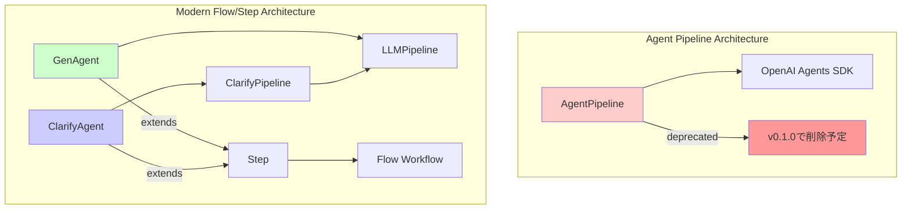

# エージェントクラス比較ガイド

## 概要

agents-sdk-modelsには3つの主要なエージェントクラスがあります：

- **AgentPipeline** （非推奨）：従来のオールインワン型パイプライン
- **GenAgent**：モダンなテキスト生成・変換エージェント
- **ClarifyAgent**：対話型要件明確化エージェント

本文書では各クラスのインターフェース、機能、適用場面を詳しく比較します。

## アーキテクチャ概要



## 詳細比較表

### 基本属性比較

| 項目 | AgentPipeline | GenAgent | ClarifyAgent |
|------|---------------|----------|---------------|
| **ステータス** | 🚨 非推奨（v0.1.0で削除） | ✅ 推奨 | ✅ 推奨 |
| **アーキテクチャ** | 独立型パイプライン | Flow/Step統合 | Flow/Step統合 |
| **内部実装** | OpenAI Agents SDK直接利用 | LLMPipeline使用 | ClarifyPipeline使用 |
| **対話性** | 単発実行 | 単発実行 | 多ターン対話 |
| **主な用途** | 生成・評価・改善 | 生成・変換 | 要件明確化 |

### 機能比較

| 機能 | AgentPipeline | GenAgent | ClarifyAgent |
|------|---------------|----------|---------------|
| **テキスト生成** | ✅ | ✅ | ✅（質問生成） |
| **品質評価** | ✅ | ✅ | ✅ |
| **リトライ機能** | ✅ | ✅ | ✅ |
| **構造化出力** | ✅ | ✅ | ✅ |
| **多ターン対話** | ❌ | ❌ | ✅ |
| **要件明確化** | ❌ | ❌ | ✅ |
| **ターン制御** | ❌ | ❌ | ✅ |
| **会話状態管理** | ❌ | ❌ | ✅ |
| **Flowワークフロー統合** | ❌（ラッパー必要） | ✅ | ✅ |

### インターフェース比較

#### 作成関数

| クラス | 基本作成関数 | 評価付き作成関数 |
|--------|-------------|------------------|
| AgentPipeline | `AgentPipeline(...)` | 同一コンストラクタ |
| GenAgent | `create_simple_gen_agent(...)` | `create_evaluated_gen_agent(...)` |
| ClarifyAgent | `create_simple_clarify_agent(...)` | `create_evaluated_clarify_agent(...)` |

#### コンストラクタパラメータ

##### 共通パラメータ

| パラメータ | AgentPipeline | GenAgent | ClarifyAgent |
|------------|---------------|----------|---------------|
| `name` | ✅ str | ✅ str | ✅ str |
| `generation_instructions` | ✅ str | ✅ str | ✅ str |
| `evaluation_instructions` | ✅ Optional[str] | ✅ Optional[str] | ✅ Optional[str] |
| `model` | ✅ str | ✅ str = "gpt-4o-mini" | ✅ str |
| `evaluation_model` | ✅ Optional[str] | ✅ Optional[str] | ✅ Optional[str] |
| `threshold` | ✅ int = 85 | ✅ float = 85.0 | ✅ int = 85 |
| `retries` | ✅ int = 3 | ✅ int = 3 | ✅ int = 3 |

##### 固有パラメータ

**AgentPipeline固有**
- `input_guardrails` / `output_guardrails`
- `generation_tools` / `evaluation_tools` 
- `routing_func`
- `session_history` / `history_size`
- `improvement_callback`
- `dynamic_prompt`
- `retry_comment_importance`
- `locale`

**GenAgent固有**
- `output_model` (Pydantic)
- `temperature` / `max_tokens` / `timeout`
- `next_step` / `store_result_key`

**ClarifyAgent固有**
- `output_data` (ターゲットデータ型)
- `clerify_max_turns` (最大ターン数)
- `conversation_key` (会話状態キー)

#### 実行メソッド

| クラス | 同期実行 | 非同期実行 | 戻り値 |
|--------|----------|------------|--------|
| AgentPipeline | `run(user_input)` | `run_async(user_input)` | 生成結果 or None |
| GenAgent | - | `run(user_input, ctx)` | Context |
| ClarifyAgent | - | `run(user_input, ctx)` | Context |

## 使用例比較

### 1. 基本的なテキスト生成

#### AgentPipeline（非推奨）
```python
# 非推奨 - 使用を避ける
pipeline = AgentPipeline(
    name="simple_gen",
    generation_instructions="ユーザーの質問に答えてください。",
    evaluation_instructions=None,
    model="gpt-4o-mini"
)
result = pipeline.run("人工知能の未来について教えて")
```

#### GenAgent（推奨）
```python
from agents_sdk_models import create_simple_gen_agent, Context
import asyncio

agent = create_simple_gen_agent(
    name="simple_gen",
    instructions="ユーザーの質問に答えてください。",
    model="gpt-4o-mini"
)

context = Context()
result_context = asyncio.run(agent.run("人工知能の未来について教えて", context))
result = result_context.shared_state.get("simple_gen_result")
```

### 2. 評価付き生成

#### AgentPipeline（非推奨）
```python
# 非推奨
pipeline = AgentPipeline(
    name="evaluated_gen",
    generation_instructions="創造的な物語を書いてください。",
    evaluation_instructions="創造性と一貫性を評価してください。",
    model="gpt-4o",
    threshold=80
)
result = pipeline.run("ロボットの物語")
```

#### GenAgent（推奨）
```python
from agents_sdk_models import create_evaluated_gen_agent

agent = create_evaluated_gen_agent(
    name="evaluated_gen",
    generation_instructions="創造的な物語を書いてください。",
    evaluation_instructions="創造性と一貫性を評価してください。",
    model="gpt-4o",
    threshold=80.0
)

context = Context()
result_context = asyncio.run(agent.run("ロボットの物語", context))
result = result_context.shared_state.get("evaluated_gen_result")
```

### 3. 要件明確化

#### ClarifyAgent（新機能）
```python
from agents_sdk_models import create_simple_clarify_agent
from pydantic import BaseModel

class ProjectInfo(BaseModel):
    name: str
    description: str
    deadline: str

agent = create_simple_clarify_agent(
    name="clarifier",
    instructions="プロジェクト情報を明確化してください。",
    output_data=ProjectInfo,
    max_turns=5
)

# 多ターン対話による明確化
context = Context()
result_context = asyncio.run(agent.run("新しいプロジェクトを始めたい", context))

# 明確化が完了するまで対話を継続
while not agent.is_clarification_complete():
    user_response = input("追加情報: ")
    result_context = asyncio.run(agent.run(user_response, result_context))

final_result = result_context.shared_state.get("clarifier_result")
```

## 移行ガイド

### AgentPipelineからGenAgentへの移行

#### Before (AgentPipeline)
```python
pipeline = AgentPipeline(
    name="content_generator",
    generation_instructions="記事を生成してください。",
    evaluation_instructions="品質を評価してください。",
    model="gpt-4o",
    threshold=85,
    retries=3
)
result = pipeline.run("AIについての記事")
```

#### After (GenAgent)
```python
from agents_sdk_models import create_evaluated_gen_agent, Flow

# Step 1: GenAgentに変換
agent = create_evaluated_gen_agent(
    name="content_generator",
    generation_instructions="記事を生成してください。",
    evaluation_instructions="品質を評価してください。",
    model="gpt-4o",
    threshold=85.0,
    retries=3
)

# Step 2: Flowで実行（単体またはワークフローの一部として）
flow = Flow("content_generation", steps={"generator": agent})
result = asyncio.run(flow.run("AIについての記事"))
content = result.shared_state.get("content_generator_result")
```

## 適用場面別推奨事項

### 1. 単純なテキスト生成・変換
**推奨**: GenAgent
- 理由: モダンなアーキテクチャ、Flow統合、簡潔なAPI

### 2. 品質保証が重要な生成
**推奨**: GenAgent（評価付き）
- 理由: 柔軟な評価設定、改善されたリトライ機能

### 3. 曖昧な要求の明確化
**推奨**: ClarifyAgent
- 理由: 専用設計、多ターン対話、構造化データ収集

### 4. 複雑なワークフロー
**推奨**: GenAgent + ClarifyAgent をFlowで組み合わせ
- 理由: ステップの組み合わせ、柔軟な制御フロー

### 5. 既存のAgentPipelineコード
**対応**: 早急にGenAgentに移行
- 理由: AgentPipelineはv0.1.0で削除予定

## ベストプラクティス

### 1. GenAgent使用時
```python
# ✅ 推奨: Factory関数を使用
agent = create_simple_gen_agent(
    name="my_agent",
    instructions="...",
    model="gpt-4o-mini"
)

# ❌ 非推奨: 直接コンストラクタ呼び出し（複雑）
agent = GenAgent(
    name="my_agent",
    generation_instructions="...",
    model="gpt-4o-mini",
    # 多くのパラメータ...
)
```

### 2. ClarifyAgent使用時
```python
# ✅ 推奨: 明確なデータモデル定義
class UserRequirement(BaseModel):
    goal: str
    constraints: List[str]
    deadline: str

agent = create_simple_clarify_agent(
    name="clarifier",
    instructions="要件を明確化してください。",
    output_data=UserRequirement,
    max_turns=10
)
```

### 3. Flow統合時
```python
# ✅ 推奨: 役割を明確に分離
clarify_agent = create_simple_clarify_agent(...)
gen_agent = create_evaluated_gen_agent(...)

flow = Flow("complete_workflow", steps={
    "clarify": clarify_agent,
    "generate": gen_agent
})
```

## 性能比較

| 項目 | AgentPipeline | GenAgent | ClarifyAgent |
|------|---------------|----------|---------------|
| **初期化速度** | 中 | 高 | 高 |
| **実行速度** | 中 | 高 | 中（対話型） |
| **メモリ使用量** | 中 | 低 | 中 |
| **拡張性** | 低 | 高 | 高 |
| **保守性** | 低 | 高 | 高 |

## まとめ

- **AgentPipeline**: 非推奨、早急に移行が必要
- **GenAgent**: モダンな生成・変換タスク用、高性能で拡張性が高い
- **ClarifyAgent**: 要件明確化専用、対話型タスクに最適

新規開発では**GenAgent**と**ClarifyAgent**を組み合わせたFlow/Stepアーキテクチャの採用を強く推奨します。
