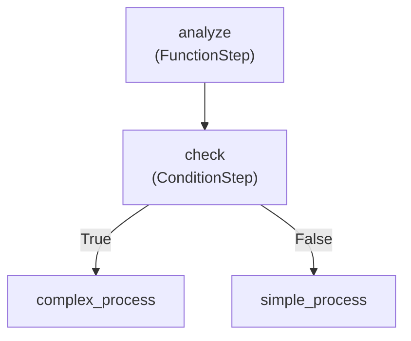

# Refinire Flow 完全ガイド - 基礎から上級まで

このガイドでは、RefinireのFlow機能を基礎から上級まで体系的に学べます。ステップ・バイ・ステップで進むことで、シンプルなワークフローから複雑な本番対応のシステムまで構築できるようになります。

## 📚 目次

1. [基礎編：Flowの概念と基本構造](#基礎編)
2. [中級編：複雑なワークフローとエージェント統合](#中級編)
3. [上級編：本番対応のFlow設計パターン](#上級編)

---

## 基礎編：Flowの概念と基本構造

### 1.1 Flowとは何か？

Flowは、複数のタスクを連鎖的に実行するワークフローエンジンです。従来の手続き型プログラミングとは異なり、**宣言的な構造**でワークフローを定義できます。

#### 従来のアプローチ vs Flow アプローチ

```python
# 従来のアプローチ（LangGraphスタイル）
from langgraph.graph import StateGraph
from langchain.chat_models import ChatOpenAI
from langchain.schema import HumanMessage
from typing import TypedDict

class WorkflowState(TypedDict):
    user_input: str
    analysis: str
    advice: str
    final_message: str

def analyze_step(state: WorkflowState):
    llm = ChatOpenAI(model="gpt-4o-mini")
    response = llm.invoke([HumanMessage(content=f"分析してください: {state['user_input']}")])
    state["analysis"] = response.content
    return state

def advice_step(state: WorkflowState):
    llm = ChatOpenAI(model="gpt-4o-mini")
    response = llm.invoke([
        HumanMessage(content=f"前回の分析: {state['analysis']}"),
        HumanMessage(content="この分析に基づいてアドバイスをください")
    ])
    state["advice"] = response.content
    return state

def encourage_step(state: WorkflowState):
    llm = ChatOpenAI(model="gpt-4o-mini")
    response = llm.invoke([
        HumanMessage(content=f"分析: {state['analysis']}"),
        HumanMessage(content=f"アドバイス: {state['advice']}"),
        HumanMessage(content="これらをまとめて励ましの言葉をください")
    ])
    state["final_message"] = response.content
    return state

# グラフの構築
workflow = StateGraph(WorkflowState)
workflow.add_node("analyze", analyze_step)
workflow.add_node("advice", advice_step)
workflow.add_node("encourage", encourage_step)
workflow.add_edge("analyze", "advice")
workflow.add_edge("advice", "encourage")
workflow.set_entry_point("analyze")
workflow.set_finish_point("encourage")

app = workflow.compile()

def traditional_ai_workflow(user_input):
    result = app.invoke({"user_input": user_input})
    return result["final_message"]

# Refinire Flowアプローチ（宣言的）
from refinire import Flow, RefinireAgent

analyzer = RefinireAgent(
    name="analyzer",
    generation_instructions="入力を詳しく分析してください",
    model="gpt-4o-mini"
)

advisor = RefinireAgent(
    name="advisor", 
    generation_instructions="分析結果に基づいて具体的なアドバイスを提供してください",
    model="gpt-4o-mini"
)

encourager = RefinireAgent(
    name="encourager",
    generation_instructions="分析とアドバイスを踏まえて励ましの言葉をください",
    model="gpt-4o-mini"
)

flow = Flow({
    "analyze": analyzer,
    "advise": advisor, 
    "encourage": encourager
})

result = await flow.run(user_input)
```

#### Flowの主な利点

1. **可読性**: ワークフロー構造が一目で理解できる
2. **保守性**: ステップの追加・削除・変更が容易
3. **再利用性**: ステップを他のFlowで再利用可能
4. **監視**: 各ステップの実行状況を追跡可能
5. **並列処理**: 独立したタスクを自動的に並列実行

### 1.2 基本的なFlowの構築

#### ステップ1: 必要なコンポーネントのインポート

```python
from refinire import Flow, RefinireAgent
import asyncio
```

#### ステップ2: 最初のFlowを作成 - RefinireAgentの連続実行

```python
# 複数のRefinireAgentを順次実行するFlow
first_agent = RefinireAgent(
    name="greeter",
    generation_instructions="ユーザーに親切に挨拶してください",
    model="gpt-4o-mini"
)

second_agent = RefinireAgent(
    name="analyzer", 
    generation_instructions="前の応答を受けて、そのユーザーに適したアドバイスを提供してください",
    model="gpt-4o-mini"
)

# 基本的なFlowの定義
simple_flow = Flow({
    "greet": first_agent,
    "advice": second_agent
})

# Flowの実行
async def run_simple_example():
    result = await simple_flow.run("太郎")
    print(f"最終結果: {result}")

# 実行
asyncio.run(run_simple_example())
```

この例では：
1. **first_agent**がユーザーに挨拶
2. **second_agent**がその挨拶を受けて追加のアドバイスを提供
3. 2つのRefinireAgentが**順次実行**される

### 1.3 三段階のRefinireAgent連携

より複雑な例として、3つのRefinireAgentを連携させてみましょう。

```python
# 第一段階：ユーザー情報の分析
analyzer_agent = RefinireAgent(
    name="analyzer",
    generation_instructions="ユーザーの名前から性格や特徴を分析してください。簡潔に答えてください。",
    model="gpt-4o-mini"
)

# 第二段階：おすすめの提案
recommender_agent = RefinireAgent(
    name="recommender",
    generation_instructions="分析結果に基づいて、そのユーザーにおすすめの活動や趣味を提案してください。",
    model="gpt-4o-mini"
)

# 第三段階：励ましのメッセージ
encourager_agent = RefinireAgent(
    name="encourager",
    generation_instructions="これまでの分析と提案を踏まえて、ユーザーを励ます温かいメッセージを作成してください。",
    model="gpt-4o-mini"
)

# 三段階連携Flow
three_step_flow = Flow({
    "analyze": analyzer_agent,
    "recommend": recommender_agent,
    "encourage": encourager_agent
})

async def run_three_step_example():
    result = await three_step_flow.run("さくら")
    print(f"最終的な励ましメッセージ: {result}")

# 実行
asyncio.run(run_three_step_example())
```

この例では：
1. **analyzer_agent**がユーザー名から特徴を分析
2. **recommender_agent**が分析結果に基づいておすすめを提案
3. **encourager_agent**が全体を踏まえて励ましメッセージを作成

各エージェントの出力が次のエージェントの入力となり、**段階的に内容が深化**していきます。

### 1.4 条件分岐の基本 - RefinireAgentによる判定

RefinireAgentの出力に基づいて条件分岐を行う例を見てみましょう。

```python
from refinire import ConditionStep

# 判定エージェント：入力の種類を分析
classifier_agent = RefinireAgent(
    name="classifier",
    generation_instructions="""
    入力を分析して、以下のいずれかで答えてください：
    - 質問：ユーザーが何かを質問している場合
    - 相談：ユーザーが悩みや相談をしている場合
    - 挨拶：ユーザーが挨拶をしている場合
    
    単語のみで答えてください。
    """,
    model="gpt-4o-mini"
)

# 質問に特化したエージェント
qa_agent = RefinireAgent(
    name="qa_agent",
    generation_instructions="質問に対して詳しく分かりやすく回答してください。",
    model="gpt-4o-mini"
)

# 相談に特化したエージェント
counseling_agent = RefinireAgent(
    name="counseling_agent", 
    generation_instructions="相談に対して共感的で建設的なアドバイスを提供してください。",
    model="gpt-4o-mini"
)

# 挨拶に特化したエージェント
greeting_agent = RefinireAgent(
    name="greeting_agent",
    generation_instructions="挨拶に対して親しみやすく温かい挨拶を返してください。",
    model="gpt-4o-mini"
)

# 判定ロジック
def route_by_type(ctx):
    """分類結果に基づいてルーティング"""
    classification = str(ctx.result).strip().lower()
    if "質問" in classification:
        return "qa"
    elif "相談" in classification:
        return "counseling"
    else:
        return "greeting"

# 条件分岐Flow
branching_flow = Flow({
    "classify": classifier_agent,
    "route": ConditionStep("route", route_by_type, 
                          {"qa": "qa", "counseling": "counseling", "greeting": "greeting"}),
    "qa": qa_agent,
    "counseling": counseling_agent,
    "greeting": greeting_agent
})

async def run_branching_example():
    # 質問の場合
    result1 = await branching_flow.run("Pythonでリストを作る方法を教えて")
    print(f"質問の結果: {result1}")
    
    # 相談の場合  
    result2 = await branching_flow.run("プログラミングの勉強が難しくて悩んでいます")
    print(f"相談の結果: {result2}")
    
    # 挨拶の場合
    result3 = await branching_flow.run("おはようございます")
    print(f"挨拶の結果: {result3}")

# 実行
asyncio.run(run_branching_example())
```

この例では：
1. **classifier_agent**が入力の種類を判定
2. **ConditionStep**が判定結果に基づいてルーティング
3. 種類に応じた**専門エージェント**が応答

RefinireAgentの出力を条件分岐に活用することで、**インテリジェントなルーティング**が可能になります。

### 1.5 基礎編まとめと練習課題

#### 基礎編で学んだこと
- Flowの基本概念と従来のアプローチとの違い
- RefinireAgentの連続実行パターン
- ConditionStepを使った条件分岐
- RefinireAgentによるインテリジェントなルーティング

#### 練習課題: 感情分析とアドバイスFlow

```python
# 課題: 以下の要件を満たすFlowを作成してください
# 1. ユーザーの入力から感情を分析するエージェント
# 2. 感情に基づいて適切なアドバイスを提供するエージェント
# 3. ポジティブ/ネガティブで異なる専門エージェントに振り分け

# 解答例：
emotion_analyzer = RefinireAgent(
    name="emotion_analyzer",
    generation_instructions="""
    入力されたテキストの感情を分析し、以下のいずれかで答えてください：
    - ポジティブ：前向きで明るい感情の場合
    - ネガティブ：落ち込んでいたり不安な感情の場合
    
    単語のみで答えてください。
    """,
    model="gpt-4o-mini"
)

positive_advisor = RefinireAgent(
    name="positive_advisor",
    generation_instructions="ポジティブな気持ちをさらに高めるようなアドバイスを提供してください。",
    model="gpt-4o-mini"
)

negative_advisor = RefinireAgent(
    name="negative_advisor",
    generation_instructions="ネガティブな気持ちを改善するための優しいアドバイスを提供してください。",
    model="gpt-4o-mini"
)

def emotion_router(ctx):
    """感情に基づくルーティング"""
    emotion = str(ctx.result).strip().lower()
    return "positive" if "ポジティブ" in emotion else "negative"

# 練習用Flow
emotion_flow = Flow({
    "analyze": emotion_analyzer,
    "route": ConditionStep("route", emotion_router, "positive", "negative"),
    "positive": positive_advisor,
    "negative": negative_advisor
})

# テスト実行
async def test_emotion_flow():
    result1 = await emotion_flow.run("今日はとても良い日でした！")
    print(f"ポジティブな入力: {result1}")
    
    result2 = await emotion_flow.run("最近うまくいかないことばかりで落ち込んでいます")
    print(f"ネガティブな入力: {result2}")
```

この課題では、**RefinireAgentの連携**と**条件分岐**を組み合わせて、感情に応じたパーソナライズされたアドバイスシステムを構築します。

### 1.6 show()を使ったFlow可視化

複雑なFlowを理解し、デバッグするためには、Flow構造を可視化することが重要です。Refinireの`show()`メソッドを使用すると、テキスト形式とグラフィカル形式の両方でFlowを表示できます。

#### 基本的なFlow可視化

```python
from refinire import Flow, FunctionStep, ConditionStep

def analyze_input(ctx):
    return f"分析済み: {ctx.result}"

def is_complex(ctx):
    return len(str(ctx.result)) > 10

# デモンストレーション用のFlowを作成
demo_flow = Flow(start="analyze", steps={
    "analyze": FunctionStep("analyze", analyze_input, next_step="check"),
    "check": ConditionStep("check", is_complex, "complex_process", "simple_process"),
    "complex_process": FunctionStep("complex_process", lambda ctx: "複雑な処理完了"),
    "simple_process": FunctionStep("simple_process", lambda ctx: "簡単な処理完了")
})

# テキスト形式でFlow構造を表示
print("=== Flow構造（テキスト形式） ===")
print(demo_flow.show(format="text"))

# Mermaid形式でFlow構造を表示
print("\n=== Flow構造（Mermaid形式） ===")
print(demo_flow.show(format="mermaid"))
```

**期待される出力:**

```
=== Flow構造（テキスト形式） ===
Flow Diagram:
==================================================
→ analyze (FunctionStep)
  → check (ConditionStep)
    True → complex_process
    False → simple_process
    → complex_process (FunctionStep)
    → simple_process (FunctionStep)

=== Flow構造（Mermaid形式） ===
graph TD
    analyze["analyze<br/>(FunctionStep)"]:::start
    analyze --> check
    check["check<br/>(ConditionStep)"]:::condition
    check -->|"True"| complex_process
    check -->|"False"| simple_process
    complex_process["complex_process<br/>(FunctionStep)"]
    simple_process["simple_process<br/>(FunctionStep)"]
```

#### 可視化形式の違い

**テキスト形式** (`format="text"`):
- コンソールでのデバッグと迅速な確認に最適
- インデントによる階層構造の表示
- ステップタイプとルーティング情報を表示
- 開発とトラブルシューティングに理想的

**Mermaid形式** (`format="mermaid"`):
- Mermaid.jsフローチャートコードを生成
- GitHub、GitLab、Notion、その他のプラットフォームでレンダリング可能
- プロフェッショナルな文書作成とプレゼンテーション
- マークダウンファイルにコピー&ペースト可能

#### 異なるFlowタイプの可視化

```python
# 1. シーケンシャルFlowの可視化
sequential_flow = Flow(steps=[
    FunctionStep("step1", lambda ctx: "ステップ1完了"),
    FunctionStep("step2", lambda ctx: "ステップ2完了"),
    FunctionStep("step3", lambda ctx: "ステップ3完了")
])

print("シーケンシャルFlow:")
print(sequential_flow.show(format="text"))

# 2. 単一ステップFlowの可視化
from refinire import RefinireAgent

single_flow = Flow(steps=RefinireAgent(
    name="assistant",
    generation_instructions="あなたは役立つアシスタントです",
    model="gpt-4o-mini"
))

print("\n単一ステップFlow:")
print(single_flow.show(format="text"))

# 3. 並列処理Flowの可視化
parallel_flow = Flow(start="input", steps={
    "input": FunctionStep("input", lambda ctx: ctx.result, next_step="parallel"),
    "parallel": {
        "parallel": [
            RefinireAgent(name="agent1", generation_instructions="視点Aから分析", model="gpt-4o-mini"),
            RefinireAgent(name="agent2", generation_instructions="視点Bから分析", model="gpt-4o-mini")
        ],
        "next_step": "combine",
        "max_workers": 2
    },
    "combine": FunctionStep("combine", lambda ctx: "結果統合完了")
})

print("\n並列処理Flow:")
print(parallel_flow.show(format="mermaid"))
```

#### 実行履歴付き可視化

Flowを実行した後、実際の実行パスを可視化できます：

```python
# 最初にFlowを実行
result = await demo_flow.run("Flowのテスト入力")

# 実行履歴付きでFlowを表示
print("=== 実行履歴付きFlow ===")
print(demo_flow.show(format="text", include_history=True))

# 実行パスハイライト付きMermaid形式
print("\n=== 実行パス付きMermaid ===")
print(demo_flow.show(format="mermaid", include_history=True))
```

実行履歴では以下がハイライトされます：
- 実際に実行されたステップ
- 実行順序
- 各ステップのタイムスタンプ
- Mermaid図での視覚的パスハイライト

#### Flow可視化のベストプラクティス

1. **開発フェーズ**:
   - `format="text"`を使用して迅速なコンソール確認
   - 実装前にFlow構造をチェック
   - 条件分岐とルーティングを検証

2. **文書化フェーズ**:
   - `format="mermaid"`を文書化に使用
   - README ファイルと技術仕様書に含める
   - チームメンバーとのレビューで共有

3. **デバッグフェーズ**:
   - 実行後に`include_history=True`を使用
   - どのパスが取られるかを特定
   - 予期しないルーティング動作をデバッグ

4. **本番監視**:
   - 運用文書用にFlow図を生成
   - 実行パターンとボトルネックを追跡
   - 複雑なビジネスプロセスを可視化

#### 外部ツールとの統合

**Mermaid Live Editor**: Mermaid出力を [https://mermaid.live/](https://mermaid.live/) にコピーして、インタラクティブな編集とエクスポートが可能です。

**GitHub/GitLab**: Mermaid図はマークダウンファイルで自動的にレンダリングされます：

````markdown

````

**文書作成ツール**: ほとんどの現代的な文書プラットフォームでMermaidレンダリングをサポートしています（Notion、Obsidian、GitBook など）。

---

## 中級編：複雑なワークフローとエージェント統合

### 2.1 RefinireAgentとFlowの統合

RefinireAgentは、LLMを活用したインテリジェントなステップとしてFlowに組み込めます。

#### 基本的なRefinireAgent統合

```python
from refinire import RefinireAgent

# シンプルなRefinireAgent
simple_agent = RefinireAgent(
    name="assistant",
    generation_instructions="ユーザーの質問に親切に答えてください",
    model="gpt-4o-mini"
)

# AgentをFlowに統合
agent_flow = Flow({
    "preprocess": FunctionStep("preprocess", lambda data, ctx: f"質問: {data}"),
    "ai_response": simple_agent,
    "postprocess": FunctionStep("postprocess", lambda data, ctx: f"回答: {data}")
})

async def run_agent_example():
    result = await agent_flow.run("Pythonの特徴を教えて")
    print(result)
```

#### 評価機能付きRefinireAgent

```python
# 評価機能付きAgent
quality_agent = RefinireAgent(
    name="quality_assistant",
    generation_instructions="高品質で詳細な回答を生成してください",
    evaluation_instructions="回答の品質を0-100で評価してください。網羅性、正確性、明確性を重視してください",
    threshold=80.0,
    max_retries=2,
    model="gpt-4o-mini"
)

def check_quality_score(ctx):
    """品質スコアに基づく分岐"""
    if hasattr(ctx, 'evaluation_result') and ctx.evaluation_result:
        return ctx.evaluation_result.get('score', 0) >= 85
    return False

def high_quality_response(data, ctx):
    """高品質レスポンス処理"""
    score = ctx.evaluation_result.get('score', 0)
    return f"高品質な回答です（スコア: {score}）\n回答: {data}"

def standard_response(data, ctx):
    """標準レスポンス処理"""
    score = ctx.evaluation_result.get('score', 0) if ctx.evaluation_result else 0
    return f"標準的な回答です（スコア: {score}）\n回答: {data}"

# 品質チェック付きFlow
quality_flow = Flow({
    "generate": quality_agent,
    "quality_check": ConditionStep("quality_check", check_quality_score, "high_quality", "standard"),
    "high_quality": FunctionStep("high_quality", high_quality_response),
    "standard": FunctionStep("standard", standard_response)
})
```

### 2.2 並列処理とパフォーマンス最適化

独立したタスクを並列実行することで、大幅なパフォーマンス向上を実現できます。

#### 基本的な並列処理

```python
def analyze_sentiment(data, ctx):
    """感情分析（模擬）"""
    import time
    time.sleep(1)  # 処理時間をシミュレート
    return f"感情: ポジティブ（入力: {data[:20]}...）"

def extract_keywords(data, ctx):
    """キーワード抽出（模擬）"""
    import time
    time.sleep(1)  # 処理時間をシミュレート
    return f"キーワード: Python, AI, 機械学習（入力: {data[:20]}...）"

def classify_category(data, ctx):
    """カテゴリ分類（模擬）"""
    import time
    time.sleep(1)  # 処理時間をシミュレート
    return f"カテゴリ: 技術（入力: {data[:20]}...）"

def combine_analysis_results(data, ctx):
    """分析結果を統合"""
    # 並列実行の結果はctx.shared_stateに格納される
    return {
        "統合結果": "複数の分析が完了しました",
        "実行時間": "約1秒（並列実行）"
    }

# 並列処理Flow
parallel_flow = Flow(start="preprocess", steps={
    "preprocess": FunctionStep("preprocess", lambda data, ctx: data),
    "parallel_analysis": {
        "parallel": [
            FunctionStep("sentiment", analyze_sentiment),
            FunctionStep("keywords", extract_keywords),
            FunctionStep("category", classify_category)
        ],
        "next_step": "combine",
        "max_workers": 3
    },
    "combine": FunctionStep("combine", combine_analysis_results)
})

async def run_parallel_example():
    import time
    start_time = time.time()
    
    result = await parallel_flow.run("Pythonは機械学習やAI開発に適したプログラミング言語です")
    
    end_time = time.time()
    print(f"実行時間: {end_time - start_time:.2f}秒")
    print(f"結果: {result}")
```

### 2.3 RouterAgentの統合

RouterAgentは、入力を分析して適切なルートに振り分けるエージェントです。

```python
from refinire import RouterAgent

# RouterAgentの設定
router_config = {
    "name": "content_router",
    "routes": {
        "technical": "tech_specialist",
        "business": "business_specialist",
        "general": "general_assistant"
    },
    "classifier_type": "llm",
    "generation_instructions": """
    以下のカテゴリのいずれかに分類してください：
    - technical: プログラミング、技術、エンジニアリング関連
    - business: ビジネス、経営、マーケティング関連  
    - general: その他の一般的な質問
    
    カテゴリ名のみを返してください。
    """
}

router = RouterAgent(router_config)

# 専門エージェントの定義
tech_specialist = RefinireAgent(
    name="tech_specialist",
    generation_instructions="技術的な専門知識を活用して詳細に回答してください",
    model="gpt-4o-mini"
)

business_specialist = RefinireAgent(
    name="business_specialist", 
    generation_instructions="ビジネスの観点から実践的にアドバイスしてください",
    model="gpt-4o-mini"
)

general_assistant = RefinireAgent(
    name="general_assistant",
    generation_instructions="分かりやすく丁寧に回答してください",
    model="gpt-4o-mini"
)

# RouterAgent統合Flow
router_flow = Flow({
    "preprocess": FunctionStep("preprocess", lambda data, ctx: data),
    "route": router,
    "tech_specialist": tech_specialist,
    "business_specialist": business_specialist,
    "general_assistant": general_assistant,
    "postprocess": FunctionStep("postprocess", lambda data, ctx: f"専門回答: {data}")
})

async def run_router_example():
    # 技術的な質問
    tech_result = await router_flow.run("Pythonでのマルチスレッド処理について教えて")
    print(f"技術質問の結果: {tech_result}")
    
    # ビジネス質問
    business_result = await router_flow.run("新規事業の立ち上げ方法について教えて")
    print(f"ビジネス質問の結果: {business_result}")
```

### 2.4 ClarifyAgentの統合

ClarifyAgentは、曖昧な要求を明確化するためのエージェントです。

```python
from refinire import ClarifyAgent

# ClarifyAgentの設定
clarify_agent = ClarifyAgent(
    name="requirement_clarifier",
    generation_instructions="ユーザーの要求を明確化するための質問を生成してください",
    clarification_instructions="要求が十分に明確かどうかを判定してください",
    threshold=80.0,
    model="gpt-4o-mini"
)

def is_clarification_needed(ctx):
    """明確化が必要かどうかを判定"""
    # ClarifyAgentの結果を確認
    if hasattr(ctx, 'clarification_result'):
        return not ctx.clarification_result.get('is_clear', False)
    return False

def process_clear_request(data, ctx):
    """明確な要求の処理"""
    return f"要求が明確です。処理を開始します: {data}"

def request_clarification(data, ctx):
    """明確化の要求"""
    clarification = ctx.clarification_result.get('clarification_question', '')
    return f"詳細を教えてください: {clarification}"

# ClarifyAgent統合Flow
clarify_flow = Flow({
    "clarify": clarify_agent,
    "check_clarity": ConditionStep("check_clarity", is_clarification_needed, "request_more", "process"),
    "request_more": FunctionStep("request_more", request_clarification),
    "process": FunctionStep("process", process_clear_request)
})

async def run_clarify_example():
    # 曖昧な要求
    vague_result = await clarify_flow.run("何かいい感じのシステムを作って")
    print(f"曖昧な要求の結果: {vague_result}")
    
    # 明確な要求
    clear_result = await clarify_flow.run("Pythonで顧客管理システムを作成してください。機能として顧客情報の登録、検索、更新、削除が必要です")
    print(f"明確な要求の結果: {clear_result}")
```

### 2.5 中級編まとめと実践課題

#### 中級編で学んだこと
- RefinireAgentの様々な統合パターン
- 評価機能を活用した品質管理
- 並列処理によるパフォーマンス最適化
- RouterAgentとClarifyAgentの活用

#### 実践課題：多機能カスタマーサポートシステム

```python
# 課題: 以下の機能を持つカスタマーサポートFlowを作成してください
# 1. 問い合わせ内容の分類（技術的/一般的/緊急）
# 2. 緊急の場合は即座にエスカレーション
# 3. 技術的な問い合わせは詳細確認後に専門対応
# 4. 一般的な問い合わせは直接回答
# 5. すべての対応を並列で記録とメール送信

def classify_inquiry(ctx):
    """問い合わせを分類"""
    content = ctx.result.lower()
    if any(word in content for word in ["緊急", "エラー", "停止", "障害"]):
        ctx.shared_state["category"] = "urgent"
        return "urgent"
    elif any(word in content for word in ["技術", "実装", "コード", "api"]):
        ctx.shared_state["category"] = "technical"
        return "technical"
    else:
        ctx.shared_state["category"] = "general"
        return "general"

# 実装例（一部）
support_flow = Flow({
    "classify": FunctionStep("classify", lambda data, ctx: classify_inquiry(ctx)),
    "route": ConditionStep("route", 
                          lambda ctx: ctx.shared_state.get("category"),
                          {"urgent": "escalate", "technical": "clarify", "general": "respond"}),
    # ... 続きを実装してください
})
```

---

## 上級編：本番対応のFlow設計パターン

### 3.1 エラーハンドリングと回復力のあるFlow

本番環境では、エラーハンドリングとフォールバック機能が重要です。

#### 堅牢なエラーハンドリング

```python
from refinire import FlowExecutionError
import logging

logger = logging.getLogger(__name__)

def safe_external_api_call(data, ctx):
    """外部API呼び出し（エラーが発生する可能性）"""
    import random
    
    # 30%の確率でエラーを発生させる（テスト用）
    if random.random() < 0.3:
        raise Exception("外部APIエラー: 接続タイムアウト")
    
    return f"API応答: {data}の処理が完了しました"

def fallback_local_processing(data, ctx):
    """フォールバック処理"""
    logger.warning("外部APIが利用できないため、ローカル処理にフォールバック")
    return f"ローカル処理: {data}をローカルで処理しました（機能制限あり）"

def error_handler(error, ctx):
    """エラーハンドラー"""
    logger.error(f"エラーが発生しました: {error}")
    ctx.shared_state["error_occurred"] = True
    ctx.shared_state["error_message"] = str(error)
    return "error_fallback"

def has_error(ctx):
    """エラーが発生したかチェック"""
    return ctx.shared_state.get("error_occurred", False)

def success_response(data, ctx):
    """成功レスポンス"""
    return f"✅ 正常に処理されました: {data}"

def error_response(data, ctx):
    """エラーレスポンス"""
    error_msg = ctx.shared_state.get("error_message", "不明なエラー")
    return f"⚠️ エラーが発生しましたが代替処理で対応しました: {data}\nエラー詳細: {error_msg}"

# エラーハンドリング対応Flow
resilient_flow = Flow({
    "try_external": FunctionStep("try_external", safe_external_api_call),
    "error_check": ConditionStep("error_check", has_error, "error_response", "success_response"),
    "error_fallback": FunctionStep("fallback", fallback_local_processing),
    "success_response": FunctionStep("success", success_response),
    "error_response": FunctionStep("error", error_response)
})

# エラーハンドラーの設定
resilient_flow.set_error_handler(error_handler)

async def run_resilient_example():
    for i in range(5):
        try:
            result = await resilient_flow.run(f"データ{i}")
            print(f"試行 {i+1}: {result}")
        except FlowExecutionError as e:
            print(f"試行 {i+1}: Flow実行エラー - {e}")
```

### 3.2 動的Flow生成とメタプログラミング

実行時にFlowを動的に生成する高度なパターンです。

```python
def create_multi_agent_analysis_flow(agents_config, analysis_type="comprehensive"):
    """動的にマルチエージェント分析Flowを生成"""
    
    # 基本ステップ
    steps = {
        "preprocess": FunctionStep("preprocess", lambda data, ctx: data)
    }
    
    # エージェントを動的に作成
    agent_steps = []
    for i, config in enumerate(agents_config):
        agent = RefinireAgent(
            name=f"agent_{i}",
            generation_instructions=config["instructions"],
            model=config.get("model", "gpt-4o-mini")
        )
        agent_steps.append(agent)
    
    # 並列処理ステップを追加
    steps["parallel_analysis"] = {
        "parallel": agent_steps,
        "next_step": "synthesize",
        "max_workers": min(len(agent_steps), 4)
    }
    
    # 統合ステップ
    if analysis_type == "comprehensive":
        synthesizer = RefinireAgent(
            name="synthesizer",
            generation_instructions="""
            複数のエージェントの分析結果を統合し、包括的な結論を導出してください。
            各エージェントの視点を考慮し、一貫性のある最終的な分析を提供してください。
            """,
            model="gpt-4o-mini"
        )
    else:
        synthesizer = FunctionStep("simple_combine", lambda data, ctx: f"分析完了: {data}")
    
    steps["synthesize"] = synthesizer
    
    return Flow(start="preprocess", steps=steps)

# 動的Flow生成の例
async def run_dynamic_flow_example():
    # 複数の専門エージェント設定
    agents_config = [
        {
            "instructions": "技術的な観点から分析してください",
            "model": "gpt-4o-mini"
        },
        {
            "instructions": "ビジネス的な観点から分析してください", 
            "model": "gpt-4o-mini"
        },
        {
            "instructions": "ユーザビリティの観点から分析してください",
            "model": "gpt-4o-mini"
        },
        {
            "instructions": "セキュリティの観点から分析してください",
            "model": "gpt-4o-mini"
        }
    ]
    
    # 動的にFlowを生成
    dynamic_flow = create_multi_agent_analysis_flow(agents_config, "comprehensive")
    
    # 実行
    result = await dynamic_flow.run("新しいWebアプリケーションの開発プロジェクトについて分析してください")
    print(f"動的Flow結果: {result}")
```

### 3.3 プロダクション監視とトレーシング

本番環境では、Flow実行の監視とトレーシングが重要です。

```python
from refinire import get_global_registry, enable_console_tracing
import time
from datetime import datetime

# トレーシングを有効化
enable_console_tracing()

class ProductionFlowMonitor:
    """本番Flow監視クラス"""
    
    def __init__(self):
        self.metrics = {
            "total_executions": 0,
            "successful_executions": 0,
            "failed_executions": 0,
            "average_duration": 0,
            "error_patterns": {}
        }
    
    def log_execution_start(self, flow_name, input_data):
        """実行開始ログ"""
        timestamp = datetime.now().isoformat()
        logger.info(f"[{timestamp}] Flow '{flow_name}' 開始 - 入力: {str(input_data)[:100]}...")
        return time.time()
    
    def log_execution_end(self, flow_name, start_time, success, result=None, error=None):
        """実行終了ログ"""
        duration = time.time() - start_time
        timestamp = datetime.now().isoformat()
        
        self.metrics["total_executions"] += 1
        
        if success:
            self.metrics["successful_executions"] += 1
            logger.info(f"[{timestamp}] Flow '{flow_name}' 成功 - 実行時間: {duration:.2f}秒")
        else:
            self.metrics["failed_executions"] += 1
            error_type = type(error).__name__ if error else "Unknown"
            self.metrics["error_patterns"][error_type] = self.metrics["error_patterns"].get(error_type, 0) + 1
            logger.error(f"[{timestamp}] Flow '{flow_name}' 失敗 - エラー: {error}")
        
        # 平均実行時間を更新
        self.metrics["average_duration"] = (
            (self.metrics["average_duration"] * (self.metrics["total_executions"] - 1) + duration) 
            / self.metrics["total_executions"]
        )
    
    def get_health_status(self):
        """ヘルスステータスを取得"""
        total = self.metrics["total_executions"]
        if total == 0:
            return {"status": "no_data", "message": "実行データがありません"}
        
        success_rate = (self.metrics["successful_executions"] / total) * 100
        
        if success_rate >= 95:
            status = "healthy"
        elif success_rate >= 85:
            status = "warning"
        else:
            status = "critical"
        
        return {
            "status": status,
            "success_rate": f"{success_rate:.2f}%",
            "average_duration": f"{self.metrics['average_duration']:.2f}秒",
            "total_executions": total,
            "error_patterns": self.metrics["error_patterns"]
        }

# 監視機能付きFlow実行関数
monitor = ProductionFlowMonitor()

async def run_monitored_flow(flow, input_data, flow_name):
    """監視機能付きFlow実行"""
    start_time = monitor.log_execution_start(flow_name, input_data)
    
    try:
        result = await flow.run(input_data)
        monitor.log_execution_end(flow_name, start_time, True, result)
        return result
    except Exception as error:
        monitor.log_execution_end(flow_name, start_time, False, error=error)
        raise

# 本番対応Flow例
production_flow = Flow({
    "validate_input": FunctionStep("validate", lambda data, ctx: data.strip() if data else ""),
    "process": RefinireAgent(
        name="production_agent",
        generation_instructions="本番環境で安全で高品質な応答を生成してください",
        evaluation_instructions="応答の安全性と品質を評価してください",
        threshold=85.0,
        model="gpt-4o-mini"
    ),
    "postprocess": FunctionStep("postprocess", lambda data, ctx: f"[本番応答] {data}")
})

async def run_production_example():
    # 複数の実行をシミュレート
    test_inputs = [
        "正常な入力データ",
        "別の正常な入力",
        "",  # 空の入力（エラーになる可能性）
        "もう一つの正常な入力"
    ]
    
    for i, input_data in enumerate(test_inputs):
        try:
            result = await run_monitored_flow(production_flow, input_data, "production_flow")
            print(f"実行 {i+1}: 成功 - {result[:50]}...")
        except Exception as e:
            print(f"実行 {i+1}: 失敗 - {e}")
    
    # ヘルスステータスを表示
    health_status = monitor.get_health_status()
    print(f"\n=== Flow ヘルスステータス ===")
    print(f"ステータス: {health_status['status']}")
    print(f"成功率: {health_status['success_rate']}")
    print(f"平均実行時間: {health_status['average_duration']}")
    print(f"総実行回数: {health_status['total_executions']}")
    if health_status['error_patterns']:
        print(f"エラーパターン: {health_status['error_patterns']}")
```

### 3.4 A/Bテストと実験的Flow

本番環境でのA/Bテストを実装する高度なパターンです。

```python
import random
from enum import Enum

class FlowVariant(Enum):
    """Flow バリアント"""
    CONTROL = "control"
    EXPERIMENTAL = "experimental"

class ABTestingManager:
    """A/Bテスト管理クラス"""
    
    def __init__(self, experiment_name, traffic_split=0.5):
        self.experiment_name = experiment_name
        self.traffic_split = traffic_split
        self.results = {
            FlowVariant.CONTROL: {"success": 0, "total": 0, "avg_score": 0},
            FlowVariant.EXPERIMENTAL: {"success": 0, "total": 0, "avg_score": 0}
        }
    
    def assign_variant(self, user_id=None):
        """ユーザーにバリアントを割り当て"""
        if user_id:
            # ユーザーIDに基づく一貫したアサインメント
            hash_value = hash(f"{user_id}_{self.experiment_name}") % 100
            return FlowVariant.EXPERIMENTAL if hash_value < (self.traffic_split * 100) else FlowVariant.CONTROL
        else:
            # ランダムアサインメント
            return FlowVariant.EXPERIMENTAL if random.random() < self.traffic_split else FlowVariant.CONTROL
    
    def record_result(self, variant, success, score=None):
        """結果を記録"""
        self.results[variant]["total"] += 1
        if success:
            self.results[variant]["success"] += 1
        if score is not None:
            current_avg = self.results[variant]["avg_score"]
            total = self.results[variant]["total"]
            self.results[variant]["avg_score"] = ((current_avg * (total - 1)) + score) / total
    
    def get_statistics(self):
        """統計情報を取得"""
        stats = {}
        for variant in FlowVariant:
            data = self.results[variant]
            total = data["total"]
            if total > 0:
                success_rate = (data["success"] / total) * 100
                stats[variant.value] = {
                    "success_rate": f"{success_rate:.2f}%",
                    "avg_score": f"{data['avg_score']:.2f}",
                    "sample_size": total
                }
            else:
                stats[variant.value] = {"success_rate": "N/A", "avg_score": "N/A", "sample_size": 0}
        return stats

# A/Bテスト対象のFlow
def create_control_flow():
    """コントロール版Flow（従来手法）"""
    return Flow({
        "process": RefinireAgent(
            name="control_agent",
            generation_instructions="簡潔で直接的な回答を提供してください",
            model="gpt-4o-mini"
        )
    })

def create_experimental_flow():
    """実験版Flow（新手法）"""
    return Flow({
        "analyze": RefinireAgent(
            name="analyzer",
            generation_instructions="まず入力を詳細に分析してください",
            model="gpt-4o-mini"
        ),
        "respond": RefinireAgent(
            name="responder",
            generation_instructions="分析結果に基づいて包括的で有用な回答を生成してください",
            evaluation_instructions="回答の有用性と包括性を0-100で評価してください",
            threshold=80.0,
            model="gpt-4o-mini"
        )
    })

# A/Bテスト実行
ab_test = ABTestingManager("response_quality_experiment", traffic_split=0.5)
control_flow = create_control_flow()
experimental_flow = create_experimental_flow()

async def run_ab_test_example():
    test_queries = [
        "Pythonでのエラーハンドリングのベストプラクティスは？",
        "機械学習モデルの評価方法について教えて",
        "Webアプリケーションのセキュリティ対策は？",
        "データベース設計の基本原則は？",
        "APIの設計において重要な考慮点は？"
    ]
    
    for i, query in enumerate(test_queries):
        user_id = f"user_{i % 3}"  # 3ユーザーをシミュレート
        variant = ab_test.assign_variant(user_id)
        
        try:
            if variant == FlowVariant.CONTROL:
                result = await control_flow.run(query)
                success = len(result) > 50  # 簡単な成功判定
                score = len(result) / 10  # 簡単なスコア算出
            else:
                ctx = Context()
                result = await experimental_flow.run(query, ctx)
                success = len(result) > 50
                # 実験版では評価スコアを使用
                score = ctx.evaluation_result.get('score', 50) if hasattr(ctx, 'evaluation_result') and ctx.evaluation_result else 50
            
            ab_test.record_result(variant, success, score)
            print(f"クエリ {i+1} ({variant.value}): {'成功' if success else '失敗'} (スコア: {score:.1f})")
            
        except Exception as e:
            ab_test.record_result(variant, False)
            print(f"クエリ {i+1} ({variant.value}): エラー - {e}")
    
    # 結果の表示
    stats = ab_test.get_statistics()
    print(f"\n=== A/Bテスト結果 ===")
    print(f"コントロール版: 成功率 {stats['control']['success_rate']}, 平均スコア {stats['control']['avg_score']}, サンプル数 {stats['control']['sample_size']}")
    print(f"実験版: 成功率 {stats['experimental']['success_rate']}, 平均スコア {stats['experimental']['avg_score']}, サンプル数 {stats['experimental']['sample_size']}")
```

### 3.5 上級編まとめと実践プロジェクト

#### 上級編で学んだこと
- 堅牢なエラーハンドリングとフォールバック機能
- 動的Flow生成とメタプログラミング技法
- プロダクション監視とトレーシング
- A/Bテストと実験的な機能開発

#### 最終プロジェクト：エンタープライズ級マルチテナントFlowシステム

```python
# 最終課題: 以下の要件を満たすエンタープライズ級システムを構築してください
# 
# 1. マルチテナント対応（テナントごとの設定とデータ分離）
# 2. 役割ベースアクセス制御（管理者、ユーザー、ゲスト）
# 3. 複数のFlowテンプレート（営業支援、カスタマーサポート、データ分析）
# 4. リアルタイム監視ダッシュボード
# 5. A/Bテスト機能
# 6. スケーラブルな並列処理
# 7. 包括的なエラーハンドリング
# 8. 監査ログ機能

class EnterpriseFlowSystem:
    """エンタープライズFlow システム"""
    
    def __init__(self):
        self.tenants = {}
        self.flow_templates = {}
        self.monitoring = {}
        self.ab_tests = {}
    
    def register_tenant(self, tenant_id, config):
        """テナント登録"""
        # 実装してください
        pass
    
    def create_flow_template(self, template_name, flow_config):
        """Flowテンプレート作成"""
        # 実装してください
        pass
    
    async def execute_flow(self, tenant_id, user_id, template_name, input_data, user_role="user"):
        """Flow実行（権限チェック付き）"""
        # 実装してください
        pass
    
    def get_monitoring_dashboard(self, tenant_id):
        """監視ダッシュボードデータ取得"""
        # 実装してください
        pass

# ヒント: このシステムでは、これまで学んだすべての技法を組み合わせて使用します
# - 動的Flow生成
# - 堅牢なエラーハンドリング
# - 監視とトレーシング
# - A/Bテスト
# - セキュリティと権限管理
```

---

## 📋 学習の進め方とまとめ

### 推奨学習順序

1. **基礎編**（1-2日）
   - Flowの基本概念を理解
   - FunctionStepとConditionStepをマスター
   - 簡単なワークフローを作成

2. **中級編**（3-5日）
   - RefinireAgentの統合を学習
   - 並列処理のパフォーマンス効果を体験
   - RouterAgentとClarifyAgentを活用

3. **上級編**（1-2週間）
   - 本番環境を想定したFlow設計
   - 監視とエラーハンドリングを実装
   - A/Bテストと実験的機能を試行

### さらなる学習リソース

- **API リファレンス**: [Flow API 詳細](flow_step.md)
- **アーキテクチャガイド**: [Flow アーキテクチャ](composable-flow-architecture.md)
- **実践例**: `examples/` ディレクトリの各種サンプル
- **コミュニティ**: GitHub Discussions での質問と情報交換

### 成功のコツ

1. **小さく始める**: シンプルなFlowから始めて段階的に複雑さを追加
2. **実際に動かす**: サンプルコードを実行して動作を確認
3. **監視を重視**: 本番では必ず監視とログを実装
4. **テストを書く**: 各ステップとFlow全体のテストを作成
5. **ドキュメント化**: Flowの設計意図と動作を文書化

Flowを使いこなして、堅牢で保守性の高いAIワークフローシステムを構築しましょう！