# 🌐 Web Maestro Bridge Documentation

The Web Maestro Bridge connects advanced browser automation capabilities with AI-powered content analysis, enabling sophisticated web scraping and menu validation workflows.

## 🎯 Architecture Overview

```mermaid
graph TB
    A[🌐 Input URL] --> B[🔍 Content Type Detection]
    B --> C{Content Strategy}

    C -->|Static HTML| D[⚡ Fast HTTP Fetch]
    C -->|Dynamic Content| E[🤖 Browser Automation]
    C -->|PDF Document| F[📄 PDF Processing]
    C -->|Image Content| G[👁️ Vision Analysis]

    D --> H[🧠 AI Scout]
    E --> I[🎭 Playwright Engine]
    F --> J[📋 Text/Vision Extraction]
    G --> K[🖼️ OCR + Pattern Recognition]

    H --> L[📊 Menu Classification]
    I --> M[🔄 Dynamic Interaction]
    J --> L
    K --> L

    M --> N[📦 DOM Capture]
    N --> O[🎯 Content Analysis]
    O --> L

    L --> P[✅ Validation Result]
```



## 🚀 Core Components

### 🎭 Browser Automation Engine
**Location**: `maestro/src/web_maestro/fetch.py`

The heart of dynamic content processing, powered by Playwright:

```python
# High-level browser automation
async def fetch_with_browser(url, config=None):
    """
    Advanced browser-based content extraction
    """
    # 🚀 Launch browser with optimized settings
    # 📍 Navigate with intelligent waiting
    # 🔄 Handle dynamic content loading
    # 📦 Capture structured content blocks
```

**Features**:
- 🎯 **Smart Navigation**: Waits for DOM stability and content loading
- 🔄 **Dynamic Interaction**: Clicks, scrolls, and expands content
- 📱 **Responsive Handling**: Adapts to different screen sizes
- 🧩 **Modular Capture**: Extracts content in structured blocks

### 🔍 Content Detection & Routing
**Location**: `maestro/src/domain/menu/utils/extractors/extraction.py`

Intelligent content type detection and processing strategy selection:

```mermaid
flowchart TD
    A[🌐 URL Input] --> B[🔍 Content Type Check]

    B --> C{Detection Result}
    C -->|text/html| D[🌐 HTML Strategy]
    C -->|application/pdf| E[📄 PDF Strategy]
    C -->|image/*| F[🖼️ Image Strategy]
    C -->|unknown| G[🔄 Fallback Chain]

    D --> H[📊 AI Scout Analysis]
    H --> I{Quick Assessment}
    I -->|Menu Detected| J[⚡ Early Exit]
    I -->|Needs Deep Analysis| K[🤖 Browser Automation]

    E --> L[📋 Text Extraction]
    L --> M{Content Quality}
    M -->|Good Text| N[🧠 LLM Analysis]
    M -->|Poor Text| O[👁️ Vision API]

    F --> O
    G --> K

    K --> P[🎭 Full Browser Processing]
    J --> Q[✅ Result]
    N --> Q
    O --> Q
    P --> Q
```



### 🧠 AI Scout System
**Location**: `maestro/src/domain/menu/utils/extractors/extraction.py`

Fast reconnaissance for quick menu detection:

```python
async def ai_scout_analysis(url, content):
    """
    Rapid menu element detection using AI

    🎯 Target Detection:
    - Menu navigation links
    - Price patterns ($X.XX, €XX)
    - Food category headers
    - Menu-specific elements
    """
```

**Scout Capabilities**:
- 🎯 **Element Recognition**: Identifies menu-specific DOM patterns
- ⚡ **Fast Classification**: Quick yes/no menu decisions
- 🔍 **Pattern Matching**: Recognizes pricing and food terminology
- 📊 **Confidence Scoring**: Reliability assessment for decisions

## 🔄 Processing Workflows

### ⚡ Fast Track Processing
For static content and clear menu signals:

```mermaid
sequenceDiagram
    participant C as Client
    participant WM as Web Maestro
    participant AS as AI Scout
    participant LLM as Language Model

    C->>WM: Request URL analysis
    WM->>AS: Quick reconnaissance
    AS->>LLM: Analyze HTML elements
    LLM-->>AS: Menu classification
    AS-->>WM: Early detection result

    alt Menu Detected
        WM-->>C: ✅ Fast result (1-2s)
    else Needs Deep Analysis
        WM->>WM: Fallback to browser
        Note over WM: Full automation workflow
    end
```



### 🤖 Deep Analysis Workflow
For complex, dynamic, or unclear content:


## 🎭 Browser Automation Features

### 🔧 Tab Management
**Location**: `maestro/src/web_maestro/dom_capture/tab_expansion.py`

```python
# Intelligent tab detection and expansion
await tab_expansion.process_tabs(page, config)
```

**Capabilities**:
- 🎯 **Priority Detection**: Identifies menu-related tabs first
- 🔄 **Smart Expansion**: Opens relevant content sections
- 📊 **Content Capture**: Extracts tab-specific information
- ⚡ **Efficiency**: Limits exploration to relevant areas

### 📜 Scroll Management
**Location**: `maestro/src/web_maestro/dom_capture/scroll.py`

```python
# Adaptive scrolling for content discovery
await scroll.smart_scroll(page, config)
```

**Features**:
- 🎯 **Lazy Loading**: Triggers dynamic content loading
- 📏 **Stability Detection**: Waits for content to stabilize
- 🔄 **Infinite Scroll**: Handles progressive loading patterns
- 🛑 **Smart Stopping**: Prevents excessive scrolling

### 🎮 Universal Interaction
**Location**: `maestro/src/web_maestro/dom_capture/universal_capture.py`

```python
# Comprehensive element interaction
await universal_capture.interact_with_elements(page, config)
```

**Interaction Types**:
- 🖱️ **Clickable Elements**: Buttons, links, menu toggles
- 📋 **Expandable Sections**: Collapsible menu categories
- 🔍 **Search Triggers**: Menu search and filter options
- 📱 **Mobile Menus**: Hamburger and responsive navigation

## 🎨 Content Processing Strategies

### 📄 HTML Processing Pipeline

```mermaid
graph LR
    A[🌐 Raw HTML] --> B[🧹 Cleaning]
    B --> C[🔗 Link Resolution]
    C --> D[🎯 Element Detection]
    D --> E[📊 AI Analysis]
    E --> F[✅ Classification]

    B --> G[📝 Text Extraction]
    G --> H[🔍 Pattern Matching]
    H --> F

    D --> I[🖼️ Image Detection]
    I --> J[👁️ Vision Analysis]
    J --> F
```


### 📋 PDF Processing Chain

```mermaid
graph TD
    A[📄 PDF Input] --> B[📥 Download]
    B --> C[📋 Text Extraction]
    C --> D{Quality Check}

    D -->|Good Text| E[🧠 LLM Analysis]
    D -->|Poor/No Text| F[🖼️ Image Conversion]

    F --> G[✂️ Page Chunking]
    G --> H[👁️ Vision API]
    H --> I[🔄 Chunk Assembly]
    I --> J[✅ Final Result]
    E --> J
```


### 🖼️ Image Analysis Flow

```mermaid
graph LR
    A[🖼️ Image Input] --> B[📏 Size Check]
    B --> C[✂️ Smart Chunking]
    C --> D[👁️ Vision API]
    D --> E[📊 Menu Detection]
    E --> F[🎯 Confidence Scoring]
    F --> G[✅ Classification]
```


## ⚙️ Configuration & Optimization

### 🎛️ Performance Tuning
```python
# Browser automation settings
BROWSER_CONFIG = {
    # Speed optimizations
    "headless": True,
    "disable_images": False,  # Keep for menu detection
    "disable_javascript": False,  # Need for dynamic content

    # Timeout management
    "page_timeout": 30000,
    "navigation_timeout": 15000,
    "interaction_timeout": 5000,

    # Resource management
    "max_tabs": 1,
    "memory_limit": "512MB",
    "cpu_limit": 2,
}
```

### 🎯 Content Detection Settings
```python
# AI Scout configuration
SCOUT_CONFIG = {
    "target_elements": [
        "menu", "food", "drinks", "prices",
        "appetizers", "entrees", "desserts"
    ],
    "confidence_threshold": 0.7,
    "early_exit_enabled": True,
    "max_analysis_time": 10.0,
}
```

### 🔄 Interaction Parameters
```python
# Dynamic content settings
INTERACTION_CONFIG = {
    "max_clicks": 10,
    "max_scrolls": 5,
    "stability_checks": 3,
    "wait_between_actions": 1000,
    "element_timeout": 5000,
}
```

## 🛠️ Integration Examples

### 🎯 Menu Validation Integration
```python
from maestro.src.web_maestro import fetch_with_browser
from maestro.src.domain.menu.utils.extractors import crawl_links_from_html

# Complete menu validation workflow
async def validate_restaurant_menu(url):
    # 1. Quick AI scout check
    scout_result = await ai_scout_analysis(url)

    if scout_result.confidence > 0.8:
        return scout_result  # Fast path

    # 2. Full browser automation
    content_blocks = await fetch_with_browser(url, config)

    # 3. Comprehensive analysis
    return await analyze_menu_content(content_blocks)
```

### 🔄 Batch Processing Integration
```python
# Concurrent processing with Web Maestro
async def process_url_batch(urls, max_concurrent=10):
    semaphore = asyncio.Semaphore(max_concurrent)

    async def process_single_url(url):
        async with semaphore:
            return await web_maestro_analysis(url)

    tasks = [process_single_url(url) for url in urls]
    return await asyncio.gather(*tasks)
```

## 📊 Performance Monitoring

### 🎯 Key Metrics
- **Processing Speed**: Average time per URL
- **Success Rate**: % of successful extractions
- **Browser Efficiency**: Resource usage per session
- **Cache Hit Rate**: Static vs dynamic processing ratio

### 📈 Optimization Strategies
1. **Early Exit**: Use AI Scout for quick decisions
2. **Smart Caching**: Cache static content aggressively
3. **Resource Pooling**: Reuse browser sessions
4. **Adaptive Timeouts**: Adjust based on content complexity

## 🔧 Development Guidelines

### Adding New Capture Modules
1. Extend `dom_capture/` with new interaction types
2. Implement content-specific detection logic
3. Add configuration options for fine-tuning
4. Test with diverse website patterns

### Performance Optimization
1. Profile browser resource usage
2. Optimize element selection strategies
3. Implement smart waiting mechanisms
4. Balance speed vs thoroughness

### Error Handling
1. Graceful degradation for failed interactions
2. Timeout management for slow sites
3. Fallback strategies for edge cases
4. Comprehensive logging for debugging

---

*Bridging the gap between static web scraping and intelligent content understanding* 🌉
