# 🤖 Smart Baseball News Crawler with LLM Bridge Architecture
## 🚧 **Beta Version** - Advanced Web Intelligence Framework

> **⚠️ Beta Release Notice**: This is a beta version of the intelligent crawling system. The current implementation focuses on content extraction and analysis. Future releases will introduce **WebActions** - a revolutionary framework for automated web interactions, form submissions, and complex workflow automation.

This example demonstrates the advanced intelligent crawling system in web-maestro, featuring LLM-powered content extraction, AI-driven navigation decisions, and the sophisticated Bridge architecture for seamless integration between browser automation and AI analysis. The system represents a significant evolution in web scraping technology, moving beyond simple HTML parsing to create an intelligent, adaptive crawler that can understand content context, make autonomous navigation decisions, and extract meaningful information using state-of-the-art language models.

The crawler exemplifies modern AI-driven automation by combining traditional web scraping techniques with cutting-edge machine learning capabilities. It employs a multi-layered approach that starts with rapid content assessment through an AI Scout system, progresses through sophisticated browser automation for dynamic content discovery, and culminates in detailed content analysis using large language models. This architecture ensures both efficiency and thoroughness, making it capable of handling the complexities of modern web applications while maintaining the speed necessary for production use cases.

## 🔮 **Future Roadmap: WebActions Framework**

The next major evolution of this system will introduce **WebActions** - an intelligent automation framework that extends beyond content extraction to include:

### 🎯 **Planned WebActions Features:**
- **🤖 Intelligent Form Automation**: AI-driven form completion with context understanding and validation
- **🔄 Complex Workflow Execution**: Multi-step web processes with decision trees and conditional logic
- **📱 Interactive Element Management**: Smart handling of dropdowns, modals, and dynamic UI components
- **🔐 Authentication Workflows**: Automated login sequences with credential management and session persistence
- **📊 Data Submission Pipelines**: Intelligent data entry with validation and error handling
- **🎮 Game-like Interactions**: Advanced interaction patterns for complex web applications
- **🧠 Action Learning**: Machine learning-based action optimization and pattern recognition

### 🌟 **WebActions Vision:**
WebActions will transform the crawler from a passive content extraction tool into an active web automation agent capable of performing complex interactions while maintaining the same level of intelligence and adaptability demonstrated in the current content analysis features. This evolution will enable use cases such as automated data entry, complex multi-step workflows, and intelligent web application testing.

## 🎯 Architecture Overview

The crawler implements a **Bridge Architecture** that connects:
- **Web Maestro Engine**: Browser automation and DOM capture
- **Scout Bridge**: Intelligent navigation and link filtering
- **LLM Processing**: Content analysis and extraction
- **Configuration System**: External YAML-based settings

```mermaid
graph TB
    A[🌐 ESPN URL] --> B[🔍 Scout Bridge]
    B --> C{🤖 Link Analysis}
    C -->|Baseball Related| D[📱 Browser Automation]
    C -->|Irrelevant| E[❌ Skip]
    D --> F[📦 DOM Capture]
    F --> G[🧠 LLM Content Processor]
    G --> H[⚾ Baseball News Extraction]
    H --> I[🔄 Recursive Crawl]
    I --> B
    H --> J[📊 Final Analysis & Summary]
```



## 🌉 Bridge Architecture Deep Dive

### 🧠 LLM Scout Bridge

The **Scout Bridge** system serves as the intelligent decision-maker for navigation, representing a paradigm shift from rule-based link filtering to AI-driven content discovery. This component embodies the core philosophy of the Bridge architecture by serving as an intelligent intermediary between raw web navigation and purposeful content extraction. The Scout Bridge operates on multiple levels of analysis, beginning with rapid technical filters to eliminate obviously irrelevant links (such as social media, PDFs, or navigation elements), and then progressing to sophisticated LLM-based analysis for nuanced content relevance decisions.

The Scout Bridge's intelligence lies in its ability to understand context beyond simple keyword matching. When evaluating whether to follow a link, it considers not just the target URL and link text, but also the source page context, the current crawling objectives, and learned patterns from previous successful extractions. This contextual awareness allows the system to make increasingly intelligent decisions as it crawls, effectively learning the structure and content patterns of the target website.

```python
# Conceptual Scout Bridge Architecture
class BaseballScoutBridge:
    """Intelligent navigation decision system for baseball content discovery."""
    
    async def should_follow_link(self, url, link_text, context_url):
        """Uses LLM to determine if a link should be followed for baseball content."""
        # Multi-stage filtering with LLM intelligence
        pass
```

**Key Capabilities:**
- **LLM-Powered Decisions**: Uses language models to evaluate link relevance with sophisticated contextual understanding
- **Context Awareness**: Considers source page relationships, crawling history, and content patterns
- **Dynamic Filtering**: Adapts to different website structures and evolves filtering strategies
- **Performance Optimization**: Quick technical filters before expensive LLM analysis, ensuring efficient resource usage
- **Learning Patterns**: Builds understanding of successful navigation paths and content indicators

### 🔄 Content Processing Bridge

The content processor represents the sophisticated bridge between raw DOM structures and meaningful, structured information extraction. This component transforms unstructured web content into organized, contextually relevant data through a multi-stage process that combines traditional text processing with advanced language model analysis. The processor understands that not all content blocks are created equal, implementing intelligent filtering mechanisms that prioritize substantial, article-quality content over navigation elements, advertisements, or boilerplate text.

The content processing system employs a chunking strategy that optimizes for both LLM token limits and content coherence. Rather than simply dividing content by arbitrary size limits, the processor analyzes semantic boundaries, paragraph structures, and content flow to create meaningful chunks that preserve context and readability. This approach ensures that the language model receives well-structured input that maintains the original content's journalistic integrity while being optimized for accurate extraction.

```python
# Conceptual Content Processing Bridge
async def extract_baseball_news_with_llm(url, content_blocks, llm_provider):
    """Transform raw DOM content into structured baseball news extraction."""
    # Multi-stage content processing with LLM analysis
    pass
```

**Processing Pipeline:**
1. **Block Filtering**: Sophisticated size and quality checks with content type detection
2. **Content Chunking**: Semantic-aware grouping that preserves article structure and context
3. **LLM Extraction**: Advanced structured content extraction with detailed prompt engineering
4. **Result Aggregation**: Intelligent combining and deduplication with multiple matching algorithms
5. **Quality Validation**: Post-processing verification of extraction accuracy and completeness

## 🎯 Prompt Engineering Techniques

### 📝 Content Extraction Prompts

The system uses sophisticated prompt engineering for maximum extraction quality:

```yaml
extraction_prompt: |
  Analyze this content and extract DETAILED baseball-related information. 
  Focus on extracting COMPLETE paragraphs, full articles, and comprehensive content.
  
  IMPORTANT INSTRUCTIONS:
  - Extract FULL paragraphs and complete sentences, not just headlines
  - Include detailed game recaps with context, statistics, and analysis
  - Extract complete player stories with background information
  - Aim for 150+ characters per extracted item when possible
  - Preserve original wording and journalistic style
```

**Prompt Design Principles:**

The prompt engineering strategy employed in this system represents a sophisticated approach to language model interaction, designed to maximize extraction quality while maintaining consistency and reliability. The prompts are crafted with multiple layers of instruction hierarchy, starting with high-level objectives and drilling down to specific formatting and quality requirements. This structured approach ensures that the language model understands not just what to extract, but how to maintain the integrity and context of the original content.

- **Specificity**: Detailed instructions for content types, quality thresholds, and extraction criteria that eliminate ambiguity
- **Context Preservation**: Explicit requirements for maintaining journalistic integrity, original wording, and source attribution
- **Length Requirements**: Sophisticated guidelines ensuring substantial content extraction while avoiding superficial headlines or fragments
- **Format Consistency**: Structured JSON output specifications with error handling and validation requirements
- **Quality Control**: Built-in validation criteria that help the LLM self-assess extraction quality and completeness
- **Domain Knowledge**: Baseball-specific terminology and context understanding that improves relevance filtering

### 🔍 Scout Navigation Prompts

```yaml
link_filter_prompt: |
  You are helping to crawl baseball news. Look at this navigation link and 
  determine if it's related to baseball/MLB content.
  
  Link: {link_text}
  URL: {link_url}
  
  Return "YES" if this link is likely to contain baseball news, player information, 
  game coverage, or MLB-related content.
  Return "NO" if this link is for other sports, general navigation, ads, or 
  non-baseball content.
```

**Navigation Strategy:**
- **Binary Decisions**: Clear YES/NO responses for efficiency
- **Context Injection**: URL and link text analysis
- **Domain Knowledge**: Baseball-specific terminology recognition

### 📊 Summary Generation Prompts

```yaml
summary_prompt: |
  Analyze the following baseball news content and create a comprehensive summary.
  
  Please provide:
  1. A 2-3 paragraph summary of the main baseball news topics
  2. Key topics/themes mentioned (as a list)
  3. Any major players, teams, or events discussed
  
  Format as JSON with structured fields for summary, key_topics, 
  major_players, major_teams, major_events.
```

## ⚙️ Configuration System

### 📋 YAML-Based Configuration

The crawler uses external YAML configuration for complete customization:

```yaml
crawler:
  max_depth: 1
  max_pages: 3
  max_concurrent_crawls: 3
  content_size_range:
    min_chars: 200
    max_chars: 8000

llm:
  chunk_size: 3
  max_blocks_to_analyze: 30
  content_preview_length: 8000
```

**Configuration Categories:**
- **Crawler Settings**: Depth, pages, concurrency
- **Content Filtering**: Size limits, skip patterns
- **LLM Parameters**: Chunking, analysis limits
- **Output Options**: File templates, formatting
- **Browser Settings**: Headless mode, viewport, arguments
- **Timeout Configuration**: Page loads, DOM stability

### 🎛️ Dynamic Configuration Loading

The configuration loading system exemplifies modern software architecture principles by providing a flexible, hierarchical approach to system customization. The configuration loader implements a sophisticated discovery mechanism that searches multiple potential configuration locations, allowing for both development and production deployment scenarios. This approach enables developers to maintain different configuration profiles for different environments while ensuring that the system can operate with sensible defaults when no custom configuration is provided.

The configuration system employs strong typing and validation to ensure that all settings are properly structured and within acceptable ranges. This approach prevents common configuration errors that could lead to runtime failures or unexpected behavior. The typed configuration objects provide IDE support and compile-time validation, making the system more maintainable and reducing the likelihood of configuration-related bugs.

```python
# Conceptual Configuration Loading System
def load_config(config_path=None):
    """Load configuration with intelligent defaults and validation."""
    
    # Multi-location configuration discovery
    default_paths = [
        "baseball_crawler_config.yaml",
        "config.yaml"
    ]
    
    # Create strongly-typed configuration objects with validation
    return create_validated_configuration(config_data)
```

## 🚀 Core Features & Concepts

### 🕷️ Intelligent Recursive Crawling

The recursive crawling engine represents the heart of the system's exploration capabilities, implementing a sophisticated traversal algorithm that balances thoroughness with efficiency. Unlike traditional web crawlers that follow every available link, this intelligent system uses the Scout Bridge to make informed decisions about which paths are likely to yield valuable content. The recursive nature allows for deep exploration of promising content areas while maintaining strict controls to prevent runaway crawling or infinite loops.

The crawling strategy incorporates multiple safety mechanisms and optimization techniques. The depth limitation prevents the crawler from going too deep into website hierarchies that may not contain relevant content, while the visited URL tracking ensures efficient resource utilization by avoiding duplicate processing. The concurrent processing capability allows multiple pages to be analyzed simultaneously, significantly improving overall crawling speed while respecting website rate limits and resource constraints.

```python
# Conceptual Recursive Crawling Engine
async def smart_crawl_recursive(url, current_depth=0, visited=None):
    """Intelligent recursive crawler with adaptive navigation and extraction."""
    # Multi-stage crawling with Scout Bridge integration
    pass
```

**Crawling Strategy:**
- **Depth-Limited**: Sophisticated depth management with configurable limits and adaptive termination criteria
- **Visited Tracking**: Comprehensive URL deduplication with normalization and canonical URL handling
- **Concurrent Processing**: Intelligent parallel page analysis with resource management and rate limiting
- **Error Resilience**: Robust error handling that isolates failures and maintains overall crawl integrity
- **Adaptive Navigation**: Dynamic adjustment of crawling parameters based on content discovery success rates

### 🧹 Advanced Deduplication

The deduplication system addresses one of the most challenging aspects of comprehensive web crawling: identifying and eliminating duplicate or near-duplicate content while preserving unique and valuable information. The system recognizes that content duplication on the web takes many forms, from exact republications to reformatted versions of the same story, and implements multiple complementary approaches to ensure comprehensive duplicate detection.

The multi-method approach acknowledges that no single deduplication technique is perfect for all scenarios. By combining exact matching, normalized comparison, and fuzzy similarity detection, the system can identify duplicates that might be missed by any single approach. This comprehensive strategy is particularly important for news content, where the same story might appear with different headlines, formatting, or minor editorial changes across different pages or sections of a website.

```python
# Conceptual Multi-Method Deduplication System
def deduplicate_news_items(news_items):
    """Comprehensive deduplication using multiple detection strategies."""
    # Multi-algorithm duplicate detection and removal
    pass
```

**Deduplication Methods:**
1. **Exact Content Hash**: Cryptographic hashing of raw content for perfect duplicate detection
2. **Normalized Content**: Intelligent text normalization removing punctuation, formatting, and style variations
3. **Title-Based**: Sophisticated headline and summary comparison with semantic similarity analysis
4. **Fuzzy Matching**: Advanced similarity algorithms for near-duplicate content identification
5. **Semantic Analysis**: Content meaning comparison to catch paraphrased or restructured duplicates

### 📊 Performance Monitoring & Logging

The comprehensive logging and monitoring system provides complete visibility into the crawler's operation, enabling both real-time monitoring and post-execution analysis. The logging architecture is designed to support both development debugging and production monitoring, with configurable verbosity levels that allow operators to balance information detail with log volume. The system captures not just basic operational events, but detailed performance metrics, decision rationales, and error contexts that enable deep analysis of crawler behavior.

The hierarchical logging approach recognizes that different components of the system require different levels of monitoring detail. Browser automation events, LLM interactions, and content processing steps are logged with appropriate detail levels, allowing operators to focus on specific subsystems when troubleshooting issues. The performance tracking capabilities provide insights into bottlenecks and optimization opportunities, while error isolation ensures that failures can be quickly identified and addressed without impacting overall system operation.

```python
# Conceptual Performance Monitoring System
logger.info("🎯 Crawling progress and state information")
logger.debug("📊 Detailed operational metrics and timing data")
```

**Logging Features:**
- **Hierarchical Logging**: Component-specific verbosity levels with intelligent filtering and routing
- **Performance Tracking**: Comprehensive timing analysis for all major operations including fetch, LLM, and processing
- **Detailed Tracing**: Complete operation visibility with request/response logging and decision audit trails
- **Error Isolation**: Sophisticated error categorization with separate logging streams for different failure types
- **Metrics Collection**: Real-time performance metrics with trend analysis and alerting capabilities
- **Debug Support**: Detailed diagnostic information for troubleshooting and system optimization

## 🎮 Usage Examples

### 🚀 Basic Smart Crawling

```bash
# Run with default configuration
python smart_baseball_crawler.py

# Custom depth and page limits
python smart_baseball_crawler.py --depth 2 --max-pages 10

# Use custom configuration
python smart_baseball_crawler.py --config my_config.yaml

# Control output formats
python smart_baseball_crawler.py --no-txt --json-output results.json
```

### 🔧 Programmatic Usage

The programmatic interface provides developers with fine-grained control over the crawling process while maintaining the simplicity of high-level operations. The API design follows modern Python patterns with async/await support, comprehensive type hints, and intuitive parameter structures. This approach enables both simple script-based usage and integration into larger application frameworks.

```python
# Conceptual Programmatic Interface
# Load configuration with automatic discovery and validation
config = load_configuration("baseball_crawler_config.yaml")

# Execute intelligent crawl with custom parameters
result = await crawl_baseball_news_smart(
    config=config,
    depth=2,
    max_pages=15
)

# Access structured results with comprehensive metadata
baseball_news = result['baseball_news']
summary = result['final_summary']
statistics = result['statistics']
```

### 🎯 Custom Content Processing

The extensible content processing framework allows developers to implement domain-specific extraction logic while leveraging the crawler's infrastructure for navigation, content capture, and result management. This approach enables the creation of specialized processors for different content types, sports, or information extraction needs without requiring modifications to the core crawling engine.

```python
# Conceptual Custom Content Processor
async def custom_content_processor(url, content_blocks):
    """Extensible processor for specialized content extraction."""
    
    # Apply custom filtering and selection criteria
    relevant_blocks = filter_content_blocks(content_blocks)
    
    # Implement domain-specific LLM prompts and processing
    custom_prompt = "Extract specialized information with domain expertise..."
    
    # Process with configured LLM provider
    result = process_with_llm(custom_prompt, relevant_blocks)
    
    return {
        'url': url,
        'extracted_data': structured_result,
        'processing_metadata': extraction_details
    }
```

## 📊 Output & Results

### 📄 Structured JSON Output

```json
{
  "crawl_info": {
    "start_url": "https://www.espn.com/mlb/",
    "max_depth": 1,
    "duration_seconds": 45.7,
    "extraction_method": "llm_powered"
  },
  "statistics": {
    "total_pages": 4,
    "pages_with_news": 3,
    "total_news_paragraphs": 15,
    "pages_by_depth": {"0": 1, "1": 3}
  },
  "baseball_news": [
    {
      "content": "Complete baseball news paragraph...",
      "url": "source_url",
      "extracted_by": "llm",
      "chunk_index": 0
    }
  ],
  "final_summary": {
    "summary": "Comprehensive analysis...",
    "key_topics": ["trades", "playoffs", "injuries"],
    "major_players": ["Player A", "Player B"],
    "major_teams": ["Team X", "Team Y"],
    "total_articles": 15,
    "word_count": 3450
  }
}
```

### 📋 Human-Readable TXT Reports

The system generates comprehensive, formatted text reports that serve as both documentation and analysis tools for the crawling operation. These reports are designed to be accessible to both technical and non-technical stakeholders, providing clear insights into the crawler's performance and the quality of extracted content. The report format balances detail with readability, ensuring that key insights are easily accessible while comprehensive data remains available for deeper analysis.

The text report generation process employs sophisticated formatting algorithms that organize content hierarchically, breaking down complex crawling results into digestible sections. Each report section serves a specific purpose in the overall analysis workflow, from high-level executive summaries that provide quick insights to detailed content listings that enable manual verification and quality assessment.

**Report Components:**
- **Executive Summary**: Comprehensive statistics overview including performance metrics, success rates, and content quality indicators
- **Page Analysis**: Detailed breakdown by URL with depth information, processing times, and content extraction success rates
- **Content Extraction**: Complete baseball news paragraphs with source attribution, processing metadata, and quality scores
- **Final Analysis**: LLM-generated summary and insights with key topics, players, teams, and events identification
- **Performance Metrics**: Detailed timing analysis, resource utilization statistics, and efficiency measurements
- **Error Analysis**: Comprehensive error reporting with categorization, frequency analysis, and troubleshooting recommendations

## 🎯 Advanced Concepts

### 🌐 Bridge Integration Patterns

The Bridge architecture represents a fundamental design philosophy that prioritizes modularity, maintainability, and extensibility throughout the system. This pattern serves as the conceptual foundation for how different system components interact, ensuring that each subsystem can evolve independently while maintaining seamless integration with the overall crawler ecosystem. The Bridge pattern implementation goes beyond simple abstraction layers to create a comprehensive framework for component interaction that supports both current functionality and future enhancements.

The architectural benefits of the Bridge pattern become particularly evident in complex crawling scenarios where different content types, websites, or extraction requirements demand specialized handling. By maintaining clear separation between interface definitions and implementation details, the system can accommodate new providers, processors, or analysis methods without requiring modifications to existing components. This flexibility is essential for production systems that need to adapt to changing website structures, new content sources, or evolving business requirements.

The Bridge architecture enables:
- **Loose Coupling**: Components operate independently with well-defined interfaces, allowing for modular development and testing
- **Extensibility**: New processors, filters, and providers can be seamlessly integrated without system-wide modifications
- **Testability**: Individual components can be unit tested in isolation with comprehensive mock and stub capabilities
- **Scalability**: Horizontal scaling of LLM processing, browser automation, and content analysis across multiple resources
- **Maintainability**: Clear separation of concerns enables focused development and simplified debugging procedures
- **Flexibility**: Runtime configuration and component selection based on specific crawling requirements or resource constraints

### 🧠 LLM Provider Abstraction

The LLM provider abstraction layer represents a critical architectural decision that enables the system to work with multiple language model providers without being tied to any specific implementation. This abstraction provides flexibility in model selection, cost optimization, and failover capabilities, allowing operators to choose the most appropriate model for their specific use case or to implement sophisticated routing strategies that leverage different models for different tasks.

```python
# Configurable LLM Provider System
provider = create_llm_provider(config)  # Multi-provider gateway with routing
# Supports: OpenAI, Anthropic, Local models, Multi-provider routing
```

### 🔄 Session Management

The sophisticated session management system maintains persistent state across crawling operations, enabling efficient resource utilization and supporting complex crawling scenarios that require authentication or state preservation. The session context handles browser instance lifecycle management, cookie persistence, and authentication state, ensuring that crawling operations can maintain consistency across multiple page visits and navigation sequences.

```python
# Advanced Session Management System
ctx = create_session_context()  # Comprehensive state management
# Features: Browser persistence, authentication, cookie management, state recovery
```

### 📈 Performance Optimization

The performance optimization strategy encompasses multiple layers of efficiency improvements, from high-level algorithmic decisions to low-level resource management techniques. The system employs a comprehensive approach to optimization that considers not just raw processing speed, but also resource utilization, cost efficiency, and overall system responsiveness. These optimizations are particularly crucial given the resource-intensive nature of combining browser automation with language model processing.

The optimization framework recognizes that different components of the system have different performance characteristics and bottlenecks. Browser automation tends to be I/O bound and benefits from concurrency, while LLM processing is compute-intensive and benefits from efficient batching and caching strategies. The system dynamically balances these different requirements to achieve optimal overall performance while maintaining extraction quality and system reliability.

**Performance Strategies:**
- **Early Exit Optimization**: Scout Bridge intelligence prevents unnecessary deep crawling by identifying low-value navigation paths before expensive processing begins
- **Concurrent Processing Architecture**: Sophisticated parallel processing that analyzes multiple pages simultaneously while respecting rate limits and resource constraints
- **Smart Caching Mechanisms**: Multi-level caching strategies that avoid re-processing visited URLs, cache LLM responses, and maintain browser session state
- **Resource Management**: Intelligent browser and LLM usage optimization with dynamic scaling, resource pooling, and adaptive timeout management
- **Batch Processing**: Efficient grouping of LLM requests to maximize token utilization and minimize API overhead
- **Adaptive Algorithms**: Dynamic adjustment of processing parameters based on real-time performance metrics and success rates

## 🛠️ Development & Extension

### 🔧 Adding New Content Processors

Extending the system with custom content processors enables domain-specific extraction capabilities while maintaining full integration with the crawler's infrastructure. The processor interface is designed to be both simple to implement and powerful enough to support complex extraction scenarios.

```python
# Custom Content Processor Implementation
async def custom_processor(url, content_blocks):
    """Implement specialized content extraction logic."""
    # Custom processing implementation
    return {"extracted_content": processed_results}

# Integration with crawler framework
result = crawl_with_custom_processor(url, custom_processor)
```

### 🎯 Scout Bridge Extensions

Customizing the Scout Bridge enables domain-specific navigation intelligence while leveraging the base framework's LLM integration and decision-making capabilities. This extensibility allows for specialized filtering logic that can incorporate external APIs, databases, or domain-specific knowledge bases.

```python
# Scout Bridge Extension Framework
class CustomScoutBridge(BaseScoutBridge):
    """Extend scout bridge with specialized domain knowledge."""
    
    async def should_follow_link(self, url, link_text, context_url):
        # Implement custom filtering logic with domain expertise
        if domain_specific_filter(url):
            return await super().should_follow_link(url, link_text, context_url)
        return False
```

### 📊 Configuration Extensions

Add new configuration sections to the YAML:

```yaml
custom_settings:
  api_keys:
    sports_api: "your_key"
  filtering:
    team_focus: ["Yankees", "Red Sox"]
  analysis:
    sentiment_enabled: true
```

## 🎯 Best Practices

### 🚀 Performance Optimization

Performance optimization in intelligent crawling systems requires a multi-faceted approach that balances speed, accuracy, and resource utilization. The key to successful optimization lies in understanding the performance characteristics of each system component and implementing targeted improvements that address the most significant bottlenecks. This approach ensures that optimization efforts provide measurable improvements without compromising extraction quality or system reliability.

1. **Start Conservative**: Begin with low depth and page limits to understand system behavior and resource requirements before scaling up
2. **Use Configuration**: Leverage external YAML configuration for easy tuning and environment-specific optimization without code changes
3. **Monitor Logs**: Implement comprehensive monitoring of performance metrics, error rates, and resource utilization to identify optimization opportunities
4. **Batch Processing**: Design workflows to process multiple URLs efficiently with intelligent grouping and resource sharing strategies
5. **Resource Management**: Carefully balance LLM API calls with browser automation overhead to achieve optimal cost-performance ratios

### 🔍 Content Quality

Content quality represents the ultimate measure of crawling system success, requiring careful attention to extraction accuracy, completeness, and relevance. Quality optimization involves iterative refinement of extraction strategies, validation procedures, and filtering mechanisms to ensure that the system consistently produces high-value results that meet user expectations and business requirements.

1. **Prompt Engineering**: Implement systematic iteration on LLM prompts with A/B testing and quality measurement to continuously improve extraction accuracy
2. **Content Filtering**: Deploy sophisticated size and pattern filters with regular evaluation and refinement based on extraction results
3. **Deduplication**: Employ multiple complementary deduplication methods to ensure comprehensive duplicate detection while preserving unique content variants
4. **Validation**: Implement comprehensive extraction quality checking with both automated metrics and manual sampling procedures
5. **Feedback Loops**: Establish mechanisms for incorporating user feedback and extraction quality assessments into system improvement processes

### 🛡️ Error Handling

Robust error handling is essential for production crawling systems that must operate reliably across diverse websites and network conditions. Effective error handling strategies minimize system downtime, preserve partial results, and provide comprehensive diagnostic information for troubleshooting and system improvement efforts.

1. **Graceful Degradation**: Design systems where individual page failures don't impact overall crawling operations, with intelligent fallback strategies
2. **Timeout Management**: Implement appropriate timeout configurations for different operation types with adaptive adjustment based on performance patterns
3. **Retry Logic**: Deploy smart retry mechanisms with exponential backoff, circuit breakers, and failure categorization to handle transient issues
4. **Logging**: Maintain comprehensive error tracking and debugging capabilities with categorization, trend analysis, and alert mechanisms
5. **Recovery Procedures**: Implement automatic recovery mechanisms and manual intervention procedures for different failure scenarios

---

*Bridging intelligent automation with AI-powered content understanding for next-generation web crawling* 🌉🤖