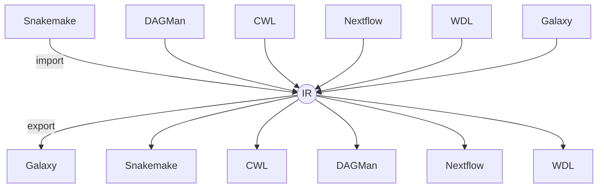

# wf2wf – Universal Workflow-Format Converter

[](https://www.python.org/downloads/)
[](https://github.com/csmcal/wf2wf/actions/workflows/ci.yml)
[](https://csmcal.github.io/wf2wf/)
[](https://pypi.org/project/wf2wf)
[](https://codecov.io/gh/csmcal/wf2wf)
[](LICENSE)
[](wf2wf/schemas/v0.1/wf.json)
[](wf2wf/schemas/v0.1/loss.json)

`wf2wf` is a **format-agnostic converter**: any supported engine → **Intermediate Representation (IR)** → any other engine.  The core library handles: 

• [Snakemake](https://snakemake.readthedocs.io/) • [Nextflow](https://www.nextflow.io/) • [CWL](https://www.commonwl.org/) • [HTCondor](https://htcondor.org/)/[DAGMan](https://htcondor.readthedocs.io/en/latest/automated-workflows/dagman-introduction.html) • [WDL](https://openwdl.org/) • [Galaxy](https://galaxyproject.org/) • bundled [BioCompute Objects](https://www.biocomputeobject.org/)



`wf2wf` is called from the command line as:
```bash
# Convert Snakemake → DAGMan and auto-generate Markdown report
wf2wf convert -i pipeline.smk -o pipeline.dag --auto-env build --interactive --report-md
```

---
## 📋 Table of Contents

- [Features](#-features)
- [Installation](#-installation)
- [Quick CLI Tour](#-quick-cli-tour)
- [Commands](#-commands-overview)
- [Examples](#-examples)
- [Contributing](#-contributing)
- [Support](#-support)
- [License](#-license)
- [Acknowledgements](#-acknowledgements)

---

## ✨ Features

- **🔄 Universal Conversion** – Any supported engine → IR → any other engine with a single command.
- **🧬 Loss-Mapping & Round-Trip Fidelity** – Structured loss reports (`*.loss.json`) and automatic reinjection guarantee nothing disappears silently.
- **🐳 Automated Environment Builds** – Optional Conda-to-OCI pipeline (micromamba → conda-pack → buildx/buildah) with digest-pinned image references, SBOMs and Apptainer conversion.
- **⚖ Regulatory & Provenance Support** – BioCompute Object generation, schema validation and side-car provenance for FDA submissions.
- **🧪 Aiming for Quality** – high test coverage, semantic versioning, graceful degradation when optional external tools are missing.
- **🔧 Smart Configuration Analysis** – Automatic detection and warnings for missing resource requirements, containers, error handling, and file transfer modes when converting between shared filesystem and distributed computing workflows.
- **💬 Interactive Mode** – Guided prompts to help users address configuration gaps and optimize workflows for target execution environments.

### Information-loss workflow

`wf2wf` should record every field the target engine cannot express:

```console
⚠ Conversion losses: 2 (lost), 1 (lost again), 7 (reapplied)
```

* `lost` – field dropped in this conversion
* `lost again` – it was already lost by a previous exporter
* `reapplied` – successfully restored from a side-car when converting back to a richer format

Use `--fail-on-loss` to abort if any *lost/lost again* entries remain.

### Configuration Analysis

When converting between different workflow execution environments, `wf2wf` automatically detects potential issues:

```console
## Configuration Analysis

### Potential Issues for Distributed Computing

* **Memory**: 2 tasks without explicit memory requirements
* **Containers**: 3 tasks without container/conda specifications
* **Error Handling**: 3 tasks without retry specifications
* **File Transfer**: 6 files with auto-detected transfer modes

**Recommendations:**
* Add explicit resource requirements for all tasks
* Specify container images or conda environments for environment isolation
* Configure retry policies for fault tolerance
* Review file transfer modes for distributed execution
```

Use `--interactive` to get guided prompts for addressing these issues automatically.

---

## 📦 Installation

```bash
# PyPI (recommended)
pip install wf2wf

# or conda-forge (once feedstock is merged)
conda install -c conda-forge wf2wf
```

Development install:

```bash
git clone https://github.com/csmcal/wf2wf.git && cd wf2wf
pip install -e .[dev]
pre-commit install
pytest -q
```

---

## 🚀 Quick CLI Tour

```bash
# Convert Snakemake → DAGMan and build digest-pinned images
wf2wf convert -i Snakefile -o pipeline.dag --auto-env build --push-registry ghcr.io/myorg --report-md --interactive

# Convert CWL → Nextflow, abort on any information loss
wf2wf convert -i analysis.cwl -o main.nf --out-format nextflow --fail-on-loss

# Validate a workflow and its loss side-car
wf2wf validate pipeline.dag
```

Interactive prompts (`--interactive`) use `y/n/always/quit`; loss prompts appear only for *warn/error* severities.

---

## 🛠 Commands Overview

| Command | Purpose |
|---------|---------|
| `wf2wf convert`  | Convert workflows between formats (all conversions go via the IR) |
| `wf2wf validate` | Validate a workflow file or a `.loss.json` side-car |
| `wf2wf info`     | Pretty-print summary statistics of a workflow |
| `wf2wf bco sign` | Sign a BioCompute Object and generate provenance attestation |
| `wf2wf bco package` | Bundle a BCO and its artefacts (e.g. eSTAR ZIP) |

Each command accepts `--help` for full usage details.

### Auto-detection matrix

| Extension | Format |
|-----------|--------|
| `.cwl`          | CWL |
| `.dag`          | DAGMan |
| `.ga`           | Galaxy |
| `.json`         | IR (JSON) |
| `.nf`           | Nextflow |
| `.smk`          | Snakemake |
| `.wdl`          | WDL |
| `.yaml`, `.yml` | IR (YAML) |
---

## 🔬 Examples

### Example 1 – Snakemake → DAGMan with automatic environment build

```bash
wf2wf convert -i Snakefile \
              -o pipeline.dag \
              --out-format dagman \
              --auto-env build --push-registry ghcr.io/myorg
```

### Example 2 – CWL → Nextflow round-trip

```bash
# CWL → IR → Nextflow
airflow_cwl="workflow.cwl"
wf2wf convert -i "$airflow_cwl" -o main.nf --out-format nextflow

# … do some edits …
# Nextflow → IR → CWL (should restore metadata)
wf2wf convert -i main.nf -o roundtrip.cwl --out-format cwl
```

### Example 3 – WDL → CWL with loss checking

```bash
wf2wf convert -i assembly.wdl -o assembly.cwl --out-format cwl --fail-on-loss
```

More recipes live in the `examples/` directory.

---

## 🔄 Workflow Conversion Differences

When converting between different workflow execution environments, several key differences need to be addressed:

### Shared Filesystem vs Distributed Computing

**Shared Filesystem Workflows** (Snakemake, CWL, Nextflow):
- Assume all files are accessible on a shared filesystem
- Often have minimal resource specifications
- Rely on system-wide software or conda environments
- Basic error handling and retry mechanisms

**Distributed Computing Workflows** (HTCondor/DAGMan):
- Require explicit file transfer specifications
- Need explicit resource allocation (CPU, memory, disk)
- Require container specifications for environment isolation
- Benefit from sophisticated retry policies and error handling

### Key Conversion Challenges

| Challenge | Shared → Distributed | Distributed → Shared |
|-----------|---------------------|---------------------|
| **File Transfer** | Add `transfer_input_files`/`transfer_output_files` | Remove transfer specifications |
| **Resources** | Add `request_cpus`, `request_memory`, `request_disk` | Convert to engine-specific resource formats |
| **Containers** | Specify Docker/Singularity images | Map to conda environments or system packages |
| **Error Handling** | Add retry policies and error strategies | Convert to engine-specific error handling |
| **Scatter/Gather** | Expand to explicit job definitions | Map to wildcards or engine-specific parallelization |

### Interactive Configuration Assistance

Use `--interactive` mode to get guided assistance:

```bash
# Interactive conversion with configuration prompts
wf2wf convert -i Snakefile -o workflow.dag --interactive

# Example prompts you'll see:
# Found 3 tasks without explicit resource requirements. 
# Distributed systems require explicit resource allocation. 
# Add default resource specifications? (y)es/(n)o/(a)lways/(q)uit: y
```

### Automatic Configuration Analysis

The conversion report includes detailed analysis:

```markdown
## Configuration Analysis

### Potential Issues for Distributed Computing

* **Memory**: 2 tasks without explicit memory requirements
* **Containers**: 3 tasks without container/conda specifications  
* **Error Handling**: 3 tasks without retry specifications
* **File Transfer**: 6 files with auto-detected transfer modes

**Recommendations:**
* Add explicit resource requirements for all tasks
* Specify container images or conda environments for environment isolation
* Configure retry policies for fault tolerance
* Review file transfer modes for distributed execution
```

See [File Transfer Handling](docs/user_guide/file_transfers.md) for detailed information about file transfer modes and best practices.

---
## 🤝 Contributing

1. Fork the repository and create a feature branch (`git checkout -b feature/amazing-feature`)
2. Add tests for new functionality
3. Ensure all tests pass (`pytest -q`)
4. Open a Pull Request – GitHub Actions will run the test matrix automatically

Please read `CONTRIBUTING.md` for the full guidelines.

### 🧪 Testing

Run the comprehensive test suite:
```bash
# Run all tests
python -m pytest tests/ -v

# Run specific test categories
python -m pytest tests/test_conversions.py::TestConversions::test_linear_workflow_conversion -v

# Run with coverage
python -m pytest tests/ --cov=wf2wf --cov-report=html
```
---

## 📞 Support

- 📖 **Documentation** – The `docs/` folder contains a growing knowledge-base, rendered on ReadTheDocs.
- 🐛 **Issues** – Found a bug or missing feature? [Open an issue](../../issues).
- 💬 **Discussions** – General questions and ideas live in [GitHub Discussions](../../discussions).

---

## 📄 License

`wf2wf` is licensed under the MIT License – see the [LICENSE](LICENSE) file for details.

---

## 🙏 Acknowledgments

- [CHTC](https://chtc.cs.wisc.edu/) - The Center for High Throughput Computing for testing and feedback
- The [OpenAI](https://openai.com/) and [Anthropic](https://www.anthropic.com/)-powered coding assistants whose suggestions accelerated feature implementation
- [Cursor](https://cursor.sh/) - Interactive IDE used for pair-programming and AI-assisted development
---

*Bridging workflow ecosystems.*
