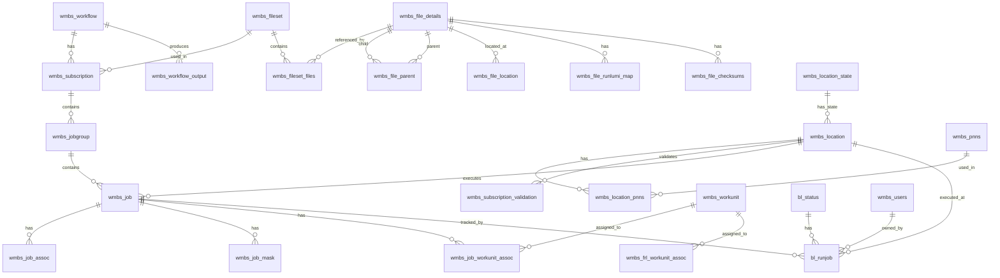
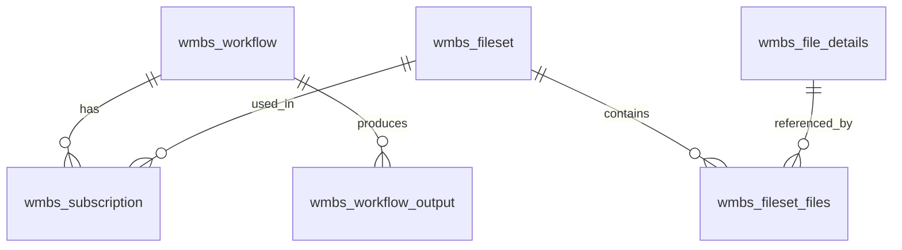
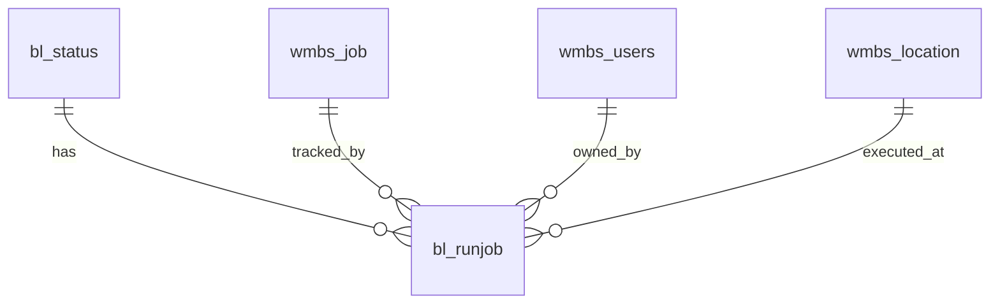
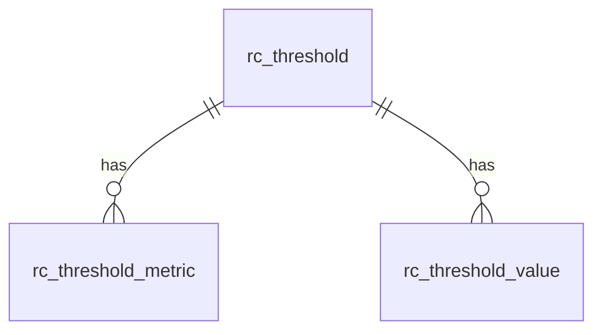
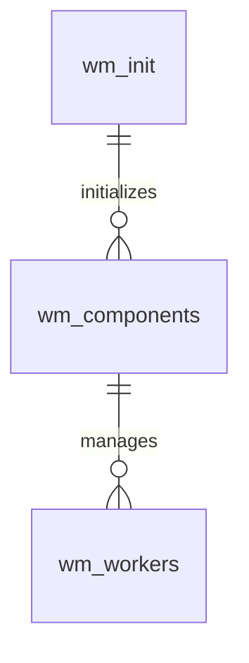
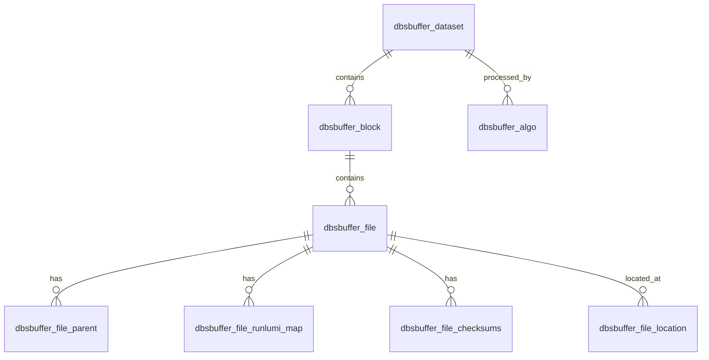
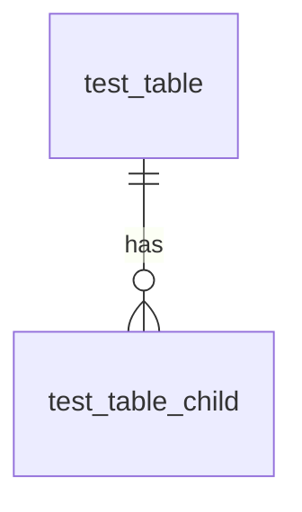
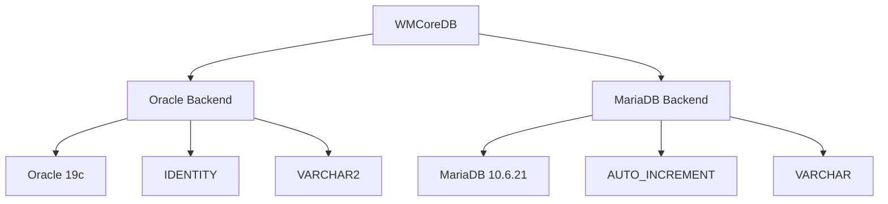
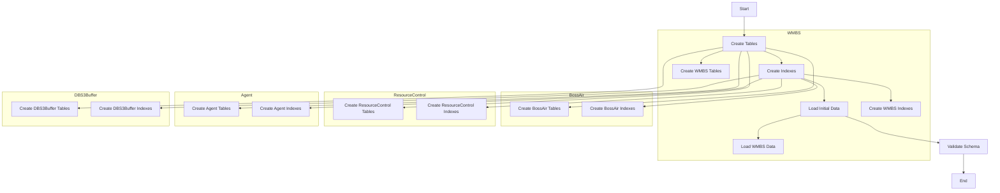

# WMCoreDB Entity Relationship Diagram

## Cardinality Notation
- `||--o{` : One-to-many relationship (one entity can have many related entities)
- `||--||` : One-to-one relationship (one entity is associated with exactly one other entity)
- `}o--o{` : Many-to-many relationship (entities can have multiple relationships with each other)
- `||--o|` : One-to-many relationship with mandatory participation
- `o|--o{` : One-to-many relationship with optional participation

## Core Schema ERD

## Module-Specific ERDs

### WMBS Module

### BossAir Module

### Resource Control Module

### Agent Database Module

### DBS3Buffer Module

### TestDB Module

## Database Backend Compatibility

## Schema Initialization Flow

