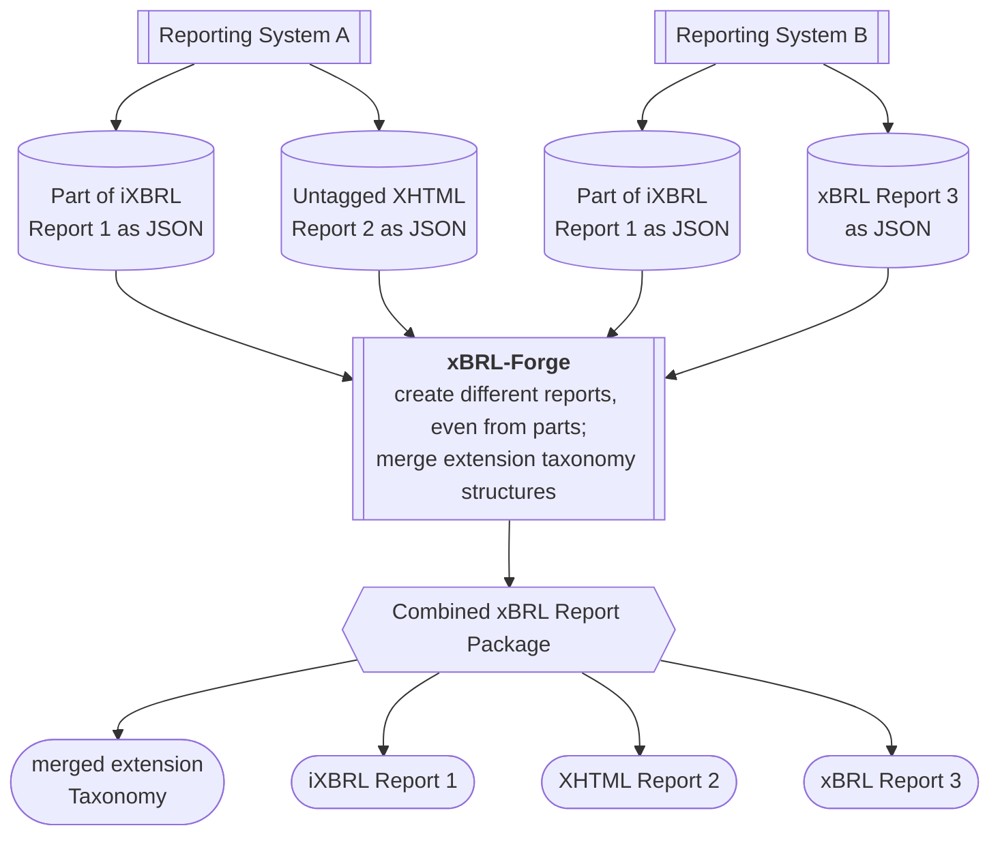
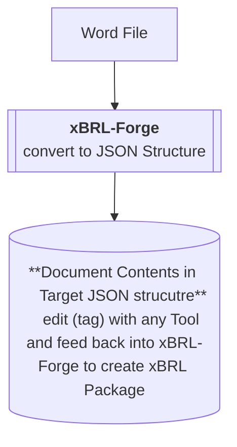

# xBRL-Forge

## Overview

**xBRL-Forge** is an open-source software solution designed to streamline the process of creating final XBRL (eXtensible Business Reporting Language) and iXBRL (Inline XBRL) reports by integrating data from multiple software applications. With xBRL-Forge, users can effortlessly generate XBRL taxonomies and compile comprehensive reports using a simple JSON structure for integration.

## Biggest strengths

Combine strengths of different source systems creating reports (but hey, it's also easy to use for very simple use cases):

Tag data imported from other files

## All the Features

- **Multi-Source Integration**: Seamlessly gather data from various software solutions and compile them into a unified XBRL or iXBRL report.

- **XBRL Taxonomy Generation**: Create customizable XBRL taxonomies to meet your reporting needs.

- **Easy JSON Structure**: Integrate data using an intuitive and straightforward JSON format.

- **Open Source**: Contribute to the community and enhance the functionality of xBRL-Forge.

- **Data conversion**: Prepare your data in a Word file (docx) and then convert it to the xBRL-Forge data structure to enhance it with tags!

- **Supported Data Types**: 
  - Numeric Data (monetary, emissions, etc.)
  - formatted string data (boolean, date, etc.)
  - untransformable data (enumeration, enumerationSet)
  - escaped string data (textBlock, etc.)

## Guides

There are two ways of using this project.

1) **Standalone use of this tool**: Lern how to run the tool for simple usage (with ui):

 - [How to deploy the application in docker](docs/tool-guides/docker_deployment.md)

2) **Integration into other tools/workflows**: Learn how to convert files and use the engine of this project in differnt ways:

 - [How to use the python Package API](docs/engine_guides/python_api.md)
 - [How to use the Web (REST) API](docs/engine_guides/web_api.md)
 - [How to use the Docker Engine API](docs/engine_guides/docker_api.md)

When integrating the tool you will exit the JSON object from other systems. To learn how to Apply Tags to the JSON object please see this:

 - [How to include Tags into the JSON object](docs/engine_guides/including_xbrl_information.md)

## Documentation

For detailed documentation on how to use xBRL-Forge, including API references and examples, please refer to the [docs](docs/) folder.

## Contributing

We welcome contributions from the community! To contribute:

1. Fork the repository.
2. Create a new branch: `git checkout -b <ISSUE_NUMBER>-feature/YourFeature`
3. Make your changes and commit them: `git commit -m 'Add your feature #<ISSUE_NUMBER>'`
4. Push to the branch: `git push origin <ISSUE_NUMBER>-feature/YourFeature`
5. Create a pull request.

PLEASE NOTE: this project uses the **REBASE STRATEGY**

Please ensure your contributions align with the project guidelines.

## License

This project is licensed under the APACHE 2.0 License - see the [LICENSE](LICENSE.md) file for details.

## Support

If you encounter any issues or have questions, feel free to open an issue in the GitHub repository or reach out via [email](mailto:anton.j.heitz@gmail.com).

Also you can join the discussion on [Discord](https://discord.gg/Wa3R7JBayw).

---

Thank you for using xBRL-Forge! We look forward to your feedback and contributions!