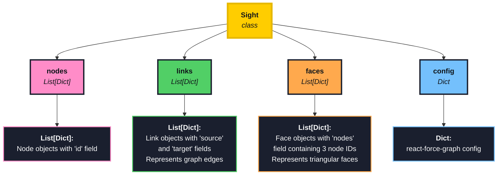

# Zen Sight

A (work in progress) simplicial complex visualization python package made with React and a Python backend.

## Features

- **Interactive Visualizations**: 2D and 3D simplicial complex rendering using react-force-graph and Three.js


- **Selection Functionality**: Single, multi, and lasso selection tools for nodes


- **Graph Operations**: Node cutting and duplication.
- **Timeline Replay**: Replay and review graph operations with the timeline


- **Integration**: Built-in adapters for NetworkX and Zen Mapper

---

## Installation

```python
pip install zen-sight
```

---

## Quick(ish) Start

Creating Simplicial Complexes

```python
from zen_sight import Sight


def create_simplicial_complex():
    """Create a graph with 2-simplices"""

    # nodes in a hexagonal pattern
    nodes = []
    positions = [
        (0, 0),
        (1, 0),
        (0.5, 0.87),
        (-0.5, 0.87),
        (-1, 0),
        (-0.5, -0.87),
        (0.5, -0.87),
    ]

    for i, (x, y) in enumerate(positions):
        nodes.append(
            {
                "id": i,
                "name": f"Node {i} <br> {'center' if i == 0 else 'outer'}",
                "x": x * 50,
                "y": y * 50,
                "z": 0,
                "group": "center" if i == 0 else "outer",
            }
        )

    links = []
    # connect center to all others
    for i in range(1, 7):
        links.append({"source": 0, "target": i})

    # connect outer nodes
    for i in range(1, 7):
        next_i = (i % 6) + 1
        links.append({"source": i, "target": next_i})

    faces = [
        (0, 1, 2),  # center with each adjacent pair in outer ring
        (0, 2, 3),
        (0, 3, 4),
        (0, 4, 5),
        (0, 5, 6),
        (0, 6, 1),
    ]

    return nodes, links, faces


def main():
    sight = Sight()

    nodes, links, faces = create_simplicial_complex()

    sight.set_nodes(nodes)
    sight.set_links(links)
    sight.set_faces(faces)

    sight.set_config(
        {
            "nodeAutoColorBy": "group",
            "nodeRelSize": 4,
            "nodeLabel": "name",
            "nodeOpacity": 1,
            "linkColor": "#000000",
            "linkWidth": 2,
            "linkOpacity": 1,
            # Simplex appearance: alpha is for 2D version and will be ignored
            # in favor of faceOpacity for 3D
            "faceFillColor": "rgba(52, 152, 219, 0.3)",
            "faceStrokeColor": "rgba(52, 152, 219, 0.5)",
            "faceStrokeWidth": 1,
            "faceOpacity": 0.3,
        }
    )
    sight.show()


if __name__ == "__main__":
    main()
```

#### Zen Mapper Integration

```python
import zen_mapper as zm
from zen_sight.adapters import vis_zen_mapper
import numpy as np
from sklearn.decomposition import PCA
from sklearn.cluster import DBSCAN


def circle(n=100):
    theta = np.linspace(0, 2 * np.pi, n)
    x = np.cos(theta)
    y = np.sin(theta)
    return np.c_[x, y]

def main():
    data = circle()
    proj = PCA(n_components=1).fit_transform(data)
    result = zm.mapper(
        data=data,
        cover_scheme=zm.Width_Balanced_Cover(percent_overlap=0.2, n_elements=6),
        projection=proj,
        dim=1,
        clusterer=zm.sk_learn(DBSCAN(eps=0.2)),
    )

    vis_zen_mapper(result)

if __name__ == "__main__":
    main()
```

## The `Sight` Class:

Currently, zen-sight comes with a `Sight` Class which acts as the main interface for creating customized visualizations. Sight() comes with a .show() method which will create the app routes and initialize the visualization on port 5050. This is hard-coded currently and needs to be updated...

Here is a breakdown of the datastructure for Sight()



- Note: Currently faces is a List[Tuple] made up of 3-tuples of nodes incident with the face

### Customization

### API Table:

Zen Sight partially acts as a wrapper for [react-force-graph-3D](https://github.com/vasturiano/react-force-graph#api-reference). Here is an incomplete table of relevant variables/parameters:

| Property              | Type               | Default                    | Description                            | Category         |
| --------------------- | ------------------ | -------------------------- | -------------------------------------- | ---------------- |
| **graphData**         | object             | `{ nodes: [], links: [] }` | Graph data structure                   | Data Input       |
| **backgroundColor**   | string             | "#000011"                  | Background color                       | Container Layout |
| **nodeId**            | string/func        | `id`                       | Node object accessor for unique ID     | Node Data        |
| **nodeVal**           | number/string/func | `val`                      | Node object accessor for numeric value | Node Data        |
| **nodeLabel**         | string/func        | `name`                     | Node object accessor for label         | Node Styling     |
| **nodeDesc**          | string/func        | `desc`                     | Node object accessor for description   | Node Styling     |
| **nodeColor**         | string/func        | `color`                    | Node color accessor                    | Node Styling     |
| **nodeAutoColorBy**   | string/func        | -                          | Auto-color nodes by property           | Node Styling     |
| **nodeOpacity**       | number             | 0.75                       | Node opacity value                     | Node Styling     |
| **nodeRelSize**       | number             | 4                          | Ratio of node sphere volume            | Node Styling     |
| **linkSource**        | string/func        | `source`                   | Link object accessor for source        | Link Data        |
| **linkTarget**        | string/func        | `target`                   | Link object accessor for target        | Link Data        |
| **linkLabel**         | string/func        | `name`                     | Link object accessor for label         | Link Styling     |
| **linkDesc**          | string/func        | `desc`                     | Link object accessor for description   | Link Styling     |
| **linkColor**         | string/func        | `color`                    | Link color accessor                    | Link Styling     |
| **linkAutoColorBy**   | string/func        | -                          | Auto-color links by property           | Link Styling     |
| **linkOpacity**       | number             | 0.2                        | Link line opacity                      | Link Styling     |
| **linkWidth**         | number/func        | 0                          | Link line width                        | Link Styling     |
| **linkResolution**    | number             | 6                          | Link cylinder geometric resolution     | Link Styling     |
| **linkCurvature**     | number/func        | 0                          | Link curvature (0=straight, 1=full)    | Link Styling     |
| **linkCurveRotation** | number/func        | 0                          | Link curve rotation in radians         | Link Styling     |

# Future Work

- Patch Bugs, Finalize API, & Organize
  - Apply It!
- Implement more adapters (e.g. GHUDI Simplex Trees)
- Include 3-Simplices and allow for simplex collapses
- Include more customization options for faces/tetrahedra
- Implement splitting functionality
- Create a Filtration Visualizer
  - Backend can already do this with a bit of work
- Create a Figure-Generation Mode for export
- Could port Zen Sight to also work in VR
